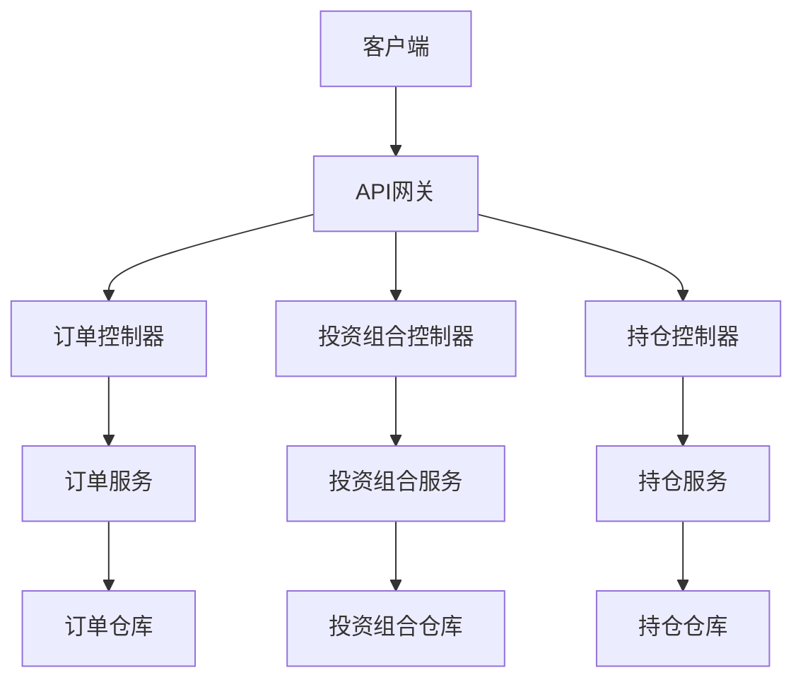
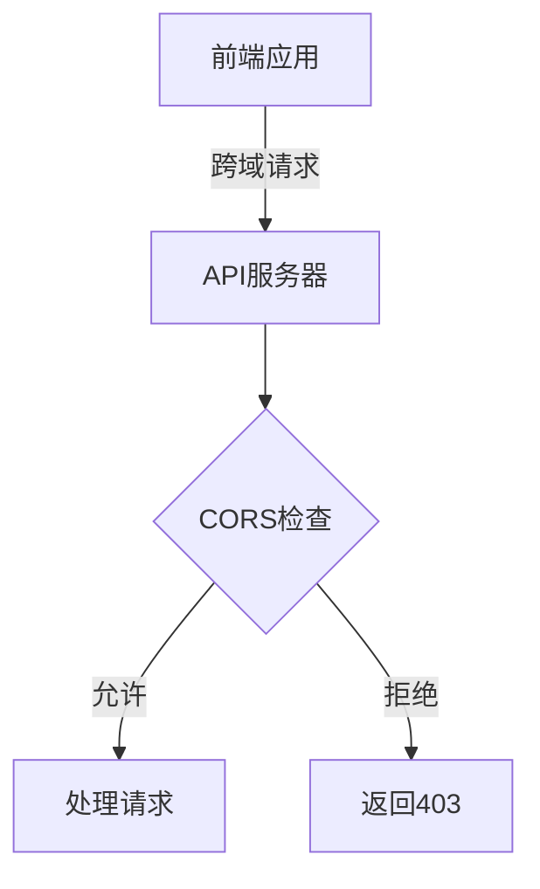
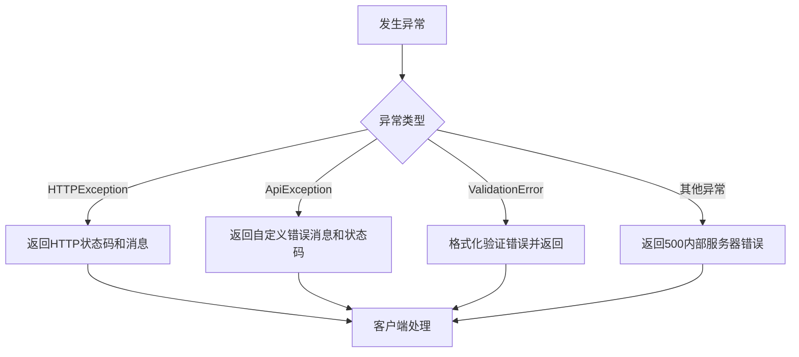
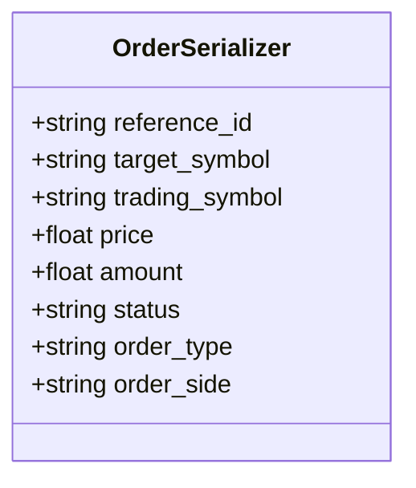
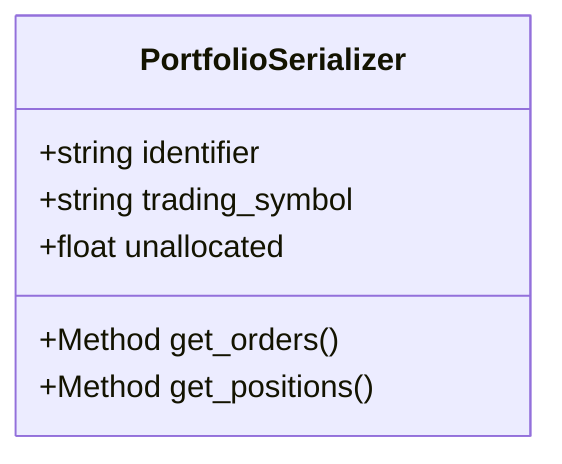
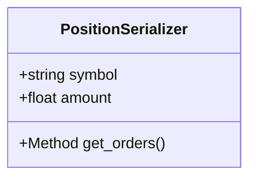
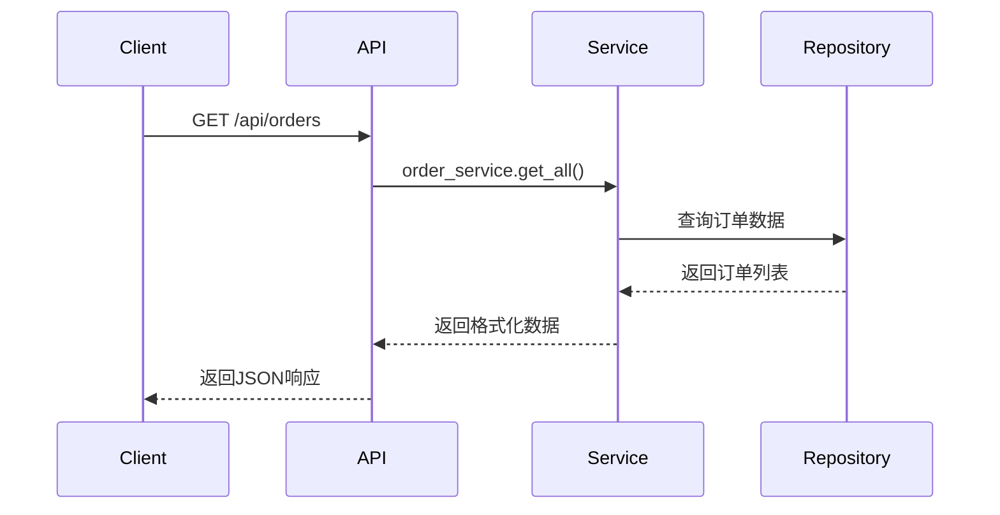

# Web API接口

<cite>
**本文档中引用的文件**  
- [create_app.py](file://investing_algorithm_framework/app/web/create_app.py)
- [setup_cors.py](file://investing_algorithm_framework/app/web/setup_cors.py)
- [error_handler.py](file://investing_algorithm_framework/app/web/error_handler.py)
- [responses.py](file://investing_algorithm_framework/app/web/responses.py)
- [orders.py](file://investing_algorithm_framework/app/web/controllers/orders.py)
- [portfolio.py](file://investing_algorithm_framework/app/web/controllers/portfolio.py)
- [positions.py](file://investing_algorithm_framework/app/web/controllers/positions.py)
- [order.py](file://investing_algorithm_framework/app/web/schemas/order.py)
- [portfolio.py](file://investing_algorithm_framework/app/web/schemas/portfolio.py)
- [position.py](file://investing_algorithm_framework/app/web/schemas/position.py)
- [order_service.py](file://investing_algorithm_framework/services/order_service/order_service.py)
- [portfolio_service.py](file://investing_algorithm_framework/services/portfolios/portfolio_service.py)
- [position_service.py](file://investing_algorithm_framework/services/positions/position_service.py)
</cite>

## 目录
1. [简介](#简介)
2. [API概览](#api概览)
3. [认证方法](#认证方法)
4. [CORS配置](#cors配置)
5. [错误响应格式](#错误响应格式)
6. [订单资源API](#订单资源api)
7. [投资组合资源API](#投资组合资源api)
8. [持仓资源API](#持仓资源api)
9. [客户端开发指南](#客户端开发指南)

## 简介

本文档详细说明了投资算法框架的RESTful Web API，涵盖了订单、投资组合和持仓资源的CRUD操作接口。文档详细描述了所有端点的HTTP方法、URL模式、请求/响应模式、数据类型、约束条件以及JSON请求/响应示例。同时说明了错误响应格式、HTTP状态码含义、CORS配置和安全性考虑，为客户端开发提供使用指南和常见集成模式。

**本节来源**
- [create_app.py](file://investing_algorithm_framework/app/web/create_app.py#L1-L21)
- [setup_cors.py](file://investing_algorithm_framework/app/web/setup_cors.py#L1-L7)

## API概览

投资算法框架提供了一个RESTful Web API，用于管理和监控交易活动。API通过Flask框架实现，支持对订单、投资组合和持仓资源的全面操作。所有API端点均以`/api/`为前缀，通过蓝图（Blueprint）组织，确保了良好的模块化和可扩展性。

API的主要功能包括：
- 订单管理：创建、查询和监控交易订单
- 投资组合管理：查看投资组合状态和配置
- 持仓管理：查询和分析资产持仓情况

所有API响应均采用JSON格式，遵循统一的响应结构，包含数据项和总数信息。



**图表来源**
- [create_app.py](file://investing_algorithm_framework/app/web/create_app.py#L8-L20)
- [controllers/__init__.py](file://investing_algorithm_framework/app/web/controllers/__init__.py#L9-L13)

## 认证方法

本API目前未实现特定的认证机制。系统依赖于应用级别的安全配置和部署环境的安全措施。在生产环境中，建议通过以下方式增强安全性：

1. **环境变量配置**：将敏感信息存储在环境变量中，而非代码中
2. **HTTPS部署**：确保所有API通信通过HTTPS加密传输
3. **网络隔离**：将API部署在受保护的网络环境中，限制外部访问
4. **API网关**：使用API网关实现访问控制、速率限制和身份验证

未来版本可能会引入更完善的认证机制，如API密钥、OAuth2或JWT令牌认证。

**本节来源**
- [create_app.py](file://investing_algorithm_framework/app/web/create_app.py#L11-L14)
- [dependency_container.py](file://investing_algorithm_framework/dependency_container.py#L31-L36)

## CORS配置

API通过Flask-CORS扩展实现了跨域资源共享（CORS）配置，允许来自不同源的客户端访问API资源。CORS配置确保了Web应用能够安全地跨域调用API端点。

```python
def setup_cors(app):
    CORS(app)
    return app
```

当前配置允许所有域访问API，适用于开发和测试环境。在生产环境中，建议限制CORS策略，仅允许受信任的域名访问API，以增强安全性。



**图表来源**
- [setup_cors.py](file://investing_algorithm_framework/app/web/setup_cors.py#L4-L6)

## 错误响应格式

API采用统一的错误响应格式，确保客户端能够一致地处理各种错误情况。错误处理由`error_handler.py`模块负责，捕获并格式化所有异常。

### 错误响应结构

```json
{
  "error_message": "错误描述信息"
}
```

### HTTP状态码含义

| 状态码 | 含义 | 说明 |
|--------|------|------|
| 200 | OK | 请求成功 |
| 400 | Bad Request | 请求参数错误 |
| 404 | Not Found | 资源未找到 |
| 500 | Internal Server Error | 服务器内部错误 |

### 错误处理流程



**图表来源**
- [error_handler.py](file://investing_algorithm_framework/app/web/error_handler.py#L13-L59)

## 订单资源API

订单资源API提供了对交易订单的全面管理功能，包括查询订单列表等操作。

### 获取订单列表

**端点**: `GET /api/orders`  
**方法**: GET  
**描述**: 获取订单列表，支持通过查询参数进行过滤

#### 请求参数

| 参数 | 类型 | 必需 | 描述 |
|------|------|------|------|
| target_symbol | string | 否 | 目标交易符号（如BTC） |
| trading_symbol | string | 否 | 交易对符号（如EUR） |
| order_side | string | 否 | 订单方向（BUY/SELL） |
| order_type | string | 否 | 订单类型（LIMIT/MARKET） |
| status | string | 否 | 订单状态 |

#### 响应字段

| 字段 | 类型 | 描述 |
|------|------|------|
| reference_id | string | 订单参考ID |
| target_symbol | string | 目标交易符号 |
| trading_symbol | string | 交易对符号 |
| price | number | 订单价格 |
| amount | number | 订单数量 |
| status | string | 订单状态 |
| order_type | string | 订单类型 |
| order_side | string | 订单方向 |

#### JSON响应示例

```json
{
  "items": [
    {
      "reference_id": "ORD123456",
      "target_symbol": "BTC",
      "trading_symbol": "EUR",
      "price": 50000.0,
      "amount": 0.01,
      "status": "OPEN",
      "order_type": "LIMIT",
      "order_side": "BUY"
    }
  ],
  "total": 1
}
```



**图表来源**
- [orders.py](file://investing_algorithm_framework/app/web/controllers/orders.py#L16-L20)
- [order.py](file://investing_algorithm_framework/app/web/schemas/order.py#L4-L13)

**本节来源**
- [orders.py](file://investing_algorithm_framework/app/web/controllers/orders.py#L16-L20)
- [order_service.py](file://investing_algorithm_framework/services/order_service/order_service.py#L61-L200)

## 投资组合资源API

投资组合资源API提供了对投资组合的查询功能。

### 获取投资组合列表

**端点**: `GET /api/portfolios`  
**方法**: GET  
**描述**: 获取投资组合列表

#### 响应字段

| 字段 | 类型 | 描述 |
|------|------|------|
| identifier | string | 投资组合标识符 |
| trading_symbol | string | 交易符号 |
| unallocated | number | 未分配资金 |
| orders | number | 订单数量 |
| positions | number | 持仓数量 |

#### JSON响应示例

```json
{
  "items": [
    {
      "identifier": "PORTFOLIO1",
      "trading_symbol": "EUR",
      "unallocated": 1000.0,
      "orders": 5,
      "positions": 3
    }
  ],
  "total": 1
}
```



**图表来源**
- [portfolio.py](file://investing_algorithm_framework/app/web/controllers/portfolio.py#L16-L20)
- [portfolio.py](file://investing_algorithm_framework/app/web/schemas/portfolio.py#L7-L23)

**本节来源**
- [portfolio.py](file://investing_algorithm_framework/app/web/controllers/portfolio.py#L16-L20)
- [portfolio_service.py](file://investing_algorithm_framework/services/portfolios/portfolio_service.py#L14-L189)

## 持仓资源API

持仓资源API提供了对资产持仓的查询功能。

### 获取持仓列表

**端点**: `GET /api/positions`  
**方法**: GET  
**描述**: 获取持仓列表

#### 响应字段

| 字段 | 类型 | 描述 |
|------|------|------|
| symbol | string | 资产符号 |
| amount | number | 持仓数量 |
| orders | number | 关联订单数量 |

#### JSON响应示例

```json
{
  "items": [
    {
      "symbol": "BTC",
      "amount": 0.5,
      "orders": 2
    }
  ],
  "total": 1
}
```



**图表来源**
- [positions.py](file://investing_algorithm_framework/app/web/controllers/positions.py#L14-L19)
- [position.py](file://investing_algorithm_framework/app/web/schemas/position.py#L7-L16)

**本节来源**
- [positions.py](file://investing_algorithm_framework/app/web/controllers/positions.py#L14-L19)
- [position_service.py](file://investing_algorithm_framework/services/positions/position_service.py)

## 客户端开发指南

### 基本使用模式

客户端可以通过标准的HTTP请求与API交互。以下是常见的使用模式：



### 常见集成模式

1. **轮询模式**：客户端定期轮询API获取最新状态
2. **事件驱动模式**：结合WebSocket或消息队列实现实时更新
3. **批处理模式**：批量获取数据进行分析处理

### 最佳实践

- 使用适当的HTTP缓存头减少重复请求
- 实现错误重试机制处理临时性故障
- 验证响应数据的完整性和正确性
- 监控API调用性能和错误率

**本节来源**
- [responses.py](file://investing_algorithm_framework/app/web/responses.py#L6-L21)
- [create_app.py](file://investing_algorithm_framework/app/web/create_app.py)