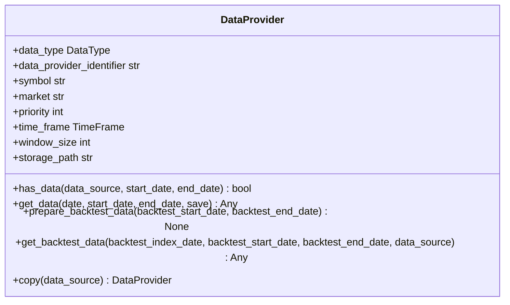
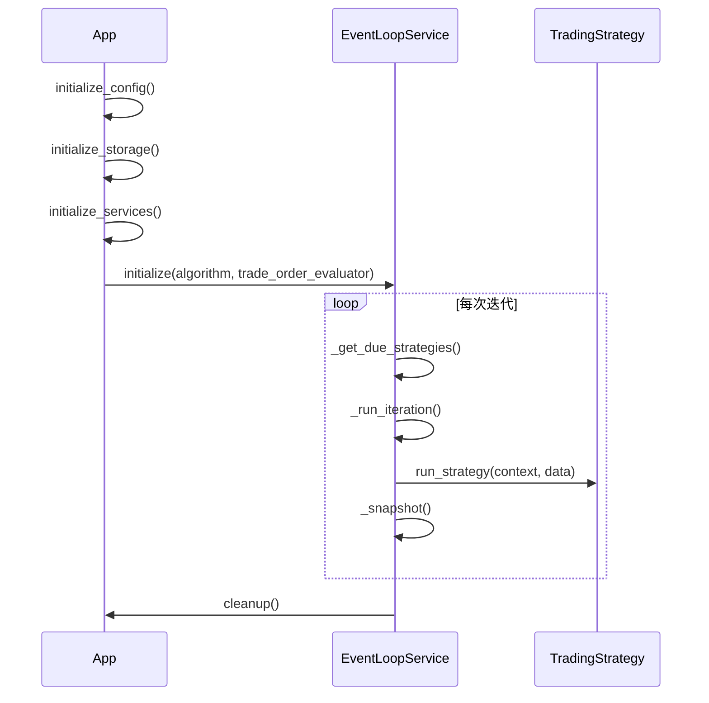
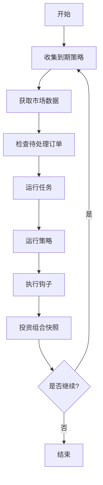

# 应用API

<cite>
**本文档引用的文件**   
- [app.py](file://investing_algorithm_framework/app/app.py)
- [context.py](file://investing_algorithm_framework/app/context.py)
- [eventloop.py](file://investing_algorithm_framework/app/eventloop.py)
- [strategy.py](file://investing_algorithm_framework/app/strategy.py)
- [task.py](file://investing_algorithm_framework/app/task.py)
- [data_provider.py](file://investing_algorithm_framework/domain/data_provider.py)
- [create_app.py](file://investing_algorithm_framework/create_app.py)
</cite>

## 目录
1. [简介](#简介)
2. [核心配置方法](#核心配置方法)
3. [运行方法与生命周期](#运行方法与生命周期)
4. [上下文对象](#上下文对象)
5. [事件循环与任务调度](#事件循环与任务调度)
6. [错误处理](#错误处理)
7. [使用示例](#使用示例)

## 简介
App类是投资算法框架的核心，用于初始化和运行交易机器人。它提供了配置策略、数据源、市场、投资组合和任务的接口。通过App类，用户可以构建一个完整的交易系统，包括数据获取、策略执行、订单管理和风险控制。

**Section sources**
- [app.py](file://investing_algorithm_framework/app/app.py#L43-L80)

## 核心配置方法

### add_strategy方法
用于向应用程序添加交易策略。策略必须是TradingStrategy类或其子类的实例。

**参数**
- `strategy`: TradingStrategy实例
- `throw_exception` (bool): 当策略不符合要求时是否抛出异常，默认为True

**返回值**
- None

**Section sources**
- [app.py](file://investing_algorithm_framework/app/app.py#L1767-L1818)

### add_data_provider方法
用于向应用程序添加数据提供者。数据提供者负责获取和准备交易算法所需的数据。

**参数**
- `data_provider`: DataProvider实例
- `priority` (int): 优先级，数值越低优先级越高，默认为3

**返回值**
- None



**Diagram sources**
- [data_provider.py](file://investing_algorithm_framework/domain/data_provider.py#L12-L335)

**Section sources**
- [app.py](file://investing_algorithm_framework/app/app.py#L1605-L1628)

### add_market方法
用于向应用程序添加市场。这是一个实用函数，用于同时添加投资组合配置和市场凭证。

**参数**
- `market` (str): 市场名称
- `trading_symbol` (str): 交易符号
- `api_key` (str): API密钥
- `secret_key` (str): 密钥
- `initial_balance` (float): 初始余额

**返回值**
- None

**Section sources**
- [app.py](file://investing_algorithm_framework/app/app.py#L1841-L1878)

### add_portfolio_configuration方法
用于向应用程序添加投资组合配置。投资组合配置定义了投资组合的初始余额、交易符号和市场。

**参数**
- `portfolio_configuration`: PortfolioConfiguration实例

**返回值**
- None

**Section sources**
- [app.py](file://investing_algorithm_framework/app/app.py#L687-L701)

## 运行方法与生命周期

### run方法
应用程序的入口点，用于启动交易机器人。该方法有三种运行模式：

1. **无参数模式**: 应用程序持续运行，直到收到键盘中断
2. **负载模式**: 应用程序仅运行一次，使用提供的负载数据
3. **迭代模式**: 应用程序运行指定的迭代次数

**参数**
- `number_of_iterations` (int): 要运行的迭代次数

**返回值**
- None



**Diagram sources**
- [app.py](file://investing_algorithm_framework/app/app.py#L565-L686)
- [eventloop.py](file://investing_algorithm_framework/app/eventloop.py#L334-L444)

**Section sources**
- [app.py](file://investing_algorithm_framework/app/app.py#L565-L686)

## 上下文对象
上下文对象存储算法的状态，并提供对订单、头寸、交易和投资组合等对象的访问。

**主要属性**
- `config`: 配置服务
- `portfolio_service`: 投资组合服务
- `position_service`: 头寸服务
- `order_service`: 订单服务
- `market_credential_service`: 市场凭证服务
- `data_provider_service`: 数据提供者服务
- `trade_service`: 交易服务

**主要方法**
- `create_limit_order()`: 创建限价订单
- `get_portfolio()`: 获取投资组合
- `get_positions()`: 获取头寸
- `get_orders()`: 获取订单
- `get_latest_price()`: 获取最新价格

**Section sources**
- [context.py](file://investing_algorithm_framework/app/context.py#L18-L85)

## 事件循环与任务调度
事件循环服务管理交易机器人的事件循环，负责运行交易策略并处理其生命周期中的事件。

**执行流程**
1. 收集需要运行的策略和任务
2. 收集策略的市场数据
3. 检查待处理订单、止损和止盈
4. 运行所有任务
5. 运行所有策略
6. 运行所有on_strategy_run钩子
7. 根据定义的快照间隔对投资组合进行快照



**Diagram sources**
- [eventloop.py](file://investing_algorithm_framework/app/eventloop.py#L20-L621)

**Section sources**
- [eventloop.py](file://investing_algorithm_framework/app/eventloop.py#L20-L621)

## 错误处理
框架提供了多种错误处理机制，包括配置验证、数据完整性检查和异常处理。

**常见配置错误**
- 未配置投资组合
- 策略时间单位未设置
- 策略间隔未设置
- 数据提供者未正确配置

**错误处理模式**
- 使用OperationalException表示操作异常
- 使用ImproperlyConfigured表示配置错误
- 在关键操作前进行参数验证
- 提供详细的错误信息和建议

**Section sources**
- [app.py](file://investing_algorithm_framework/app/app.py#L596-L671)
- [strategy.py](file://investing_algorithm_framework/app/strategy.py#L66-L115)

## 使用示例

### 基本应用设置
```python
from investing_algorithm_framework import create_app, PortfolioConfiguration

app = create_app()
app.add_portfolio_configuration(
    PortfolioConfiguration(
        market="BITVAVO",
        trading_symbol="EUR",
        initial_balance=1000
    )
)
```

### 添加策略
```python
from investing_algorithm_framework import TradingStrategy

class MyStrategy(TradingStrategy):
    time_unit = "HOUR"
    interval = 1
    
    def run_strategy(self, context, data):
        # 策略逻辑
        pass

app.add_strategy(MyStrategy())
```

### 添加数据提供者
```python
from investing_algorithm_framework import DataProvider

class MyDataProvider(DataProvider):
    data_type = "OHLCV"
    data_provider_identifier = "my_data_provider"
    
    def has_data(self, data_source, start_date=None, end_date=None):
        return True
    
    def get_data(self, date=None, start_date=None, end_date=None, save=False):
        # 获取数据逻辑
        pass

app.add_data_provider(MyDataProvider())
```

### 运行应用
```python
# 运行指定次数
app.run(number_of_iterations=10)

# 持续运行
app.run()
```

**Section sources**
- [create_app.py](file://investing_algorithm_framework/create_app.py#L13-L55)
- [app.py](file://investing_algorithm_framework/app/app.py#L565-L686)
- [strategy.py](file://investing_algorithm_framework/app/strategy.py#L13-L802)
- [data_provider.py](file://investing_algorithm_framework/domain/data_provider.py#L12-L335)