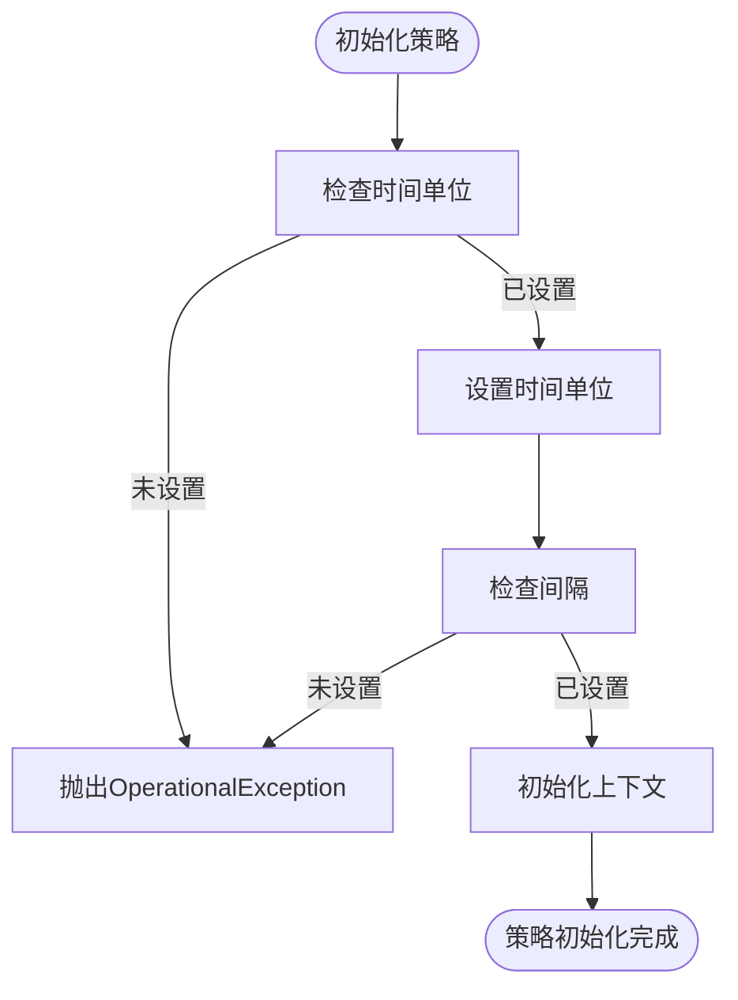
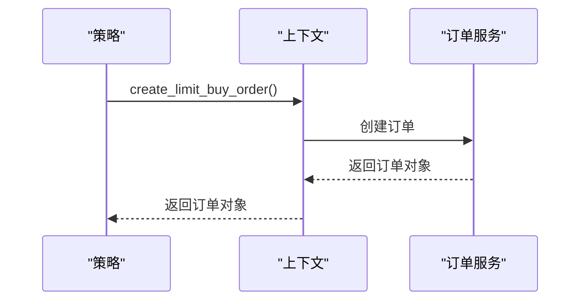
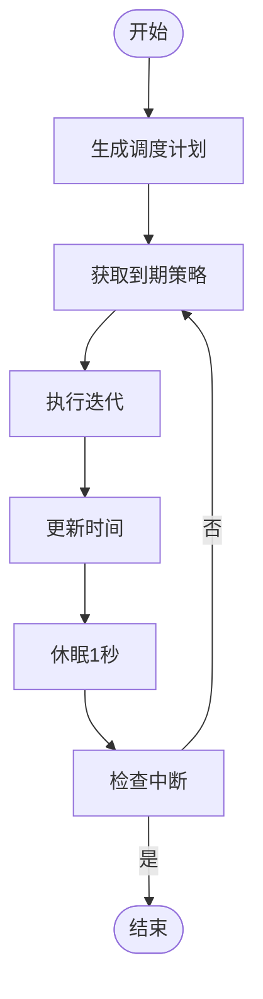
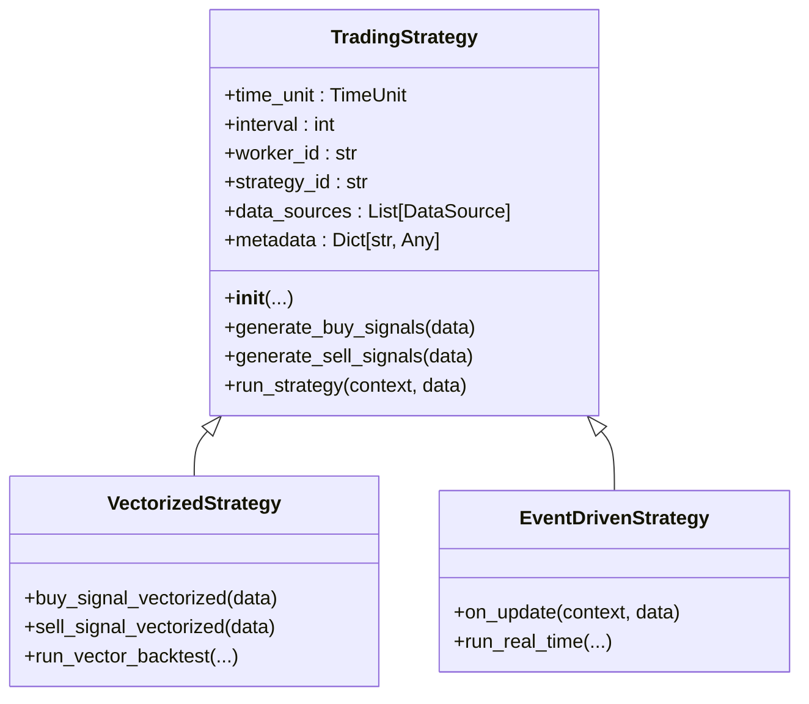

# 策略API

<cite>
**本文档中引用的文件**  
- [strategy.py](file://investing_algorithm_framework/app/strategy.py)
- [task.py](file://investing_algorithm_framework/app/task.py)
- [context.py](file://investing_algorithm_framework/app/context.py)
- [strategy.py](file://investing_algorithm_framework/domain/strategy.py)
- [exceptions.py](file://investing_algorithm_framework/domain/exceptions.py)
- [backtest_service.py](file://investing_algorithm_framework/services/backtesting/backtest_service.py)
- [run_strategies.py](file://investing_algorithm_framework/app/web/run_strategies.py)
- [action_handler.py](file://investing_algorithm_framework/app/stateless/action_handlers/__init__.py)
- [stateless_actions.py](file://investing_algorithm_framework/domain/stateless_actions.py)
- [strategy.py](file://investing_algorithm_framework/domain/strategy.py)
- [strategy_one.py](file://tests/resources/strategies_for_testing/strategy_one.py)
- [strategy_two.py](file://tests/resources/strategies_for_testing/strategy_two.py)
- [strategy_v2.py](file://tests/resources/strategies_for_testing/strategy_v2/strategy_v2.py)
- [strategy.py](file://examples/example_strategies/macd_wr/strategy.py)
</cite>

## 目录
1. [简介](#简介)
2. [策略基类接口定义](#策略基类接口定义)
3. [生命周期方法](#生命周期方法)
4. [交易操作方法](#交易操作方法)
5. [任务调度机制](#任务调度机制)
6. [策略间通信与数据共享](#策略间通信与数据共享)
7. [向量化策略与事件驱动策略API差异](#向量化策略与事件驱动策略api差异)
8. [复杂策略实现模式](#复杂策略实现模式)

## 简介
本策略API文档详细介绍了投资算法框架中策略基类的完整接口定义。文档涵盖了策略生命周期方法的调用时机和使用模式，交易操作方法的参数约束和异常情况，任务调度机制和装饰器的使用方法，以及策略间通信和数据共享的最佳实践。通过具体代码示例展示了复杂策略的实现模式。

## 策略基类接口定义
`TradingStrategy` 是所有交易策略的基类。它定义了一组规则，用于确定何时买入或卖出资产。策略通过继承 `TradingStrategy` 类并实现其方法来创建。

**核心属性**:
- **time_unit**: 策略的时间单位，定义策略运行的频率，如小时、天、周、月
- **interval**: 策略的间隔，定义在时间单位内策略运行的频率
- **worker_id**: 工作线程的ID
- **strategy_id**: 策略的ID
- **data_sources**: 数据源列表，用于标识数据提供者
- **metadata**: 包含策略元数据的字典，如作者、版本、描述等

**Section sources**
- [strategy.py](file://investing_algorithm_framework/app/strategy.py#L13-L50)

## 生命周期方法
策略的生命周期方法定义了策略在不同阶段的行为。这些方法在特定条件下被框架自动调用。

### init方法
`__init__` 方法用于初始化策略实例。它设置策略的基本属性，如时间单位、间隔、数据源等。如果未设置必要属性，将抛出 `OperationalException` 异常。



**Diagram sources**
- [strategy.py](file://investing_algorithm_framework/app/strategy.py#L51-L128)

### on_start方法
`on_start` 方法在策略启动时调用。该方法可用于执行一次性初始化任务，如加载模型、初始化变量等。框架在策略开始运行前自动调用此方法。

### on_stop方法
`on_stop` 方法在策略停止时调用。该方法可用于执行清理任务，如保存状态、关闭连接等。框架在策略停止运行时自动调用此方法。

### on_update方法
`on_update` 方法在每次策略更新时调用。该方法接收最新的市场数据，并根据数据生成交易信号。框架根据策略的时间单位和间隔定期调用此方法。

**Section sources**
- [strategy.py](file://investing_algorithm_framework/app/strategy.py#L129-L194)

## 交易操作方法
交易操作方法提供了创建和管理订单、交易和头寸的功能。

### check_order_status方法
`check_order_status` 方法用于检查订单状态。它查询订单服务以获取指定订单的当前状态。如果订单不存在，将抛出 `OperationalException` 异常。

### create_limit_buy_order方法
`create_limit_buy_order` 方法用于创建限价买入订单。它接受目标资产符号、价格、数量等参数，并创建相应的订单。如果未指定数量或价格，将抛出 `OperationalException` 异常。



**Diagram sources**
- [context.py](file://investing_algorithm_framework/app/context.py#L345-L361)

### create_limit_sell_order方法
`create_limit_sell_order` 方法用于创建限价卖出订单。它与 `create_limit_buy_order` 方法类似，但用于卖出资产。该方法还支持按投资组合百分比或头寸百分比指定卖出数量。

**Section sources**
- [context.py](file://investing_algorithm_framework/app/context.py#L150-L199)

## 任务调度机制
任务调度机制允许策略在指定的时间间隔内自动执行。通过 `@time_task` 装饰器可以轻松定义定时任务。

### @time_task装饰器
`@time_task` 装饰器用于标记需要定期执行的方法。它接受时间单位和间隔作为参数，指示框架在指定的时间间隔内调用该方法。

```python
@time_task(time_unit=TimeUnit.HOUR, interval=2)
def my_task(self, context):
    # 每2小时执行一次的任务
    pass
```

### 任务调度流程
任务调度流程由框架的事件循环管理。事件循环根据策略的时间单位和间隔生成调度计划，并在适当的时间调用相应的任务。



**Diagram sources**
- [eventloop.py](file://investing_algorithm_framework/app/eventloop.py#L379-L426)

**Section sources**
- [task.py](file://investing_algorithm_framework/app/task.py#L1-L42)

## 策略间通信与数据共享
策略间通信和数据共享是构建复杂交易系统的关键。框架提供了多种机制来实现策略间的协作。

### 共享上下文
所有策略共享同一个上下文对象，该对象包含投资组合、订单、交易等信息。策略可以通过上下文对象访问和修改这些信息，从而实现数据共享。

### 事件驱动通信
策略可以通过发布和订阅事件来实现通信。当一个策略完成特定任务时，它可以发布一个事件，其他策略可以订阅该事件并做出相应反应。

### 最佳实践
- 使用元数据存储策略配置和状态
- 通过共享数据源实现数据同步
- 使用任务调度器协调多个策略的执行

**Section sources**
- [context.py](file://investing_algorithm_framework/app/context.py#L18-L53)

## 向量化策略与事件驱动策略API差异
向量化策略和事件驱动策略在API使用上存在显著差异，主要体现在数据处理方式和执行模式上。

### 向量化策略
向量化策略使用向量化操作处理大量数据，通常在回测中使用。它们通过 `run_vector_backtest` 方法执行，支持批量处理数据。

```python
def buy_signal_vectorized(self, data):
    # 向量化买入信号
    pass

def sell_signal_vectorized(self, data):
    # 向量化卖出信号
    pass
```

### 事件驱动策略
事件驱动策略基于事件流处理数据，通常在实时交易中使用。它们通过 `on_update` 方法接收实时数据，并立即做出决策。

```python
def on_update(self, context, data):
    # 事件驱动更新
    pass
```

### API差异对比
| 特性 | 向量化策略 | 事件驱动策略 |
| --- | --- | --- |
| 数据处理 | 批量处理 | 流式处理 |
| 执行模式 | 批处理 | 实时处理 |
| 性能 | 高吞吐量 | 低延迟 |
| 适用场景 | 回测 | 实时交易 |

**Section sources**
- [backtest_service.py](file://investing_algorithm_framework/services/backtesting/backtest_service.py#L453-L494)

## 复杂策略实现模式
复杂策略通常结合多种技术来实现高级交易逻辑。以下是一些常见的实现模式。

### 多时间框架分析
多时间框架分析策略使用不同时间框架的数据来做出交易决策。例如，使用日线图确定趋势，使用小时图确定入场点。

### 组合策略
组合策略将多个简单策略组合在一起，形成更复杂的交易系统。每个子策略负责特定的任务，如趋势识别、风险管理等。

### 机器学习集成
机器学习集成策略使用机器学习模型来预测市场走势。这些模型可以是预训练的，也可以在运行时动态训练。



**Diagram sources**
- [strategy.py](file://investing_algorithm_framework/app/strategy.py#L13-L802)

**Section sources**
- [strategy.py](file://investing_algorithm_framework/app/strategy.py#L13-L802)
- [backtest_service.py](file://investing_algorithm_framework/services/backtesting/backtest_service.py#L453-L494)
- [run_strategies.py](file://investing_algorithm_framework/app/web/run_strategies.py#L1-L4)
- [action_handler.py](file://investing_algorithm_framework/app/stateless/action_handlers/__init__.py#L48-L84)
- [stateless_actions.py](file://investing_algorithm_framework/domain/stateless_actions.py#L1-L7)