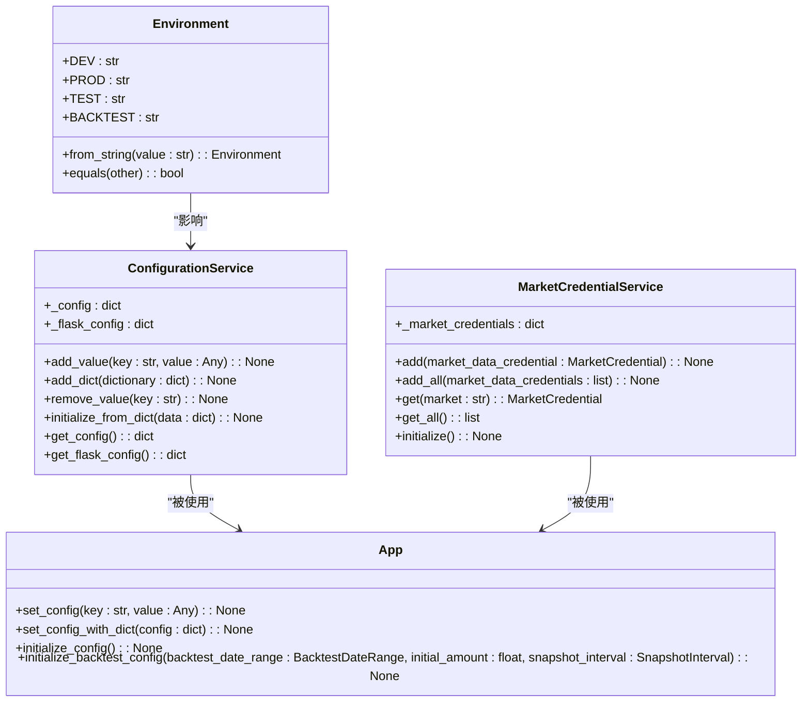

# 配置API

<cite>
**本文档中引用的文件**   
- [config.py](file://investing_algorithm_framework/domain/config.py)
- [configuration_service.py](file://investing_algorithm_framework/services/configuration_service.py)
- [constants.py](file://investing_algorithm_framework/domain/constants.py)
- [app.py](file://investing_algorithm_framework/app/app.py)
- [create_app.py](file://investing_algorithm_framework/create_app.py)
- [dependency_container.py](file://investing_algorithm_framework/dependency_container.py)
- [market_credential.py](file://investing_algorithm_framework/domain/models/market/market_credential.py)
- [market_credential_service.py](file://investing_algorithm_framework/services/market_credential_service.py)
- [env.example.template](file://investing_algorithm_framework/cli/templates/env.example.template)
- [app_aws_lambda_function.py.template](file://investing_algorithm_framework/cli/templates/app_aws_lambda_function.py.template)
- [app_azure_function.py.template](file://investing_algorithm_framework/cli/templates/app_azure_function.py.template)
- [azure_function_function_app.py.template](file://investing_algorithm_framework/cli/templates/azure_function_function_app.py.template)
</cite>

## 目录
1. [简介](#简介)
2. [配置系统架构](#配置系统架构)
3. [核心配置方法](#核心配置方法)
4. [配置优先级与默认值](#配置优先级与默认值)
5. [支持的配置键](#支持的配置键)
6. [市场凭证配置](#市场凭证配置)
7. [配置验证与错误诊断](#配置验证与错误诊断)
8. [部署环境配置示例](#部署环境配置示例)
9. [结论](#结论)

## 简介

本文档详细记录了投资算法框架的配置系统API，涵盖了所有配置选项和环境变量。文档说明了通过`add_config`方法设置配置项的模式，包括市场凭证、数据源路径、交易模式等关键配置。同时，文档化了配置优先级体系和默认值机制，详细列出了支持的所有配置键及其数据类型、有效范围和用途。此外，还提供了配置验证机制和错误诊断方法，并包含不同部署环境（本地、AWS Lambda、Azure Functions）的配置示例和最佳实践。

**Section sources**
- [config.py](file://investing_algorithm_framework/domain/config.py#L1-L112)
- [configuration_service.py](file://investing_algorithm_framework/services/configuration_service.py#L1-L96)

## 配置系统架构

配置系统采用分层架构设计，核心组件包括配置服务、环境管理、默认配置和应用上下文。系统通过依赖注入容器管理配置服务实例，并提供统一的配置访问接口。



**Diagram sources **
- [configuration_service.py](file://investing_algorithm_framework/services/configuration_service.py#L50-L95)
- [config.py](file://investing_algorithm_framework/domain/config.py#L9-L52)
- [app.py](file://investing_algorithm_framework/app/app.py#L200-L269)
- [market_credential_service.py](file://investing_algorithm_framework/services/market_credential_service.py#L6-L40)

**Section sources**
- [configuration_service.py](file://investing_algorithm_framework/services/configuration_service.py#L1-L96)
- [config.py](file://investing_algorithm_framework/domain/config.py#L1-L112)
- [app.py](file://investing_algorithm_framework/app/app.py#L200-L269)

## 核心配置方法

配置系统提供了多种方法来设置和管理应用配置，主要通过`App`类的实例方法实现。

### 设置单个配置项

使用`set_config`方法可以添加或更新单个配置项：

```python
app.set_config("ENVIRONMENT", "PROD")
app.set_config("LOG_LEVEL", "DEBUG")
```

### 批量设置配置项

使用`set_config_with_dict`方法可以一次性设置多个配置项：

```python
config = {
    "ENVIRONMENT": "PROD",
    "LOG_LEVEL": "DEBUG",
    "RESOURCE_DIRECTORY": "/path/to/resources"
}
app.set_config_with_dict(config)
```

### 初始化配置

在设置完基本配置后，需要调用`initialize_config`方法来完成配置的初始化，该方法会根据环境设置数据库名称、路径等衍生配置：

```python
app.initialize_config()
```

### 回测模式配置

对于回测场景，使用`initialize_backtest_config`方法来初始化回测专用配置：

```python
from investing_algorithm_framework.domain import BacktestDateRange, SnapshotInterval

backtest_date_range = BacktestDateRange(
    start_date="2023-01-01",
    end_date="2023-12-31"
)
app.initialize_backtest_config(
    backtest_date_range=backtest_date_range,
    initial_amount=10000,
    snapshot_interval=SnapshotInterval.DAILY
)
```

**Section sources**
- [app.py](file://investing_algorithm_framework/app/app.py#L200-L328)
- [configuration_service.py](file://investing_algorithm_framework/services/configuration_service.py#L75-L95)

## 配置优先级与默认值

配置系统遵循特定的优先级体系，确保配置值的正确性和一致性。配置优先级从高到低如下：

1. **代码中显式设置的配置**：通过`set_config`或`set_config_with_dict`方法设置的配置具有最高优先级
2. **环境变量**：系统会自动读取环境变量作为配置值
3. **.env文件**：项目根目录下的`.env`文件中定义的配置
4. **默认配置**：框架内置的默认配置值

### 默认配置

系统定义了一组默认配置，这些配置在没有显式设置时生效：

```python
DEFAULT_CONFIGURATION = {
    "ENVIRONMENT": Environment.PROD.value,
    "LOG_LEVEL": 'DEBUG',
    "APP_DIR": os.path.abspath(os.path.dirname(__file__)),
    "PROJECT_ROOT": os.path.abspath(os.path.join(os.path.abspath(os.path.dirname(__file__)), os.pardir)),
    "RESOURCE_DIRECTORY": os.getenv("RESOURCE_DIRECTORY") or os.path.join(caller_dir, "resources"),
    "APP_MODE": AppMode.DEFAULT.value,
    "CHECK_PENDING_ORDERS": True,
    "BACKTEST_DATA_DIRECTORY_NAME": "backtest_data",
    "SYMBOLS": None,
    "DATETIME_FORMAT": "%Y-%m-%d %H:%M:%S",
    "DATABASE_DIRECTORY_PATH": None,
    "DATABASE_DIRECTORY_NAME": "databases",
    DATA_DIRECTORY: "data",
    INDEX_DATETIME: None,
    SNAPSHOT_INTERVAL: SnapshotInterval.DAILY.value,
    DATETIME_FORMAT_FILE_NAME: "%Y-%m-%d-%H-%M"
}
```

### 环境特定配置

根据不同的环境，系统会自动调整某些配置的默认值：

- **生产环境(PROD)**：数据库文件名为`prod-database.sqlite3`
- **测试环境(TEST)**：数据库文件名为`test-database.sqlite3`
- **开发环境(DEV)**：数据库文件名为`dev-database.sqlite3`
- **回测环境(BACKTEST)**：数据库文件名为`backtest-database.sqlite3`，数据库目录为`backtest_databases`

**Section sources**
- [configuration_service.py](file://investing_algorithm_framework/services/configuration_service.py#L10-L30)
- [app.py](file://investing_algorithm_framework/app/app.py#L236-L268)
- [config.py](file://investing_algorithm_framework/domain/config.py#L9-L52)

## 支持的配置键

以下是系统支持的所有配置键，按类别分组：

### 基础配置

| 配置键 | 数据类型 | 有效范围 | 用途 |
|-------|--------|--------|------|
| ENVIRONMENT | 字符串 | DEV, PROD, TEST, BACKTEST | 应用运行环境 |
| LOG_LEVEL | 字符串 | DEBUG, INFO, WARNING, ERROR, CRITICAL | 日志级别 |
| APP_DIR | 字符串 | 有效路径 | 应用目录路径 |
| RESOURCE_DIRECTORY | 字符串 | 有效路径 | 资源目录路径 |
| APP_MODE | 字符串 | DEFAULT, WEB, STATELESS | 应用模式 |

### 数据库配置

| 配置键 | 数据类型 | 有效范围 | 用途 |
|-------|--------|--------|------|
| DATABASE_NAME | 字符串 | 有效文件名 | 数据库文件名 |
| DATABASE_DIRECTORY_NAME | 字符串 | 有效目录名 | 数据库目录名 |
| DATABASE_DIRECTORY_PATH | 字符串 | 有效路径 | 数据库完整路径 |
| DATABASE_URL | 字符串 | 有效数据库URL | 数据库连接URL |
| SQLALCHEMY_DATABASE_URI | 字符串 | 有效SQLAlchemy URI | SQLAlchemy数据库URI |

### 回测配置

| 配置键 | 数据类型 | 有效范围 | 用途 |
|-------|--------|--------|------|
| BACKTESTING_START_DATE | 字符串 | 有效日期时间 | 回测开始日期 |
| BACKTESTING_END_DATE | 字符串 | 有效日期时间 | 回测结束日期 |
| BACKTESTING_INITIAL_AMOUNT | 浮点数 | 正数 | 回测初始金额 |
| BACKTESTING_FLAG | 布尔值 | True, False | 是否为回测模式 |
| SNAPSHOT_INTERVAL | 字符串 | DAILY, WEEKLY, MONTHLY | 快照间隔 |

### 交易配置

| 配置键 | 数据类型 | 有效范围 | 用途 |
|-------|--------|--------|------|
| CHECK_PENDING_ORDERS | 布尔值 | True, False | 是否检查待处理订单 |
| RUN_STRATEGY | 布尔值 | True, False | 是否运行策略 |
| SYMBOLS | 字符串列表 | 有效交易对 | 交易符号列表 |
| DATETIME_FORMAT | 字符串 | 有效日期时间格式 | 日期时间格式 |
| DATETIME_FORMAT_FILE_NAME | 字符串 | 有效日期时间格式 | 文件名日期时间格式 |

### 部署配置

| 配置键 | 数据类型 | 有效范围 | 用途 |
|-------|--------|--------|------|
| AWS_S3_STATE_BUCKET_NAME | 字符串 | 有效S3桶名 | AWS S3状态桶名 |
| BACKTEST_DATA_DIRECTORY_NAME | 字符串 | 有效目录名 | 回测数据目录名 |
| DATA_DIRECTORY | 字符串 | 有效目录名 | 数据目录名 |

**Section sources**
- [constants.py](file://investing_algorithm_framework/domain/constants.py#L2-L53)
- [configuration_service.py](file://investing_algorithm_framework/services/configuration_service.py#L10-L30)
- [app.py](file://investing_algorithm_framework/app/app.py#L200-L269)

## 市场凭证配置

市场凭证配置是交易系统的关键部分，用于连接不同的交易所。系统支持通过代码和环境变量两种方式配置市场凭证。

### 代码配置

通过`add_market`方法直接在代码中配置市场凭证：

```python
app.add_market(
    market="binance",
    trading_symbol="EUR",
    api_key="your_api_key",
    secret_key="your_secret_key"
)
```

### 环境变量配置

系统会自动从环境变量中读取市场凭证，环境变量命名规则为`<MARKET>_API_KEY`和`<MARKET>_SECRET_KEY`：

```bash
# .env文件示例
BINANCE_API_KEY=your_binance_api_key
BINANCE_SECRET_KEY=your_binance_secret_key
BITVAVO_API_KEY=your_bitvavo_api_key
BITVAVO_SECRET_KEY=your_bitvavo_secret_key
```

### 市场凭证服务

`MarketCredentialService`负责管理所有市场凭证，提供添加、获取和初始化功能：

```python
class MarketCredentialService:
    def __init__(self):
        self._market_credentials = {}
    
    def add(self, market_data_credential: MarketCredential):
        """添加市场凭证"""
        self._market_credentials[market_data_credential.market.upper()] = market_data_credential
    
    def get(self, market) -> Union[MarketCredential, None]:
        """根据市场名称获取市场凭证"""
        return self._market_credentials.get(market.upper())
    
    def initialize(self):
        """初始化所有市场凭证，从环境变量读取缺失的密钥"""
        for market_credential in self.get_all():
            market_credential.initialize()
```

当市场凭证的API密钥或密钥为空时，系统会自动尝试从对应的环境变量中读取：

```python
def initialize(self):
    if self.api_key is None:
        logger.info(f"从环境变量 {self.market.upper()}_API_KEY 读取API密钥")
        environment_variable = f"{self.market.upper()}_API_KEY"
        self._api_key = os.getenv(environment_variable)
    
    if self.secret_key is None:
        logger.info(f"从环境变量 {self.market.upper()}_SECRET_KEY 读取密钥")
        environment_variable = f"{self.market.upper()}_SECRET_KEY"
        self._secret_key = os.getenv(environment_variable)
```

**Section sources**
- [market_credential.py](file://investing_algorithm_framework/domain/models/market/market_credential.py#L45-L88)
- [market_credential_service.py](file://investing_algorithm_framework/services/market_credential_service.py#L6-L40)
- [app.py](file://investing_algorithm_framework/app/app.py#L48-L75)

## 配置验证与错误诊断

配置系统提供了多种机制来验证配置的正确性并诊断配置错误。

### 配置验证流程

1. **类型验证**：确保配置值的数据类型正确
2. **范围验证**：确保配置值在有效范围内
3. **必填验证**：确保关键配置项不为空
4. **路径验证**：确保文件路径存在且可访问

### 错误诊断方法

当配置出现错误时，系统会提供详细的错误信息：

```python
def handle_exception(error):
    logger.error("发生类型为 {} 的异常".format(type(error)))
    logger.exception(error)
    
    if isinstance(error, OperationalException):
        return error.to_response()
    else:
        # 发生未知的内部错误
        return {
            "status": "error",
            "message": str(error)
        }
```

### 常见配置错误及解决方案

| 错误类型 | 可能原因 | 解决方案 |
|--------|--------|--------|
| 环境变量转换失败 | 提供的值无法转换为环境类型 | 确保环境变量值为DEV, PROD, TEST, BACKTEST之一 |
| 数据库路径不存在 | 资源目录或数据库目录不存在 | 确保资源目录存在，或调用`initialize_storage`创建目录 |
| 市场凭证缺失 | API密钥或密钥未提供且环境变量中也不存在 | 在代码中提供密钥，或在环境变量中设置对应值 |
| 配置键不存在 | 使用了不存在的配置键 | 检查配置键拼写，参考支持的配置键列表 |

### 调试建议

1. **启用DEBUG日志**：将`LOG_LEVEL`设置为`DEBUG`以获取详细的配置初始化日志
2. **检查配置字典**：在初始化后打印`app.config`查看实际配置值
3. **验证环境变量**：确保`.env`文件中的环境变量正确加载
4. **使用配置测试**：编写单元测试验证配置的正确性

**Section sources**
- [exception_handler.py](file://investing_algorithm_framework/app/stateless/exception_handler.py#L1-L40)
- [config.py](file://investing_algorithm_framework/domain/config.py#L20-L37)
- [app.py](file://investing_algorithm_framework/app/app.py#L236-L269)

## 部署环境配置示例

### 本地开发环境

```python
# local_config.py
from investing_algorithm_framework import create_app

app = create_app({
    "ENVIRONMENT": "DEV",
    "LOG_LEVEL": "DEBUG",
    "RESOURCE_DIRECTORY": "./resources",
    "CHECK_PENDING_ORDERS": True
})

# 添加市场配置
app.add_market(
    market="bitvavo",
    trading_symbol="EUR",
    api_key="your_bitvavo_api_key",
    secret_key="your_bitvavo_secret_key"
)

app.initialize_config()
```

### AWS Lambda部署

```python
# app_aws_lambda_function.py
import json
import logging.config
from investing_algorithm_framework import create_app, DEFAULT_LOGGING_CONFIG
from your_strategy import YourStrategy

# 配置日志
logging.config.dictConfig(DEFAULT_LOGGING_CONFIG)
logger = logging.getLogger(__name__)

# 创建应用实例
app = create_app({
    "ENVIRONMENT": "PROD",
    "LOG_LEVEL": "INFO",
    "APP_MODE": "STATELESS"
})

# 添加策略
app.add_strategy(YourStrategy())

def lambda_handler(event, context):
    """AWS Lambda处理函数"""
    try:
        logger.info("收到Lambda调用请求")
        result = app.run()
        logger.info("策略执行完成")
        return {
            'statusCode': 200,
            'body': json.dumps({'status': 'success', 'result': result})
        }
    except Exception as e:
        logger.error(f"执行过程中发生错误: {str(e)}")
        return {
            'statusCode': 500,
            'body': json.dumps({'status': 'error', 'message': str(e)})
        }
```

AWS Lambda环境变量配置（.env文件）：
```bash
# AWS相关配置
AWS_S3_STATE_BUCKET_NAME=your-state-bucket-name

# 交易所API密钥
BINANCE_API_KEY=your_binance_api_key
BINANCE_SECRET_KEY=your_binance_secret_key

# 应用配置
ENVIRONMENT=PROD
LOG_LEVEL=INFO
```

### Azure Functions部署

```python
# app_azure_function.py
import azure.functions as func
import logging.config
from investing_algorithm_framework import create_app, DEFAULT_LOGGING_CONFIG, StatelessAction
from your_strategy import YourStrategy

# 配置日志
logging.config.dictConfig(DEFAULT_LOGGING_CONFIG)
logger = logging.getLogger(__name__)

# 创建应用实例
app = create_app({
    "ENVIRONMENT": "PROD",
    "LOG_LEVEL": "INFO",
    "APP_MODE": "STATELESS"
})

# 添加策略
app.add_strategy(YourStrategy())

app = func.FunctionApp()

@app.route(route="run", auth_level=func.AuthLevel.ANONYMOUS)
def run_trading_bot(req: func.HttpRequest) -> func.HttpResponse:
    """Azure Functions HTTP触发器"""
    logger.info("收到运行请求")
    try:
        result = app.run(payload={"action": StatelessAction.RUN_STRATEGY.value})
        logger.info("策略执行成功")
        return func.HttpResponse(
            json.dumps({"status": "success", "result": result}),
            status_code=200,
            mimetype="application/json"
        )
    except Exception as e:
        logger.error(f"执行过程中发生错误: {str(e)}")
        return func.HttpResponse(
            json.dumps({"status": "error", "message": str(e)}),
            status_code=500,
            mimetype="application/json"
        )

@app.function_name(name="scheduled_trading_bot_run")
@app.schedule(
    schedule="0 */30 * * * *",  # 每30分钟执行一次
    arg_name="timer",
    auth_level=func.AuthLevel.ANONYMOUS,
    run_on_startup=True
)
def scheduled_trading_bot(timer: func.TimerRequest) -> None:
    """定时触发器"""
    logger.info("定时任务触发")
    try:
        app.run(payload={"action": StatelessAction.RUN_STRATEGY.value})
        logger.info("定时任务执行成功")
    except Exception as e:
        logger.error(f"定时任务执行失败: {str(e)}")
        raise e
```

Azure Functions环境变量配置（local.settings.json）：
```json
{
  "IsEncrypted": false,
  "Values": {
    "FUNCTIONS_WORKER_RUNTIME": "python",
    "AzureWebJobsStorage": "UseDevelopmentStorage=true",
    "ENVIRONMENT": "PROD",
    "LOG_LEVEL": "INFO",
    "APP_MODE": "STATELESS",
    "BINANCE_API_KEY": "your_binance_api_key",
    "BINANCE_SECRET_KEY": "your_binance_secret_key"
  }
}
```

### 最佳实践

1. **环境分离**：为不同环境使用不同的配置文件或环境变量
2. **密钥安全**：永远不要在代码中硬编码API密钥，使用环境变量或密钥管理服务
3. **配置版本控制**：将配置模板纳入版本控制，但排除包含敏感信息的实际配置文件
4. **默认值设置**：为所有配置项设置合理的默认值，确保应用在最小配置下也能运行
5. **文档化配置**：维护完整的配置文档，包括每个配置项的用途、默认值和有效范围

**Section sources**
- [app_aws_lambda_function.py.template](file://investing_algorithm_framework/cli/templates/app_aws_lambda_function.py.template)
- [app_azure_function.py.template](file://investing_algorithm_framework/cli/templates/app_azure_function.py.template)
- [azure_function_function_app.py.template](file://investing_algorithm_framework/cli/templates/azure_function_function_app.py.template)
- [env.example.template](file://investing_algorithm_framework/cli/templates/env.example.template)

## 结论

本配置系统API文档全面记录了投资算法框架的配置机制，涵盖了从基础配置到高级部署的所有方面。系统采用分层设计，通过`ConfigurationService`统一管理配置，支持多种配置方式和优先级体系。关键特性包括：

1. **灵活的配置方式**：支持通过代码、字典、环境变量等多种方式设置配置
2. **智能的默认值机制**：根据环境自动选择合适的默认配置
3. **安全的凭证管理**：支持从环境变量读取市场凭证，避免密钥硬编码
4. **完整的部署支持**：为本地、AWS Lambda、Azure Functions等环境提供配置示例
5. **健壮的错误处理**：提供详细的配置验证和错误诊断机制

通过遵循本文档中的最佳实践，开发者可以高效地配置和管理投资算法框架，确保应用在不同环境下的稳定运行。