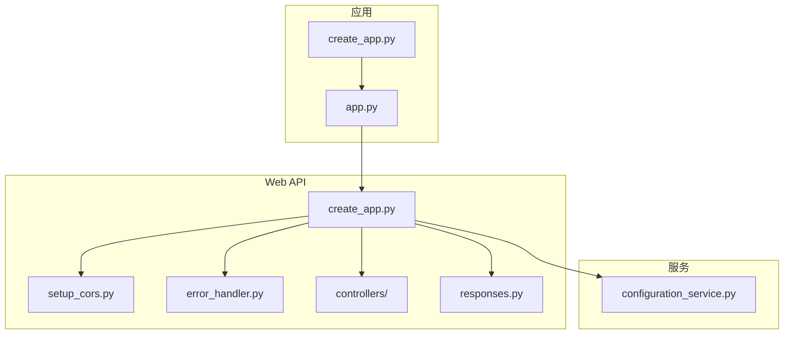
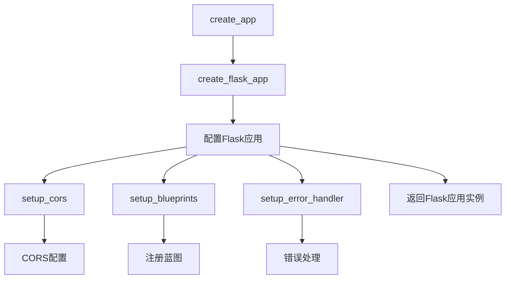
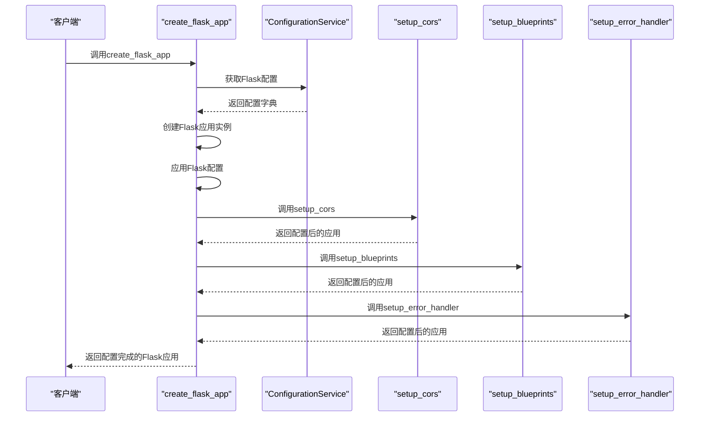
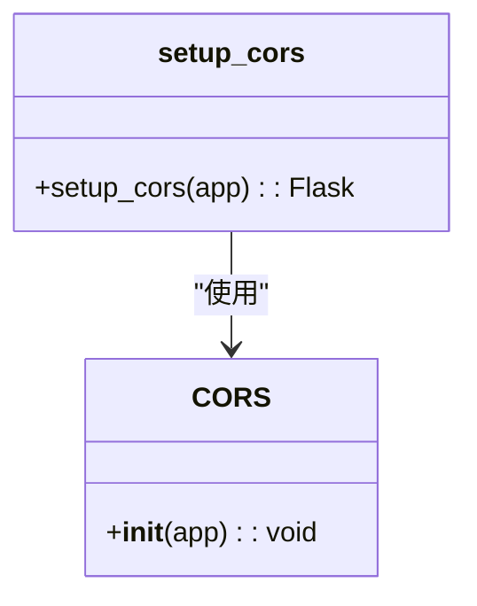
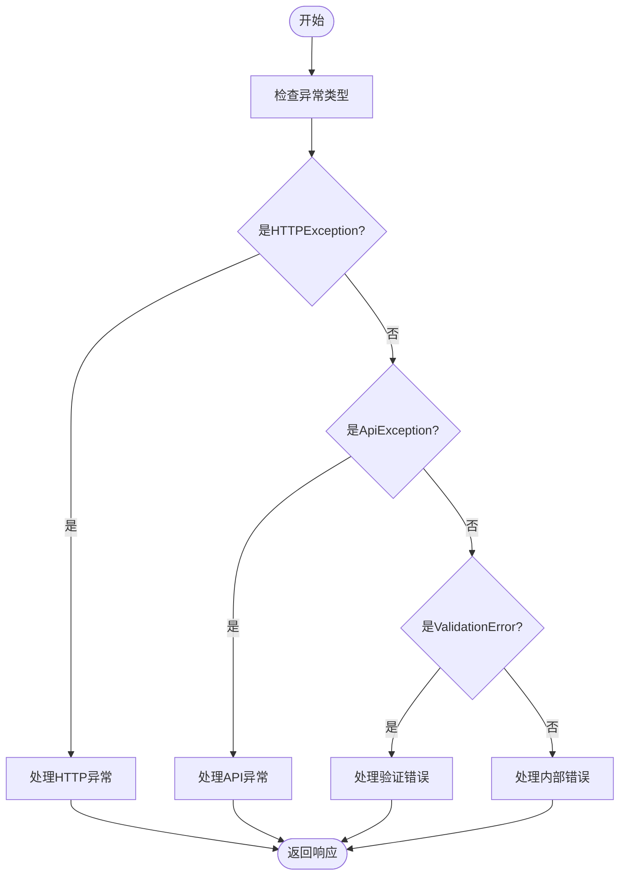
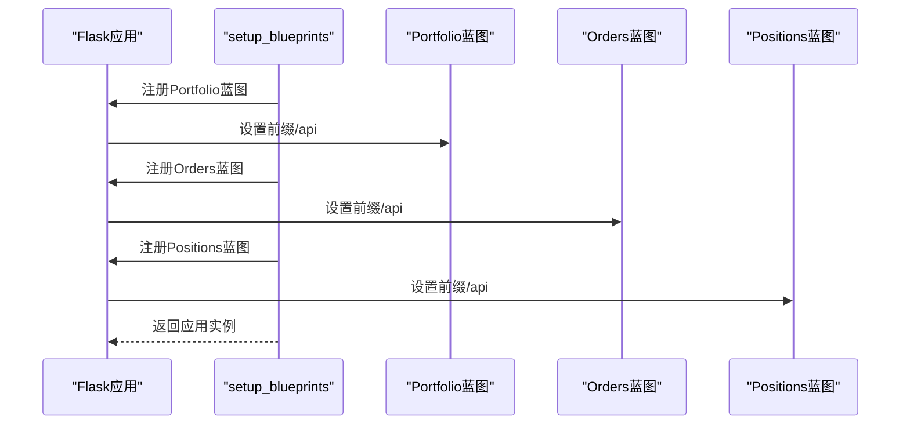
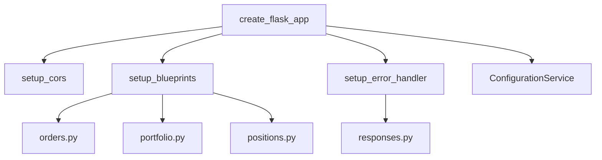

# API配置与安全

<cite>
**本文档中引用的文件**  
- [create_app.py](file://investing_algorithm_framework/app/web/create_app.py)
- [setup_cors.py](file://investing_algorithm_framework/app/web/setup_cors.py)
- [error_handler.py](file://investing_algorithm_framework/app/web/error_handler.py)
- [controllers/__init__.py](file://investing_algorithm_framework/app/web/controllers/__init__.py)
- [orders.py](file://investing_algorithm_framework/app/web/controllers/orders.py)
- [portfolio.py](file://investing_algorithm_framework/app/web/controllers/portfolio.py)
- [positions.py](file://investing_algorithm_framework/app/web/controllers/positions.py)
- [responses.py](file://investing_algorithm_framework/app/web/responses.py)
- [configuration_service.py](file://investing_algorithm_framework/services/configuration_service.py)
- [create_app.py](file://investing_algorithm_framework/create_app.py)
- [app.py](file://investing_algorithm_framework/app/app.py)
</cite>

## 目录
1. [简介](#简介)
2. [项目结构](#项目结构)
3. [核心组件](#核心组件)
4. [架构概述](#架构概述)
5. [详细组件分析](#详细组件分析)
6. [依赖分析](#依赖分析)
7. [性能考虑](#性能考虑)
8. [故障排除指南](#故障排除指南)
9. [结论](#结论)

## 简介
本文档详细介绍了投资算法框架中的Web API配置与安全机制。文档涵盖了API的初始化过程、CORS配置、错误处理机制、蓝图注册、启动流程以及安全最佳实践。通过分析关键组件和配置选项，本文档为开发者提供了全面的指导，以确保API的安全性和可靠性。

## 项目结构
投资算法框架的项目结构清晰地组织了各个模块和组件。API相关的代码主要位于`investing_algorithm_framework/app/web/`目录下，包括控制器、蓝图、错误处理和CORS配置等。

**图示来源**  
- [create_app.py](file://investing_algorithm_framework/app/web/create_app.py#L1-L21)
- [setup_cors.py](file://investing_algorithm_framework/app/web/setup_cors.py#L1-L7)
- [error_handler.py](file://investing_algorithm_framework/app/web/error_handler.py#L1-L60)
- [configuration_service.py](file://investing_algorithm_framework/services/configuration_service.py#L32-L82)

**本节来源**  
- [investing_algorithm_framework/app/web/](file://investing_algorithm_framework/app/web/)
- [investing_algorithm_framework/services/](file://investing_algorithm_framework/services/)

## 核心组件
本节分析了API配置与安全的核心组件，包括`create_flask_app`函数、CORS配置、错误处理机制和蓝图注册。

**本节来源**  
- [create_app.py](file://investing_algorithm_framework/app/web/create_app.py#L8-L21)
- [setup_cors.py](file://investing_algorithm_framework/app/web/setup_cors.py#L4-L6)
- [error_handler.py](file://investing_algorithm_framework/app/web/error_handler.py#L13-L59)
- [controllers/__init__.py](file://investing_algorithm_framework/app/web/controllers/__init__.py#L9-L13)

## 架构概述
投资算法框架的Web API架构基于Flask框架，通过模块化设计实现了高内聚低耦合。API的初始化、CORS配置、错误处理和蓝图注册等关键功能被封装在独立的模块中，便于维护和扩展。

**图示来源**  
- [create_app.py](file://investing_algorithm_framework/app/web/create_app.py#L8-L21)
- [setup_cors.py](file://investing_algorithm_framework/app/web/setup_cors.py#L4-L6)
- [error_handler.py](file://investing_algorithm_framework/app/web/error_handler.py#L13-L59)
- [controllers/__init__.py](file://investing_algorithm_framework/app/web/controllers/__init__.py#L9-L13)

## 详细组件分析
### create_flask_app函数分析
`create_flask_app`函数负责创建和配置Flask应用实例。它接收`configuration_service`作为参数，从中获取Flask配置，并将这些配置应用到Flask应用实例中。

#### 函数调用流程

**图示来源**  
- [create_app.py](file://investing_algorithm_framework/app/web/create_app.py#L8-L21)

**本节来源**  
- [create_app.py](file://investing_algorithm_framework/app/web/create_app.py#L8-L21)

### CORS配置分析
CORS（跨域资源共享）配置通过`setup_cors`函数实现。该函数使用`flask_cors`库为Flask应用添加CORS支持。

#### CORS配置详情

**图示来源**  
- [setup_cors.py](file://investing_algorithm_framework/app/web/setup_cors.py#L4-L6)

**本节来源**  
- [setup_cors.py](file://investing_algorithm_framework/app/web/setup_cors.py#L4-L6)

### 错误处理机制分析
错误处理机制通过`setup_error_handler`函数实现。该函数注册了一个全局错误处理器，能够捕获各种类型的异常并将其转换为标准化的JSON响应。

#### 错误处理流程

**图示来源**  
- [error_handler.py](file://investing_algorithm_framework/app/web/error_handler.py#L13-L59)

**本节来源**  
- [error_handler.py](file://investing_algorithm_framework/app/web/error_handler.py#L13-L59)

### 蓝图注册分析
蓝图注册通过`setup_blueprints`函数实现。该函数将各个控制器的蓝图注册到Flask应用中，并为它们设置统一的API前缀。

#### 蓝图注册流程

**图示来源**  
- [controllers/__init__.py](file://investing_algorithm_framework/app/web/controllers/__init__.py#L9-L13)

**本节来源**  
- [controllers/__init__.py](file://investing_algorithm_framework/app/web/controllers/__init__.py#L9-L13)

## 依赖分析
API配置与安全组件之间的依赖关系清晰，每个组件职责单一，便于维护和测试。

**图示来源**  
- [create_app.py](file://investing_algorithm_framework/app/web/create_app.py#L3-L5)
- [controllers/__init__.py](file://investing_algorithm_framework/app/web/controllers/__init__.py#L1-L13)
- [error_handler.py](file://investing_algorithm_framework/app/web/error_handler.py#L5-L6)

**本节来源**  
- [create_app.py](file://investing_algorithm_framework/app/web/create_app.py#L3-L5)
- [controllers/__init__.py](file://investing_algorithm_framework/app/web/controllers/__init__.py#L1-L13)
- [error_handler.py](file://investing_algorithm_framework/app/web/error_handler.py#L5-L6)

## 性能考虑
在API配置与安全方面，性能考虑主要包括：

1. **配置加载**：通过`configuration_service.get_flask_config()`一次性获取所有配置，减少重复读取。
2. **错误处理**：使用全局错误处理器，避免在每个路由中重复处理异常。
3. **蓝图注册**：批量注册蓝图，减少函数调用开销。
4. **CORS配置**：使用`flask_cors`库的默认配置，避免复杂的自定义逻辑。

这些设计选择确保了API在启动和运行时的高效性。

## 故障排除指南
### 常见问题及解决方案
1. **CORS错误**：检查`CORS_ORIGIN_WHITELIST`配置，确保客户端域名在白名单中。
2. **404错误**：确认蓝图已正确注册，并检查路由前缀是否正确。
3. **配置未生效**：确保在调用`create_flask_app`之前已正确设置`configuration_service`。
4. **错误响应格式不正确**：检查`setup_error_handler`是否已正确注册。

### 调试技巧
- 使用`logger`记录关键步骤的执行情况。
- 在开发环境中启用Flask的调试模式。
- 使用单元测试验证各个组件的功能。

**本节来源**  
- [error_handler.py](file://investing_algorithm_framework/app/web/error_handler.py#L10-L11)
- [create_app.py](file://investing_algorithm_framework/app/web/create_app.py#L11-L14)

## 结论
本文档详细介绍了投资算法框架中Web API的配置与安全机制。通过模块化设计和清晰的依赖关系，API的各个组件能够高效协作，确保了系统的稳定性和安全性。开发者可以基于本文档快速理解和配置API，同时遵循最佳实践来避免常见问题。