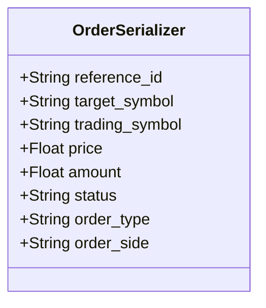
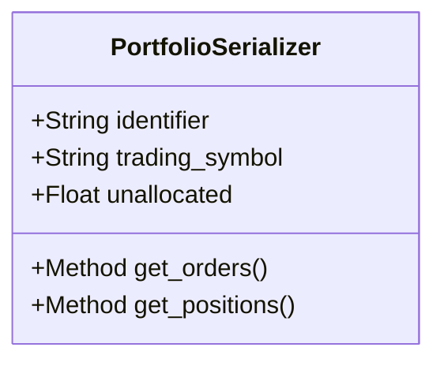
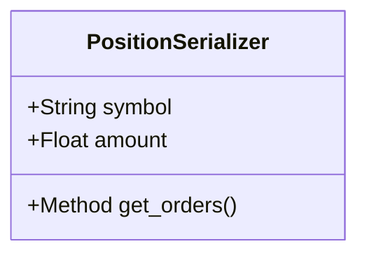
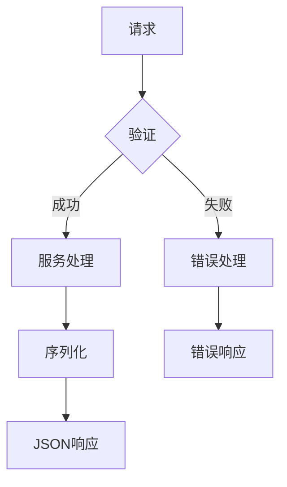
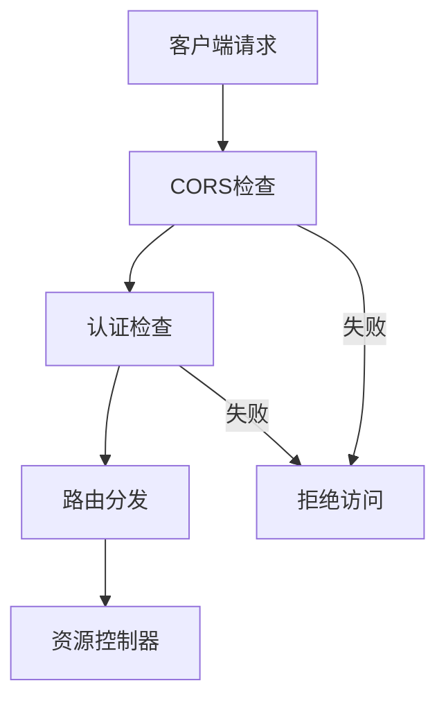
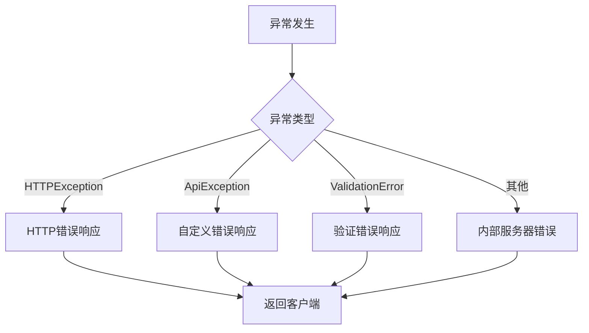
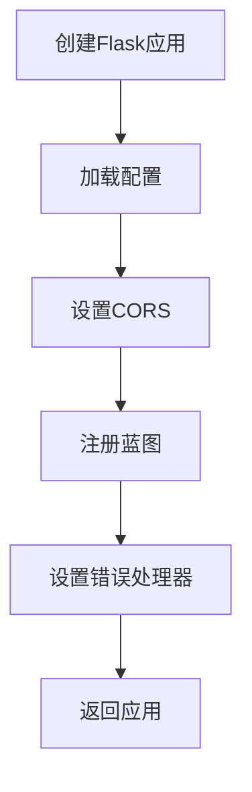

# Web API

<cite>
**本文档中引用的文件**  
- [create_app.py](file://investing_algorithm_framework/app/web/create_app.py)
- [controllers/orders.py](file://investing_algorithm_framework/app/web/controllers/orders.py)
- [controllers/portfolio.py](file://investing_algorithm_framework/app/web/controllers/portfolio.py)
- [controllers/positions.py](file://investing_algorithm_framework/app/web/controllers/positions.py)
- [schemas/order.py](file://investing_algorithm_framework/app/web/schemas/order.py)
- [schemas/portfolio.py](file://investing_algorithm_framework/app/web/schemas/portfolio.py)
- [schemas/position.py](file://investing_algorithm_framework/app/web/schemas/position.py)
- [responses.py](file://investing_algorithm_framework/app/web/responses.py)
- [error_handler.py](file://investing_algorithm_framework/app/web/error_handler.py)
- [setup_cors.py](file://investing_algorithm_framework/app/web/setup_cors.py)
- [dependency_container.py](file://investing_algorithm_framework/dependency_container.py)
</cite>

## 目录
1. [简介](#简介)
2. [API端点概览](#api端点概览)
3. [资源详细说明](#资源详细说明)
4. [请求与响应结构](#请求与响应结构)
5. [认证与安全](#认证与安全)
6. [错误处理](#错误处理)
7. [速率限制与版本控制](#速率限制与版本控制)
8. [API使用示例](#api使用示例)
9. [Web服务配置](#web服务配置)

## 简介

本API文档详细介绍了投资算法框架提供的RESTful Web API。该API允许用户通过HTTP接口访问投资组合、订单和头寸等核心金融资源。API基于Flask框架构建，使用Blueprints组织路由，并通过依赖注入容器管理服务组件。API设计遵循REST原则，提供对投资组合管理系统的标准化访问。

**Section sources**
- [create_app.py](file://investing_algorithm_framework/app/web/create_app.py#L8-L20)
- [dependency_container.py](file://investing_algorithm_framework/dependency_container.py#L1-L21)

## API端点概览

API提供对三个核心资源的访问：订单、投资组合和头寸。所有端点均以`/api/`为前缀，通过不同的控制器进行管理。系统使用Flask Blueprints将路由组织到独立的模块中，并在应用初始化时注册。

```mermaid
graph TD
A[客户端] --> B[/api/portfolios]
A --> C[/api/orders]
A --> D[/api/positions]
B --> E[投资组合控制器]
C --> F[订单控制器]
D --> G[头寸控制器]
E --> H[投资组合服务]
F --> I[订单服务]
G --> J[头寸服务]
```

**Diagram sources**
- [create_app.py](file://investing_algorithm_framework/app/web/create_app.py#L18)
- [controllers/__init__.py](file://investing_algorithm_framework/app/web/controllers/__init__.py#L9-L12)

**Section sources**
- [controllers/__init__.py](file://investing_algorithm_framework/app/web/controllers/__init__.py#L1-L12)

## 资源详细说明

### 订单资源

订单资源通过`/api/orders`端点访问，支持GET方法获取订单列表。订单服务负责处理所有与订单相关的业务逻辑，包括创建、查询和状态更新。



**Diagram sources**
- [schemas/order.py](file://investing_algorithm_framework/app/web/schemas/order.py#L4-L13)

**Section sources**
- [controllers/orders.py](file://investing_algorithm_framework/app/web/controllers/orders.py#L16-L20)

### 投资组合资源

投资组合资源通过`/api/portfolios`端点访问，支持GET方法获取投资组合列表。投资组合序列化器包含标识符、交易符号、未分配资金等信息，并通过方法字段动态计算相关订单和头寸数量。



**Diagram sources**
- [schemas/portfolio.py](file://investing_algorithm_framework/app/web/schemas/portfolio.py#L7-L23)

**Section sources**
- [controllers/portfolio.py](file://investing_algorithm_framework/app/web/controllers/portfolio.py#L16-L20)

### 头寸资源

头寸资源通过`/api/positions`端点访问，支持GET方法获取头寸列表。头寸序列化器包含交易符号、数量等信息，并通过方法字段计算相关订单数量。



**Diagram sources**
- [schemas/position.py](file://investing_algorithm_framework/app/web/schemas/position.py#L7-L16)

**Section sources**
- [controllers/positions.py](file://investing_algorithm_framework/app/web/controllers/positions.py#L14-L19)

## 请求与响应结构

### 响应格式

所有API响应均采用JSON格式。成功响应包含资源数据，而错误响应包含错误消息。响应通过统一的响应创建函数生成，确保格式一致性。



**Diagram sources**
- [responses.py](file://investing_algorithm_framework/app/web/responses.py#L6-L21)

**Section sources**
- [responses.py](file://investing_algorithm_framework/app/web/responses.py#L6-L21)

### 数据序列化

API使用Marshmallow库进行数据序列化和反序列化。每个资源都有对应的序列化器类，定义了字段的序列化规则。序列化器仅导出（dump_only）字段，确保内部实现细节不暴露给API客户端。

**Section sources**
- [schemas/order.py](file://investing_algorithm_framework/app/web/schemas/order.py#L4-L13)
- [schemas/portfolio.py](file://investing_algorithm_framework/app/web/schemas/portfolio.py#L7-L23)
- [schemas/position.py](file://investing_algorithm_framework/app/web/schemas/position.py#L7-L16)

## 认证与安全

API通过依赖注入容器管理安全相关服务。虽然当前代码中未显示具体的认证实现，但系统架构支持通过市场凭证服务（MarketCredentialService）进行认证。CORS（跨域资源共享）已通过Flask-CORS扩展启用，允许来自不同域的请求。



**Diagram sources**
- [setup_cors.py](file://investing_algorithm_framework/app/web/setup_cors.py#L4-L6)
- [dependency_container.py](file://investing_algorithm_framework/dependency_container.py#L34-L36)

**Section sources**
- [setup_cors.py](file://investing_algorithm_framework/app/web/setup_cors.py#L4-L6)
- [dependency_container.py](file://investing_algorithm_framework/dependency_container.py#L34-L36)

## 错误处理

API实现了统一的错误处理机制。系统注册了全局异常处理器，能够捕获并处理各种类型的异常，包括HTTP异常、API异常和数据验证异常。错误消息被格式化为JSON响应，包含清晰的错误描述。



**Diagram sources**
- [error_handler.py](file://investing_algorithm_framework/app/web/error_handler.py#L13-L59)

**Section sources**
- [error_handler.py](file://investing_algorithm_framework/app/web/error_handler.py#L13-L59)

## 速率限制与版本控制

当前代码中未实现速率限制和版本控制功能。API端点直接暴露，没有版本前缀。未来的实现可以在Blueprint注册时添加版本前缀，或通过中间件实现速率限制。

**Section sources**
- [create_app.py](file://investing_algorithm_framework/app/web/create_app.py#L18)
- [controllers/__init__.py](file://investing_algorithm_framework/app/web/controllers/__init__.py#L10-L12)

## API使用示例

### 使用curl调用API

```bash
# 获取所有投资组合
curl -X GET http://localhost:5000/api/portfolios

# 获取所有订单
curl -X GET http://localhost:5000/api/orders

# 获取所有头寸
curl -X GET http://localhost:5000/api/positions
```

### 使用Python requests库

```python
import requests

# 获取投资组合
response = requests.get('http://localhost:5000/api/portfolios')
portfolios = response.json()
print(portfolios)

# 获取订单
response = requests.get('http://localhost:5000/api/orders')
orders = response.json()
print(orders)

# 获取头寸
response = requests.get('http://localhost:5000/api/positions')
positions = response.json()
print(positions)
```

**Section sources**
- [controllers/portfolio.py](file://investing_algorithm_framework/app/web/controllers/portfolio.py#L16)
- [controllers/orders.py](file://investing_algorithm_framework/app/web/controllers/orders.py#L16)
- [controllers/positions.py](file://investing_algorithm_framework/app/web/controllers/positions.py#L14)

## Web服务配置

Web服务通过`create_flask_app`函数创建和配置。该函数接收配置服务作为参数，设置Flask应用的配置，启用CORS，注册蓝图，并设置错误处理器。应用配置从配置服务获取，确保配置的一致性和可管理性。



**Diagram sources**
- [create_app.py](file://investing_algorithm_framework/app/web/create_app.py#L8-L20)

**Section sources**
- [create_app.py](file://investing_algorithm_framework/app/web/create_app.py#L8-L20)