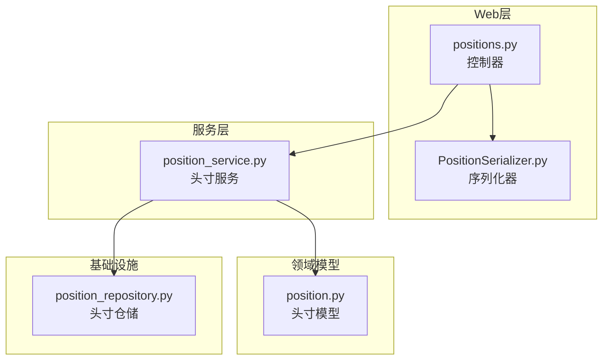
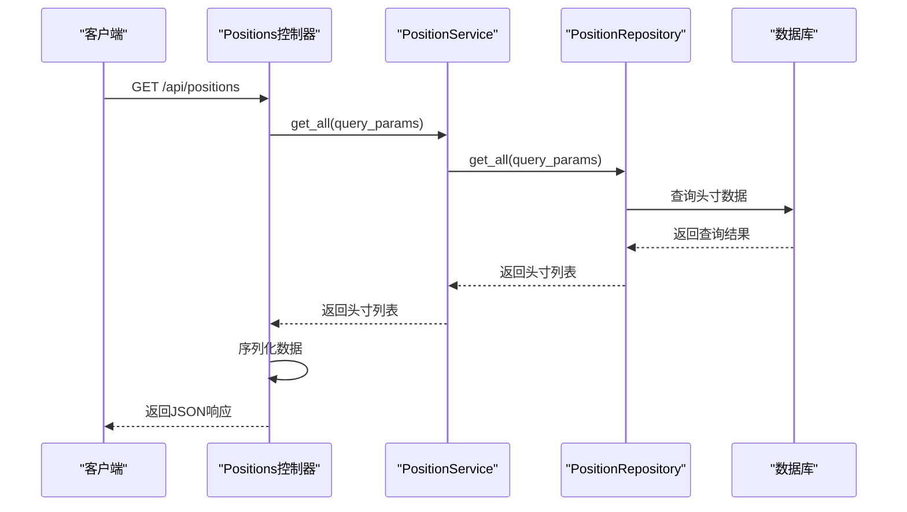
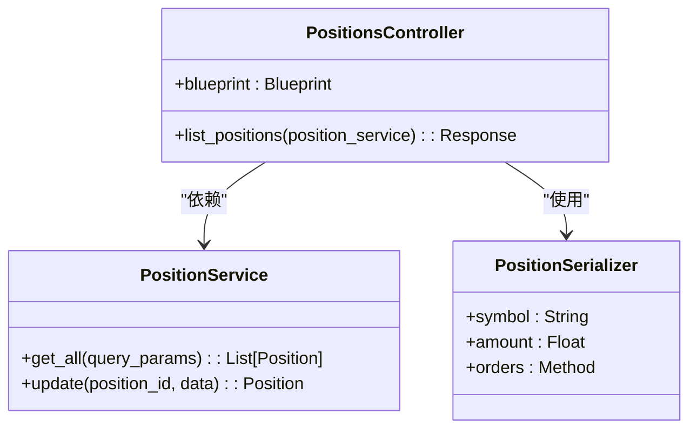
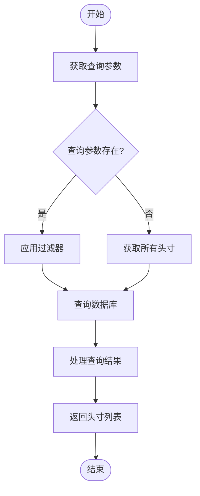
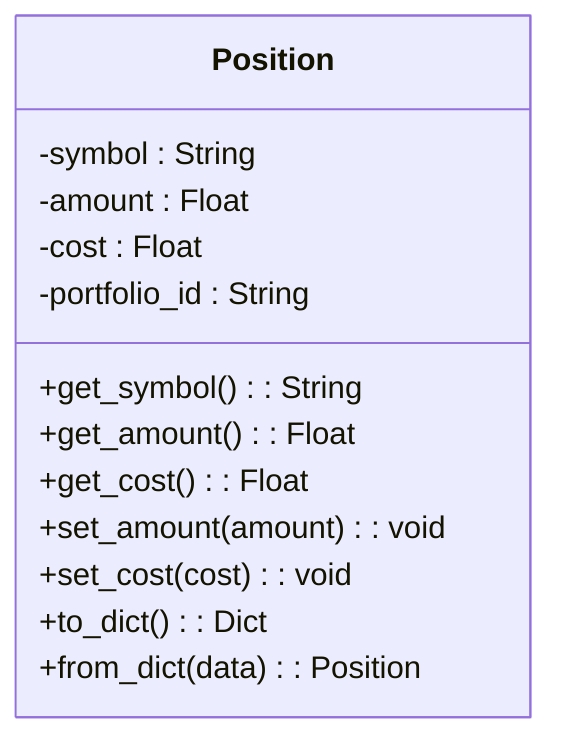
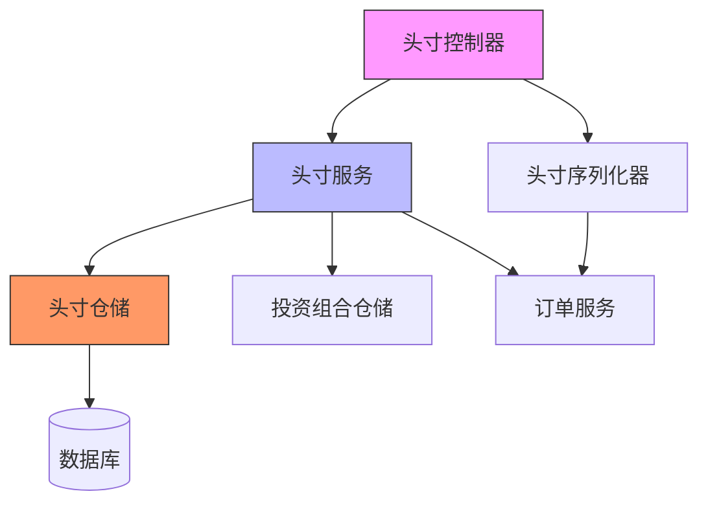

# 头寸API

<cite>
**本文档引用的文件**  
- [positions.py](file://investing_algorithm_framework/app/web/controllers/positions.py)
- [position_service.py](file://investing_algorithm_framework/services/positions/position_service.py)
- [position.py](file://investing_algorithm_framework/domain/models/position/position.py)
- [position_repository.py](file://investing_algorithm_framework/infrastructure/repositories/position_repository.py)
- [PositionSerializer.py](file://investing_algorithm_framework/app/web/schemas/position.py)
- [create_response.py](file://investing_algorithm_framework/app/web/responses.py)
- [create_app.py](file://investing_algorithm_framework/app/web/create_app.py)
- [configuration_service.py](file://investing_algorithm_framework/services/configuration_service.py)
</cite>

## 目录
1. [简介](#简介)
2. [项目结构](#项目结构)
3. [核心组件](#核心组件)
4. [架构概述](#架构概述)
5. [详细组件分析](#详细组件分析)
6. [依赖分析](#依赖分析)
7. [性能考虑](#性能考虑)
8. [故障排除指南](#故障排除指南)
9. [结论](#结论)

## 简介
头寸API是投资算法框架中的关键组件，提供RESTful端点用于获取投资组合中的头寸信息。该API允许用户查询特定交易对的头寸或获取所有头寸的汇总信息，支持数据过滤和查询参数，为投资决策提供实时数据支持。

## 项目结构
头寸API的实现分布在多个模块中，主要位于`investing_algorithm_framework/app/web/controllers/`目录下。该API与其他组件如投资组合、订单和市场数据提供者紧密集成，形成完整的交易系统。

**图示来源**  
- [positions.py](file://investing_algorithm_framework/app/web/controllers/positions.py)
- [position_service.py](file://investing_algorithm_framework/services/positions/position_service.py)
- [position.py](file://investing_algorithm_framework/domain/models/position/position.py)
- [position_repository.py](file://investing_algorithm_framework/infrastructure/repositories/position_repository.py)

## 核心组件
头寸API的核心组件包括控制器、服务、模型和仓储。控制器处理HTTP请求，服务层实现业务逻辑，模型定义数据结构，仓储负责数据持久化。这种分层架构确保了代码的可维护性和可扩展性。

**组件来源**  
- [positions.py](file://investing_algorithm_framework/app/web/controllers/positions.py)
- [position_service.py](file://investing_algorithm_framework/services/positions/position_service.py)
- [position.py](file://investing_algorithm_framework/domain/models/position/position.py)

## 架构概述
头寸API采用典型的分层架构，从HTTP请求处理到数据持久化形成清晰的调用链。当收到GET请求时，控制器调用服务层，服务层通过仓储访问数据库，最后将数据序列化后返回给客户端。

**图示来源**  
- [positions.py](file://investing_algorithm_framework/app/web/controllers/positions.py#L14-L18)
- [position_service.py](file://investing_algorithm_framework/services/positions/position_service.py#L10-L23)
- [position_repository.py](file://investing_algorithm_framework/infrastructure/repositories/position_repository.py#L7-L67)

## 详细组件分析

### 头寸控制器分析
头寸控制器是API的入口点，负责处理HTTP请求和响应。它使用Flask框架定义路由，并通过依赖注入获取服务实例。

#### 控制器实现

**图示来源**  
- [positions.py](file://investing_algorithm_framework/app/web/controllers/positions.py)
- [position_service.py](file://investing_algorithm_framework/services/positions/position_service.py)
- [position.py](file://investing_algorithm_framework/app/web/schemas/position.py)

**组件来源**  
- [positions.py](file://investing_algorithm_framework/app/web/controllers/positions.py#L1-L19)

### 头寸服务分析
头寸服务是业务逻辑的核心，负责处理头寸的创建、更新和查询操作。它实现了RepositoryService接口，提供了丰富的头寸管理功能。

#### 服务功能流程

**图示来源**  
- [position_service.py](file://investing_algorithm_framework/services/positions/position_service.py#L10-L211)

**组件来源**  
- [position_service.py](file://investing_algorithm_framework/services/positions/position_service.py#L1-L211)

### 头寸模型分析
头寸模型定义了头寸的数据结构和基本操作。它包含交易对、持有数量、成本等关键属性，是系统中头寸数据的核心表示。

#### 数据模型结构

**图示来源**  
- [position.py](file://investing_algorithm_framework/domain/models/position/position.py#L4-L69)

**组件来源**  
- [position.py](file://investing_algorithm_framework/domain/models/position/position.py#L1-L69)

## 依赖分析
头寸API依赖于多个核心组件，包括投资组合服务、订单服务和数据库仓储。这些依赖关系通过依赖注入容器管理，确保了组件间的松耦合。

**图示来源**  
- [positions.py](file://investing_algorithm_framework/app/web/controllers/positions.py)
- [position_service.py](file://investing_algorithm_framework/services/positions/position_service.py)
- [position_repository.py](file://investing_algorithm_framework/infrastructure/repositories/position_repository.py)

**组件来源**  
- [position_service.py](file://investing_algorithm_framework/services/positions/position_service.py#L12-L23)
- [position_repository.py](file://investing_algorithm_framework/infrastructure/repositories/position_repository.py#L7-L67)

## 性能考虑
头寸API在设计时考虑了性能优化，通过查询参数过滤和数据库索引提高查询效率。建议在生产环境中使用缓存机制来进一步提升性能，特别是在高并发场景下。

## 故障排除指南
当头寸API出现问题时，可以检查以下方面：确保数据库连接正常，验证查询参数的正确性，检查服务依赖是否正常注入。对于空响应，需要确认投资组合中是否存在头寸数据。

**组件来源**  
- [positions.py](file://investing_algorithm_framework/app/web/controllers/positions.py#L17)
- [position_service.py](file://investing_algorithm_framework/services/positions/position_service.py#L12-L23)

## 结论
头寸API为投资算法框架提供了强大的头寸管理功能，通过清晰的分层架构和RESTful设计，实现了高效、可靠的数据访问。该API的设计考虑了可扩展性和性能，为构建复杂的交易策略提供了坚实的基础。