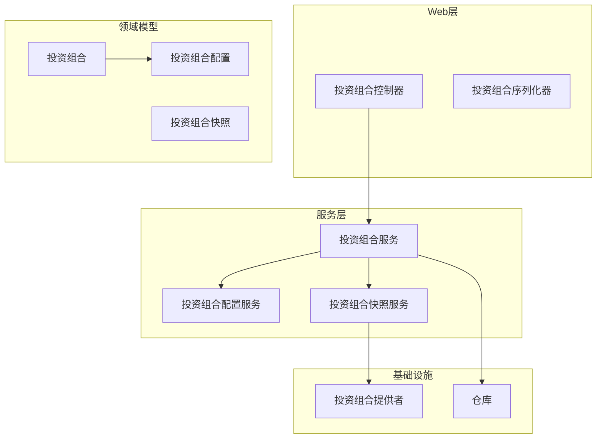
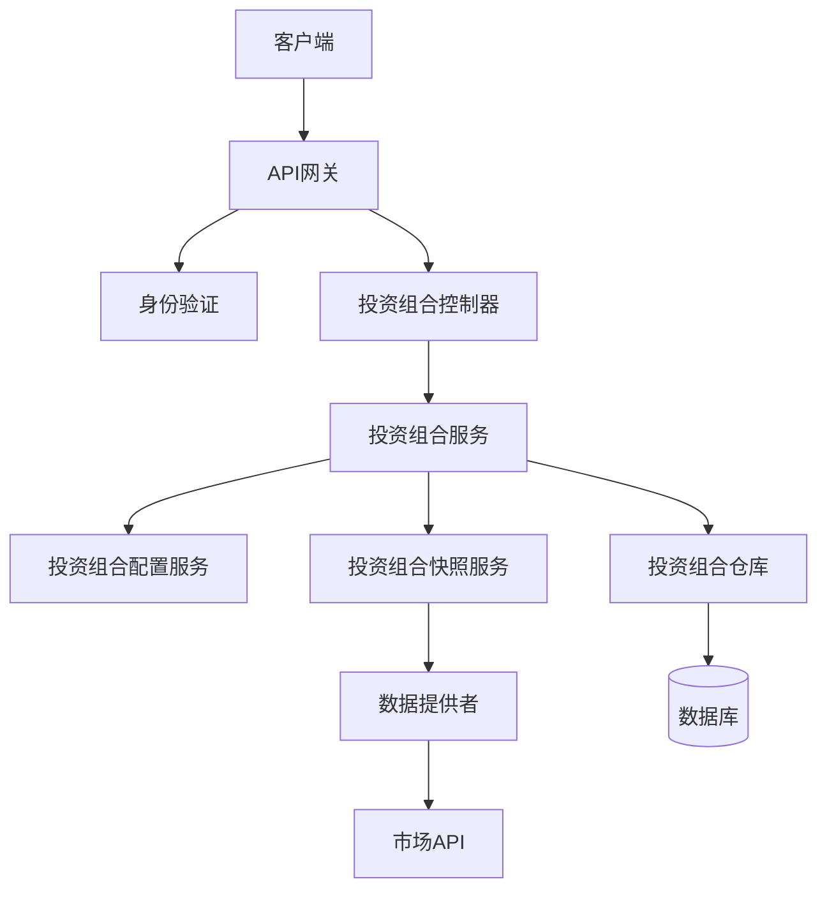
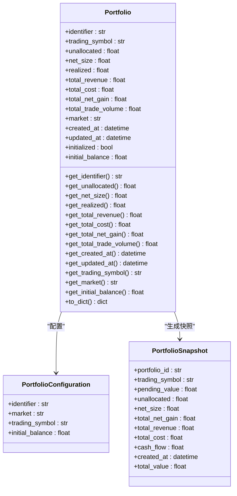
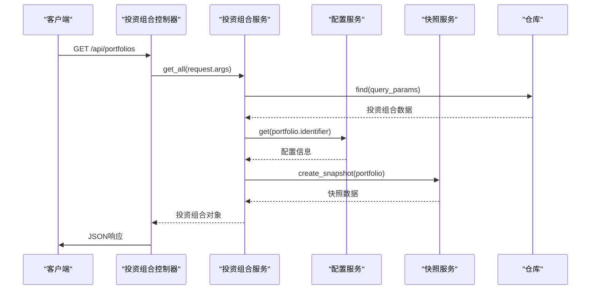
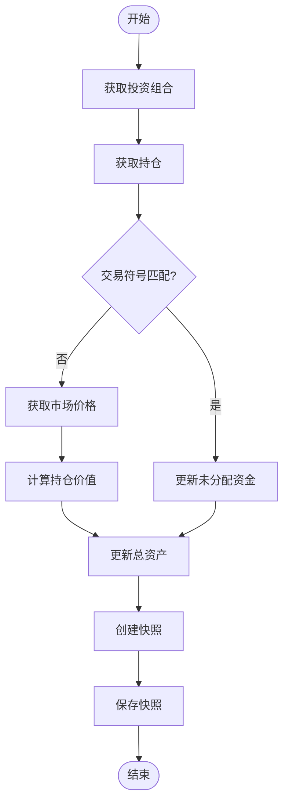
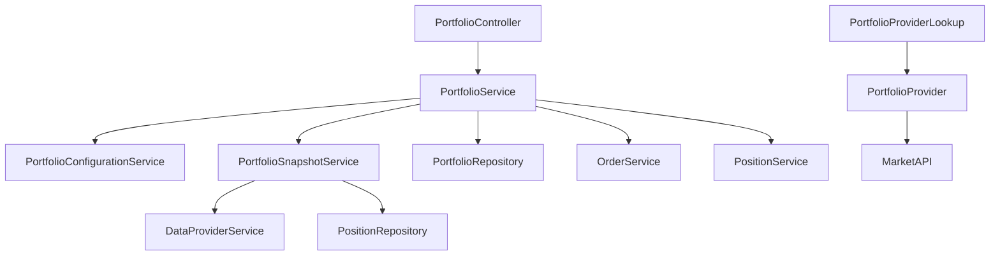

# 投资组合API

<cite>
**本文档中引用的文件**  
- [portfolio.py](file://investing_algorithm_framework/domain/models/portfolio/portfolio.py)
- [portfolio_service.py](file://investing_algorithm_framework/services/portfolios/portfolio_service.py)
- [portfolio.py](file://investing_algorithm_framework/app/web/controllers/portfolio.py)
- [portfolio_snapshot_service.py](file://investing_algorithm_framework/services/portfolios/portfolio_snapshot_service.py)
- [portfolio_configuration_service.py](file://investing_algorithm_framework/services/portfolios/portfolio_configuration_service.py)
- [portfolio.py](file://investing_algorithm_framework/app/web/schemas/portfolio.py)
- [create_app.py](file://investing_algorithm_framework/app/web/create_app.py)
- [context.py](file://investing_algorithm_framework/app/context.py)
- [portfolio_provider_lookup.py](file://investing_algorithm_framework/services/portfolios/portfolio_provider_lookup.py)
- [ccxt_portfolio_provider.py](file://investing_algorithm_framework/infrastructure/portfolio_providers/ccxt_portfolio_provider.py)
</cite>

## 目录
1. [简介](#简介)
2. [项目结构](#项目结构)
3. [核心组件](#核心组件)
4. [架构概述](#架构概述)
5. [详细组件分析](#详细组件分析)
6. [依赖分析](#依赖分析)
7. [性能考虑](#性能考虑)
8. [故障排除指南](#故障排除指南)
9. [结论](#结论)

## 简介
投资组合API是投资算法框架中的核心组件，用于管理和获取投资组合信息。该API提供了一个RESTful接口，用于获取投资组合的详细信息，包括总资产价值、未分配资金、货币类型和时间戳等关键指标。本API通过GET /api/portfolios端点提供投资组合数据，支持身份验证和数据保护机制。投资组合价值的计算基于实时市场数据和持仓信息，通过定期快照机制更新。该API还处理各种错误情况，如投资组合未初始化等场景，确保系统的稳定性和可靠性。

## 项目结构
投资组合API的实现分布在多个模块中，主要位于`investing_algorithm_framework`目录下。核心功能分布在`domain/models/portfolio`、`services/portfolios`和`app/web/controllers`等目录中。`domain/models/portfolio`包含投资组合的核心数据模型，`services/portfolios`包含投资组合的业务逻辑服务，`app/web/controllers`包含API控制器。这种分层架构确保了代码的可维护性和可扩展性。

**图表来源**
- [portfolio.py](file://investing_algorithm_framework/domain/models/portfolio/portfolio.py)
- [portfolio_service.py](file://investing_algorithm_framework/services/portfolios/portfolio_service.py)
- [portfolio.py](file://investing_algorithm_framework/app/web/controllers/portfolio.py)
- [portfolio_snapshot_service.py](file://investing_algorithm_framework/services/portfolios/portfolio_snapshot_service.py)
- [portfolio_configuration_service.py](file://investing_algorithm_framework/services/portfolios/portfolio_configuration_service.py)

**章节来源**
- [portfolio.py](file://investing_algorithm_framework/domain/models/portfolio/portfolio.py)
- [portfolio_service.py](file://investing_algorithm_framework/services/portfolios/portfolio_service.py)
- [portfolio.py](file://investing_algorithm_framework/app/web/controllers/portfolio.py)

## 核心组件
投资组合API的核心组件包括投资组合模型、投资组合服务、投资组合控制器和投资组合序列化器。投资组合模型定义了投资组合的数据结构，包括交易符号、未分配资金、总资产价值等属性。投资组合服务处理投资组合的业务逻辑，如创建、查找和更新投资组合。投资组合控制器处理HTTP请求，调用服务层方法并返回响应。投资组合序列化器负责将投资组合对象转换为JSON格式，包括计算订单和持仓数量等动态属性。

**章节来源**
- [portfolio.py](file://investing_algorithm_framework/domain/models/portfolio/portfolio.py)
- [portfolio_service.py](file://investing_algorithm_framework/services/portfolios/portfolio_service.py)
- [portfolio.py](file://investing_algorithm_framework/app/web/controllers/portfolio.py)
- [portfolio.py](file://investing_algorithm_framework/app/web/schemas/portfolio.py)

## 架构概述
投资组合API采用分层架构，包括Web层、服务层、领域模型层和基础设施层。Web层负责处理HTTP请求和响应，服务层处理业务逻辑，领域模型层定义核心数据结构，基础设施层提供数据访问和外部服务集成。这种架构确保了关注点分离，提高了代码的可测试性和可维护性。API通过依赖注入容器管理组件之间的依赖关系，实现了松耦合设计。

**图表来源**
- [create_app.py](file://investing_algorithm_framework/app/web/create_app.py)
- [portfolio.py](file://investing_algorithm_framework/app/web/controllers/portfolio.py)
- [portfolio_service.py](file://investing_algorithm_framework/services/portfolios/portfolio_service.py)
- [portfolio_configuration_service.py](file://investing_algorithm_framework/services/portfolios/portfolio_configuration_service.py)
- [portfolio_snapshot_service.py](file://investing_algorithm_framework/services/portfolios/portfolio_snapshot_service.py)

## 详细组件分析

### 投资组合模型分析
投资组合模型是投资组合API的核心数据结构，定义了投资组合的属性和行为。该模型包含交易符号、未分配资金、总资产价值、市场信息等关键属性。投资组合的总资产价值通过投资组合快照服务定期计算和更新。模型还提供了各种getter方法来访问属性值，确保数据的封装性和安全性。

**图表来源**
- [portfolio.py](file://investing_algorithm_framework/domain/models/portfolio/portfolio.py)
- [portfolio_configuration.py](file://investing_algorithm_framework/domain/models/portfolio/portfolio_configuration.py)
- [portfolio_snapshot.py](file://investing_algorithm_framework/domain/models/portfolio/portfolio_snapshot.py)

### 投资组合服务分析
投资组合服务是投资组合API的业务逻辑核心，负责处理投资组合的创建、查找和更新操作。该服务依赖于投资组合配置服务、投资组合快照服务和其他相关服务。服务通过仓库模式访问持久化数据，确保数据访问的抽象性和可测试性。投资组合服务还处理投资组合的初始化和同步逻辑，确保投资组合状态的一致性。

**图表来源**
- [portfolio_service.py](file://investing_algorithm_framework/services/portfolios/portfolio_service.py)
- [portfolio_configuration_service.py](file://investing_algorithm_framework/services/portfolios/portfolio_configuration_service.py)
- [portfolio_snapshot_service.py](file://investing_algorithm_framework/services/portfolios/portfolio_snapshot_service.py)
- [portfolio.py](file://investing_algorithm_framework/app/web/controllers/portfolio.py)

### 投资组合价值计算分析
投资组合价值的计算是投资组合API的关键功能，通过投资组合快照服务实现。该服务定期创建投资组合快照，计算总资产价值。计算过程包括获取持仓信息、查询市场价格、计算持仓价值，并汇总得到总资产价值。快照服务还处理未分配资金、待处理订单价值等，确保投资组合价值的准确性。

**图表来源**
- [portfolio_snapshot_service.py](file://investing_algorithm_framework/services/portfolios/portfolio_snapshot_service.py)
- [portfolio.py](file://investing_algorithm_framework/domain/models/portfolio/portfolio.py)
- [data_provider_service.py](file://investing_algorithm_framework/services/data_providers/data_provider_service.py)

**章节来源**
- [portfolio_snapshot_service.py](file://investing_algorithm_framework/services/portfolios/portfolio_snapshot_service.py)
- [portfolio.py](file://investing_algorithm_framework/domain/models/portfolio/portfolio.py)

## 依赖分析
投资组合API的组件之间存在复杂的依赖关系。投资组合控制器依赖于投资组合服务，投资组合服务又依赖于投资组合配置服务、投资组合快照服务和仓库。投资组合快照服务依赖于数据提供者服务来获取市场价格。这些依赖关系通过依赖注入容器管理，确保了组件之间的松耦合。投资组合提供者查找服务负责管理不同市场的投资组合提供者，确保系统可以支持多个交易平台。

**图表来源**
- [portfolio_service.py](file://investing_algorithm_framework/services/portfolios/portfolio_service.py)
- [portfolio_configuration_service.py](file://investing_algorithm_framework/services/portfolios/portfolio_configuration_service.py)
- [portfolio_snapshot_service.py](file://investing_algorithm_framework/services/portfolios/portfolio_snapshot_service.py)
- [portfolio_provider_lookup.py](file://investing_algorithm_framework/services/portfolios/portfolio_provider_lookup.py)
- [ccxt_portfolio_provider.py](file://investing_algorithm_framework/infrastructure/portfolio_providers/ccxt_portfolio_provider.py)

**章节来源**
- [portfolio_service.py](file://investing_algorithm_framework/services/portfolios/portfolio_service.py)
- [portfolio_configuration_service.py](file://investing_algorithm_framework/services/portfolios/portfolio_configuration_service.py)
- [portfolio_snapshot_service.py](file://investing_algorithm_framework/services/portfolios/portfolio_snapshot_service.py)
- [portfolio_provider_lookup.py](file://investing_algorithm_framework/services/portfolios/portfolio_provider_lookup.py)

## 性能考虑
投资组合API的性能主要受数据查询和市场数据获取的影响。为了优化性能，系统采用了缓存机制和批量操作。投资组合快照服务定期创建快照，避免了实时计算的开销。API还支持查询参数过滤，允许客户端获取特定的投资组合数据，减少网络传输量。对于高频率的市场数据查询，系统实现了数据缓存和速率限制，确保系统的稳定性和响应性。

## 故障排除指南
投资组合API可能遇到的常见问题包括投资组合未初始化、市场凭证缺失和余额不足等。当投资组合未初始化时，系统会检查配置的初始余额是否可用，并在余额不足时抛出异常。市场凭证缺失会导致无法同步投资组合数据，系统会返回相应的错误信息。余额不足问题通常发生在创建投资组合时，系统会验证可用余额是否满足初始余额要求，并提供清晰的错误消息。

**章节来源**
- [portfolio_sync_service.py](file://investing_algorithm_framework/services/portfolios/portfolio_sync_service.py)
- [portfolio_service.py](file://investing_algorithm_framework/services/portfolios/portfolio_service.py)
- [context.py](file://investing_algorithm_framework/app/context.py)

## 结论
投资组合API是一个功能完整、架构清晰的RESTful API，提供了投资组合信息的获取和管理功能。通过分层架构和依赖注入，系统实现了高内聚、低耦合的设计。API的安全性通过身份验证和数据保护机制得到保障。投资组合价值的计算准确可靠，支持多种市场和交易符号。系统的可扩展性良好，可以轻松集成新的交易平台和数据源。整体而言，投资组合API为投资算法框架提供了稳定可靠的基础服务。