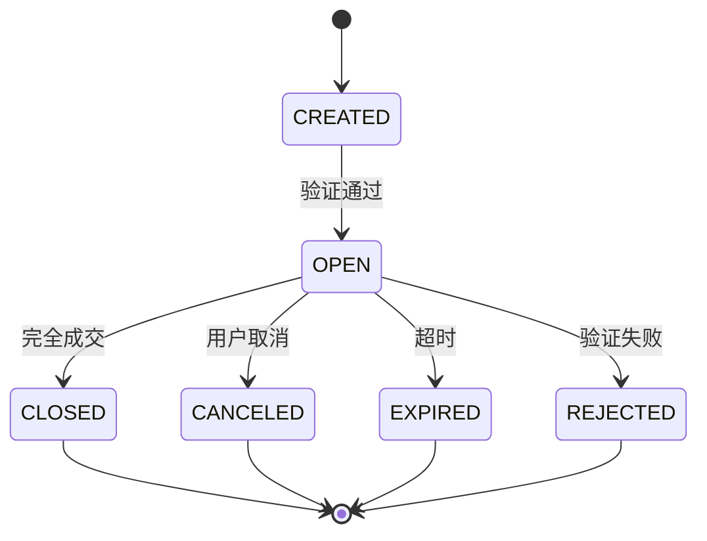
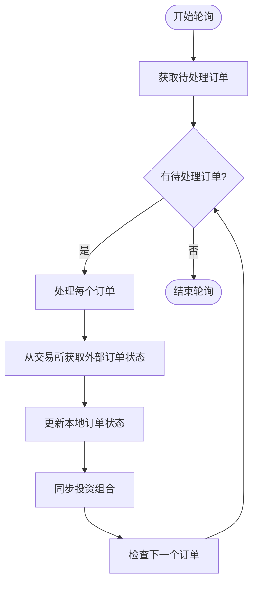
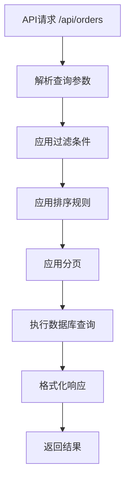

# 订单API

<cite>
**本文档中引用的文件**   
- [orders.py](file://investing_algorithm_framework/app/web/controllers/orders.py)
- [order_service.py](file://investing_algorithm_framework/services/order_service/order_service.py)
- [order.py](file://investing_algorithm_framework/domain/models/order/order.py)
- [order_status.py](file://investing_algorithm_framework/domain/models/order/order_status.py)
- [order_side.py](file://investing_algorithm_framework/domain/models/order/order_side.py)
- [order_type.py](file://investing_algorithm_framework/domain/models/order/order_type.py)
- [responses.py](file://investing_algorithm_framework/app/web/responses.py)
</cite>

## 目录
1. [简介](#简介)
2. [核心端点](#核心端点)
3. [请求体JSON模式](#请求体json模式)
4. [响应数据结构](#响应数据结构)
5. [订单状态转换逻辑](#订单状态转换逻辑)
6. [错误处理](#错误处理)
7. [分页、过滤和排序](#分页过滤和排序)

## 简介
订单API是投资算法框架的核心组件，用于管理交易订单的创建、查询和状态更新。该API提供RESTful端点来处理市价单和限价单，支持完整的订单生命周期管理，包括创建、查询、执行和状态同步。API通过与后端服务集成，确保订单在不同市场环境下的正确执行和状态跟踪。

**Section sources**
- [orders.py](file://investing_algorithm_framework/app/web/controllers/orders.py#L1-L21)
- [order_service.py](file://investing_algorithm_framework/services/order_service/order_service.py#L1-L827)

## 核心端点

### GET /api/orders
此端点用于检索订单列表。支持通过查询参数进行过滤、分页和排序。

**HTTP方法**: GET  
**URL**: `/api/orders`  
**认证**: 需要有效的API密钥  
**成功响应**: HTTP 200 OK

### POST /api/orders
此端点用于创建新订单。客户端需要提供订单的详细信息，包括交易对、数量、价格和订单类型。

**HTTP方法**: POST  
**URL**: `/api/orders`  
**认证**: 需要有效的API密钥  
**请求体**: application/json  
**成功响应**: HTTP 201 Created

### GET /api/orders/<id>
此端点用于根据唯一ID检索特定订单的详细信息。

**HTTP方法**: GET  
**URL**: `/api/orders/<id>`  
**URL参数**: 
- `id` (整数): 订单的唯一标识符
**认证**: 需要有效的API密钥  
**成功响应**: HTTP 200 OK  
**错误响应**: 
- HTTP 404 Not Found (订单不存在)

**Section sources**
- [orders.py](file://investing_algorithm_framework/app/web/controllers/orders.py#L16-L20)
- [order_service.py](file://investing_algorithm_framework/services/order_service/order_service.py#L61-L196)

## 请求体JSON模式

创建订单时，请求体必须包含以下字段：

```json
{
  "target_symbol": "BTC",
  "trading_symbol": "EUR",
  "amount": 0.5,
  "order_side": "BUY",
  "order_type": "LIMIT",
  "price": 50000,
  "portfolio_id": 1
}
```

### 字段定义和约束

| 字段 | 类型 | 必需 | 描述 | 约束 |
|------|------|------|------|------|
| **target_symbol** | 字符串 | 是 | 目标交易符号 | 必须是有效的加密货币或资产代码，如"BTC"、"ETH"等 |
| **trading_symbol** | 字符串 | 是 | 交易符号 | 必须是有效的法定货币或交易对，如"EUR"、"USD"等 |
| **amount** | 浮点数 | 是 | 订单数量 | 必须大于0 |
| **order_side** | 字符串 | 是 | 订单方向 | 必须是"BUY"或"SELL" |
| **order_type** | 字符串 | 是 | 订单类型 | 当前仅支持"LIMIT"（限价单） |
| **price** | 浮点数 | 是 | 订单价格 | 必须大于0，用于限价单 |
| **portfolio_id** | 整数 | 是 | 投资组合ID | 必须指向存在的投资组合 |

**特殊字段**:
- `stop_losses`: 可选，用于止损单的上下文
- `take_profits`: 可选，用于止盈单的上下文
- `trades`: 可选，用于与特定交易关联的订单

**Section sources**
- [order_service.py](file://investing_algorithm_framework/services/order_service/order_service.py#L94-L124)
- [order.py](file://investing_algorithm_framework/domain/models/order/order.py#L23-L45)

## 响应数据结构

订单API返回的响应包含完整的订单信息，包括状态、时间戳和关联数据。

```json
{
  "id": 123,
  "external_id": "ext_456",
  "target_symbol": "BTC",
  "trading_symbol": "EUR",
  "order_side": "BUY",
  "order_type": "LIMIT",
  "status": "OPEN",
  "price": 50000,
  "amount": 0.5,
  "filled": 0,
  "remaining": 0.5,
  "cost": 25000,
  "created_at": "2023-08-08T10:00:00Z",
  "updated_at": "2023-08-08T10:00:00Z",
  "order_fee": 10,
  "order_fee_currency": "EUR",
  "order_fee_rate": 0.0004
}
```

### 字段说明

| 字段 | 描述 |
|------|------|
| **id** | 系统生成的订单唯一标识符 |
| **external_id** | 外部交易所的订单ID |
| **status** | 订单当前状态 |
| **filled** | 已成交数量 |
| **remaining** | 剩余数量 |
| **cost** | 订单总成本 |
| **created_at** | 订单创建时间（UTC） |
| **updated_at** | 订单最后更新时间（UTC） |
| **order_fee** | 交易费用 |
| **order_fee_currency** | 费用货币 |
| **order_fee_rate** | 费率 |

**Section sources**
- [order.py](file://investing_algorithm_framework/domain/models/order/order.py#L219-L264)
- [responses.py](file://investing_algorithm_framework/app/web/responses.py#L6-L21)

## 订单状态转换逻辑

订单系统实现了完整的状态机，管理订单从创建到完成的整个生命周期。

### 订单状态



**Diagram sources**
- [order_status.py](file://investing_algorithm_framework/domain/models/order/order_status.py#L4-L10)
- [order_service.py](file://investing_algorithm_framework/services/order_service/order_service.py#L292-L304)

### 状态转换规则

1. **CREATED → OPEN**: 订单通过验证后，状态变为OPEN，表示订单已提交到市场
2. **OPEN → CLOSED**: 当订单完全成交（filled = amount）时，状态变为CLOSED
3. **OPEN → CANCELED**: 用户或系统取消订单
4. **OPEN → EXPIRED**: 订单超过有效期
5. **OPEN → REJECTED**: 订单验证失败，如余额不足

### 轮询机制

系统定期检查待处理订单的状态：



**Diagram sources**
- [order_service.py](file://investing_algorithm_framework/services/order_service/order_service.py#L399-L430)

**Section sources**
- [order_service.py](file://investing_algorithm_framework/services/order_service/order_service.py#L399-L430)
- [order_status.py](file://investing_algorithm_framework/domain/models/order/order_status.py#L4-L10)

## 错误处理

API实现了全面的错误处理机制，确保客户端能够准确理解失败原因。

### 常见错误情况

| HTTP状态码 | 错误类型 | 描述 | 示例 |
|-----------|---------|------|------|
| 400 | 验证错误 | 请求数据无效 | 余额不足、无效交易对 |
| 404 | 未找到 | 资源不存在 | 订单ID不存在 |
| 401 | 未授权 | 认证失败 | API密钥无效 |
| 422 | 处理失败 | 业务逻辑错误 | 订单金额超过持仓 |

### 具体错误场景

**余额不足**:
当创建买入订单时，系统会验证交易货币余额是否足够：
```python
def validate_buy_order(order_data, portfolio):
    total_price = order_data["amount"] * order_data["price"]
    unallocated_position = self.position_service.find({
        "portfolio": portfolio.id,
        "symbol": portfolio.trading_symbol
    })
    unallocated_amount = unallocated_position.get_amount()
    
    if unallocated_amount < total_price:
        raise OperationalException(
            f"订单总额: {total_price} {portfolio.trading_symbol}, "
            f"超过未分配金额: {unallocated_amount} {portfolio.trading_symbol}"
        )
```

**无效交易对**:
系统会验证交易对是否与投资组合配置匹配：
```python
def validate_buy_order(order_data, portfolio):
    if not order_data["trading_symbol"] == portfolio.trading_symbol:
        raise OperationalException(
            f"无法将交易符号为 {order_data['trading_symbol']} 的买入订单 "
            f"添加到交易符号为 {portfolio.trading_symbol} 的投资组合"
        )
```

**持仓不足**:
对于卖出订单，系统会验证目标资产持仓是否足够：
```python
def validate_sell_order(order_data, portfolio):
    position = self.position_service.find({
        "symbol": order_data["target_symbol"],
        "portfolio": portfolio.id
    })
    
    if position.get_amount() < order_data["amount"]:
        raise OperationalException(
            f"订单数量 {order_data['amount']} {order_data['target_symbol']} "
            f"超过持仓数量 {position.get_amount()} {position.symbol}"
        )
```

**Section sources**
- [order_service.py](file://investing_algorithm_framework/services/order_service/order_service.py#L340-L398)
- [order.py](file://investing_algorithm_framework/domain/models/order/order.py#L46-L50)

## 分页、过滤和排序

API支持通过查询参数对订单列表进行分页、过滤和排序。

### 分页
使用标准的分页参数：
- `page`: 页码（从1开始）
- `size`: 每页大小（默认20，最大100）

示例：`/api/orders?page=2&size=50`

### 过滤
支持多种过滤条件：
- `status`: 按订单状态过滤（如`status=OPEN`）
- `target_symbol`: 按目标交易符号过滤（如`target_symbol=BTC`）
- `trading_symbol`: 按交易符号过滤（如`trading_symbol=EUR`）
- `portfolio_id`: 按投资组合ID过滤

示例：`/api/orders?status=OPEN&target_symbol=BTC`

### 排序
支持按创建时间排序：
- `order_by_created_at_asc=true`: 按创建时间升序
- `order_by_created_at_asc=false`: 按创建时间降序（默认）

示例：`/api/orders?order_by_created_at_asc=false`



**Diagram sources**
- [order_service.py](file://investing_algorithm_framework/services/order_service/order_service.py#L19-L20)
- [test_order_repository.py](file://tests/infrastructure/repositories/orders/test_order_repository.py#L118-L132)

**Section sources**
- [order_service.py](file://investing_algorithm_framework/services/order_service/order_service.py#L19-L20)
- [test_order_repository.py](file://tests/infrastructure/repositories/orders/test_order_repository.py#L118-L132)