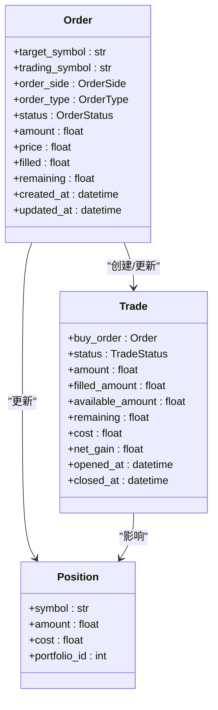
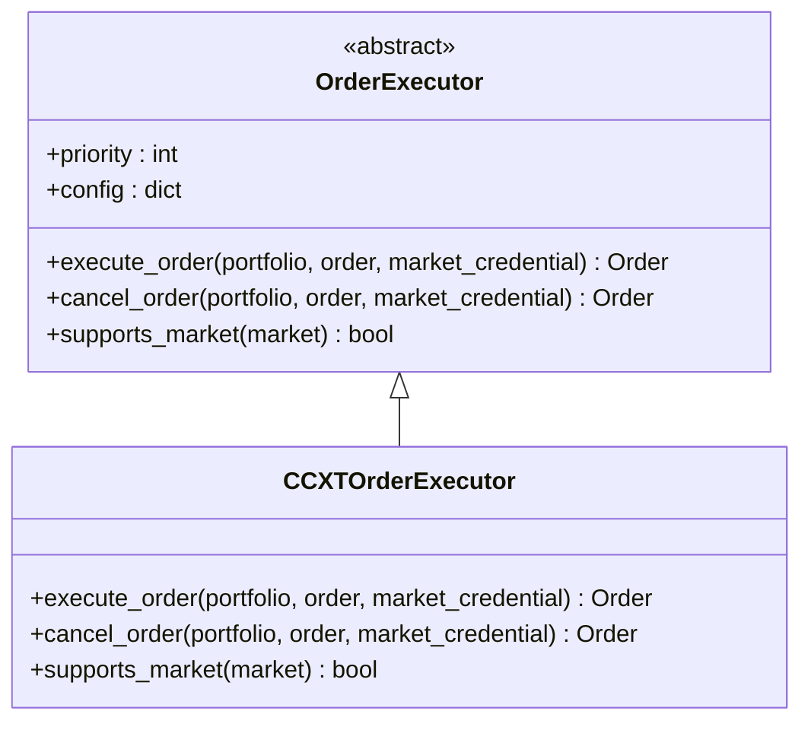
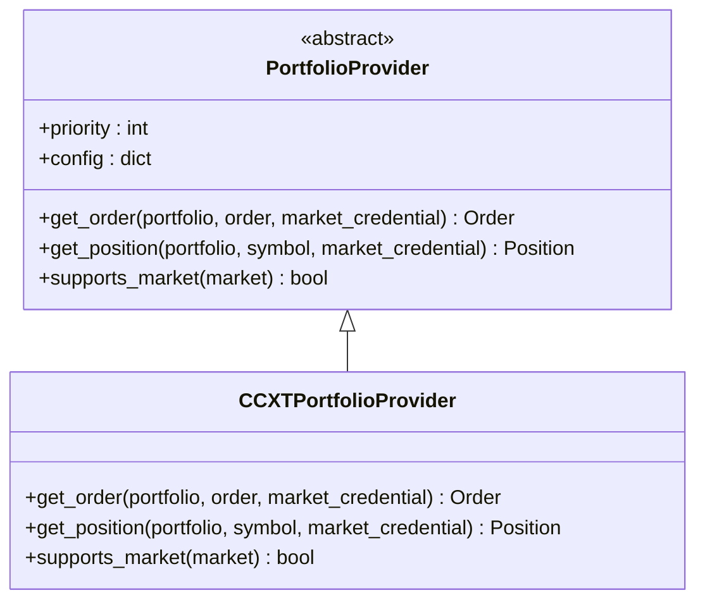
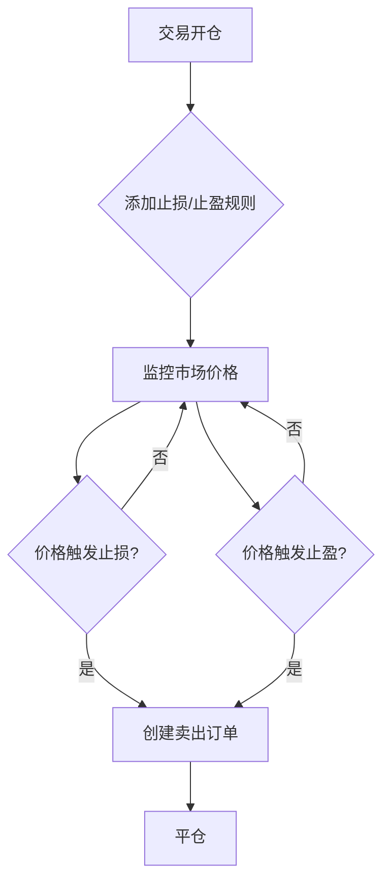

# 交易执行

<cite>
**本文档引用的文件**   
- [order_executor.py](file://investing_algorithm_framework/domain/order_executor.py)
- [portfolio_provider.py](file://investing_algorithm_framework/domain/portfolio_provider.py)
- [ccxt_order_executor.py](file://investing_algorithm_framework/infrastructure/order_executors/ccxt_order_executor.py)
- [ccxt_portfolio_provider.py](file://investing_algorithm_framework/infrastructure/portfolio_providers/ccxt_portfolio_provider.py)
- [order_service.py](file://investing_algorithm_framework/services/order_service/order_service.py)
- [trade_service.py](file://investing_algorithm_framework/services/trade_service/trade_service.py)
- [order.py](file://investing_algorithm_framework/domain/models/order/order.py)
- [position.py](file://investing_algorithm_framework/domain/models/position/position.py)
- [trade.py](file://investing_algorithm_framework/domain/models/trade/trade.py)
- [trade_stop_loss.py](file://investing_algorithm_framework/domain/models/trade/trade_stop_loss.py)
- [trade_take_profit.py](file://investing_algorithm_framework/domain/models/trade/trade_take_profit.py)
- [simple_trading_bot_example.py](file://examples/simple_trading_bot_example.py)
</cite>

## 目录
1. [引言](#引言)
2. [核心模型关系与状态转换](#核心模型关系与状态转换)
3. [订单执行器接口设计](#订单执行器接口设计)
4. [投资组合提供者同步机制](#投资组合提供者同步机制)
5. [订单类型创建与管理](#订单类型创建与管理)
6. [风险管理功能](#风险管理功能)
7. [结论](#结论)

## 引言

本技术文档全面介绍了一个交易执行系统的架构和实现。该系统旨在为算法交易提供一个稳健、可扩展的框架，核心功能包括订单管理、头寸跟踪、交易执行和风险管理。文档详细阐述了订单（Order）、头寸（Position）和交易（Trade）三个核心模型之间的关系及其状态转换机制。重点分析了`OrderExecutor`接口的设计原则，特别是基于CCXT库的`CCXTOrderExecutor`实现细节。同时，文档描述了`PortfolioProvider`如何与外部交易所同步账户余额和持仓信息。此外，还涵盖了市价单、限价单等不同订单类型的创建和管理示例，以及止损（Stop-Loss）和止盈（Take-Profit）规则的配置与执行机制。

## 核心模型关系与状态转换

交易执行系统围绕三个核心领域模型构建：订单（Order）、头寸（Position）和交易（Trade）。它们之间存在着紧密的关联和明确的状态转换逻辑。

### 订单（Order）
订单是系统中最基本的执行单元，代表在交易市场上进行买入或卖出操作的指令。一个订单包含以下关键属性：
- **目标资产（Target Symbol）**：要交易的资产，如BTC。
- **计价资产（Trading Symbol）**：用于交易的资产，如EUR。
- **订单方向（Order Side）**：`BUY`（买入）或`SELL`（卖出）。
- **订单类型（Order Type）**：目前主要支持`LIMIT`（限价单）。
- **订单状态（Order Status）**：包括`CREATED`（已创建）、`OPEN`（已打开）、`CANCELED`（已取消）、`EXPIRED`（已过期）、`REJECTED`（已拒绝）和`CLOSED`（已关闭）。
- **数量（Amount）**：交易的数量。
- **价格（Price）**：限价单的执行价格。
- **已成交（Filled）**：已成交的数量。
- **剩余（Remaining）**：剩余待成交的数量。

订单的状态转换是系统执行流程的核心。当一个订单被创建后，其状态为`CREATED`。在调用`execute_order`方法后，如果交易所成功接受该订单，其状态会变为`OPEN`。订单的最终状态取决于其执行结果：如果被用户或系统取消，则变为`CANCELED`；如果因超时等原因失效，则变为`EXPIRED`；如果被交易所拒绝，则变为`REJECTED`；当订单的`filled`数量等于`amount`时，其状态变为`CLOSED`。

### 头寸（Position）
头寸代表投资组合中某个特定资产的持有情况。它是一个账户级别的概念，用于跟踪用户在某个资产上的总持仓量和成本。一个头寸包含以下关键属性：
- **资产符号（Symbol）**：持有的资产，如BTC。
- **数量（Amount）**：当前持有的资产总量。
- **成本（Cost）**：持有该资产的总成本。

头寸与订单和交易的关系如下：
- **买入订单**：当一个`BUY`订单成功成交时，系统会更新或创建一个对应资产的头寸，增加其`amount`和`cost`。
- **卖出订单**：当一个`SELL`订单成功成交时，系统会减少对应资产头寸的`amount`。
- **交易**：一个交易的开仓（买入）会增加头寸，而平仓（卖出）会减少头寸。

### 交易（Trade）
交易是系统中一个更高级别的概念，它将一个买入订单和一个或多个卖出订单关联起来，形成一个完整的买卖周期。一个交易代表了一次完整的投资行为，从买入到最终卖出。其关键属性包括：
- **开仓订单（Buy Order）**：创建该交易的买入订单。
- **状态（Status）**：`OPEN`（开放）或`CLOSED`（已关闭）。
- **已成交数量（Filled Amount）**：通过买入订单已买入的数量。
- **可用数量（Available Amount）**：可用于卖出的数量。
- **剩余数量（Remaining）**：买入订单中尚未成交的数量。
- **成本（Cost）**：开仓的总成本。
- **净收益（Net Gain）**：当前的净收益。

### 模型关系与状态转换图



**图示来源**
- [order.py](file://investing_algorithm_framework/domain/models/order/order.py)
- [position.py](file://investing_algorithm_framework/domain/models/position/position.py)
- [trade.py](file://investing_algorithm_framework/domain/models/trade/trade.py)

**状态转换流程说明**：
1.  **创建买入订单**：用户或策略创建一个`BUY`订单。
2.  **执行并成交**：订单被执行，状态从`CREATED`变为`OPEN`，随着成交，`filled`数量增加。
3.  **创建交易**：当买入订单的`filled`数量大于0时，系统会创建一个新的`Trade`对象，其状态为`OPEN`。
4.  **更新头寸**：买入订单的成交会增加相应资产的`Position`数量和成本。
5.  **创建卖出订单**：当满足卖出条件时，系统创建一个`SELL`订单。
6.  **执行卖出订单**：卖出订单被执行并成交。
7.  **更新交易**：卖出订单的成交会减少`Trade`的`available_amount`。当`available_amount`为0时，`Trade`的状态变为`CLOSED`。
8.  **更新头寸**：卖出订单的成交会减少相应资产的`Position`数量。

**核心模型关系与状态转换部分来源**
- [order.py](file://investing_algorithm_framework/domain/models/order/order.py#L1-L385)
- [position.py](file://investing_algorithm_framework/domain/models/position/position.py#L1-L69)
- [trade.py](file://investing_algorithm_framework/domain/models/trade/trade.py#L1-L389)
- [order_service.py](file://investing_algorithm_framework/services/order_service/order_service.py#L1-L800)
- [trade_service.py](file://investing_algorithm_framework/services/trade_service/trade_service.py#L1-L1100)

## 订单执行器接口设计

订单执行器（`OrderExecutor`）是系统与外部交易所进行交互的核心抽象层。它定义了一个统一的接口，使得系统可以支持多个不同的交易所，而无需修改核心业务逻辑。

### OrderExecutor 接口

`OrderExecutor`是一个抽象基类（ABC），定义了所有订单执行器必须实现的方法。其核心设计原则是**解耦**和**可扩展性**。



**图示来源**
- [order_executor.py](file://investing_algorithm_framework/domain/order_executor.py)
- [ccxt_order_executor.py](file://investing_algorithm_framework/infrastructure/order_executors/ccxt_order_executor.py)

#### 核心方法
- **`execute_order(portfolio, order, market_credential)`**: 这是执行订单的核心方法。它接收一个投资组合、一个订单和市场凭证作为参数，负责在指定的交易所上创建订单。该方法**不应抛出异常**，如果执行失败，应返回一个状态为`OrderStatus.FAILED`的订单实例。
- **`cancel_order(portfolio, order, market_credential)`**: 用于取消一个已打开的订单。
- **`supports_market(market)`**: 检查该执行器是否支持指定的市场（交易所）。

#### 优先级机制
`OrderExecutor`包含一个`_priority`属性。当系统需要为某个市场选择执行器时，会根据优先级进行选择，优先级数值越低，优先级越高。这允许系统为特定市场配置更优的执行器。

### CCXTOrderExecutor 实现

`CCXTOrderExecutor`是`OrderExecutor`接口的一个具体实现，它利用了流行的`ccxt`库来与众多加密货币交易所进行通信。

#### 执行流程
1.  **初始化交易所**：`execute_order`方法首先调用`initialize_exchange`，根据市场名称（如`binance`）和市场凭证（API密钥和密钥）创建一个`ccxt`交易所实例。
2.  **验证功能**：在创建订单前，会检查交易所实例是否支持`createLimitBuyOrder`或`createLimitSellOrder`等方法。
3.  **创建订单**：根据订单的类型和方向，调用相应的`ccxt`方法创建订单。
4.  **处理响应**：将`ccxt`返回的原始订单数据通过`Order.from_ccxt_order()`方法转换为系统内部的`Order`对象。
5.  **返回结果**：返回一个包含外部订单ID和状态的`Order`实例。

#### 关键实现细节
- **异常处理**：所有与`ccxt`的交互都包裹在`try-except`块中。如果发生异常，会记录日志并抛出一个`OperationalException`，但根据接口规范，这通常意味着订单执行失败。
- **静态方法**：`initialize_exchange`和`check_credentials`被设计为静态方法，提高了代码的模块化和可测试性。
- **市场支持**：`supports_market`方法通过检查`ccxt`模块中是否存在对应名称的交易所类来判断是否支持该市场。

**订单执行器接口设计部分来源**
- [order_executor.py](file://investing_algorithm_framework/domain/order_executor.py#L1-L113)
- [ccxt_order_executor.py](file://investing_algorithm_framework/infrastructure/order_executors/ccxt_order_executor.py#L1-L201)

## 投资组合提供者同步机制

投资组合提供者（`PortfolioProvider`）负责从外部交易所获取最新的账户信息，确保系统内部状态与实际账户状态保持一致。

### PortfolioProvider 接口

与`OrderExecutor`类似，`PortfolioProvider`也是一个抽象基类，定义了获取账户信息的标准接口。



**图示来源**
- [portfolio_provider.py](file://investing_algorithm_framework/domain/portfolio_provider.py)
- [ccxt_portfolio_provider.py](file://investing_algorithm_framework/infrastructure/portfolio_providers/ccxt_portfolio_provider.py)

#### 核心方法
- **`get_order(portfolio, order, market_credential)`**: 用于获取一个特定订单在交易所上的最新状态。如果订单不存在，应返回`None`，而不是抛出异常。
- **`get_position(portfolio, symbol, market_credential)`**: 用于获取投资组合中某个特定资产的最新持仓信息。
- **`supports_market(market)`**: 检查该提供者是否支持指定的市场。

### CCXTPortfolioProvider 实现

`CCXTPortfolioProvider`是`PortfolioProvider`的`ccxt`实现。

#### 同步流程
1.  **检查功能**：在调用`fetchOrder`或`fetchBalance`之前，会检查交易所实例的`has`属性，确认该功能是否可用。
2.  **获取订单状态**：`get_order`方法调用`exchange.fetchOrder()`来获取订单的详细信息，并将其转换为内部`Order`对象。
3.  **获取持仓信息**：`get_position`方法调用`exchange.fetchBalance()`来获取账户的余额信息。它会检查`free`余额中是否存在指定的资产，如果存在则返回一个`Position`对象，否则返回`None`。
4.  **错误处理**：与`CCXTOrderExecutor`一样，所有操作都包含在`try-except`块中，以处理网络或API错误。

#### 与订单服务的集成
`OrderService`中的`check_pending_orders`方法会定期调用`PortfolioProvider`来检查所有状态为`OPEN`的订单。它会获取这些订单在交易所上的最新状态，并调用`update`方法来同步系统内部的订单状态。这个机制确保了系统能够及时响应订单的成交、取消或拒绝。

**投资组合提供者同步机制部分来源**
- [portfolio_provider.py](file://investing_algorithm_framework/domain/portfolio_provider.py#L1-L119)
- [ccxt_portfolio_provider.py](file://investing_algorithm_framework/infrastructure/portfolio_providers/ccxt_portfolio_provider.py#L1-L200)
- [order_service.py](file://investing_algorithm_framework/services/order_service/order_service.py#L399-L430)

## 订单类型创建与管理

系统主要支持限价单（Limit Order），并提供了创建和管理不同类型订单的完整流程。

### 限价单（Limit Order）
限价单是最常用的订单类型，它指定了一个明确的执行价格。只有当市场价格达到或优于该价格时，订单才会成交。

#### 创建流程
1.  **数据准备**：调用`OrderService.create()`方法，传入包含`target_symbol`, `trading_symbol`, `order_side`, `order_type`, `amount`, `price`, 和 `portfolio_id`等信息的字典。
2.  **验证**：系统会调用`validate_order`方法进行验证。对于买入订单，会检查计价资产的余额是否充足；对于卖出订单，会检查目标资产的头寸是否足够。
3.  **执行**：如果`execute=True`，系统会通过`OrderExecutorLookup`找到匹配的`OrderExecutor`，并调用其`execute_order`方法。
4.  **同步**：订单创建后，系统会自动更新相关的`Position`和`Trade`。

#### 示例代码
```python
# 在策略中创建一个限价买入订单
order_data = {
    "target_symbol": "BTC",
    "trading_symbol": "EUR",
    "order_side": "BUY",
    "order_type": "LIMIT",
    "amount": 0.01,
    "price": 40000,
    "portfolio_id": 1
}
order = order_service.create(order_data)
```

### 市价单（Market Order）
虽然代码中主要实现了限价单，但系统架构也支持市价单。市价单会以当前市场上最优的价格立即成交。

#### 实现考量
在`CCXTOrderExecutor`的`execute_order`方法中，有一个`else`分支用于处理不支持的订单类型。要支持市价单，可以在此处添加对`OrderType.MARKET`的判断，并调用`ccxt`的`createMarketBuyOrder`或`createMarketSellOrder`方法。

### 订单管理
系统提供了对订单的全生命周期管理：
- **查询**：可以通过`get`方法获取订单的当前状态。
- **取消**：`cancel_order`方法可以取消一个已打开的订单。
- **状态更新**：`check_pending_orders`方法会自动同步外部订单状态。

**订单类型创建与管理部分来源**
- [order_service.py](file://investing_algorithm_framework/services/order_service/order_service.py#L61-L196)
- [order.py](file://investing_algorithm_framework/domain/models/order/order.py)
- [simple_trading_bot_example.py](file://examples/simple_trading_bot_example.py#L221-L254)

## 风险管理功能

系统内置了强大的风险管理功能，主要通过止损（Stop-Loss）和止盈（Take-Profit）规则来实现。

### 止损（Stop-Loss）规则

止损规则用于限制潜在的亏损。系统支持两种类型的止损：固定止损和追踪止损。

#### 核心组件
- **`TradeStopLoss`**：代表一个具体的止损规则，与一个`Trade`关联。
  - **`percentage`**: 触发止损的百分比阈值。
  - **`trailing`**: 布尔值，指示是固定止损还是追踪止损。
  - **`sell_percentage`**: 触发时卖出的仓位百分比。
  - **`high_water_mark`**: 价格达到的最高点（用于追踪止损）。
  - **`stop_loss_price`**: 当前的止损触发价格。

#### 工作原理
- **固定止损**：止损价格在创建时就已确定。例如，以100美元买入，设置5%的固定止损，则止损价为95美元。只要价格低于95美元，止损就会触发。
- **追踪止损**：止损价格会随着价格上涨而自动上移。例如，以100美元买入，设置5%的追踪止损。当价格上涨到120美元时，止损价会调整到114美元（120 * 0.95）。如果价格从120美元回落到114美元，止损就会触发。

#### 执行流程
1.  **添加规则**：通过`TradeService.add_stop_loss()`为一个开放的交易添加止损规则。
2.  **价格更新**：每当有新的市场价格数据时，`TradeService.update()`会调用`TradeStopLoss.update_with_last_reported_price()`来更新止损价格。
3.  **检查触发**：系统会定期检查`TradeStopLoss.has_triggered()`方法，判断当前价格是否已触发止损。
4.  **创建订单**：一旦触发，系统会自动创建一个`SELL`订单来平仓。

### 止盈（Take-Profit）规则

止盈规则用于锁定利润。其设计与止损规则类似，但方向相反。

#### 核心组件
- **`TradeTakeProfit`**：代表一个具体的止盈规则。
  - **`percentage`**: 触发止盈的百分比阈值。
  - **`trailing`**: 布尔值，指示是固定止盈还是追踪止盈。
  - **`sell_percentage`**: 触发时卖出的仓位百分比。
  - **`high_water_mark`**: 价格达到的最高点。
  - **`take_profit_price`**: 当前的止盈触发价格。

#### 工作原理
- **固定止盈**：止盈价格在创建时就已确定。例如，以100美元买入，设置10%的固定止盈，则止盈价为110美元。
- **追踪止盈**：当价格首次达到一个预设的初始阈值（如105美元）时，系统会设置`high_water_mark`，并开始计算一个“回撤”级别的止盈价（如`high_water_mark * 0.95`）。之后，`high_water_mark`会随着价格创新高而更新，止盈价也随之上移。

### 风险管理流程图



**图示来源**
- [trade_stop_loss.py](file://investing_algorithm_framework/domain/models/trade/trade_stop_loss.py)
- [trade_take_profit.py](file://investing_algorithm_framework/domain/models/trade/trade_take_profit.py)
- [trade_service.py](file://investing_algorithm_framework/services/trade_service/trade_service.py)

**风险管理功能部分来源**
- [trade_stop_loss.py](file://investing_algorithm_framework/domain/models/trade/trade_stop_loss.py#L1-L333)
- [trade_take_profit.py](file://investing_algorithm_framework/domain/models/trade/trade_take_profit.py#L1-L366)
- [trade_service.py](file://investing_algorithm_framework/services/trade_service/trade_service.py#L742-L800)

## 结论

本文档详细阐述了一个交易执行系统的架构和实现。该系统通过清晰的领域模型（订单、头寸、交易）和状态管理，构建了一个健壮的交易基础。`OrderExecutor`和`PortfolioProvider`的抽象设计实现了与外部交易所的解耦，使得系统具有良好的可扩展性。基于`ccxt`的实现为与众多加密货币交易所的集成提供了便利。系统还提供了完善的订单管理功能和强大的风险管理机制，包括固定和追踪止损/止盈规则，为算法交易提供了全面的支持。整体架构清晰，职责分离明确，为构建复杂的交易策略奠定了坚实的基础。