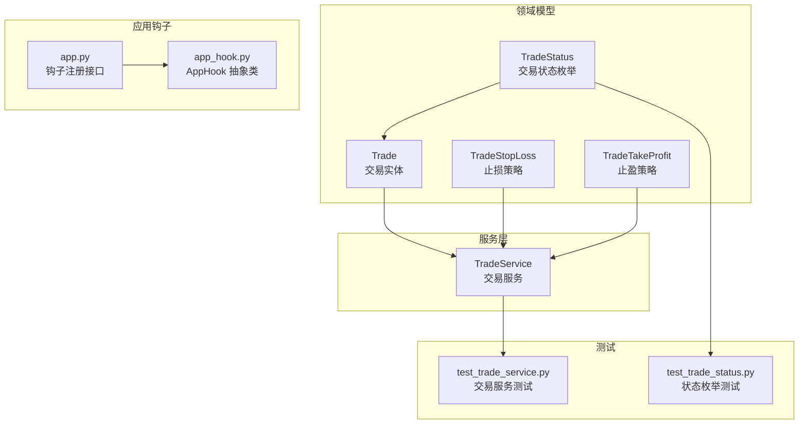
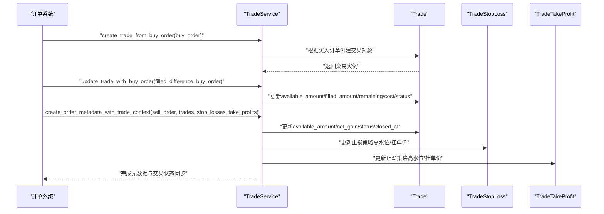
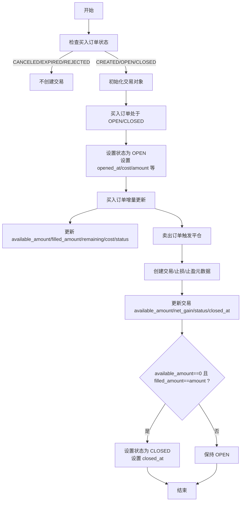
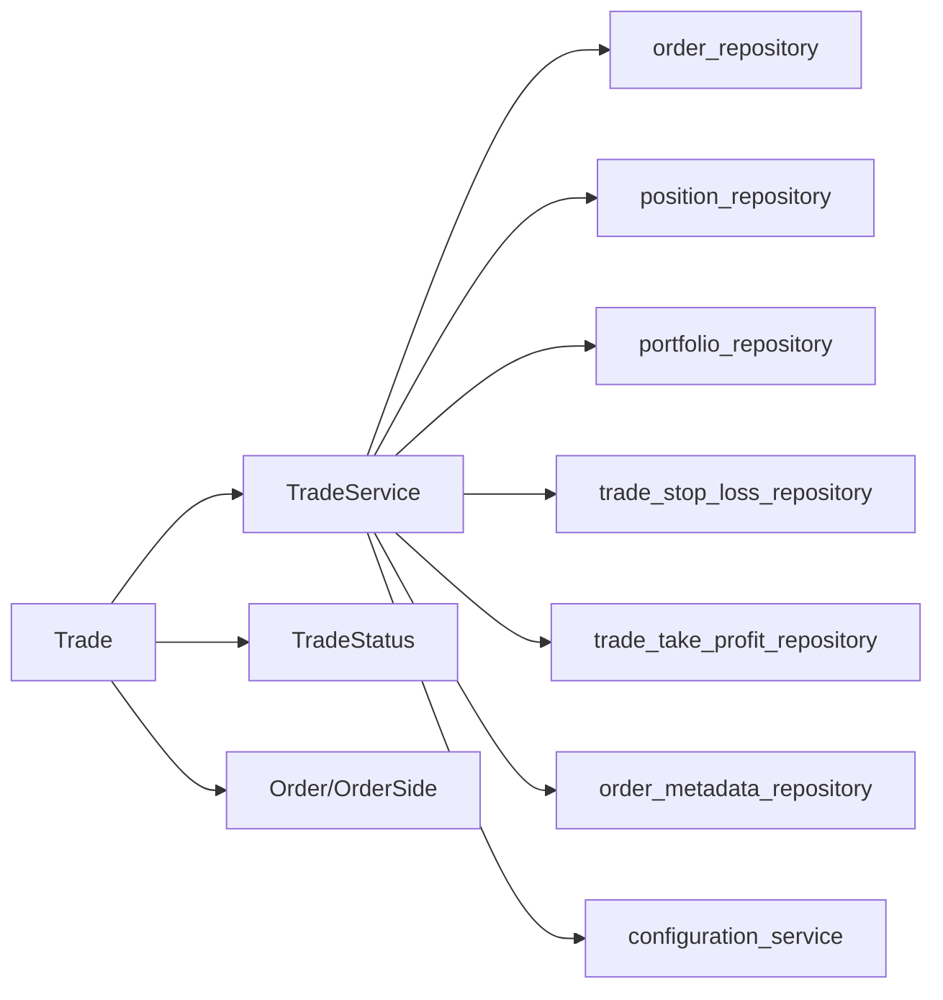

# 交易生命周期管理

<cite>
**本文引用的文件**
- [investing_algorithm_framework/domain/models/trade/trade.py](file://investing_algorithm_framework/domain/models/trade/trade.py)
- [investing_algorithm_framework/domain/models/trade/trade_status.py](file://investing_algorithm_framework/domain/models/trade/trade_status.py)
- [investing_algorithm_framework/services/trade_service/trade_service.py](file://investing_algorithm_framework/services/trade_service/trade_service.py)
- [investing_algorithm_framework/domain/models/trade/trade_stop_loss.py](file://investing_algorithm_framework/domain/models/trade/trade_stop_loss.py)
- [investing_algorithm_framework/domain/models/trade/trade_take_profit.py](file://investing_algorithm_framework/domain/models/trade/trade_take_profit.py)
- [tests/services/test_trade_service.py](file://tests/services/test_trade_service.py)
- [tests/domain/models/trades/test_trade_status.py](file://tests/domain/models/trades/test_trade_status.py)
- [investing_algorithm_framework/app/app.py](file://investing_algorithm_framework/app/app.py)
- [investing_algorithm_framework/app/app_hook.py](file://investing_algorithm_framework/app/app_hook.py)
</cite>

## 目录
1. [引言](#引言)
2. [项目结构](#项目结构)
3. [核心组件](#核心组件)
4. [架构总览](#架构总览)
5. [详细组件分析](#详细组件分析)
6. [依赖关系分析](#依赖关系分析)
7. [性能考量](#性能考量)
8. [故障排查指南](#故障排查指南)
9. [结论](#结论)
10. [附录](#附录)

## 引言
本文件系统性阐述交易生命周期的管理机制，围绕 Trade 模型的核心属性与状态机、TradeService 的创建/更新/关闭流程、以及与止盈止损策略的联动，帮助读者从概念到实现全面理解交易从开仓到平仓的全过程。同时给出状态转换条件、数据流与错误处理策略，并通过测试用例路径展示真实调用链路。

## 项目结构
交易生命周期相关代码主要分布在以下模块：
- 领域模型：Trade、TradeStatus、TradeStopLoss、TradeTakeProfit
- 服务层：TradeService（负责交易的创建、更新、关闭、市场价驱动的收益计算）
- 测试：对 TradeService 的行为进行覆盖，验证状态转换与金额/剩余量/已成交等字段变化
- 应用钩子：AppHook 与应用入口中的钩子注册接口，用于在策略运行前后扩展行为

图表来源
- [investing_algorithm_framework/domain/models/trade/trade.py](file://investing_algorithm_framework/domain/models/trade/trade.py#L1-L120)
- [investing_algorithm_framework/domain/models/trade/trade_status.py](file://investing_algorithm_framework/domain/models/trade/trade_status.py#L1-L41)
- [investing_algorithm_framework/services/trade_service/trade_service.py](file://investing_algorithm_framework/services/trade_service/trade_service.py#L1-L120)
- [investing_algorithm_framework/domain/models/trade/trade_stop_loss.py](file://investing_algorithm_framework/domain/models/trade/trade_stop_loss.py#L1-L120)
- [investing_algorithm_framework/domain/models/trade/trade_take_profit.py](file://investing_algorithm_framework/domain/models/trade/trade_take_profit.py#L1-L120)
- [tests/services/test_trade_service.py](file://tests/services/test_trade_service.py#L1-L120)
- [tests/domain/models/trades/test_trade_status.py](file://tests/domain/models/trades/test_trade_status.py#L1-L47)
- [investing_algorithm_framework/app/app.py](file://investing_algorithm_framework/app/app.py#L1660-L1710)
- [investing_algorithm_framework/app/app_hook.py](file://investing_algorithm_framework/app/app_hook.py#L1-L29)

章节来源
- [investing_algorithm_framework/domain/models/trade/trade.py](file://investing_algorithm_framework/domain/models/trade/trade.py#L1-L120)
- [investing_algorithm_framework/services/trade_service/trade_service.py](file://investing_algorithm_framework/services/trade_service/trade_service.py#L1-L120)

## 核心组件
- Trade：交易实体，承载开仓价格、数量、时间戳、状态、已成交/可用/剩余数量、成本、净收益、最高水位等信息；并提供基于市价的收益与百分比变化计算。
- TradeStatus：交易状态枚举，支持字符串与枚举值互转，并提供 equals 比较。
- TradeService：交易生命周期管理的核心服务，负责：
  - 从买入订单创建交易
  - 基于买入/卖出订单增量更新交易
  - 基于市价数据批量更新交易的最新报价与时间戳
  - 为卖出订单创建与交易、止损、止盈的元数据关联
  - 在卖出订单移除时回滚交易与策略状态
- TradeStopLoss/TradeTakeProfit：分别定义固定/移动止损与固定/移动止盈策略，包含高水位、触发时间、挂单卖出金额等状态，并提供触发判断与挂单价更新逻辑。

章节来源
- [investing_algorithm_framework/domain/models/trade/trade.py](file://investing_algorithm_framework/domain/models/trade/trade.py#L1-L120)
- [investing_algorithm_framework/domain/models/trade/trade_status.py](file://investing_algorithm_framework/domain/models/trade/trade_status.py#L1-L41)
- [investing_algorithm_framework/services/trade_service/trade_service.py](file://investing_algorithm_framework/services/trade_service/trade_service.py#L1-L200)
- [investing_algorithm_framework/domain/models/trade/trade_stop_loss.py](file://investing_algorithm_framework/domain/models/trade/trade_stop_loss.py#L1-L120)
- [investing_algorithm_framework/domain/models/trade/trade_take_profit.py](file://investing_algorithm_framework/domain/models/trade/trade_take_profit.py#L1-L120)

## 架构总览
交易生命周期由“订单驱动 + 市价驱动”的双通道构成：
- 订单驱动：买入订单状态变化触发交易创建或更新；卖出订单触发交易部分/全部平仓与元数据记录。
- 市价驱动：周期性拉取 OHLCV 市场数据，更新交易的最新报价与时间戳，进而驱动止损/止盈策略的触发与状态更新。

图表来源
- [investing_algorithm_framework/services/trade_service/trade_service.py](file://investing_algorithm_framework/services/trade_service/trade_service.py#L44-L120)
- [investing_algorithm_framework/services/trade_service/trade_service.py](file://investing_algorithm_framework/services/trade_service/trade_service.py#L216-L278)
- [investing_algorithm_framework/services/trade_service/trade_service.py](file://investing_algorithm_framework/services/trade_service/trade_service.py#L339-L449)
- [investing_algorithm_framework/domain/models/trade/trade_stop_loss.py](file://investing_algorithm_framework/domain/models/trade/trade_stop_loss.py#L104-L167)
- [investing_algorithm_framework/domain/models/trade/trade_take_profit.py](file://investing_algorithm_framework/domain/models/trade/trade_take_profit.py#L106-L202)

## 详细组件分析

### Trade 模型与核心属性
- 关键属性
  - 开仓价格：open_price
  - 数量：amount、available_amount、filled_amount、remaining
  - 时间戳：opened_at、updated_at、closed_at
  - 状态：status（由 TradeStatus 管理）
  - 收益：net_gain、cost、last_reported_price、last_reported_price_datetime
  - 风险指标：high_water_mark、high_water_mark_datetime
  - 元数据：metadata
- 行为与派生属性
  - closed_prices：所有卖出订单的价格列表
  - buy_order：对应买入订单
  - symbol：目标币/交易币对标识
  - duration：交易持续小时数（按 opened_at 到 closed_at 或 updated_at 计算）
  - size：交易规模（amount × open_price）
  - change：未平仓部分的绝对收益（按 last_reported_price 计算）
  - net_gain_absolute/net_gain_percentage/percentage_change：综合收益与百分比
  - update：当状态变为 CLOSED 时，自动将止损/止盈策略置为非激活

章节来源
- [investing_algorithm_framework/domain/models/trade/trade.py](file://investing_algorithm_framework/domain/models/trade/trade.py#L26-L139)
- [investing_algorithm_framework/domain/models/trade/trade.py](file://investing_algorithm_framework/domain/models/trade/trade.py#L131-L218)
- [investing_algorithm_framework/domain/models/trade/trade.py](file://investing_algorithm_framework/domain/models/trade/trade.py#L219-L262)
- [investing_algorithm_framework/domain/models/trade/trade.py](file://investing_algorithm_framework/domain/models/trade/trade.py#L263-L307)

### TradeStatus 状态机
- 状态枚举：CREATED、OPEN、CLOSED
- 转换规则
  - 由字符串或枚举值解析，不合法值抛出异常
  - Trade.update 中，当状态设为 CLOSED 时，会将关联的止损/止盈策略全部置为非激活
- 测试验证：非法状态字符串会触发异常

章节来源
- [investing_algorithm_framework/domain/models/trade/trade_status.py](file://investing_algorithm_framework/domain/models/trade/trade_status.py#L1-L41)
- [tests/domain/models/trades/test_trade_status.py](file://tests/domain/models/trades/test_trade_status.py#L1-L47)
- [investing_algorithm_framework/domain/models/trade/trade.py](file://investing_algorithm_framework/domain/models/trade/trade.py#L98-L114)

### TradeService 生命周期方法
- create_trade_from_buy_order
  - 输入：买入订单
  - 行为：若买入订单状态为 CANCELED/EXPIRED/REJECTED，则不创建交易；否则根据 filled/remaining/amount 等字段初始化交易，并设置 opened_at/cost/status
- update_trade_with_buy_order
  - 输入：filled_difference 与买入订单
  - 行为：若买入订单状态为 CANCELED/EXPIRED/REJECTED，则删除交易；否则增量更新 available_amount/filled_amount/remaining/cost/status
- update_trade_with_filled_sell_order
  - 输入：filled_difference 与卖出订单
  - 行为：更新与该卖出订单关联的元数据对象（trade/stop_loss/take_profit），并按 pending 量逐步扣减
- create_order_metadata_with_trade_context
  - 输入：卖出订单及可选参数（trades、stop_losses、take_profits）
  - 行为：为交易、止损、止盈分别创建元数据对象，更新交易的 available_amount/net_gain/status/closed_at，并更新仓位与组合的总收益/净值
- update_trades_with_market_data
  - 输入：市场数据（OHLCV）
  - 行为：遍历 OPEN 状态交易，按最细粒度时间框取最新收盘价，更新 last_reported_price/last_reported_price_datetime/updated_at，并触发止损/止盈策略的高水位与挂单价更新

章节来源
- [investing_algorithm_framework/services/trade_service/trade_service.py](file://investing_algorithm_framework/services/trade_service/trade_service.py#L44-L120)
- [investing_algorithm_framework/services/trade_service/trade_service.py](file://investing_algorithm_framework/services/trade_service/trade_service.py#L537-L600)
- [investing_algorithm_framework/services/trade_service/trade_service.py](file://investing_algorithm_framework/services/trade_service/trade_service.py#L602-L741)
- [investing_algorithm_framework/services/trade_service/trade_service.py](file://investing_algorithm_framework/services/trade_service/trade_service.py#L339-L449)

### 止损/止盈策略与交易联动
- TradeStopLoss
  - 固定止损：以开仓价为基础设定止损价，价格跌破即触发
  - 移动止损：随价格上行调整止损价，价格回落至新止损价时触发
  - 高水位与触发时间：记录最高价与触发时刻，支持挂单价/日期集合维护
- TradeTakeProfit
  - 固定止盈：价格达到止盈价即触发
  - 移动止盈：首次突破初始阈值后，随价格上行调整止盈价，价格回撤至止盈价时触发
  - 高水位与触发时间：记录最高价与触发时刻，支持挂单价/日期集合维护
- 与 TradeService 的交互
  - TradeService.update 在 last_reported_price 更新时，调用策略的 update_with_last_reported_price 并持久化
  - 当交易状态变为 CLOSED 时，策略自动置为非激活

章节来源
- [investing_algorithm_framework/domain/models/trade/trade_stop_loss.py](file://investing_algorithm_framework/domain/models/trade/trade_stop_loss.py#L1-L167)
- [investing_algorithm_framework/domain/models/trade/trade_take_profit.py](file://investing_algorithm_framework/domain/models/trade/trade_take_profit.py#L1-L202)
- [investing_algorithm_framework/services/trade_service/trade_service.py](file://investing_algorithm_framework/services/trade_service/trade_service.py#L216-L278)
- [investing_algorithm_framework/domain/models/trade/trade.py](file://investing_algorithm_framework/domain/models/trade/trade.py#L98-L114)

### 交易状态转换流程图

图表来源
- [investing_algorithm_framework/services/trade_service/trade_service.py](file://investing_algorithm_framework/services/trade_service/trade_service.py#L44-L120)
- [investing_algorithm_framework/services/trade_service/trade_service.py](file://investing_algorithm_framework/services/trade_service/trade_service.py#L537-L600)
- [investing_algorithm_framework/services/trade_service/trade_service.py](file://investing_algorithm_framework/services/trade_service/trade_service.py#L339-L449)

### 交易生命周期钩子与事件触发机制
- 钩子类型
  - on_strategy_run：在策略运行前执行
  - after_initialize：应用初始化完成后执行
- 使用方式
  - 通过应用入口的 on_strategy_run/after_initialize 注册自定义 AppHook 实现类
  - AppHook 定义 on_run(context) 接口，可在其中访问当前上下文（如组合、订单、持仓等）
- 事件触发
  - TradeService.update_trades_with_market_data 会周期性更新 OPEN 交易的 last_reported_price，从而间接触发止损/止盈策略的触发判断
  - Trade.update 在状态切换为 CLOSED 时，会将止损/止盈策略置为非激活，避免后续误触发

章节来源
- [investing_algorithm_framework/app/app.py](file://investing_algorithm_framework/app/app.py#L1666-L1709)
- [investing_algorithm_framework/app/app_hook.py](file://investing_algorithm_framework/app/app_hook.py#L1-L29)
- [investing_algorithm_framework/services/trade_service/trade_service.py](file://investing_algorithm_framework/services/trade_service/trade_service.py#L703-L741)
- [investing_algorithm_framework/domain/models/trade/trade.py](file://investing_algorithm_framework/domain/models/trade/trade.py#L98-L114)

### 关键流程示例（测试用例路径）
- 创建交易（买入订单状态为 CREATED/OPEN/CLOSED）
  - 参考路径：[tests/services/test_trade_service.py](file://tests/services/test_trade_service.py#L27-L52)
  - 参考路径：[tests/services/test_trade_service.py](file://tests/services/test_trade_service.py#L54-L105)
  - 参考路径：[tests/services/test_trade_service.py](file://tests/services/test_trade_service.py#L107-L133)
- 买入订单增量更新（部分成交/完全成交）
  - 参考路径：[tests/services/test_trade_service.py](file://tests/services/test_trade_service.py#L235-L279)
  - 参考路径：[tests/services/test_trade_service.py](file://tests/services/test_trade_service.py#L280-L340)
- 卖出订单触发平仓（完全/部分）
  - 参考路径：[tests/services/test_trade_service.py](file://tests/services/test_trade_service.py#L340-L430)
  - 参考路径：[tests/services/test_trade_service.py](file://tests/services/test_trade_service.py#L431-L518)
- 状态枚举校验
  - 参考路径：[tests/domain/models/trades/test_trade_status.py](file://tests/domain/models/trades/test_trade_status.py#L1-L47)

章节来源
- [tests/services/test_trade_service.py](file://tests/services/test_trade_service.py#L235-L518)
- [tests/domain/models/trades/test_trade_status.py](file://tests/domain/models/trades/test_trade_status.py#L1-L47)

## 依赖关系分析
- TradeService 依赖多个仓库与配置服务，用于：
  - 订单/仓位/组合的查询与保存
  - 止损/止盈策略的持久化
  - 市价数据索引与环境配置（用于回测时间点）
- Trade 对 TradeStatus、Order、OrderSide 进行依赖，以保证状态一致性与订单侧别识别
- 测试用例覆盖了状态转换、金额与数量字段的正确性，以及取消/撤销场景下的交易删除

图表来源
- [investing_algorithm_framework/services/trade_service/trade_service.py](file://investing_algorithm_framework/services/trade_service/trade_service.py#L1-L120)
- [investing_algorithm_framework/domain/models/trade/trade.py](file://investing_algorithm_framework/domain/models/trade/trade.py#L1-L48)

章节来源
- [investing_algorithm_framework/services/trade_service/trade_service.py](file://investing_algorithm_framework/services/trade_service/trade_service.py#L1-L120)
- [investing_algorithm_framework/domain/models/trade/trade.py](file://investing_algorithm_framework/domain/models/trade/trade.py#L1-L48)

## 性能考量
- 优先使用批量更新：update_trades_with_market_data 会一次性处理所有 OPEN 交易，减少多次数据库往返
- 元数据队列与优先级：在按可用量匹配多笔交易平仓时，使用优先队列确保公平分配与顺序一致性
- 策略更新去重：仅在 last_reported_price 更新时触发止损/止盈策略的更新与持久化，避免无谓写入

## 故障排查指南
- 状态异常
  - 现象：传入非法状态字符串导致异常
  - 处理：确认状态字符串大小写与 TradeStatus.from_value 的支持范围
  - 参考路径：[tests/domain/models/trades/test_trade_status.py](file://tests/domain/models/trades/test_trade_status.py#L26-L47)
- 交易不存在
  - 现象：update_trade_with_buy_order 找不到对应交易
  - 处理：确认买入订单与交易的映射关系是否正确建立
  - 参考路径：[investing_algorithm_framework/services/trade_service/trade_service.py](file://investing_algorithm_framework/services/trade_service/trade_service.py#L557-L573)
- 平仓不足
  - 现象：卖出订单总平仓量超过交易可用量
  - 处理：检查交易 available_amount 与卖出订单 amount 的匹配关系
  - 参考路径：[investing_algorithm_framework/services/trade_service/trade_service.py](file://investing_algorithm_framework/services/trade_service/trade_service.py#L118-L121)
- 止损/止盈叠加超限
  - 现象：多个止损/止盈的卖出比例之和超过 100%
  - 处理：合并策略时控制总卖出比例不超过 100%
  - 参考路径：[investing_algorithm_framework/services/trade_service/trade_service.py](file://investing_algorithm_framework/services/trade_service/trade_service.py#L780-L793)

章节来源
- [tests/domain/models/trades/test_trade_status.py](file://tests/domain/models/trades/test_trade_status.py#L26-L47)
- [investing_algorithm_framework/services/trade_service/trade_service.py](file://investing_algorithm_framework/services/trade_service/trade_service.py#L557-L573)
- [investing_algorithm_framework/services/trade_service/trade_service.py](file://investing_algorithm_framework/services/trade_service/trade_service.py#L118-L121)
- [investing_algorithm_framework/services/trade_service/trade_service.py](file://investing_algorithm_framework/services/trade_service/trade_service.py#L780-L793)

## 结论
交易生命周期管理通过“订单驱动 + 市价驱动”两条主线协同工作：订单驱动负责交易的创建与状态推进，市价驱动负责收益评估与风控策略触发。TradeService 提供了完善的生命周期方法与元数据管理，配合 TradeStopLoss/TradeTakeProfit 实现灵活的风险控制。测试用例覆盖了关键状态转换与边界条件，确保系统在复杂场景下仍能保持一致与可靠。

## 附录
- 关键 API 一览
  - create_trade_from_buy_order：从买入订单创建交易
  - update_trade_with_buy_order：基于买入订单增量更新交易
  - update_trade_with_filled_sell_order：基于卖出订单增量更新交易与元数据
  - create_order_metadata_with_trade_context：创建交易/止损/止盈元数据并更新仓位与组合收益
  - update_trades_with_market_data：批量更新 OPEN 交易的市价与风控策略
- 钩子注册
  - on_strategy_run：策略运行前钩子
  - after_initialize：应用初始化后钩子

章节来源
- [investing_algorithm_framework/services/trade_service/trade_service.py](file://investing_algorithm_framework/services/trade_service/trade_service.py#L44-L120)
- [investing_algorithm_framework/services/trade_service/trade_service.py](file://investing_algorithm_framework/services/trade_service/trade_service.py#L537-L741)
- [investing_algorithm_framework/app/app.py](file://investing_algorithm_framework/app/app.py#L1666-L1709)