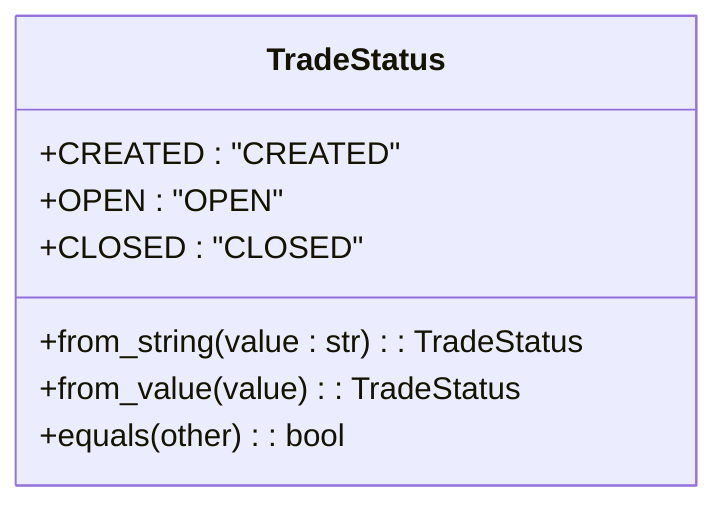
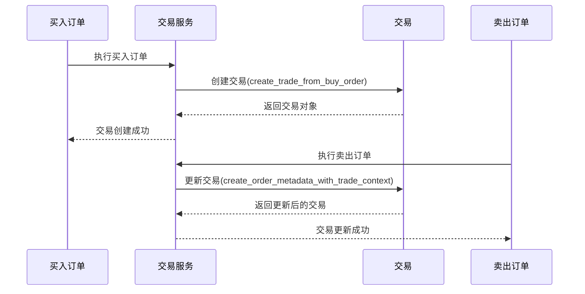
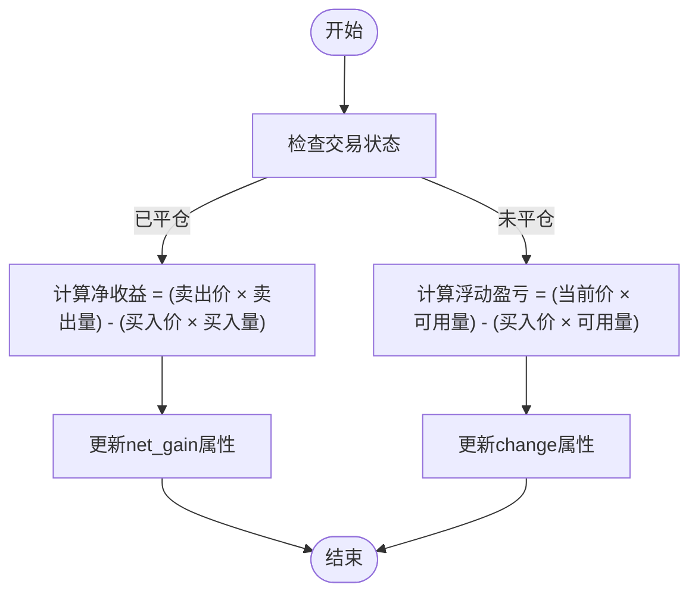
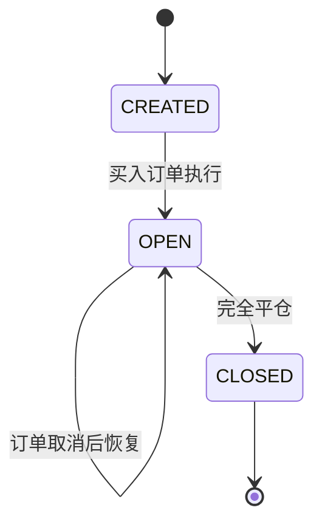
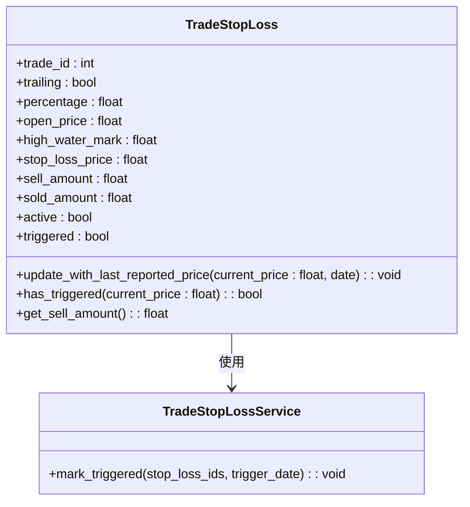
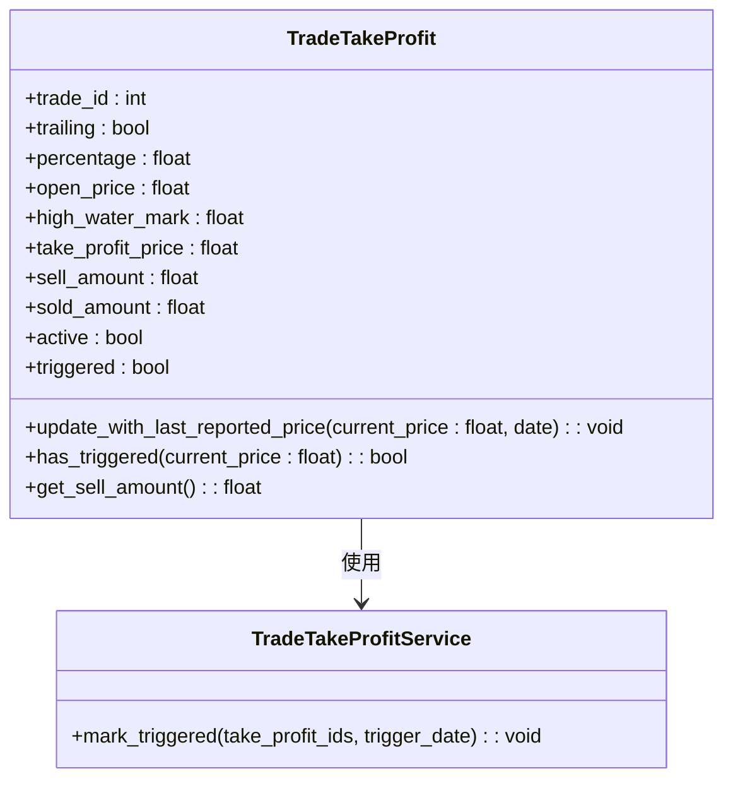
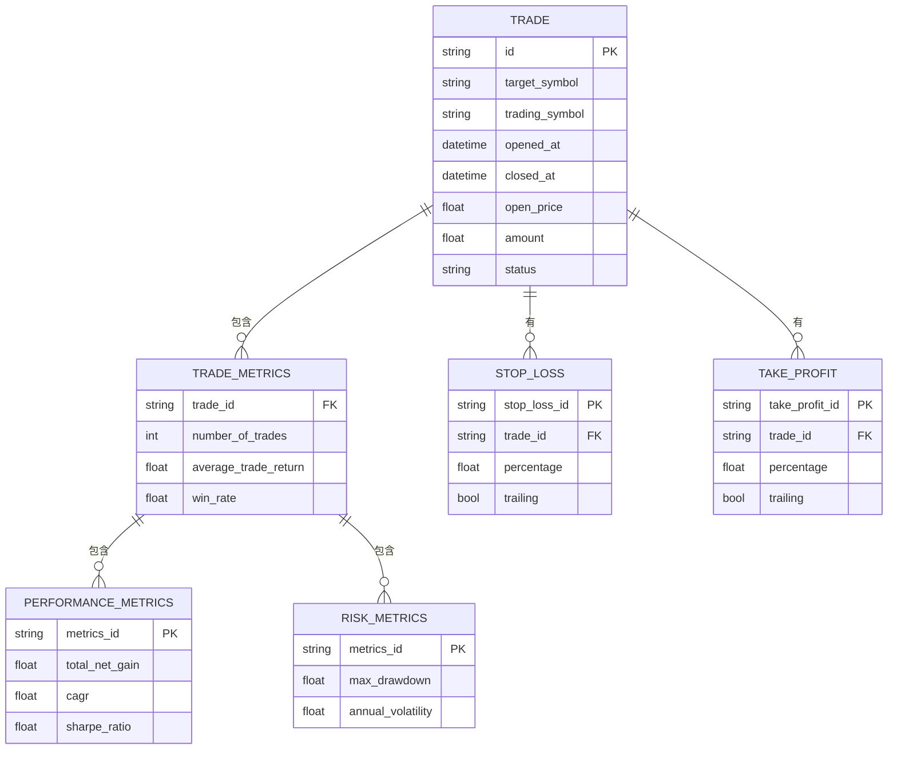

# 交易管理

<cite>
**本文档引用的文件**   
- [trade.py](file://investing_algorithm_framework/domain/models/trade/trade.py)
- [trade_status.py](file://investing_algorithm_framework/domain/models/trade/trade_status.py)
- [trade_stop_loss.py](file://investing_algorithm_framework/domain/models/trade/trade_stop_loss.py)
- [trade_take_profit.py](file://investing_algorithm_framework/domain/models/trade/trade_take_profit.py)
- [trade_service.py](file://investing_algorithm_framework/services/trade_service/trade_service.py)
- [trade_stop_loss_service.py](file://investing_algorithm_framework/services/trade_service/trade_stop_loss_service.py)
- [trade_take_profit_service.py](file://investing_algorithm_framework/services/trade_service/trade_take_profit_service.py)
- [trade_repository.py](file://investing_algorithm_framework/infrastructure/repositories/trade_repository.py)
- [test_trade_service.py](file://tests/services/test_trade_service.py)
- [trades.py](file://investing_algorithm_framework/services/metrics/trades.py)
- [generate.py](file://investing_algorithm_framework/services/metrics/generate.py)
</cite>

## 目录
1. [引言](#引言)
2. [交易模型结构](#交易模型结构)
3. [交易状态](#交易状态)
4. [开仓与平仓订单关联](#开仓与平仓订单关联)
5. [盈亏计算逻辑](#盈亏计算逻辑)
6. [交易服务生命周期管理](#交易服务生命周期管理)
7. [交易止损实现机制](#交易止损实现机制)
8. [交易止盈实现机制](#交易止盈实现机制)
9. [交易历史查询与绩效分析](#交易历史查询与绩效分析)
10. [风险评估功能](#风险评估功能)
11. [结论](#结论)

## 引言
交易管理系统是投资算法框架的核心组件，负责管理交易的整个生命周期，从开仓到平仓。该系统通过交易模型（Trade）来表示一个完整的交易过程，包括开仓订单和可能的多个平仓订单。交易服务（TradeService）负责创建、更新和删除交易，同时管理与交易相关的止损（TradeStopLoss）和止盈（TradeTakeProfit）策略。系统还提供了丰富的交易历史查询、绩效分析和风险评估功能，帮助用户全面了解交易表现。

## 交易模型结构
交易模型（Trade）是交易管理系统的核心数据结构，用于表示一个完整的交易过程。它包含了交易的基本信息、状态、盈亏计算以及与订单的关联关系。

**交易模型属性：**
- **id**: 交易的唯一标识符
- **orders**: 与交易关联的订单列表，包括开仓订单和一个或多个平仓订单
- **target_symbol**: 交易的目标交易对（如BTC）
- **trading_symbol**: 交易的计价货币（如EUR）
- **opened_at**: 交易开仓时间
- **closed_at**: 交易平仓时间
- **open_price**: 开仓价格
- **amount**: 交易数量
- **available_amount**: 可用数量（可用于平仓的数量）
- **filled_amount**: 已成交数量
- **remaining**: 剩余未成交数量
- **cost**: 交易成本（开仓价格 × 成交数量）
- **net_gain**: 净收益
- **last_reported_price**: 最新报价
- **last_reported_price_datetime**: 最新报价时间
- **status**: 交易状态（CREATED, OPEN, CLOSED）
- **stop_losses**: 关联的止损策略列表
- **take_profits**: 关联的止盈策略列表
- **metadata**: 元数据，用于存储额外信息

**Section sources**
- [trade.py](file://investing_algorithm_framework/domain/models/trade/trade.py#L14-L389)

## 交易状态
交易状态（TradeStatus）是一个枚举类型，定义了交易在其生命周期中的不同状态。

**交易状态类型：**
- **CREATED**: 交易已创建，但尚未开仓
- **OPEN**: 交易已开仓，但尚未平仓
- **CLOSED**: 交易已平仓，生命周期结束

当一个买入订单成功执行后，交易状态从CREATED变为OPEN。当一个卖出订单成功执行并完全平仓后，交易状态变为CLOSED。系统通过`TradeStatus`枚举类来管理这些状态，并提供了从字符串值转换为状态对象的静态方法。

**Diagram sources **
- [trade_status.py](file://investing_algorithm_framework/domain/models/trade/trade_status.py#L6-L41)

**Section sources**
- [trade_status.py](file://investing_algorithm_framework/domain/models/trade/trade_status.py#L6-L41)

## 开仓与平仓订单关联
交易系统通过将买入订单和卖出订单关联到交易对象来管理开仓和平仓过程。当一个买入订单成功执行时，系统会创建一个交易对象，并将该买入订单作为开仓订单关联到交易中。当一个卖出订单成功执行时，系统会更新相应的交易对象，将该卖出订单作为平仓订单关联到交易中。

交易服务（TradeService）提供了`create_trade_from_buy_order`方法来根据买入订单创建交易。该方法会检查买入订单的状态，只有当订单状态为CLOSED或OPEN时才会创建交易。对于平仓操作，系统通过`create_order_metadata_with_trade_context`方法来处理卖出订单与交易的关联，确保交易的可用数量、成本和净收益得到正确更新。

**Diagram sources **
- [trade_service.py](file://investing_algorithm_framework/services/trade_service/trade_service.py#L44-L83)
- [trade_service.py](file://investing_algorithm_framework/services/trade_service/trade_service.py#L339-L449)

**Section sources**
- [trade_service.py](file://investing_algorithm_framework/services/trade_service/trade_service.py#L44-L83)
- [trade_service.py](file://investing_algorithm_framework/services/trade_service/trade_service.py#L339-L449)

## 盈亏计算逻辑
交易系统的盈亏计算逻辑是其核心功能之一，确保了交易收益的准确计算。系统通过多个属性和方法来实现这一功能。

**核心盈亏属性：**
- **net_gain**: 交易的净收益，计算公式为：(卖出价格 × 卖出数量) - (买入价格 × 买入数量)
- **change**: 交易的价值变化，对于已平仓交易等于net_gain，对于未平仓交易等于当前价值与成本的差额
- **net_gain_absolute**: 绝对净收益，考虑了当前市场价的影响
- **net_gain_percentage**: 净收益百分比，计算公式为：(净收益 / 成本) × 100%

系统通过`update_trades_with_market_data`方法定期更新交易的最新报价，从而能够实时计算未平仓交易的浮动盈亏。当交易平仓时，系统会根据实际的卖出价格和数量计算最终的净收益。

**Diagram sources **
- [trade.py](file://investing_algorithm_framework/domain/models/trade/trade.py#L179-L261)
- [trade_service.py](file://investing_algorithm_framework/services/trade_service/trade_service.py#L703-L741)

**Section sources**
- [trade.py](file://investing_algorithm_framework/domain/models/trade/trade.py#L179-L261)
- [trade_service.py](file://investing_algorithm_framework/services/trade_service/trade_service.py#L703-L741)

## 交易服务生命周期管理
交易服务（TradeService）是管理交易生命周期的核心组件，负责处理交易从创建到关闭的整个过程。

**交易生命周期管理流程：**
1. **创建交易**: 当买入订单执行时，调用`create_trade_from_buy_order`方法创建交易
2. **更新交易**: 当订单状态变化时，调用`update_trade_with_buy_order`或`update_trade_with_filled_sell_order`方法更新交易
3. **平仓交易**: 当卖出订单执行时，系统自动更新相关交易的状态和属性
4. **关闭交易**: 当交易的可用数量为0且所有订单都已成交时，交易状态变为CLOSED

交易服务还负责处理订单取消、过期等异常情况，确保交易状态的一致性。例如，当一个平仓卖出订单被取消时，系统会调用`update_trade_with_removed_sell_order`方法恢复交易的可用数量和状态。

**Diagram sources **
- [trade_service.py](file://investing_algorithm_framework/services/trade_service/trade_service.py#L44-L83)
- [trade_service.py](file://investing_algorithm_framework/services/trade_service/trade_service.py#L537-L600)
- [trade_service.py](file://investing_algorithm_framework/services/trade_service/trade_service.py#L450-L535)

**Section sources**
- [trade_service.py](file://investing_algorithm_framework/services/trade_service/trade_service.py#L44-L83)
- [trade_service.py](file://investing_algorithm_framework/services/trade_service/trade_service.py#L537-L600)
- [trade_service.py](file://investing_algorithm_framework/services/trade_service/trade_service.py#L450-L535)

## 交易止损实现机制
交易止损（TradeStopLoss）是风险管理的重要工具，用于在价格不利变动时自动平仓以限制损失。

**止损类型：**
- **固定止损**: 在开仓价格的基础上设置一个固定的百分比作为止损价，无论价格如何波动，止损价保持不变
- **追踪止损**: 止损价会随着价格的有利变动而调整，始终保持在最高价的一定百分比之下

**止损实现逻辑：**
1. 当创建止损时，系统会根据止损类型计算初始止损价
2. 对于追踪止损，系统会跟踪交易的最高价（high_water_mark）
3. 每次市场数据更新时，系统会调用`update_with_last_reported_price`方法更新止损状态
4. 当当前价格触及止损价时，止损被触发，系统会创建相应的卖出订单

系统通过`TradeStopLossService`来管理止损的触发状态，当止损被触发时，会调用`mark_triggered`方法更新止损对象的状态。

**Diagram sources **
- [trade_stop_loss.py](file://investing_algorithm_framework/domain/models/trade/trade_stop_loss.py#L8-L333)
- [trade_stop_loss_service.py](file://investing_algorithm_framework/services/trade_service/trade_stop_loss_service.py#L10-L40)

**Section sources**
- [trade_stop_loss.py](file://investing_algorithm_framework/domain/models/trade/trade_stop_loss.py#L8-L333)
- [trade_stop_loss_service.py](file://investing_algorithm_framework/services/trade_service/trade_stop_loss_service.py#L10-L40)

## 交易止盈实现机制
交易止盈（TradeTakeProfit）是盈利保护的重要工具，用于在价格有利变动时自动平仓以锁定利润。

**止盈类型：**
- **固定止盈**: 在开仓价格的基础上设置一个固定的百分比作为止盈价，当价格达到该价位时触发
- **追踪止盈**: 类似于追踪止损，但用于保护利润。当价格达到初始止盈阈值后，止盈价会随着价格的上涨而上调

**止盈实现逻辑：**
1. 当创建止盈时，系统会根据止盈类型设置初始止盈条件
2. 对于追踪止盈，系统会等待价格达到初始阈值（开仓价 × (1 + 百分比)）
3. 一旦达到初始阈值，系统会设置最高价标记，并计算实际的止盈价（最高价 × (1 - 百分比)）
4. 当价格从最高点回落到止盈价时，止盈被触发

系统通过`TradeTakeProfitService`来管理止盈的触发状态，当止盈被触发时，会调用`mark_triggered`方法更新止盈对象的状态。

**Diagram sources **
- [trade_take_profit.py](file://investing_algorithm_framework/domain/models/trade/trade_take_profit.py#L7-L366)
- [trade_take_profit_service.py](file://investing_algorithm_framework/services/trade_service/trade_take_profit_service.py#L10-L42)

**Section sources**
- [trade_take_profit.py](file://investing_algorithm_framework/domain/models/trade/trade_take_profit.py#L7-L366)
- [trade_take_profit_service.py](file://investing_algorithm_framework/services/trade_service/trade_take_profit_service.py#L10-L42)

## 交易历史查询与绩效分析
系统提供了丰富的交易历史查询和绩效分析功能，帮助用户全面了解交易表现。

**交易历史查询功能：**
- 获取所有交易记录
- 按状态筛选交易（开仓、平仓）
- 按交易对筛选交易
- 获取特定投资组合的交易记录

**绩效分析指标：**
- **交易统计**: 交易总数、开仓交易数、平仓交易数
- **收益指标**: 平均交易收益、最佳交易、最差交易
- **时间指标**: 平均交易持续时间
- **成功率**: 胜率、盈亏比

系统通过`trades.py`模块中的各种函数来计算这些指标，如`get_number_of_trades`、`get_average_trade_return`、`get_win_rate`等。这些函数接收交易列表作为输入，返回相应的统计结果。

**Diagram sources **
- [trades.py](file://investing_algorithm_framework/services/metrics/trades.py#L7-L501)
- [generate.py](file://investing_algorithm_framework/services/metrics/generate.py#L38-L359)

**Section sources**
- [trades.py](file://investing_algorithm_framework/services/metrics/trades.py#L7-L501)
- [generate.py](file://investing_algorithm_framework/services/metrics/generate.py#L38-L359)

## 风险评估功能
系统提供了全面的风险评估功能，帮助用户识别和管理交易风险。

**主要风险评估指标：**
- **最大回撤**(Max Drawdown): 评估投资组合从峰值到谷值的最大损失
- **年化波动率**(Annual Volatility): 衡量投资组合收益的波动程度
- **夏普比率**(Sharpe Ratio): 衡量风险调整后的收益
- **卡玛比率**(Calmar Ratio): 衡量收益与最大回撤的比率
- **盈亏比**(Profit Factor): 衡量总盈利与总亏损的比率

这些风险指标通过`generate.py`模块中的`create_backtest_metrics`函数计算，该函数接收回测运行数据作为输入，输出包含各种风险和绩效指标的`BacktestMetrics`对象。系统还提供了`get_current_win_rate`和`get_current_win_loss_ratio`等函数来计算当前状态下的风险指标。

**风险评估指标表：**

| 指标 | 描述 | 计算方法 |
|------|------|---------|
| 最大回撤 | 从峰值到谷值的最大损失 | `get_max_drawdown` |
| 年化波动率 | 收益的年度标准差 | `get_annual_volatility` |
| 夏普比率 | 风险调整后的收益 | `get_sharpe_ratio` |
| 卡玛比率 | 收益与最大回撤的比率 | `get_calmar_ratio` |
| 盈亏比 | 总盈利与总亏损的比率 | `get_profit_factor` |
| 胜率 | 盈利交易的比例 | `get_win_rate` |

**Section sources**
- [generate.py](file://investing_algorithm_framework/services/metrics/generate.py#L38-L359)
- [trades.py](file://investing_algorithm_framework/services/metrics/trades.py#L7-L501)

## 结论
交易管理系统通过精心设计的模型和服务，实现了完整的交易生命周期管理。系统以`Trade`模型为核心，通过`TradeService`管理交易的创建、更新和关闭过程。`TradeStopLoss`和`TradeTakeProfit`模型提供了灵活的风险管理和盈利保护机制。系统还提供了丰富的交易历史查询、绩效分析和风险评估功能，帮助用户全面了解交易表现。整个系统设计注重数据一致性、状态管理和性能优化，为投资策略的执行提供了可靠的基础。