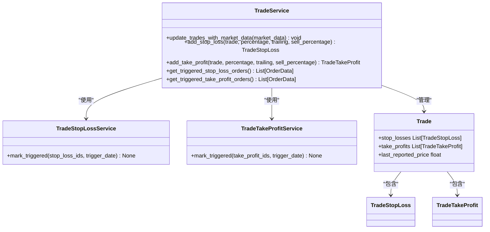

# 交易风险管理

<cite>
**本文档引用的文件**   
- [trade_stop_loss.py](file://investing_algorithm_framework/domain/models/trade/trade_stop_loss.py)
- [trade_take_profit.py](file://investing_algorithm_framework/domain/models/trade/trade_take_profit.py)
- [trade_service.py](file://investing_algorithm_framework/services/trade_service/trade_service.py)
- [trade_stop_loss_service.py](file://investing_algorithm_framework/services/trade_service/trade_stop_loss_service.py)
- [trade_take_profit_service.py](file://investing_algorithm_framework/services/trade_service/trade_take_profit_service.py)
- [stop_loss_rule.py](file://investing_algorithm_framework/domain/models/risk_rules/stop_loss_rule.py)
- [take_profit_rule.py](file://investing_algorithm_framework/domain/models/risk_rules/take_profit_rule.py)
- [context.py](file://investing_algorithm_framework/app/context.py)
</cite>

## 目录
1. [引言](#引言)
2. [核心模型设计](#核心模型设计)
3. [服务架构与监控机制](#服务架构与监控机制)
4. [止盈止损规则与订单关联](#止盈止损规则与订单关联)
5. [回测与实盘环境处理](#回测与实盘环境处理)
6. [动态配置与多级策略](#动态配置与多级策略)
7. [异常处理与恢复机制](#异常处理与恢复机制)

## 引言
本文档深入解析交易风险管理系统的实现，重点阐述止盈止损功能的架构设计与运行机制。系统通过TradeStopLoss和TradeTakeProfit模型实现风险控制，由StopLossService和TakeProfitService服务进行监控和执行。文档详细说明了这些组件的结构、交互方式以及在不同环境下的行为。

**Section sources**
- [stop_loss_rule.py](file://investing_algorithm_framework/domain/models/risk_rules/stop_loss_rule.py)
- [take_profit_rule.py](file://investing_algorithm_framework/domain/models/risk_rules/take_profit_rule.py)
- [context.py](file://investing_algorithm_framework/app/context.py)

## 核心模型设计

交易风险管理系统的基石是`TradeStopLoss`和`TradeTakeProfit`两个核心数据模型。它们定义了风险控制指令的结构、触发条件和状态管理。

`TradeStopLoss`模型用于实现止损策略。其核心属性包括：
- **trailing** (bool): 指示止损是追踪式还是固定式的。
- **percentage** (float): 触发止损的价格变动百分比。
- **open_price** (float): 交易的开仓价格。
- **sell_percentage** (float): 触发时卖出的仓位百分比。
- **stop_loss_price** (float): 计算得出的止损触发价格。
- **high_water_mark** (float): 交易期间的最高价格水位线，对追踪止损至关重要。

`TradeTakeProfit`模型用于实现止盈策略，其属性与`TradeStopLoss`类似，但逻辑相反：
- **trailing** (bool): 指示止盈是追踪式还是固定式的。
- **percentage** (float): 触发止盈的价格变动百分比。
- **open_price** (float): 交易的开仓价格。
- **sell_percentage** (float): 触发时卖出的仓位百分比。
- **take_profit_price** (float): 计算得出的止盈触发价格。
- **high_water_mark** (float): 交易期间的最高价格水位线。

这两个模型都继承自`BaseModel`，并实现了`has_triggered`和`update_with_last_reported_price`等关键方法，用于判断触发条件和根据最新市场价格更新状态。

**Section sources**
- [trade_stop_loss.py](file://investing_algorithm_framework/domain/models/trade/trade_stop_loss.py)
- [trade_take_profit.py](file://investing_algorithm_framework/domain/models/trade/trade_take_profit.py)

## 服务架构与监控机制

系统的风险监控由`TradeService`、`TradeStopLossService`和`TradeTakeProfitService`协同完成。`TradeService`是核心协调者，负责管理交易的全生命周期。

**Diagram sources **
- [trade_service.py](file://investing_algorithm_framework/services/trade_service/trade_service.py)
- [trade_stop_loss_service.py](file://investing_algorithm_framework/services/trade_service/trade_stop_loss_service.py)
- [trade_take_profit_service.py](file://investing_algorithm_framework/services/trade_service/trade_take_profit_service.py)
- [trade.py](file://investing_algorithm_framework/domain/models/trade/trade.py)

监控流程如下：
1.  **数据更新**：`TradeService.update_trades_with_market_data()`方法接收市场数据，为所有未平仓交易更新`last_reported_price`。
2.  **状态同步**：在更新交易价格时，`TradeService.update()`方法会调用`TradeStopLoss`和`TradeTakeProfit`的`update_with_last_reported_price()`方法。
3.  **价格计算**：
    - **固定止损/止盈**：价格在创建时即确定，不随市场波动而改变。
    - **追踪止损/止盈**：`high_water_mark`会随着价格上涨而更新，`stop_loss_price`或`take_profit_price`则基于新的`high_water_mark`重新计算。
4.  **触发检查**：`has_triggered()`方法根据当前市场价格和模型状态判断是否触发。对于追踪止盈，只有当价格从最高点回撤到`take_profit_price`时才会触发。
5.  **指令执行**：`TradeService`通过`get_triggered_stop_loss_orders()`和`get_triggered_take_profit_orders()`方法获取所有已触发的指令，并生成相应的卖出订单。

**Section sources**
- [trade_service.py](file://investing_algorithm_framework/services/trade_service/trade_service.py)
- [trade_stop_loss.py](file://investing_algorithm_framework/domain/models/trade/trade_stop_loss.py)
- [trade_take_profit.py](file://investing_algorithm_framework/domain/models/trade/trade_take_profit.py)

## 止盈止损规则与订单关联

止盈止损规则通过`TradeService`与具体的交易订单建立关联。当一个买入订单成交后，系统会创建一个`Trade`对象。用户或策略可以通过`add_stop_loss()`和`add_take_profit()`方法为该交易添加风险控制指令。

这些指令与订单的关联通过`order_metadata_repository`实现。当一个由止盈或止损触发的卖出订单被执行时，系统会创建元数据对象，将卖出订单与对应的`TradeStopLoss`或`TradeTakeProfit`关联起来。这确保了：
- 可以精确追踪是哪个风险规则触发了订单。
- 在订单执行后，可以正确更新`TradeStopLoss`或`TradeTakeProfit`的`sold_amount`和`sell_prices`。
- 如果订单被取消或失败，系统可以通过`update_trade_with_removed_sell_order()`方法回滚状态，恢复`sold_amount`并重新激活风险规则。

**Section sources**
- [trade_service.py](file://investing_algorithm_framework/services/trade_service/trade_service.py)
- [trade_stop_loss.py](file://investing_algorithm_framework/domain/models/trade/trade_stop_loss.py)
- [trade_take_profit.py](file://investing_algorithm_framework/domain/models/trade/trade_take_profit.py)

## 回测与实盘环境处理

系统对回测和实盘环境进行了区分处理，主要体现在时间戳的获取上。

在`TradeService.update()`方法中，当更新交易的`last_reported_price`时，系统会检查当前环境：
- **回测环境**：使用配置中的`INDEX_DATETIME`作为时间戳，该时间由回测引擎精确控制，确保与历史数据同步。
- **实盘环境**：使用`datetime.now(tz=timezone.utc)`获取当前实时时间。

这种设计保证了回测的可重现性和实盘的实时性。此外，`BacktestOrderExecutor`等组件专门用于回测环境，模拟订单的执行，而实盘环境则使用如`CCXTOrderExecutor`等与真实交易所交互的执行器。

**Section sources**
- [trade_service.py](file://investing_algorithm_framework/services/trade_service/trade_service.py)
- [order_backtest_service.py](file://investing_algorithm_framework/services/order_service/order_backtest_service.py)

## 动态配置与多级策略

系统支持灵活的动态配置和多级止盈止损策略。

**动态配置**：用户可以在交易创建后，通过`add_stop_loss()`和`add_take_profit()`方法动态添加多个风险规则。例如，可以为一个交易同时设置一个10%的固定止盈和一个5%的追踪止损。

**多级止盈**：通过设置多个`sell_percentage`小于100%的`TradeTakeProfit`，可以实现多级止盈。例如，可以设置：
- 第一级止盈：价格涨5%，卖出50%仓位。
- 第二级止盈：价格涨10%，再卖出30%仓位。
系统会检查所有止盈规则的`sell_percentage`总和不超过100%。

**追踪止损**：通过设置`trailing=True`，可以启用追踪止损。系统会持续跟踪`high_water_mark`，并动态调整`stop_loss_price`，以锁定更多利润。

**Section sources**
- [trade_service.py](file://investing_algorithm_framework/services/trade_service/trade_service.py)
- [trade_stop_loss.py](file://investing_algorithm_framework/domain/models/trade/trade_stop_loss.py)
- [trade_take_profit.py](file://investing_algorithm_framework/domain/models/trade/trade_take_profit.py)

## 异常处理与恢复机制

系统具备完善的异常处理和订单执行失败的恢复机制。

当一个由止盈止损触发的卖出订单被取消、过期或拒绝时，`OrderService`会调用`_sync_with_sell_order_expired`或`_sync_with_sell_order_rejected`等方法。这些方法最终会调用`TradeService`的`update_trade_with_removed_sell_order()`。

该方法会：
1.  从`order_metadata`中查找与该卖出订单关联的所有`TradeStopLoss`或`TradeTakeProfit`。
2.  将`sold_amount`减去订单中未成交的部分。
3.  从`sell_prices`和`sell_dates`中移除相关记录。
4.  如果`sold_amount`小于`sell_amount`，则将`active`状态重置为`True`，使该风险规则重新生效。
5.  更新相关交易和投资组合的状态。

这一机制确保了在订单执行失败后，风险控制策略能够自动恢复，不会永久失效，从而保障了系统的鲁棒性。

**Section sources**
- [order_service.py](file://investing_algorithm_framework/services/order_service/order_service.py)
- [trade_service.py](file://investing_algorithm_framework/services/trade_service/trade_service.py)
- [trade_stop_loss.py](file://investing_algorithm_framework/domain/models/trade/trade_stop_loss.py)
- [trade_take_profit.py](file://investing_algorithm_framework/domain/models/trade/trade_take_profit.py)