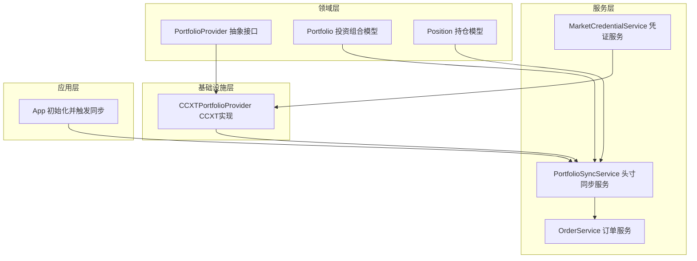
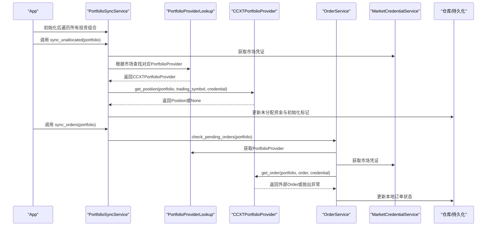
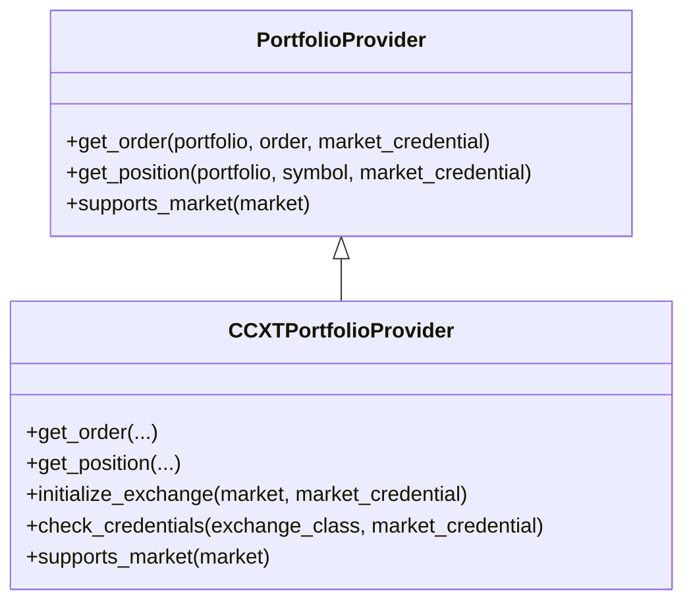
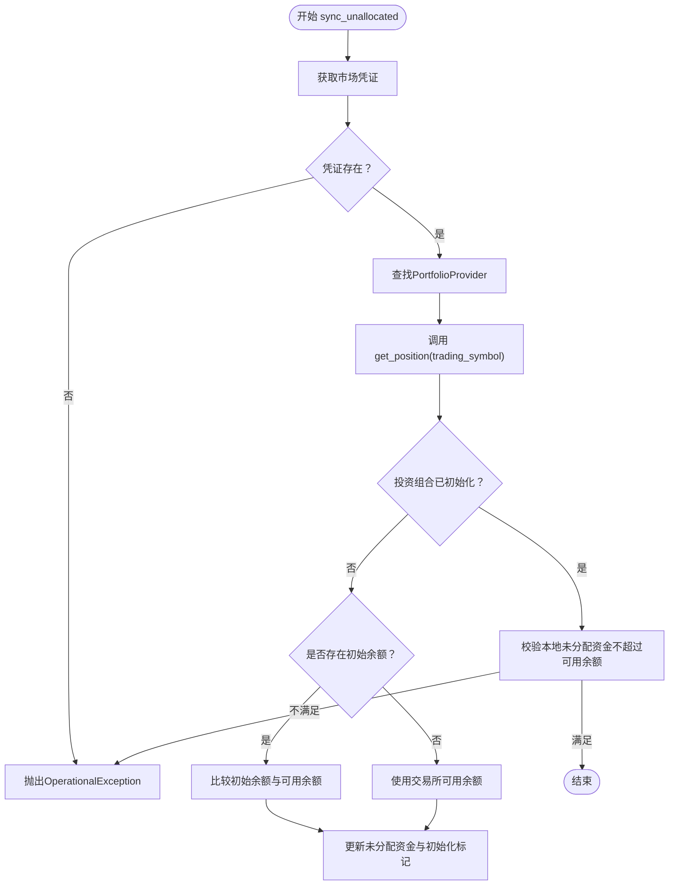
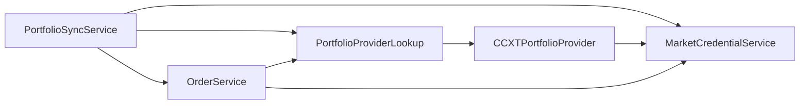

# 头寸同步

<cite>
**本文引用的文件**
- [investing_algorithm_framework/services/portfolios/portfolio_sync_service.py](file://investing_algorithm_framework/services/portfolios/portfolio_sync_service.py)
- [investing_algorithm_framework/infrastructure/portfolio_providers/ccxt_portfolio_provider.py](file://investing_algorithm_framework/infrastructure/portfolio_providers/ccxt_portfolio_provider.py)
- [investing_algorithm_framework/domain/portfolio_provider.py](file://investing_algorithm_framework/domain/portfolio_provider.py)
- [investing_algorithm_framework/services/portfolios/portfolio_provider_lookup.py](file://investing_algorithm_framework/services/portfolios/portfolio_provider_lookup.py)
- [investing_algorithm_framework/domain/models/portfolio/portfolio.py](file://investing_algorithm_framework/domain/models/portfolio/portfolio.py)
- [investing_algorithm_framework/domain/models/position/position.py](file://investing_algorithm_framework/domain/models/position/position.py)
- [investing_algorithm_framework/services/order_service/order_service.py](file://investing_algorithm_framework/services/order_service/order_service.py)
- [investing_algorithm_framework/services/market_credential_service.py](file://investing_algorithm_framework/services/market_credential_service.py)
- [investing_algorithm_framework/domain/models/market/market_credential.py](file://investing_algorithm_framework/domain/models/market/market_credential.py)
- [investing_algorithm_framework/app/app.py](file://investing_algorithm_framework/app/app.py)
- [investing_algorithm_framework/domain/services/portfolios/portfolio_sync_service.py](file://investing_algorithm_framework/domain/services/portfolios/portfolio_sync_service.py)
- [tests/services/test_portfolio_sync_service.py](file://tests/services/test_portfolio_sync_service.py)
</cite>

## 目录
1. [简介](#简介)
2. [项目结构](#项目结构)
3. [核心组件](#核心组件)
4. [架构总览](#架构总览)
5. [详细组件分析](#详细组件分析)
6. [依赖关系分析](#依赖关系分析)
7. [性能考量](#性能考量)
8. [故障排查指南](#故障排查指南)
9. [结论](#结论)
10. [附录](#附录)

## 简介
本文件围绕“头寸同步”主题，系统性阐述投资组合提供者（PortfolioProvider）与交易所API交互以获取实时持仓数据的机制，重点覆盖：
- CCXT投资组合提供者的实现原理：API认证、请求能力检测、错误处理与返回约定
- 头寸同步服务（PortfolioSyncService）的调度策略与数据一致性保障
- 多交易所、多市场环境下的最佳实践
- 异常处理策略：网络中断、API限流等场景下的恢复方案

## 项目结构
围绕头寸同步的关键模块分布如下：
- 领域层：抽象接口与模型（PortfolioProvider、Portfolio、Position）
- 基础设施层：CCXT实现（CCXTPortfolioProvider）
- 服务层：头寸同步（PortfolioSyncService）、订单服务（OrderService）、凭证管理（MarketCredentialService）
- 应用层：应用初始化流程中触发头寸同步

图表来源
- [investing_algorithm_framework/domain/portfolio_provider.py](file://investing_algorithm_framework/domain/portfolio_provider.py#L1-L119)
- [investing_algorithm_framework/infrastructure/portfolio_providers/ccxt_portfolio_provider.py](file://investing_algorithm_framework/infrastructure/portfolio_providers/ccxt_portfolio_provider.py#L1-L200)
- [investing_algorithm_framework/services/portfolios/portfolio_sync_service.py](file://investing_algorithm_framework/services/portfolios/portfolio_sync_service.py#L1-L183)
- [investing_algorithm_framework/services/order_service/order_service.py](file://investing_algorithm_framework/services/order_service/order_service.py#L1-L827)
- [investing_algorithm_framework/services/market_credential_service.py](file://investing_algorithm_framework/services/market_credential_service.py#L1-L40)
- [investing_algorithm_framework/app/app.py](file://investing_algorithm_framework/app/app.py#L2110-L2118)

章节来源
- [investing_algorithm_framework/services/portfolios/portfolio_sync_service.py](file://investing_algorithm_framework/services/portfolios/portfolio_sync_service.py#L1-L183)
- [investing_algorithm_framework/infrastructure/portfolio_providers/ccxt_portfolio_provider.py](file://investing_algorithm_framework/infrastructure/portfolio_providers/ccxt_portfolio_provider.py#L1-L200)
- [investing_algorithm_framework/domain/portfolio_provider.py](file://investing_algorithm_framework/domain/portfolio_provider.py#L1-L119)
- [investing_algorithm_framework/services/portfolios/portfolio_provider_lookup.py](file://investing_algorithm_framework/services/portfolios/portfolio_provider_lookup.py#L1-L107)
- [investing_algorithm_framework/domain/models/portfolio/portfolio.py](file://investing_algorithm_framework/domain/models/portfolio/portfolio.py#L1-L170)
- [investing_algorithm_framework/domain/models/position/position.py](file://investing_algorithm_framework/domain/models/position/position.py#L1-L69)
- [investing_algorithm_framework/services/order_service/order_service.py](file://investing_algorithm_framework/services/order_service/order_service.py#L1-L827)
- [investing_algorithm_framework/services/market_credential_service.py](file://investing_algorithm_framework/services/market_credential_service.py#L1-L40)
- [investing_algorithm_framework/domain/models/market/market_credential.py](file://investing_algorithm_framework/domain/models/market/market_credential.py#L1-L88)
- [investing_algorithm_framework/app/app.py](file://investing_algorithm_framework/app/app.py#L2110-L2118)

## 核心组件
- 投资组合提供者接口（PortfolioProvider）：定义统一的get_order、get_position、supports_market方法，确保不同交易所实现的一致调用入口。
- CCXT投资组合提供者（CCXTPortfolioProvider）：基于CCXT库对接具体交易所，负责API认证、能力检测、错误处理与返回约定。
- 头寸同步服务（PortfolioSyncService）：在应用启动时按配置为每个投资组合执行未分配资金同步与挂单同步，并进行一致性校验。
- 订单服务（OrderService）：负责检查本地开放订单与外部状态的差异，拉取外部订单并更新本地状态。
- 市场凭证服务（MarketCredentialService）与凭证模型（MarketCredential）：负责加载与验证API密钥与密文，支持从环境变量注入。

章节来源
- [investing_algorithm_framework/domain/portfolio_provider.py](file://investing_algorithm_framework/domain/portfolio_provider.py#L1-L119)
- [investing_algorithm_framework/infrastructure/portfolio_providers/ccxt_portfolio_provider.py](file://investing_algorithm_framework/infrastructure/portfolio_providers/ccxt_portfolio_provider.py#L1-L200)
- [investing_algorithm_framework/services/portfolios/portfolio_sync_service.py](file://investing_algorithm_framework/services/portfolios/portfolio_sync_service.py#L1-L183)
- [investing_algorithm_framework/services/order_service/order_service.py](file://investing_algorithm_framework/services/order_service/order_service.py#L1-L827)
- [investing_algorithm_framework/services/market_credential_service.py](file://investing_algorithm_framework/services/market_credential_service.py#L1-L40)
- [investing_algorithm_framework/domain/models/market/market_credential.py](file://investing_algorithm_framework/domain/models/market/market_credential.py#L1-L88)

## 架构总览
下图展示从应用初始化到头寸同步完成的端到端流程，以及各组件之间的交互关系。

图表来源
- [investing_algorithm_framework/app/app.py](file://investing_algorithm_framework/app/app.py#L2110-L2118)
- [investing_algorithm_framework/services/portfolios/portfolio_sync_service.py](file://investing_algorithm_framework/services/portfolios/portfolio_sync_service.py#L47-L183)
- [investing_algorithm_framework/services/portfolios/portfolio_provider_lookup.py](file://investing_algorithm_framework/services/portfolios/portfolio_provider_lookup.py#L34-L86)
- [investing_algorithm_framework/infrastructure/portfolio_providers/ccxt_portfolio_provider.py](file://investing_algorithm_framework/infrastructure/portfolio_providers/ccxt_portfolio_provider.py#L17-L110)
- [investing_algorithm_framework/services/order_service/order_service.py](file://investing_algorithm_framework/services/order_service/order_service.py#L399-L430)
- [investing_algorithm_framework/services/market_credential_service.py](file://investing_algorithm_framework/services/market_credential_service.py#L1-L40)

## 详细组件分析

### 投资组合提供者接口（PortfolioProvider）
- 职责：定义统一的对外接口，屏蔽底层交易所差异。
- 关键方法：
  - get_order：根据外部订单ID与交易对查询外部订单状态，返回None表示未找到或不可用，不抛异常。
  - get_position：查询指定交易对的可用持仓数量，返回None表示无该币种余额。
  - supports_market：判断是否支持某市场。
- 设计要点：明确“未找到即返回None”的契约，避免上层误判；通过优先级选择最佳Provider。

章节来源
- [investing_algorithm_framework/domain/portfolio_provider.py](file://investing_algorithm_framework/domain/portfolio_provider.py#L1-L119)

### CCXT投资组合提供者（CCXTPortfolioProvider）
- API认证与初始化：
  - 通过MarketCredential加载apiKey与secretKey，构造CCXT交易所实例。
  - 使用exchange.requiredCredentials校验是否需要apiKey/secret字段。
  - 支持从环境变量自动注入（MarketCredential.initialize）。
- 请求能力检测：
  - 在get_order前检查exchange.has['fetchOrder']，在get_position前检查exchange.has['fetchBalance']。
- 错误处理与返回约定：
  - get_order：若外部API失败，记录异常并抛出OperationalException，返回None的契约由上层OrderService处理。
  - get_position：当symbol不在可用余额中时返回None；其他异常包装为OperationalException。
- 市场支持判定：
  - supports_market通过hasattr(ccxt, market.lower())判断。

图表来源
- [investing_algorithm_framework/domain/portfolio_provider.py](file://investing_algorithm_framework/domain/portfolio_provider.py#L1-L119)
- [investing_algorithm_framework/infrastructure/portfolio_providers/ccxt_portfolio_provider.py](file://investing_algorithm_framework/infrastructure/portfolio_providers/ccxt_portfolio_provider.py#L1-L200)

章节来源
- [investing_algorithm_framework/infrastructure/portfolio_providers/ccxt_portfolio_provider.py](file://investing_algorithm_framework/infrastructure/portfolio_providers/ccxt_portfolio_provider.py#L17-L110)
- [investing_algorithm_framework/domain/models/market/market_credential.py](file://investing_algorithm_framework/domain/models/market/market_credential.py#L1-L88)

### 头寸同步服务（PortfolioSyncService）
- 同步未分配资金（sync_unallocated）：
  - 获取市场凭证与对应PortfolioProvider，查询trading_symbol的可用余额。
  - 若投资组合未初始化：比较初始余额与可用余额，决定使用初始余额或交易所可用余额；随后更新Portfolio与交易币种Position。
  - 若已初始化：校验本地未分配资金不超过交易所可用余额，否则抛出OperationalException。
- 同步挂单（sync_orders）：
  - 在非回测模式下，委托OrderService检查所有本地开放订单与外部状态差异，并更新本地状态。
- 数据一致性保障：
  - 通过严格的前置校验（凭证存在、余额充足、初始余额合规）与异常抛出，保证数据一致性。
  - 与OrderService协作，确保本地订单状态与外部一致。

图表来源
- [investing_algorithm_framework/services/portfolios/portfolio_sync_service.py](file://investing_algorithm_framework/services/portfolios/portfolio_sync_service.py#L47-L160)

章节来源
- [investing_algorithm_framework/services/portfolios/portfolio_sync_service.py](file://investing_algorithm_framework/services/portfolios/portfolio_sync_service.py#L47-L183)

### 订单服务（OrderService）与外部状态同步
- 检查开放订单：
  - 遍历本地OPEN订单，调用PortfolioProvider.get_order获取外部状态并更新本地。
- 外部状态拉取流程：
  - 通过PortfolioProviderLookup获取Provider，MarketCredentialService获取凭证，再调用Provider.get_order。
- 错误处理：
  - get_order异常时包装为OperationalException，交由上层处理；返回None表示未找到或不可用。

章节来源
- [investing_algorithm_framework/services/order_service/order_service.py](file://investing_algorithm_framework/services/order_service/order_service.py#L399-L430)
- [investing_algorithm_framework/infrastructure/portfolio_providers/ccxt_portfolio_provider.py](file://investing_algorithm_framework/infrastructure/portfolio_providers/ccxt_portfolio_provider.py#L17-L58)

### 市场凭证与认证
- MarketCredential：
  - 支持从构造参数或环境变量注入API Key与Secret Key。
  - initialize阶段会读取环境变量并进行必要校验。
- MarketCredentialService：
  - 提供add/get/get_all等基础能力，用于集中管理凭证。

章节来源
- [investing_algorithm_framework/domain/models/market/market_credential.py](file://investing_algorithm_framework/domain/models/market/market_credential.py#L1-L88)
- [investing_algorithm_framework/services/market_credential_service.py](file://investing_algorithm_framework/services/market_credential_service.py#L1-L40)

### 应用初始化与调度
- 应用启动时：
  - 注册PortfolioProvider（默认CCXTPortfolioProvider），并为每个配置的投资组合执行：
    - sync_unallocated：确保未分配资金与交易所可用余额一致
    - sync_orders：同步开放订单状态
- 回测模式：
  - 跳过真实交易所交互，避免外部依赖。

章节来源
- [investing_algorithm_framework/app/app.py](file://investing_algorithm_framework/app/app.py#L2110-L2118)
- [investing_algorithm_framework/app/app.py](file://investing_algorithm_framework/app/app.py#L2154-L2181)

## 依赖关系分析
- 组件耦合：
  - PortfolioSyncService依赖PortfolioProviderLookup、MarketCredentialService、OrderService、仓库层。
  - CCXTPortfolioProvider依赖CCXT库与MarketCredential。
  - OrderService依赖PortfolioProviderLookup与MarketCredentialService。
- 可能的循环依赖：
  - 当前设计通过lookup表与服务注入避免直接循环依赖。
- 外部依赖：
  - CCXT库用于交易所API访问；MarketCredentialService负责凭证注入。

图表来源
- [investing_algorithm_framework/services/portfolios/portfolio_sync_service.py](file://investing_algorithm_framework/services/portfolios/portfolio_sync_service.py#L1-L183)
- [investing_algorithm_framework/services/portfolios/portfolio_provider_lookup.py](file://investing_algorithm_framework/services/portfolios/portfolio_provider_lookup.py#L1-L107)
- [investing_algorithm_framework/infrastructure/portfolio_providers/ccxt_portfolio_provider.py](file://investing_algorithm_framework/infrastructure/portfolio_providers/ccxt_portfolio_provider.py#L1-L200)
- [investing_algorithm_framework/services/order_service/order_service.py](file://investing_algorithm_framework/services/order_service/order_service.py#L1-L827)
- [investing_algorithm_framework/services/market_credential_service.py](file://investing_algorithm_framework/services/market_credential_service.py#L1-L40)

章节来源
- [investing_algorithm_framework/services/portfolios/portfolio_sync_service.py](file://investing_algorithm_framework/services/portfolios/portfolio_sync_service.py#L1-L183)
- [investing_algorithm_framework/services/portfolios/portfolio_provider_lookup.py](file://investing_algorithm_framework/services/portfolios/portfolio_provider_lookup.py#L1-L107)
- [investing_algorithm_framework/infrastructure/portfolio_providers/ccxt_portfolio_provider.py](file://investing_algorithm_framework/infrastructure/portfolio_providers/ccxt_portfolio_provider.py#L1-L200)
- [investing_algorithm_framework/services/order_service/order_service.py](file://investing_algorithm_framework/services/order_service/order_service.py#L1-L827)
- [investing_algorithm_framework/services/market_credential_service.py](file://investing_algorithm_framework/services/market_credential_service.py#L1-L40)

## 性能考量
- 请求频率控制与限流：
  - 代码中未发现显式的速率限制或退避逻辑。建议在CCXTPortfolioProvider或其封装处增加：
    - 限流器：基于时间窗口统计请求数量，超过阈值则等待
    - 退避重试：指数退避+抖动，结合HTTP状态码（如429/5xx）触发
    - 批量查询：合并多次查询为一次批量请求（若交易所支持）
- 并发与线程安全：
  - 头寸同步通常在应用启动时一次性执行；若扩展为周期任务，需确保多线程安全与幂等性。
- I/O优化：
  - 对于多交易所、多市场的场景，可采用异步I/O或并发池减少等待时间。

[本节为通用性能建议，不直接分析具体文件]

## 故障排查指南
- 常见异常与恢复
  - 无市场凭证：在sync_unallocated中会抛出OperationalException，需确认MarketCredentialService中是否正确注册凭证。
  - 交易所不支持功能：get_order或get_position前的能力检测失败会抛出OperationalException，需确认交易所是否支持相应API。
  - 初始余额超可用：当初始余额大于可用余额时抛出OperationalException，需调整初始余额或充值。
  - 本地未分配资金超可用：当本地未分配资金大于可用余额时抛出OperationalException，需检查历史操作或重新初始化。
  - 外部订单拉取失败：get_order异常会被包装为OperationalException，建议增加重试与告警。
- 网络中断与API限流
  - 建议在CCXTPortfolioProvider中引入指数退避重试与熔断保护；对429/5xx响应进行退避重试，对401/403进行凭证校验与刷新。
- 单元测试参考
  - 测试用例展示了初始化与未分配资金同步的行为，可用于回归验证。

章节来源
- [investing_algorithm_framework/services/portfolios/portfolio_sync_service.py](file://investing_algorithm_framework/services/portfolios/portfolio_sync_service.py#L75-L160)
- [investing_algorithm_framework/infrastructure/portfolio_providers/ccxt_portfolio_provider.py](file://investing_algorithm_framework/infrastructure/portfolio_providers/ccxt_portfolio_provider.py#L48-L109)
- [tests/services/test_portfolio_sync_service.py](file://tests/services/test_portfolio_sync_service.py#L41-L75)

## 结论
- CCXT投资组合提供者通过能力检测与严格错误处理，确保与交易所API交互的稳定性与可预期性。
- PortfolioSyncService在应用初始化阶段完成未分配资金与挂单的同步，配合OrderService保持本地状态与外部一致。
- 在多交易所、多市场环境下，建议补充速率限制、退避重试与并发优化，以提升可靠性与吞吐量。
- 通过凭证服务与环境变量注入，简化部署与运维复杂度。

[本节为总结性内容，不直接分析具体文件]

## 附录
- 最佳实践清单
  - 在应用启动前完成MarketCredential注册与初始化
  - 为每个市场配置合适的PortfolioProvider优先级与能力
  - 在生产环境中启用指数退避与熔断，避免雪崩效应
  - 将头寸同步作为独立任务定期运行，确保与外部状态一致
  - 对关键路径增加监控与告警，快速定位异常

[本节为通用建议，不直接分析具体文件]