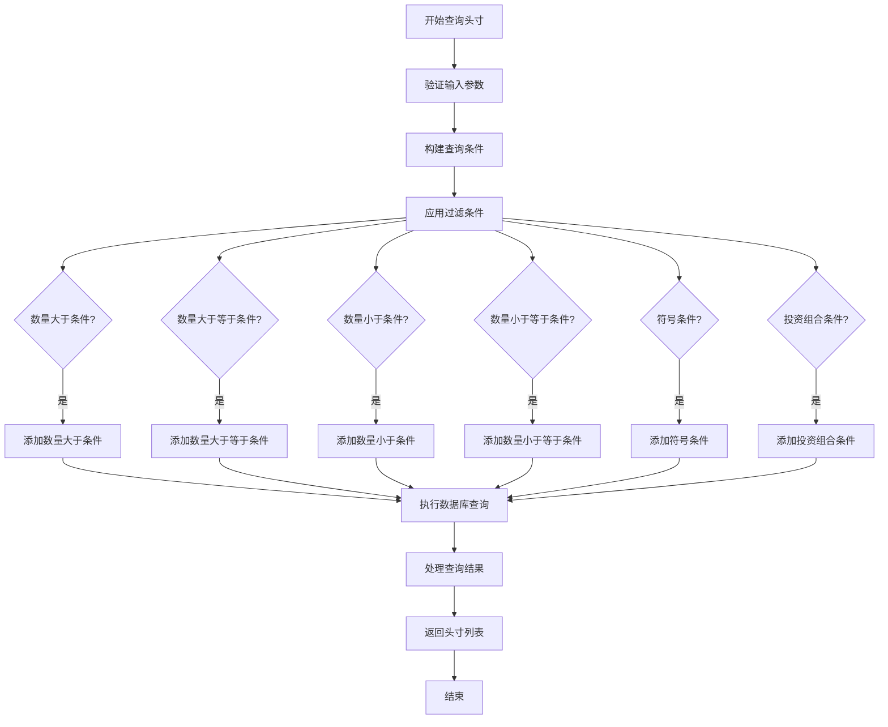
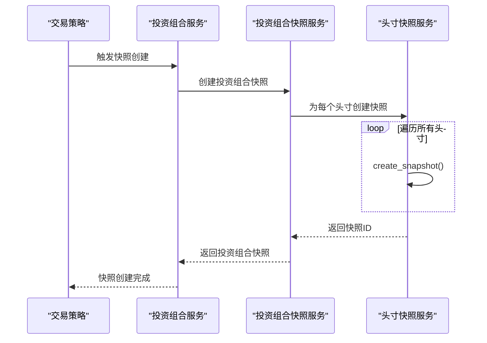
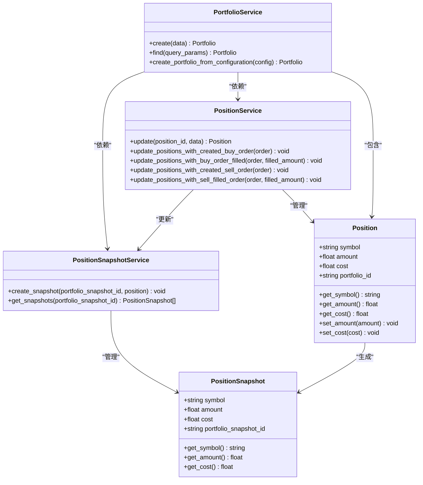

# 头寸服务

<cite>
**本文档引用的文件**   
- [position_service.py](file://investing_algorithm_framework/services/positions/position_service.py)
- [position_snapshot_service.py](file://investing_algorithm_framework/services/positions/position_snapshot_service.py)
- [position.py](file://investing_algorithm_framework/domain/models/position/position.py)
- [position_snapshot.py](file://investing_algorithm_framework/domain/models/position/position_snapshot.py)
- [context.py](file://investing_algorithm_framework/app/context.py)
- [portfolio_service.py](file://investing_algorithm_framework/services/portfolios/portfolio_service.py)
- [portfolio_snapshot_service.py](file://investing_algorithm_framework/services/portfolios/portfolio_snapshot_service.py)
- [test_get_position.py](file://tests/app/algorithm/test_get_position.py)
- [test_get_number_of_positions.py](file://tests/app/algorithm/test_get_number_of_positions.py)
- [position_repository.py](file://investing_algorithm_framework/infrastructure/repositories/position_repository.py)
</cite>

## 目录
1. [简介](#简介)
2. [核心API接口](#核心api接口)
3. [头寸数据聚合与过滤](#头寸数据聚合与过滤)
4. [头寸查询性能优化](#头寸查询性能优化)
5. [交易策略中的头寸操作](#交易策略中的头寸操作)
6. [头寸快照机制](#头寸快照机制)
7. [架构关系图](#架构关系图)

## 简介
头寸服务是投资算法框架中的核心组件，负责管理投资组合中的资产头寸。该服务提供了全面的API接口，用于查询、过滤和操作头寸信息，支持在交易策略中安全地访问和管理资产。头寸服务与投资组合服务、订单服务等紧密集成，确保头寸状态与实际交易活动保持同步。

**Section sources**
- [position_service.py](file://investing_algorithm_framework/services/positions/position_service.py#L1-L211)
- [context.py](file://investing_algorithm_framework/app/context.py#L603-L701)

## 核心API接口

### get_position方法
`get_position`方法用于获取指定资产的头寸信息。该方法支持通过市场和投资组合标识符进行查询，返回匹配的头寸对象。

**参数说明：**
- `symbol`: 资产符号，表示要查询的头寸资产
- `market`: 投资组合所在市场，用于定位特定市场的投资组合
- `identifier`: 投资组合标识符，用于定位特定的投资组合

**返回值：**
- `Position`: 匹配查询参数的头寸对象，包含资产符号、持有数量、成本等信息

### get_all_positions方法
`get_all_positions`方法用于获取所有符合条件的头寸。该方法支持多种过滤条件，包括市场、投资组合标识符以及头寸数量的比较条件。

**参数说明：**
- `market`: 投资组合所在市场
- `identifier`: 投资组合标识符
- `amount_gt`: 头寸数量必须大于指定值
- `amount_gte`: 头寸数量必须大于或等于指定值
- `amount_lt`: 头寸数量必须小于指定值
- `amount_lte`: 头寸数量必须小于或等于指定值

**返回值：**
- `List[Position]`: 符合查询条件的头寸列表

**Section sources**
- [context.py](file://investing_algorithm_framework/app/context.py#L603-L701)
- [test_get_position.py](file://tests/app/algorithm/test_get_position.py#L1-L45)

## 头寸数据聚合与过滤

### 头寸聚合功能
头寸服务提供强大的数据聚合功能，支持基于多种条件的头寸筛选。通过`get_all_positions`方法，用户可以根据头寸数量范围进行过滤，实现精细化的头寸管理。

### 过滤实现机制
头寸过滤功能通过`SQLPositionRepository`类的`_apply_query_params`方法实现。该方法将查询参数转换为SQL查询条件，支持符号、投资组合、数量范围等多种过滤条件。



**Diagram sources **
- [position_repository.py](file://investing_algorithm_framework/infrastructure/repositories/position_repository.py#L11-L66)

**Section sources**
- [position_repository.py](file://investing_algorithm_framework/infrastructure/repositories/position_repository.py#L1-L67)

## 头寸查询性能优化

### 缓存策略
虽然当前代码库中没有显式的缓存实现，但可以通过以下方式优化头寸查询性能：
1. **数据库索引优化**：确保头寸表的关键字段（如symbol、portfolio_id、amount）都有适当的数据库索引
2. **查询结果缓存**：在应用层实现查询结果缓存，避免重复查询相同条件的头寸数据
3. **批量查询**：尽量使用批量查询替代多次单个查询

### 分页处理
对于大量头寸数据的查询，建议实现分页处理机制：
- 使用`limit`和`offset`参数控制返回结果的数量
- 支持按创建时间排序，便于增量查询
- 提供总记录数统计，方便前端分页显示

**Section sources**
- [position_repository.py](file://investing_algorithm_framework/infrastructure/repositories/position_repository.py#L11-L66)

## 交易策略中的头寸操作

### 安全访问模式
在交易策略中访问头寸信息时，应遵循以下最佳实践：
1. **异常处理**：始终处理"未找到投资组合"等异常情况
2. **数据验证**：验证返回的头寸数据完整性
3. **并发控制**：在多线程环境下确保头寸数据的一致性

### 实际用例
```python
# 示例：在交易策略中检查BTC头寸
def check_btc_position(context):
    try:
        btc_position = context.get_position("BTC", market="BINANCE")
        if btc_position.get_amount() > 0:
            print(f"持有{btc_position.get_amount()} BTC")
            # 执行卖出策略
        else:
            print("未持有BTC")
            # 执行买入策略
    except OperationalException as e:
        print(f"获取头寸失败: {e}")
```

**Section sources**
- [test_get_position.py](file://tests/app/algorithm/test_get_position.py#L1-L45)
- [test_get_number_of_positions.py](file://tests/app/algorithm/test_get_number_of_positions.py#L1-L68)

## 头寸快照机制

### 快照生成时机
头寸快照的生成与投资组合快照紧密相关。当投资组合快照创建时，系统会自动为该投资组合下的所有头寸创建相应的快照。

**触发条件：**
- 策略迭代时（SnapshotInterval.STRATEGY_ITERATION）
- 每日定时（SnapshotInterval.DAILY）
- 手动触发快照创建

### 持久化机制
头寸快照通过`PositionSnapshotService`类实现持久化存储。当投资组合快照创建后，系统会调用`create_snapshot`方法为每个头寸创建快照记录。



**Diagram sources **
- [portfolio_snapshot_service.py](file://investing_algorithm_framework/services/portfolios/portfolio_snapshot_service.py#L28-L135)
- [position_snapshot_service.py](file://investing_algorithm_framework/services/positions/position_snapshot_service.py#L7-L18)

**Section sources**
- [portfolio_snapshot_service.py](file://investing_algorithm_framework/services/portfolios/portfolio_snapshot_service.py#L6-L135)
- [position_snapshot_service.py](file://investing_algorithm_framework/services/positions/position_snapshot_service.py#L1-L19)

## 架构关系图



**Diagram sources **
- [position.py](file://investing_algorithm_framework/domain/models/position/position.py#L4-L69)
- [position_snapshot.py](file://investing_algorithm_framework/domain/models/position/position_snapshot.py#L4-L48)
- [position_service.py](file://investing_algorithm_framework/services/positions/position_service.py#L10-L211)
- [position_snapshot_service.py](file://investing_algorithm_framework/services/positions/position_snapshot_service.py#L5-L19)
- [portfolio_service.py](file://investing_algorithm_framework/services/portfolios/portfolio_service.py#L13-L187)

**Section sources**
- [position.py](file://investing_algorithm_framework/domain/models/position/position.py#L1-L69)
- [position_snapshot.py](file://investing_algorithm_framework/domain/models/position/position_snapshot.py#L1-L48)