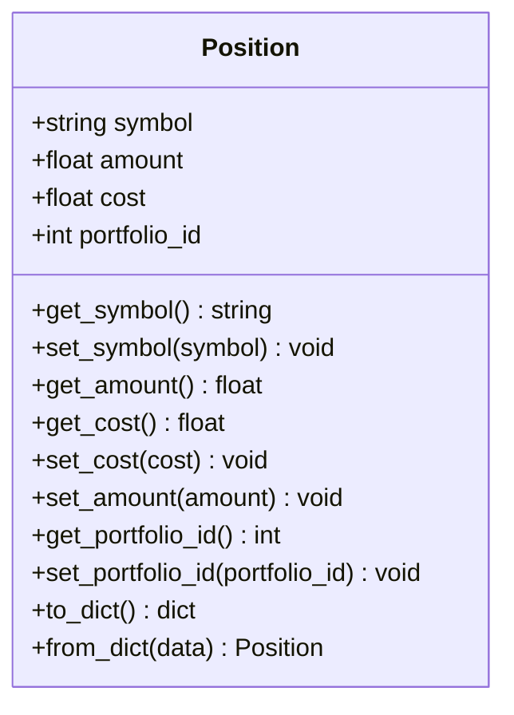
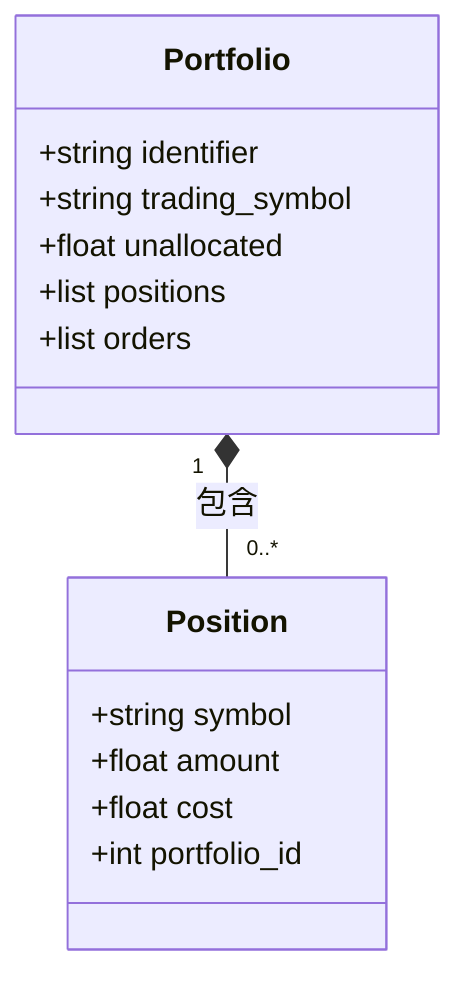
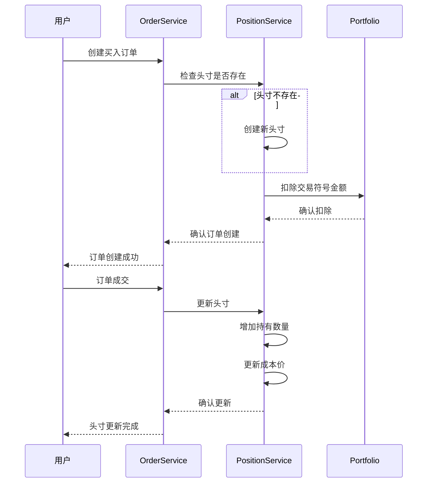
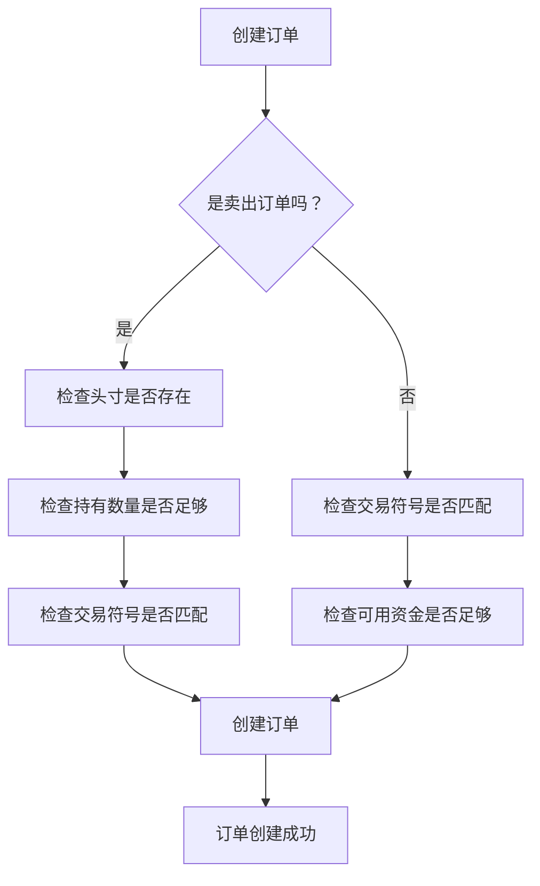
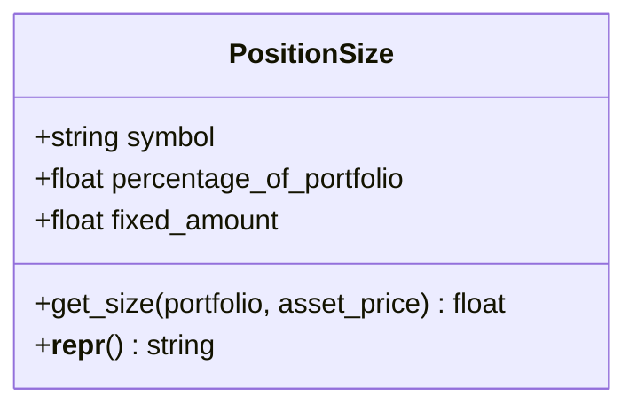

# 头寸模型

<cite>
**本文档中引用的文件**  
- [position.py](file://investing_algorithm_framework/domain/models/position/position.py)
- [position_size.py](file://investing_algorithm_framework/domain/models/position/position_size.py)
- [SQLPosition.py](file://investing_algorithm_framework/infrastructure/models/position/position.py)
- [position_service.py](file://investing_algorithm_framework/services/positions/position_service.py)
- [position_snapshot.py](file://investing_algorithm_framework/domain/models/position/position_snapshot.py)
- [context.py](file://investing_algorithm_framework/app/context.py)
- [order_service.py](file://investing_algorithm_framework/services/order_service/order_service.py)
- [position.py](file://investing_algorithm_framework/app/web/schemas/position.py)
- [serialization_dicts.py](file://tests/resources/serialization_dicts.py)
</cite>

## 目录
1. [引言](#引言)
2. [核心属性与字段定义](#核心属性与字段定义)
3. [头寸与投资组合的关联关系](#头寸与投资组合的关联关系)
4. [头寸状态生命周期管理](#头寸状态生命周期管理)
5. [数据验证规则与业务约束](#数据验证规则与业务约束)
6. [头寸大小计算策略](#头寸大小计算策略)
7. [头寸对象的创建、更新与序列化](#头寸对象的创建更新与序列化)
8. [总结](#总结)

## 引言

头寸模型是投资算法框架中的核心组件之一，用于表示投资组合中特定资产的持仓情况。头寸（Position）记录了交易对、持有数量、成本价等关键信息，并与投资组合（Portfolio）紧密关联。本文档详细阐述了头寸类的核心属性和方法，包括交易对(symbol)、成本价(cost_basis)、持有数量(amount)、未实现盈亏(unrealized_pnl)等字段的定义和计算逻辑。同时，文档还解释了头寸与投资组合的关联关系、头寸状态的生命周期管理、数据验证规则以及头寸大小(PositionSize)的计算策略和应用场景。

**Section sources**
- [position.py](file://investing_algorithm_framework/domain/models/position/position.py#L1-L69)
- [position_size.py](file://investing_algorithm_framework/domain/models/position/position_size.py#L1-L42)

## 核心属性与字段定义

头寸模型的核心属性包括交易对(symbol)、持有数量(amount)、成本(cost)和投资组合ID(portfolio_id)。这些属性在`Position`类中定义，并通过相应的getter和setter方法进行访问和修改。

### 交易对 (Symbol)

交易对表示头寸所持有的资产符号，例如"BTC"或"ETH"。在设置交易对时，系统会自动将其转换为大写格式，以确保一致性。

### 持有数量 (Amount)

持有数量表示当前持有的资产数量。该值可以是正数（表示多头头寸）或零（表示无持仓）。当执行买入或卖出订单时，持有数量会相应增加或减少。

### 成本价 (Cost Basis)

成本价表示获取当前持仓的总成本。每次执行买入订单时，成本价会根据成交价格和数量进行更新。成本价的计算公式为：新成本 = 原成本 + (成交价格 × 成交数量)。

### 未实现盈亏 (Unrealized PNL)

未实现盈亏是指当前持仓相对于成本价的浮动盈亏。虽然在提供的代码片段中没有直接显示未实现盈亏的计算方法，但可以通过当前市场价格与成本价的差额乘以持有数量来计算。

**Diagram sources**
- [position.py](file://investing_algorithm_framework/domain/models/position/position.py#L4-L68)

**Section sources**
- [position.py](file://investing_algorithm_framework/domain/models/position/position.py#L4-L68)

## 头寸与投资组合的关联关系

头寸与投资组合之间存在紧密的关联关系。每个头寸都属于一个特定的投资组合，并通过`portfolio_id`字段进行关联。投资组合管理着多个头寸，包括交易符号头寸和其他资产头寸。

### 投资组合中的头寸管理

投资组合通过`positions`属性管理其包含的所有头寸。当创建新的买入订单时，系统会检查是否存在对应的头寸，如果不存在则会创建一个新的头寸。同样，当执行卖出订单时，系统会更新相应的头寸信息。

### 交易符号头寸

每个投资组合都有一个交易符号（trading_symbol），通常表示用于交易的基础货币，如"EUR"或"USDT"。交易符号本身也是一个特殊的头寸，记录了可用于交易的资金量。当执行买入订单时，交易符号头寸的数量会减少；当执行卖出订单时，交易符号头寸的数量会增加。

**Diagram sources**
- [position.py](file://investing_algorithm_framework/domain/models/position/position.py#L4-L68)
- [portfolio.py](file://investing_algorithm_framework/domain/models/portfolio/portfolio.py#L4-L100)

**Section sources**
- [position.py](file://investing_algorithm_framework/domain/models/position/position.py#L4-L68)
- [portfolio.py](file://investing_algorithm_framework/domain/models/portfolio/portfolio.py#L4-L100)

## 头寸状态生命周期管理

头寸的状态生命周期主要通过订单的创建和执行来管理。当创建买入或卖出订单时，系统会相应地更新头寸的状态。

### 买入订单对头寸的影响

当创建买入订单时，系统会首先检查是否存在对应的头寸，如果不存在则创建一个新的头寸。然后，系统会从交易符号头寸中扣除相应的金额，并在订单成交后更新目标头寸的持有数量和成本价。

### 卖出订单对头寸的影响

当创建卖出订单时，系统会检查目标头寸的持有数量是否足够覆盖订单数量。如果足够，则从目标头寸中扣除相应的数量，并在订单成交后将收益添加到交易符号头寸中。

**Diagram sources**
- [position_service.py](file://investing_algorithm_framework/services/positions/position_service.py#L43-L90)
- [order_service.py](file://investing_algorithm_framework/services/order_service/order_service.py#L445-L463)

**Section sources**
- [position_service.py](file://investing_algorithm_framework/services/positions/position_service.py#L43-L90)
- [order_service.py](file://investing_algorithm_framework/services/order_service/order_service.py#L445-L463)

## 数据验证规则与业务约束

头寸模型实施了严格的数据验证规则和业务约束，以确保数据的完整性和一致性。

### 头寸存在性验证

在执行卖出订单之前，系统会验证目标头寸是否存在。如果头寸不存在，则会抛出`OperationalException`异常，阻止订单的创建。

### 数量验证

系统会验证卖出订单的数量是否超过当前头寸的持有数量。如果订单数量大于持有数量，系统会抛出异常，防止过度卖出。

### 交易符号验证

系统会验证订单的交易符号是否与投资组合的交易符号匹配。如果不匹配，系统会拒绝订单的创建，确保交易的一致性。

**Diagram sources**
- [order_service.py](file://investing_algorithm_framework/services/order_service/order_service.py#L306-L397)

**Section sources**
- [order_service.py](file://investing_algorithm_framework/services/order_service/order_service.py#L306-L397)

## 头寸大小计算策略

头寸大小(PositionSize)定义了如何将资本分配给特定的交易对。系统支持两种主要的头寸大小计算策略：固定金额和投资组合百分比。

### 固定金额策略

固定金额策略允许用户为特定交易对指定一个固定的金额。这种策略适用于希望对某些资产进行精确控制的情况。

### 投资组合百分比策略

投资组合百分比策略根据投资组合的总价值按比例分配资金。计算公式为：头寸大小 = 总价值 × (百分比 / 100)。这种策略有助于实现投资组合的多样化和风险分散。

**Diagram sources**
- [position_size.py](file://investing_algorithm_framework/domain/models/position/position_size.py#L6-L41)

**Section sources**
- [position_size.py](file://investing_algorithm_framework/domain/models/position/position_size.py#L6-L41)

## 头寸对象的创建、更新与序列化

头寸对象的创建、更新和序列化是头寸管理的重要组成部分。系统提供了完整的方法来处理这些操作。

### 头寸创建

头寸对象可以通过`Position`类的构造函数创建，需要提供交易对、持有数量、成本和投资组合ID等参数。创建后，头寸会被添加到相应的投资组合中。

### 头寸更新

头寸可以通过`update`方法进行更新。系统会自动处理持有数量和成本的更新，并确保数据的一致性。更新操作通常由订单服务在订单成交后触发。

### 头寸序列化

头寸对象可以通过`to_dict`方法转换为字典格式，便于存储和传输。反向操作可以通过`from_dict`静态方法实现，从字典数据重建头寸对象。

**Diagram sources**
- [position.py](file://investing_algorithm_framework/domain/models/position/position.py#L45-L60)
- [position_service.py](file://investing_algorithm_framework/services/positions/position_service.py#L25-L41)

**Section sources**
- [position.py](file://investing_algorithm_framework/domain/models/position/position.py#L45-L60)
- [position_service.py](file://investing_algorithm_framework/services/positions/position_service.py#L25-L41)

## 总结

头寸模型是投资算法框架的核心组件，负责管理投资组合中各个资产的持仓情况。通过详细的属性定义、严格的验证规则和灵活的计算策略，头寸模型确保了投资决策的准确性和一致性。理解头寸模型的工作原理对于开发和维护投资算法至关重要。未来的工作可以进一步优化头寸管理的性能，并增加更多高级功能，如动态头寸调整和风险控制机制。