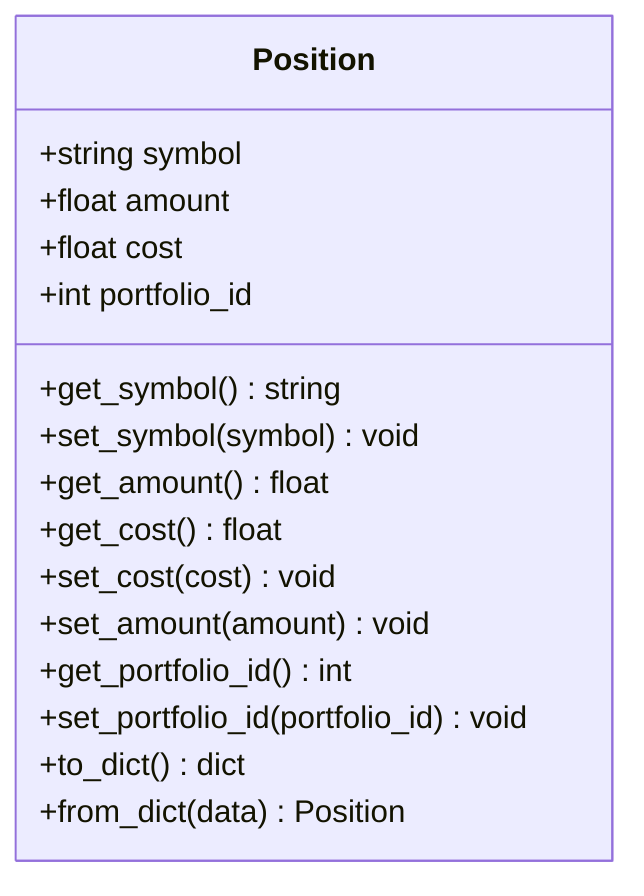
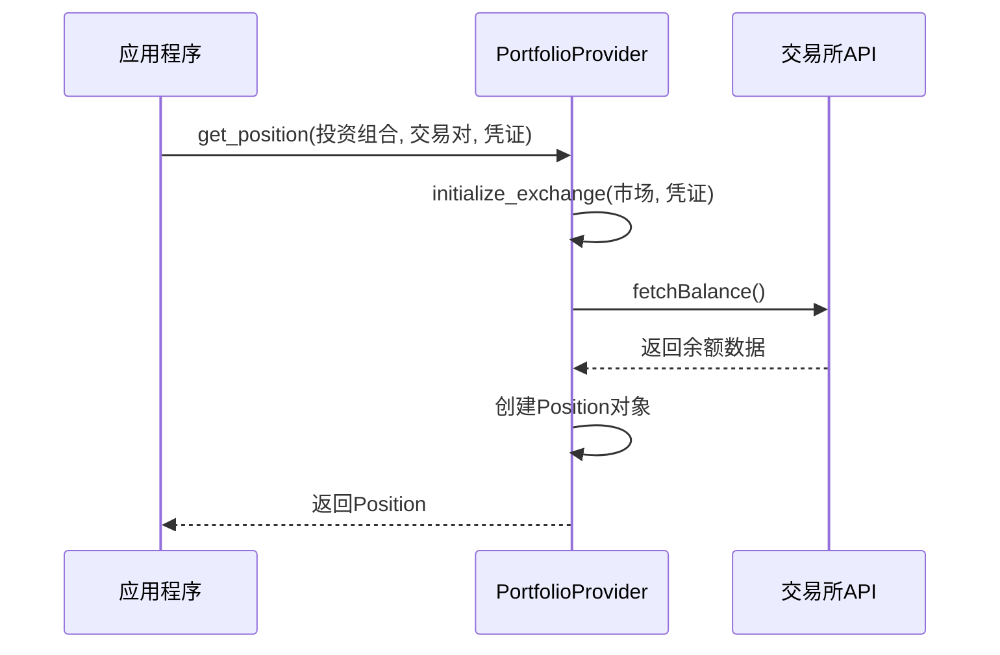
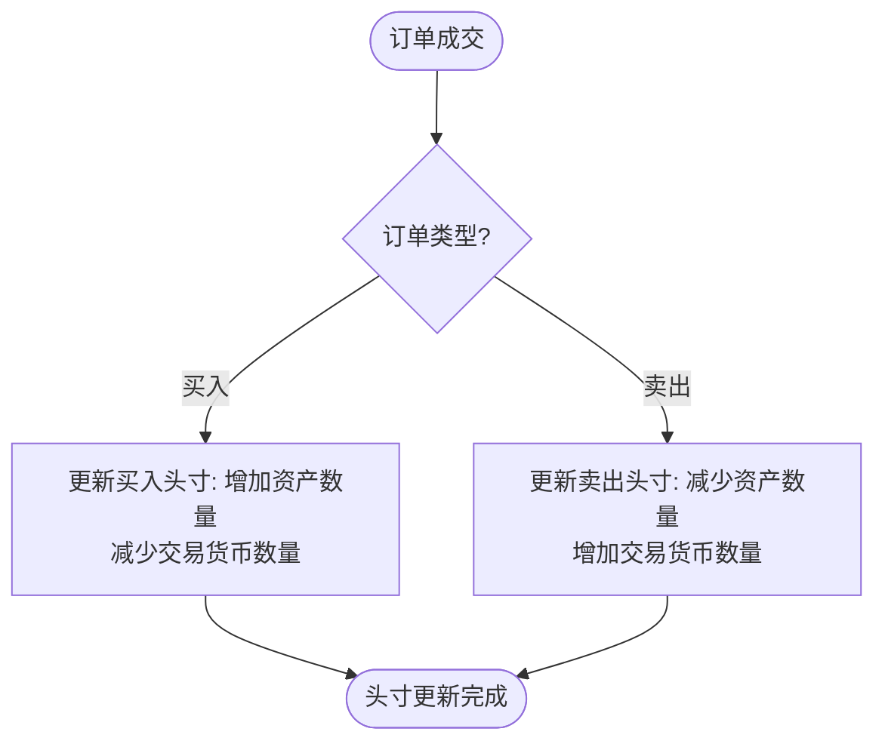
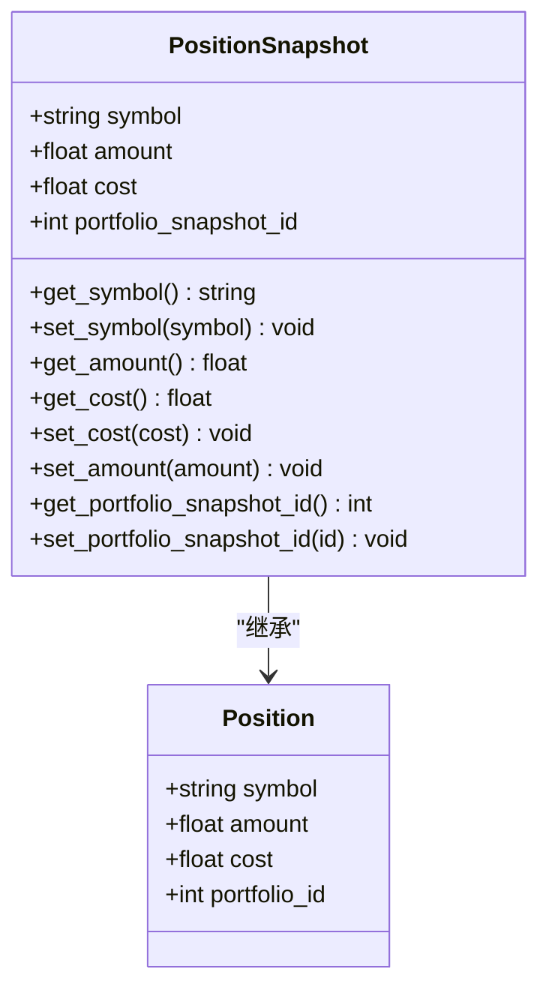

# 头寸管理

<cite>
**本文档引用的文件**   
- [position.py](file://investing_algorithm_framework/domain/models/position/position.py)
- [position_service.py](file://investing_algorithm_framework/services/positions/position_service.py)
- [ccxt_portfolio_provider.py](file://investing_algorithm_framework/infrastructure/portfolio_providers/ccxt_portfolio_provider.py)
- [position_snapshot_service.py](file://investing_algorithm_framework/services/positions/position_snapshot_service.py)
- [position_snapshot.py](file://investing_algorithm_framework/domain/models/position/position_snapshot.py)
- [context.py](file://investing_algorithm_framework/app/context.py)
</cite>

## 目录
1. [引言](#引言)
2. [头寸模型核心属性](#头寸模型核心属性)
3. [投资组合提供者](#投资组合提供者)
4. [头寸服务](#头寸服务)
5. [头寸快照](#头寸快照)
6. [多市场多资产头寸管理最佳实践](#多市场多资产头寸管理最佳实践)

## 引言
头寸管理系统是投资算法框架的核心组件，负责管理投资组合中的资产持仓。该系统通过与交易所API集成，实时获取持仓数据，并提供查询接口和数据聚合功能。本文档详细介绍了头寸管理系统的实现，包括Position模型的核心属性、投资组合提供者的同步机制、头寸服务的查询功能以及头寸快照的生成和持久化机制。

## 头寸模型核心属性
头寸模型（Position）是头寸管理系统的基础，用于表示投资组合中的资产持仓。该模型包含以下核心属性：

- **交易对（symbol）**：表示资产的交易符号，如BTC、ETH等。
- **数量（amount）**：表示持有的资产数量。
- **成本（cost）**：表示持有该资产的总成本。
- **投资组合ID（portfolio_id）**：关联的头寸所属投资组合。

头寸的未实现盈亏计算基于当前市场价格与成本价的差额。当买入订单成交时，系统会更新头寸的数量和成本；当卖出订单成交时，系统会减少头寸数量并增加交易货币的数量。

**图表来源**
- [position.py](file://investing_algorithm_framework/domain/models/position/position.py#L4-L68)

**本节来源**
- [position.py](file://investing_algorithm_framework/domain/models/position/position.py#L4-L68)

## 投资组合提供者
投资组合提供者（PortfolioProvider）负责从交易所API获取实时持仓数据并同步到本地。系统通过CCXTPortfolioProvider实现与多个交易所的集成。

投资组合提供者的主要功能包括：
1. 通过交易所API获取指定资产的持仓信息
2. 验证市场凭证的有效性
3. 将外部持仓数据转换为内部Position对象

当系统需要获取某个资产的持仓时，会调用`get_position`方法，该方法会：
- 初始化交易所实例
- 检查交易所是否支持余额查询功能
- 调用API获取可用余额
- 创建并返回Position对象

**图表来源**
- [ccxt_portfolio_provider.py](file://investing_algorithm_framework/infrastructure/portfolio_providers/ccxt_portfolio_provider.py#L59-L103)

**本节来源**
- [ccxt_portfolio_provider.py](file://investing_algorithm_framework/infrastructure/portfolio_providers/ccxt_portfolio_provider.py#L59-L103)

## 头寸服务
头寸服务（PositionService）提供头寸数据的查询接口和数据聚合功能。该服务作为头寸管理的核心业务逻辑层，处理所有与头寸相关的操作。

主要功能包括：
- **头寸查询**：根据投资组合ID、交易对等条件查询头寸
- **头寸更新**：处理买入/卖出订单成交后的头寸更新
- **数据聚合**：计算投资组合的已分配资金、未分配资金等指标

当订单成交时，头寸服务会自动更新相关头寸：
- 对于买入订单：增加目标资产数量，减少交易货币数量
- 对于卖出订单：减少目标资产数量，增加交易货币数量

**图表来源**
- [position_service.py](file://investing_algorithm_framework/services/positions/position_service.py#L43-L211)

**本节来源**
- [position_service.py](file://investing_algorithm_framework/services/positions/position_service.py#L43-L211)

## 头寸快照
头寸快照（PositionSnapshot）用于记录特定时间点的头寸状态，支持投资组合的历史数据分析和性能评估。

头寸快照的生成和持久化机制：
1. **快照创建**：在策略迭代或每日结束时创建快照
2. **数据采集**：采集当前所有头寸的数量、成本等信息
3. **持久化存储**：将快照数据保存到数据库

头寸快照包含以下信息：
- **交易对（symbol）**：资产交易符号
- **数量（amount）**：持有数量
- **成本（cost）**：持有成本
- **投资组合快照ID（portfolio_snapshot_id）**：关联的投资组合快照

**图表来源**
- [position_snapshot.py](file://investing_algorithm_framework/domain/models/position/position_snapshot.py#L4-L47)
- [position_snapshot_service.py](file://investing_algorithm_framework/services/positions/position_snapshot_service.py#L7-L15)

**本节来源**
- [position_snapshot.py](file://investing_algorithm_framework/domain/models/position/position_snapshot.py#L4-L47)
- [position_snapshot_service.py](file://investing_algorithm_framework/services/positions/position_snapshot_service.py#L7-L15)

## 多市场多资产头寸管理最佳实践
在多市场、多资产环境下进行头寸管理时，应遵循以下最佳实践：

### 统一的头寸标识
使用标准化的交易对格式（如BTC/EUR）确保跨市场的一致性。通过`ccxt_symbol`属性生成符合CCXT标准的交易对标识。

### 原子性操作
确保头寸更新操作的原子性，避免在并发环境下出现数据不一致。系统通过事务处理保证买入/卖出操作的完整性。

### 实时同步
定期从交易所同步持仓数据，确保本地状态与实际持仓一致。建议设置合理的同步频率（如每分钟一次）以平衡实时性和API调用成本。

### 错误处理
实现健壮的错误处理机制，当API调用失败时能够优雅降级，并记录详细的错误日志以便排查问题。

### 性能优化
- 使用缓存减少重复的API调用
- 批量处理头寸更新操作
- 异步执行非关键路径的操作

### 安全考虑
- 严格验证市场凭证的有效性
- 限制API调用频率避免被封禁
- 敏感信息加密存储

**本节来源**
- [context.py](file://investing_algorithm_framework/app/context.py#L627-L1591)
- [position_service.py](file://investing_algorithm_framework/services/positions/position_service.py#L43-L211)
- [ccxt_portfolio_provider.py](file://investing_algorithm_framework/infrastructure/portfolio_providers/ccxt_portfolio_provider.py#L59-L103)