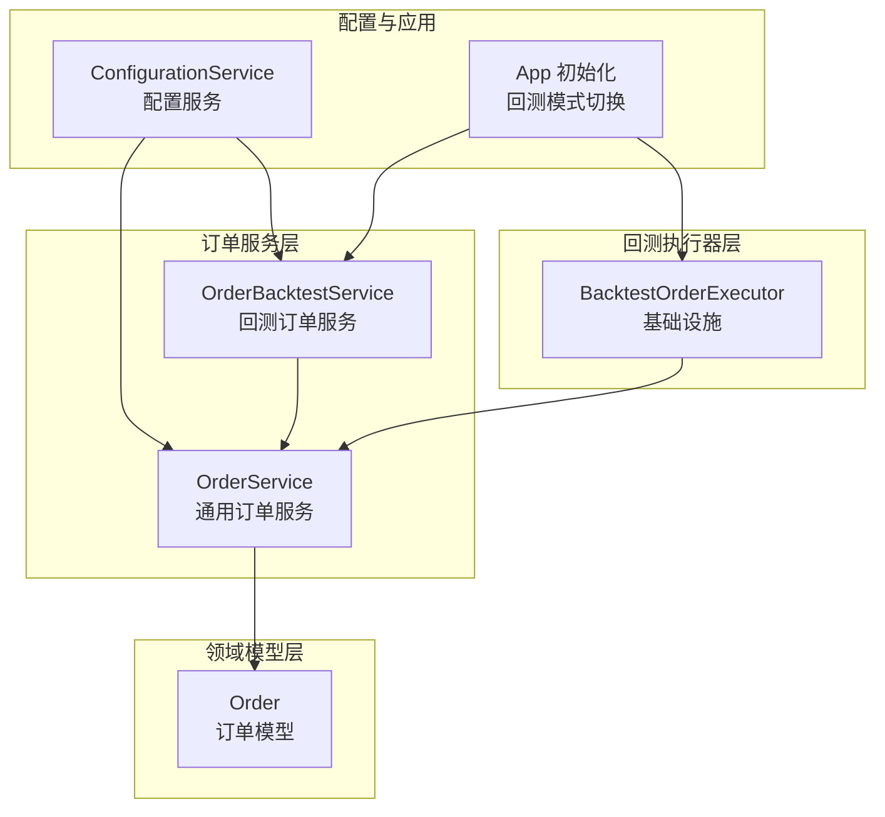
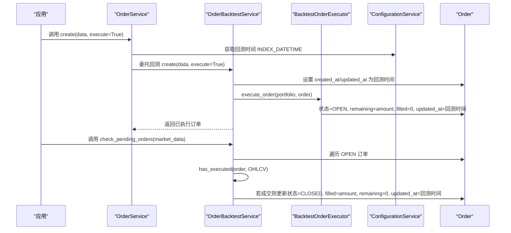
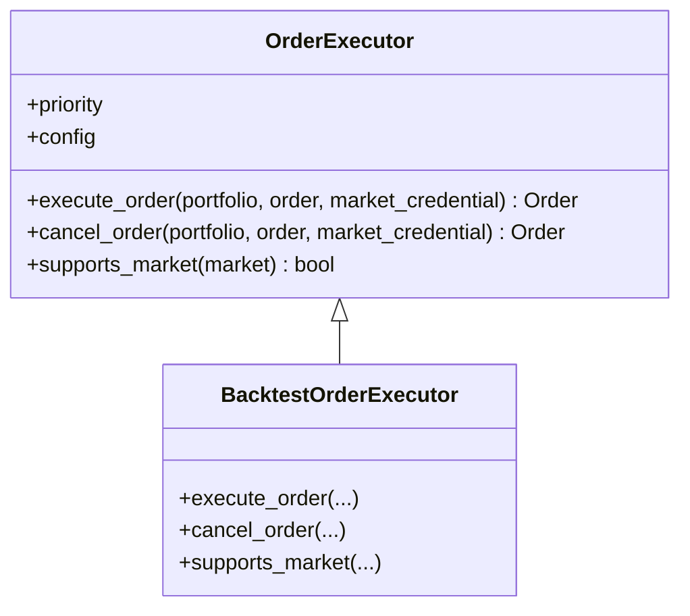
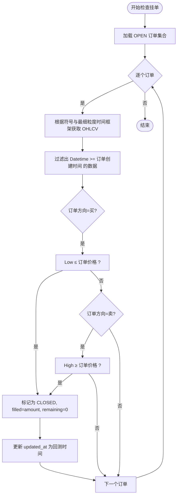
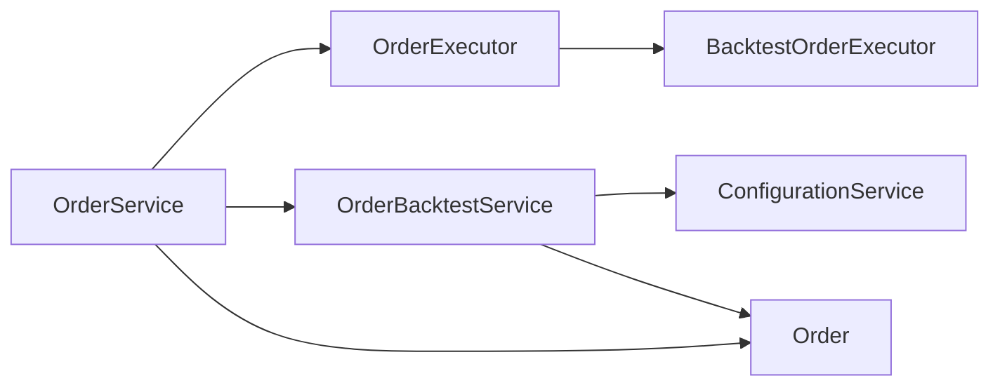

# 回测订单执行

<cite>
**本文引用的文件**
- [investing_algorithm_framework/infrastructure/order_executors/backtest_oder_executor.py](file://investing_algorithm_framework/infrastructure/order_executors/backtest_oder_executor.py)
- [investing_algorithm_framework/domain/order_executor.py](file://investing_algorithm_framework/domain/order_executor.py)
- [investing_algorithm_framework/services/order_service/order_service.py](file://investing_algorithm_framework/services/order_service/order_service.py)
- [investing_algorithm_framework/services/order_service/order_backtest_service.py](file://investing_algorithm_framework/services/order_service/order_backtest_service.py)
- [investing_algorithm_framework/domain/models/order/order.py](file://investing_algorithm_framework/domain/models/order/order.py)
- [investing_algorithm_framework/services/configuration_service.py](file://investing_algorithm_framework/services/configuration_service.py)
- [investing_algorithm_framework/app/app.py](file://investing_algorithm_framework/app/app.py)
- [tests/services/test_order_backtest_service.py](file://tests/services/test_order_backtest_service.py)
</cite>

## 目录
1. [引言](#引言)
2. [项目结构](#项目结构)
3. [核心组件](#核心组件)
4. [架构总览](#架构总览)
5. [详细组件分析](#详细组件分析)
6. [依赖关系分析](#依赖关系分析)
7. [性能与内存优化](#性能与内存优化)
8. [故障排查指南](#故障排查指南)
9. [结论](#结论)
10. [附录：不同时间框架下的执行示例与验证方法](#附录不同时间框架下的执行示例与验证方法)

## 引言
本文件聚焦于回测环境中的订单执行机制，系统性阐述 BacktestOrderExecutor 的实现与 OrderBacktestService 的回测执行流程。内容涵盖：
- 如何在回测中模拟订单执行（状态流转、时间戳更新）
- 价格填充逻辑（基于 OHLCV 的条件判断）
- 滑点与手续费的现状与扩展建议
- 不同时间框架下的执行时序与数据匹配
- 验证回测执行准确性的方法
- 性能优化与大规模回测的内存管理策略

## 项目结构
围绕回测订单执行的关键模块如下：
- 基础抽象与执行器：domain/order_executor.py、infrastructure/order_executors/backtest_oder_executor.py
- 订单服务与回测服务：services/order_service/order_service.py、services/order_service/order_backtest_service.py
- 订单模型：domain/models/order/order.py
- 配置服务：services/configuration_service.py
- 应用初始化与回测模式切换：app/app.py
- 测试用例：tests/services/test_order_backtest_service.py

图表来源
- [investing_algorithm_framework/infrastructure/order_executors/backtest_oder_executor.py](file://investing_algorithm_framework/infrastructure/order_executors/backtest_oder_executor.py#L1-L29)
- [investing_algorithm_framework/services/order_service/order_service.py](file://investing_algorithm_framework/services/order_service/order_service.py#L256-L290)
- [investing_algorithm_framework/services/order_service/order_backtest_service.py](file://investing_algorithm_framework/services/order_service/order_backtest_service.py#L46-L178)
- [investing_algorithm_framework/domain/models/order/order.py](file://investing_algorithm_framework/domain/models/order/order.py#L1-L385)
- [investing_algorithm_framework/services/configuration_service.py](file://investing_algorithm_framework/services/configuration_service.py#L1-L96)
- [investing_algorithm_framework/app/app.py](file://investing_algorithm_framework/app/app.py#L1952-L1980)

章节来源
- [investing_algorithm_framework/infrastructure/order_executors/backtest_oder_executor.py](file://investing_algorithm_framework/infrastructure/order_executors/backtest_oder_executor.py#L1-L29)
- [investing_algorithm_framework/services/order_service/order_backtest_service.py](file://investing_algorithm_framework/services/order_service/order_backtest_service.py#L46-L178)
- [investing_algorithm_framework/services/order_service/order_service.py](file://investing_algorithm_framework/services/order_service/order_service.py#L256-L290)
- [investing_algorithm_framework/domain/order_executor.py](file://investing_algorithm_framework/domain/order_executor.py#L1-L113)
- [investing_algorithm_framework/domain/models/order/order.py](file://investing_algorithm_framework/domain/models/order/order.py#L1-L385)
- [investing_algorithm_framework/services/configuration_service.py](file://investing_algorithm_framework/services/configuration_service.py#L1-L96)
- [investing_algorithm_framework/app/app.py](file://investing_algorithm_framework/app/app.py#L1952-L1980)

## 核心组件
- BacktestOrderExecutor：在回测模式下模拟订单执行与取消，不对接真实市场，仅更新订单状态与时间戳。
- OrderBacktestService：负责在回测中检查挂单是否已成交，依据 OHLCV 数据判断成交条件，并同步订单状态与时间戳。
- OrderService：通用订单服务，负责创建、执行、更新订单，并与外部执行器交互；在回测中通过 OrderBacktestService 完成实际执行逻辑。
- Order：订单模型，包含金额、已成交、剩余、费用等字段，支持序列化与反序列化。
- ConfigurationService：提供回测当前时间索引（INDEX_DATETIME）等配置信息，驱动回测时序。
- App 初始化：根据运行环境自动切换到 BacktestOrderExecutor，确保回测模式下的统一执行路径。

章节来源
- [investing_algorithm_framework/infrastructure/order_executors/backtest_oder_executor.py](file://investing_algorithm_framework/infrastructure/order_executors/backtest_oder_executor.py#L1-L29)
- [investing_algorithm_framework/services/order_service/order_backtest_service.py](file://investing_algorithm_framework/services/order_service/order_backtest_service.py#L46-L178)
- [investing_algorithm_framework/services/order_service/order_service.py](file://investing_algorithm_framework/services/order_service/order_service.py#L256-L290)
- [investing_algorithm_framework/domain/models/order/order.py](file://investing_algorithm_framework/domain/models/order/order.py#L1-L385)
- [investing_algorithm_framework/services/configuration_service.py](file://investing_algorithm_framework/services/configuration_service.py#L1-L96)
- [investing_algorithm_framework/app/app.py](file://investing_algorithm_framework/app/app.py#L1952-L1980)

## 架构总览
回测模式下的订单执行链路如下：
- 创建订单：OrderService.create 在回测中委托 OrderBacktestService，设置 created_at/updated_at 为回测当前时间。
- 执行订单：OrderService.execute_order 选择 BacktestOrderExecutor，将其状态置为 OPEN 并更新时间戳。
- 检查挂单：OrderBacktestService.check_pending_orders 遍历 OPEN 状态订单，基于 OHLCV 数据判断是否成交。
- 成交后同步：更新订单状态为 CLOSED，filled=amount，remaining=0，并更新 updated_at。

图表来源
- [investing_algorithm_framework/services/order_service/order_service.py](file://investing_algorithm_framework/services/order_service/order_service.py#L256-L290)
- [investing_algorithm_framework/services/order_service/order_backtest_service.py](file://investing_algorithm_framework/services/order_service/order_backtest_service.py#L46-L178)
- [investing_algorithm_framework/infrastructure/order_executors/backtest_oder_executor.py](file://investing_algorithm_framework/infrastructure/order_executors/backtest_oder_executor.py#L1-L29)
- [investing_algorithm_framework/services/configuration_service.py](file://investing_algorithm_framework/services/configuration_service.py#L1-L96)

## 详细组件分析

### BacktestOrderExecutor 实现
- execute_order：将订单状态置为 OPEN，remaining 设为订单总量，filled 设为 0，并将 updated_at 更新为回测当前时间。
- cancel_order：若订单仍为 OPEN，则将其状态置为 CANCELED，remaining=0，并更新 updated_at。
- supports_market：始终返回 True，确保在回测模式下可被选中。

图表来源
- [investing_algorithm_framework/domain/order_executor.py](file://investing_algorithm_framework/domain/order_executor.py#L1-L113)
- [investing_algorithm_framework/infrastructure/order_executors/backtest_oder_executor.py](file://investing_algorithm_framework/infrastructure/order_executors/backtest_oder_executor.py#L1-L29)

章节来源
- [investing_algorithm_framework/infrastructure/order_executors/backtest_oder_executor.py](file://investing_algorithm_framework/infrastructure/order_executors/backtest_oder_executor.py#L1-L29)
- [investing_algorithm_framework/domain/order_executor.py](file://investing_algorithm_framework/domain/order_executor.py#L1-L113)

### OrderBacktestService 执行逻辑
- create：将订单的 created_at/updated_at 设置为回测当前时间，再调用父类标准流程。
- execute_order：将订单置为 OPEN，remaining=amount，filled=0，updated_at=回测时间。
- check_pending_orders：遍历 OPEN 订单，依据 OHLCV 数据判断是否成交；若成交则更新为 CLOSED，filled=amount，remaining=0。
- has_executed：基于订单方向与价格与 OHLCV 的比较判断成交条件：
  - 买单：当 OHLCV 中 Low ≤ 订单价格 且 时间 ≥ 订单创建时间 时成交。
  - 卖单：当 OHLCV 中 High ≥ 订单价格 且 时间 ≥ 订单创建时间 时成交。
- create_snapshot：以回测当前时间为基准生成快照。

图表来源
- [investing_algorithm_framework/services/order_service/order_backtest_service.py](file://investing_algorithm_framework/services/order_service/order_backtest_service.py#L66-L178)

章节来源
- [investing_algorithm_framework/services/order_service/order_backtest_service.py](file://investing_algorithm_framework/services/order_service/order_backtest_service.py#L46-L178)

### OrderService 在回测中的作用
- execute_order：从 OrderExecutorLookup 获取 BacktestOrderExecutor，调用其 execute_order，并将外部执行结果的状态、已成交、剩余等属性写回本地订单，同时更新 updated_at。
- cancel_order：先检查挂单，再通过 BacktestOrderExecutor 取消 OPEN 订单并更新状态。
- 同步逻辑：在订单状态变化或部分成交时，调用位置与组合的同步方法，维护资金与头寸。

章节来源
- [investing_algorithm_framework/services/order_service/order_service.py](file://investing_algorithm_framework/services/order_service/order_service.py#L256-L290)
- [investing_algorithm_framework/services/order_service/order_service.py](file://investing_algorithm_framework/services/order_service/order_service.py#L499-L516)

### 订单模型 Order
- 字段：目标币种/交易币种、方向、类型、状态、价格、数量、已成交、剩余、费用、成本、时间戳、外部 ID 等。
- 方法：getter/setter、to_dict/from_dict、from_ccxt_order、available_amount 等。
- 用途：承载回测与实盘的统一订单表示，便于序列化与跨模块传递。

章节来源
- [investing_algorithm_framework/domain/models/order/order.py](file://investing_algorithm_framework/domain/models/order/order.py#L1-L385)

### 配置与回测时序
- ConfigurationService 提供 INDEX_DATETIME，用于驱动回测当前时间点。
- App.initialize_order_executors：在回测模式下重置执行器列表并添加 BacktestOrderExecutor，保证回测一致性。

章节来源
- [investing_algorithm_framework/services/configuration_service.py](file://investing_algorithm_framework/services/configuration_service.py#L1-L96)
- [investing_algorithm_framework/app/app.py](file://investing_algorithm_framework/app/app.py#L1952-L1980)

## 依赖关系分析
- OrderExecutor 抽象定义了 execute_order/cancel_order/suppoerts_market 接口，BacktestOrderExecutor 实现该接口。
- OrderService 通过 OrderExecutorLookup 获取具体执行器；在回测中由 OrderBacktestService 处理执行细节。
- OrderBacktestService 依赖 ConfigurationService 获取回测时间，依赖 OHLCV 数据判断成交。
- Order 模型贯穿所有服务层，作为数据载体。

图表来源
- [investing_algorithm_framework/domain/order_executor.py](file://investing_algorithm_framework/domain/order_executor.py#L1-L113)
- [investing_algorithm_framework/infrastructure/order_executors/backtest_oder_executor.py](file://investing_algorithm_framework/infrastructure/order_executors/backtest_oder_executor.py#L1-L29)
- [investing_algorithm_framework/services/order_service/order_service.py](file://investing_algorithm_framework/services/order_service/order_service.py#L256-L290)
- [investing_algorithm_framework/services/order_service/order_backtest_service.py](file://investing_algorithm_framework/services/order_service/order_backtest_service.py#L46-L178)
- [investing_algorithm_framework/services/configuration_service.py](file://investing_algorithm_framework/services/configuration_service.py#L1-L96)
- [investing_algorithm_framework/domain/models/order/order.py](file://investing_algorithm_framework/domain/models/order/order.py#L1-L385)

## 性能与内存优化
- 数据过滤与查询优化
  - 在 has_executed 中使用按时间过滤（Datetime ≥ 订单创建时间）减少无关数据扫描。
  - 对 OHLCV DataFrame 使用列选择与布尔掩码，避免不必要的列读取。
- 批量处理
  - check_pending_orders 遍历 OPEN 订单时，尽量复用同一时间框架的数据，减少重复 IO。
- 内存管理
  - 使用 Polars 进行向量化操作，避免 Python 循环；在大数据集上注意分块与惰性计算。
  - 控制回测数据窗口大小，避免一次性加载过长的历史数据。
- 日志与调试
  - 在回测中开启必要的日志级别，避免在高频迭代中产生过多 I/O。
- 并发与线程安全
  - 回测通常串行推进，避免引入多线程导致的竞态；如需并行，确保只读共享状态。

[本节为通用性能建议，不直接分析具体文件，故无章节来源]

## 故障排查指南
- 订单未成交
  - 检查 OHLCV 数据是否覆盖订单创建时间之后的时间段。
  - 确认 has_executed 条件：买单 Low ≤ 价格，卖单 High ≥ 价格。
  - 确认回测时间推进正常，INDEX_DATETIME 是否随迭代递增。
- 订单状态异常
  - 检查 OrderBacktestService.update 是否被调用，updated_at 是否更新为回测时间。
  - 确认 cancel_order 流程是否在 OPEN 状态下调用 BacktestOrderExecutor。
- 测试验证
  - 参考测试用例中对 OrderBacktestService 的覆盖与断言方式，验证 create、execute_order、check_pending_orders 的行为。

章节来源
- [tests/services/test_order_backtest_service.py](file://tests/services/test_order_backtest_service.py#L29-L401)
- [investing_algorithm_framework/services/order_service/order_backtest_service.py](file://investing_algorithm_framework/services/order_service/order_backtest_service.py#L46-L178)
- [investing_algorithm_framework/services/order_service/order_service.py](file://investing_algorithm_framework/services/order_service/order_service.py#L499-L516)

## 结论
BacktestOrderExecutor 与 OrderBacktestService 共同实现了回测环境下的订单执行闭环：在回测模式下，订单状态在执行时即置为 OPEN，并在后续的每个回测周期内基于 OHLCV 数据判断是否成交。该设计简单可靠，满足大多数回测场景的需求。对于更精细的模拟（如滑点、手续费），可在现有框架基础上扩展 OrderBacktestService 的 has_executed 与成交同步逻辑，以贴近真实市场微观结构。

[本节为总结性内容，不直接分析具体文件，故无章节来源]

## 附录：不同时间框架下的执行示例与验证方法

### 不同时间框架下的执行要点
- 最细粒度时间框架优先：在 check_pending_orders 中，优先选择符号对应 OHLCV 元数据中最细粒度的时间框架，以提高成交判断的精确性。
- 时间对齐：has_executed 严格基于 Datetime ≥ 订单创建时间的过滤，避免未来数据泄漏。
- 多时间框架兼容：若策略使用多时间框架，确保各时间框架数据均可用，以便 OrderBacktestService 正确匹配。

章节来源
- [investing_algorithm_framework/services/order_service/order_backtest_service.py](file://investing_algorithm_framework/services/order_service/order_backtest_service.py#L66-L106)

### 验证回测执行准确性的方法
- 单元测试验证：参考测试用例对 OrderBacktestService 的覆盖，断言 create、execute_order、check_pending_orders 的行为。
- 回放对比：在相同数据与参数下，对比不同时间框架下的回测结果，观察成交点位与成交量是否符合预期。
- 快照校验：利用 create_snapshot 生成回测关键节点的组合快照，核对资金、头寸与交易记录的一致性。

章节来源
- [tests/services/test_order_backtest_service.py](file://tests/services/test_order_backtest_service.py#L29-L401)
- [investing_algorithm_framework/services/order_service/order_backtest_service.py](file://investing_algorithm_framework/services/order_service/order_backtest_service.py#L171-L178)