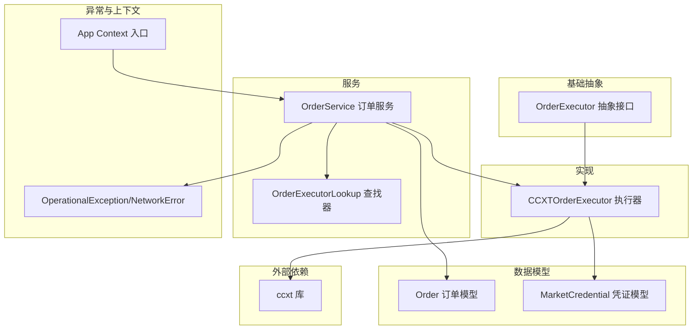
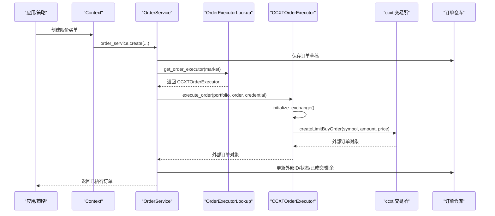
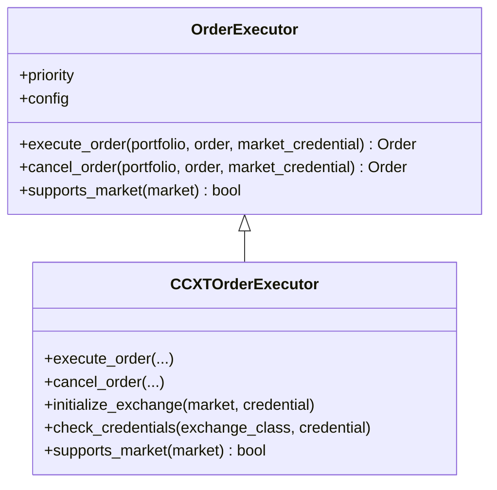
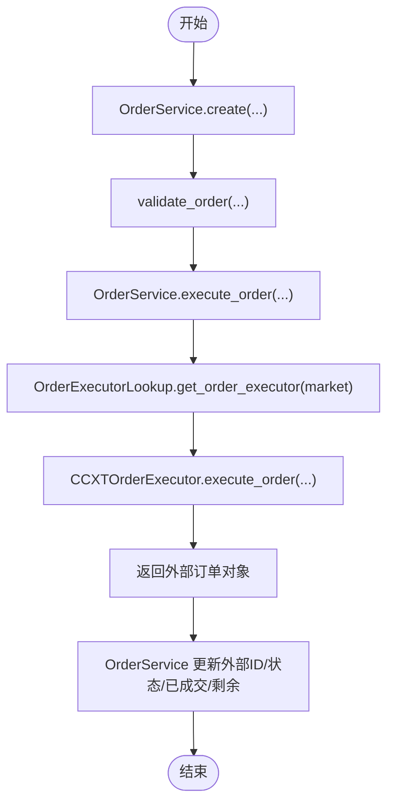
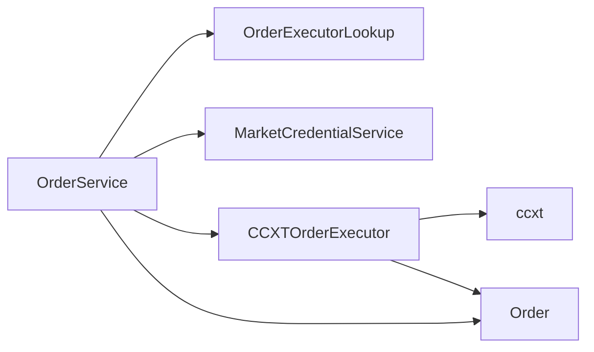

# 实盘订单执行

<cite>
**本文引用的文件列表**
- [ccxt_order_executor.py](file://investing_algorithm_framework/infrastructure/order_executors/ccxt_order_executor.py)
- [order_executor.py](file://investing_algorithm_framework/domain/order_executor.py)
- [order_service.py](file://investing_algorithm_framework/services/order_service/order_service.py)
- [order_executor_lookup.py](file://investing_algorithm_framework/services/order_service/order_executor_lookup.py)
- [order.py](file://investing_algorithm_framework/domain/models/order/order.py)
- [market_credential.py](file://investing_algorithm_framework/domain/models/market/market_credential.py)
- [exceptions.py](file://investing_algorithm_framework/domain/exceptions.py)
- [context.py](file://investing_algorithm_framework/app/context.py)
- [ccxt.py](file://investing_algorithm_framework/infrastructure/data_providers/ccxt.py)
</cite>

## 目录
1. [简介](#简介)
2. [项目结构](#项目结构)
3. [核心组件](#核心组件)
4. [架构总览](#架构总览)
5. [详细组件分析](#详细组件分析)
6. [依赖关系分析](#依赖关系分析)
7. [性能与速率限制](#性能与速率限制)
8. [故障排查指南](#故障排查指南)
9. [结论](#结论)
10. [附录](#附录)

## 简介
本文件聚焦于实盘订单执行，围绕 CCXTOrderExecutor 的实现展开，系统性阐述：
- 如何通过 ccxt 库与交易所 API 进行交互（API 密钥认证、请求签名机制、网络错误处理）
- 订单执行的完整流程：从接收订单指令到构造 API 请求、处理响应、更新订单状态
- 创建市价单、限价单、止损单的代码示例路径与差异说明
- 错误处理策略、重试机制与交易速率限制的应对方案

## 项目结构
围绕“实盘订单执行”的关键模块分布如下：
- 基础抽象层：OrderExecutor 抽象接口定义了执行器的职责与契约
- 实现层：CCXTOrderExecutor 基于 ccxt 的具体执行器
- 服务层：OrderService 负责订单生命周期管理、校验、执行与同步
- 查找与配置：OrderExecutorLookup 提供按市场选择执行器的查找机制
- 数据模型：Order、MarketCredential 等支撑订单与凭证的数据结构
- 异常体系：OperationalException、NetworkError 等统一异常处理
- 上下文入口：app/context.py 暴露 create_limit_buy_order 等便捷入口

图表来源
- [order_executor.py](file://investing_algorithm_framework/domain/order_executor.py#L1-L113)
- [ccxt_order_executor.py](file://investing_algorithm_framework/infrastructure/order_executors/ccxt_order_executor.py#L1-L201)
- [order_service.py](file://investing_algorithm_framework/services/order_service/order_service.py#L1-L300)
- [order_executor_lookup.py](file://investing_algorithm_framework/services/order_service/order_executor_lookup.py#L1-L110)
- [order.py](file://investing_algorithm_framework/domain/models/order/order.py#L1-L385)
- [market_credential.py](file://investing_algorithm_framework/domain/models/market/market_credential.py#L1-L89)
- [exceptions.py](file://investing_algorithm_framework/domain/exceptions.py#L54-L112)
- [context.py](file://investing_algorithm_framework/app/context.py#L338-L361)

章节来源
- [order_executor.py](file://investing_algorithm_framework/domain/order_executor.py#L1-L113)
- [ccxt_order_executor.py](file://investing_algorithm_framework/infrastructure/order_executors/ccxt_order_executor.py#L1-L201)
- [order_service.py](file://investing_algorithm_framework/services/order_service/order_service.py#L1-L300)
- [order_executor_lookup.py](file://investing_algorithm_framework/services/order_service/order_executor_lookup.py#L1-L110)
- [order.py](file://investing_algorithm_framework/domain/models/order/order.py#L1-L385)
- [market_credential.py](file://investing_algorithm_framework/domain/models/market/market_credential.py#L1-L89)
- [exceptions.py](file://investing_algorithm_framework/domain/exceptions.py#L54-L112)
- [context.py](file://investing_algorithm_framework/app/context.py#L338-L361)

## 核心组件
- CCXTOrderExecutor：基于 ccxt 的订单执行器，负责创建限价买单/卖单、取消订单、初始化交易所与凭证校验
- OrderService：订单服务，封装订单创建、执行、更新、同步逻辑；协调执行器与凭证服务
- OrderExecutorLookup：按市场选择最佳执行器的查找器
- Order：订单数据模型，支持从 ccxt 响应转换为内部订单对象
- MarketCredential：市场凭证模型，支持从参数或环境变量加载 API Key/Secret
- 异常体系：OperationalException、NetworkError 统一错误处理

章节来源
- [ccxt_order_executor.py](file://investing_algorithm_framework/infrastructure/order_executors/ccxt_order_executor.py#L1-L201)
- [order_service.py](file://investing_algorithm_framework/services/order_service/order_service.py#L1-L300)
- [order_executor_lookup.py](file://investing_algorithm_framework/services/order_service/order_executor_lookup.py#L1-L110)
- [order.py](file://investing_algorithm_framework/domain/models/order/order.py#L1-L385)
- [market_credential.py](file://investing_algorithm_framework/domain/models/market/market_credential.py#L1-L89)
- [exceptions.py](file://investing_algorithm_framework/domain/exceptions.py#L54-L112)

## 架构总览
实盘订单执行的关键调用链如下：
- 应用通过上下文入口创建订单（如限价买单）
- OrderService 接收订单，进行校验与持久化
- OrderService 通过 OrderExecutorLookup 获取 CCXTOrderExecutor
- CCXTOrderExecutor 初始化交易所并执行订单（createLimitBuyOrder/createLimitSellOrder）
- 返回外部订单对象，OrderService 更新内部订单字段并同步资产

图表来源
- [context.py](file://investing_algorithm_framework/app/context.py#L338-L361)
- [order_service.py](file://investing_algorithm_framework/services/order_service/order_service.py#L256-L290)
- [order_executor_lookup.py](file://investing_algorithm_framework/services/order_service/order_executor_lookup.py#L76-L90)
- [ccxt_order_executor.py](file://investing_algorithm_framework/infrastructure/order_executors/ccxt_order_executor.py#L18-L76)
- [order.py](file://investing_algorithm_framework/domain/models/order/order.py#L309-L351)

章节来源
- [order_service.py](file://investing_algorithm_framework/services/order_service/order_service.py#L256-L290)
- [ccxt_order_executor.py](file://investing_algorithm_framework/infrastructure/order_executors/ccxt_order_executor.py#L18-L76)
- [order_executor_lookup.py](file://investing_algorithm_framework/services/order_service/order_executor_lookup.py#L76-L90)
- [order.py](file://investing_algorithm_framework/domain/models/order/order.py#L309-L351)

## 详细组件分析

### CCXTOrderExecutor 组件分析
- 职责
  - 执行限价买单/卖单
  - 取消订单
  - 初始化交易所与凭证校验
  - 支持市场检测
- 关键方法
  - execute_order：根据订单类型与方向调用 ccxt 对应下单方法
  - cancel_order：检查 cancelOrder 能力后调用取消
  - initialize_exchange：动态选择 ccxt 交易所类，注入 apiKey/secret
  - check_credentials：校验 requiredCredentials 是否满足
  - supports_market：判断是否支持该市场

图表来源
- [order_executor.py](file://investing_algorithm_framework/domain/order_executor.py#L1-L113)
- [ccxt_order_executor.py](file://investing_algorithm_framework/infrastructure/order_executors/ccxt_order_executor.py#L1-L201)

章节来源
- [ccxt_order_executor.py](file://investing_algorithm_framework/infrastructure/order_executors/ccxt_order_executor.py#L18-L201)
- [order_executor.py](file://investing_algorithm_framework/domain/order_executor.py#L1-L113)

### 订单执行流程（从接收指令到更新状态）
- 订单创建与校验
  - OrderService.create：生成订单 ID、持久化、可选执行与同步
  - validate_order：校验买卖方向、限价单有效性等
- 执行阶段
  - OrderService.execute_order：获取执行器与凭证，调用 CCXTOrderExecutor.execute_order
  - CCXTOrderExecutor.execute_order：构造 ccxt 请求并返回外部订单
  - OrderService 同步外部订单字段（外部ID、状态、已成交、剩余）
- 后续同步
  - OrderService._sync_*：根据 filled 差异同步仓位、组合与交易记录

图表来源
- [order_service.py](file://investing_algorithm_framework/services/order_service/order_service.py#L61-L196)
- [order_service.py](file://investing_algorithm_framework/services/order_service/order_service.py#L256-L290)
- [ccxt_order_executor.py](file://investing_algorithm_framework/infrastructure/order_executors/ccxt_order_executor.py#L18-L76)

章节来源
- [order_service.py](file://investing_algorithm_framework/services/order_service/order_service.py#L61-L196)
- [order_service.py](file://investing_algorithm_framework/services/order_service/order_service.py#L256-L290)
- [ccxt_order_executor.py](file://investing_algorithm_framework/infrastructure/order_executors/ccxt_order_executor.py#L18-L76)

### API 密钥认证与请求签名机制
- 凭证来源
  - MarketCredential 支持从参数或环境变量读取 apiKey/secretKey
  - 环境变量命名规则：{MARKET}_API_KEY、{MARKET}_SECRET_KEY
- 交换机初始化
  - CCXTOrderExecutor.initialize_exchange：动态获取 ccxt 交易所类，注入 apiKey/secret
  - CCXTOrderExecutor.check_credentials：读取 exchange.requiredCredentials 并校验
- 请求签名
  - ccxt 内部负责签名与请求头设置，框架不直接暴露签名细节

章节来源
- [market_credential.py](file://investing_algorithm_framework/domain/models/market/market_credential.py#L1-L89)
- [ccxt_order_executor.py](file://investing_algorithm_framework/infrastructure/order_executors/ccxt_order_executor.py#L113-L157)
- [ccxt.py](file://investing_algorithm_framework/infrastructure/data_providers/ccxt.py#L632-L669)

### 网络错误处理
- CCXTOHLCVDataProvider 在 fetch_ohlcv 中捕获 ccxt.NetworkError 并抛出 NetworkError
- CCXTOrderExecutor 在执行过程中捕获异常并记录日志，抛出 OperationalException
- 建议在上层服务中结合指数回退与熔断策略进行重试

章节来源
- [ccxt.py](file://investing_algorithm_framework/infrastructure/data_providers/ccxt.py#L605-L614)
- [ccxt_order_executor.py](file://investing_algorithm_framework/infrastructure/order_executors/ccxt_order_executor.py#L77-L80)
- [exceptions.py](file://investing_algorithm_framework/domain/exceptions.py#L54-L112)

### 订单类型与差异
- 限价单（LIMIT）
  - CCXTOrderExecutor 支持 createLimitBuyOrder 与 createLimitSellOrder
  - 通过 OrderType/LimitSide 判断方向与类型
- 市价单（MARKET）
  - 当前 CCXTOrderExecutor 未实现 MARKET 类型下单
  - 若需支持，可在 execute_order 分支中添加相应逻辑
- 止损单（STOP/STOP_LIMIT）
  - 当前 CCXTOrderExecutor 未实现 STOP/STOP_LIMIT 类型下单
  - 需要扩展以适配具体交易所的 stop/stop_limit API

章节来源
- [ccxt_order_executor.py](file://investing_algorithm_framework/infrastructure/order_executors/ccxt_order_executor.py#L39-L76)
- [order_type.py](file://investing_algorithm_framework/domain/models/order/order_type.py#L1-L31)
- [order_side.py](file://investing_algorithm_framework/domain/models/order/order_side.py#L1-L37)

### 创建订单的代码示例路径
- 限价买单（示例路径）
  - [create_limit_buy_order 调用链](file://investing_algorithm_framework/app/context.py#L338-L361)
  - [OrderService.create](file://investing_algorithm_framework/services/order_service/order_service.py#L61-L196)
  - [OrderService.execute_order](file://investing_algorithm_framework/services/order_service/order_service.py#L256-L290)
  - [CCXTOrderExecutor.execute_order](file://investing_algorithm_framework/infrastructure/order_executors/ccxt_order_executor.py#L18-L76)
- 限价卖单（示例路径）
  - [OrderService.create](file://investing_algorithm_framework/services/order_service/order_service.py#L61-L196)
  - [OrderService.execute_order](file://investing_algorithm_framework/services/order_service/order_service.py#L256-L290)
  - [CCXTOrderExecutor.execute_order](file://investing_algorithm_framework/infrastructure/order_executors/ccxt_order_executor.py#L18-L76)
- 取消订单（示例路径）
  - [OrderService.cancel_order](file://investing_algorithm_framework/services/order_service/order_service.py#L499-L516)
  - [CCXTOrderExecutor.cancel_order](file://investing_algorithm_framework/infrastructure/order_executors/ccxt_order_executor.py#L81-L112)

章节来源
- [context.py](file://investing_algorithm_framework/app/context.py#L338-L361)
- [order_service.py](file://investing_algorithm_framework/services/order_service/order_service.py#L61-L196)
- [order_service.py](file://investing_algorithm_framework/services/order_service/order_service.py#L256-L290)
- [ccxt_order_executor.py](file://investing_algorithm_framework/infrastructure/order_executors/ccxt_order_executor.py#L18-L112)

## 依赖关系分析
- 组件耦合
  - OrderService 依赖 OrderExecutorLookup 与 MarketCredentialService
  - CCXTOrderExecutor 依赖 ccxt 与 MarketCredential
  - Order 作为跨层数据载体，支持 from_ccxt_order 转换
- 外部依赖
  - ccxt：提供交易所 API、速率限制、错误类型
- 潜在风险
  - 未覆盖的订单类型（MARKET/STOP）需要扩展
  - 未内置重试与熔断，需在上层服务补充

图表来源
- [order_service.py](file://investing_algorithm_framework/services/order_service/order_service.py#L1-L120)
- [order_executor_lookup.py](file://investing_algorithm_framework/services/order_service/order_executor_lookup.py#L1-L110)
- [ccxt_order_executor.py](file://investing_algorithm_framework/infrastructure/order_executors/ccxt_order_executor.py#L1-L112)
- [order.py](file://investing_algorithm_framework/domain/models/order/order.py#L309-L351)

章节来源
- [order_service.py](file://investing_algorithm_framework/services/order_service/order_service.py#L1-L120)
- [order_executor_lookup.py](file://investing_algorithm_framework/services/order_service/order_executor_lookup.py#L1-L110)
- [ccxt_order_executor.py](file://investing_algorithm_framework/infrastructure/order_executors/ccxt_order_executor.py#L1-L112)
- [order.py](file://investing_algorithm_framework/domain/models/order/order.py#L309-L351)

## 性能与速率限制
- 速率限制
  - ccxt 提供 exchange.rateLimit，CCXTOHLCVDataProvider 在 fetch_ohlcv 中使用 sleep(exchange.rateLimit / 1000) 控制请求频率
  - 建议在 CCXTOrderExecutor 中同样遵循 rateLimit，避免触发交易所限流
- 重试与熔断
  - 当前未内置重试机制
  - 建议在 OrderService 层引入指数回退与最大重试次数，对 NetworkError/HTTP 5xx 等可恢复错误进行重试
- 批量与并发
  - 对同一市场的多笔订单建议串行化或加队列控制，避免瞬时峰值

章节来源
- [ccxt.py](file://investing_algorithm_framework/infrastructure/data_providers/ccxt.py#L604-L605)

## 故障排查指南
- 常见错误与定位
  - 无可用执行器：OrderExecutorLookup.register_order_executor_for_market 会在未匹配市场时抛出配置异常
  - 凭证缺失：MarketCredential.initialize 会检查环境变量或参数，缺失则抛出 OperationalException
  - 交易所不支持下单方法：CCXTOrderExecutor.execute_order 会在缺少 createLimitBuyOrder/createLimitSellOrder 时抛错
  - 取消失败：exchange.has['cancelOrder'] 为 False 或取消接口异常
- 日志与异常
  - CCXTOrderExecutor 在异常时记录日志并抛出 OperationalException
  - CCXTOHLCVDataProvider 在网络错误时抛出 NetworkError
- 建议排查步骤
  - 确认 MarketCredential.api_key/secret_key 设置正确
  - 使用 supports_market 检查市场是否受支持
  - 检查 exchange.has 能力（下单/cancelOrder）
  - 观察 rateLimit 与请求频率，避免触发限流

章节来源
- [order_executor_lookup.py](file://investing_algorithm_framework/services/order_service/order_executor_lookup.py#L35-L75)
- [market_credential.py](file://investing_algorithm_framework/domain/models/market/market_credential.py#L1-L89)
- [ccxt_order_executor.py](file://investing_algorithm_framework/infrastructure/order_executors/ccxt_order_executor.py#L39-L112)
- [ccxt.py](file://investing_algorithm_framework/infrastructure/data_providers/ccxt.py#L605-L614)

## 结论
- CCXTOrderExecutor 已实现限价单的实盘执行，具备凭证校验与交易所初始化能力
- 订单执行流程清晰：上下文创建订单 → 服务校验与执行 → 执行器调用 ccxt → 同步状态
- 当前未覆盖市价单与止损单，需扩展执行器分支与参数映射
- 缺少内置重试与熔断，建议在服务层补充指数回退与限流策略
- 速率限制应严格遵守 exchange.rateLimit，避免触发交易所风控

## 附录
- 订单类型与方向枚举
  - [OrderType](file://investing_algorithm_framework/domain/models/order/order_type.py#L1-L31)
  - [OrderSide](file://investing_algorithm_framework/domain/models/order/order_side.py#L1-L37)
- 订单对象转换
  - [Order.from_ccxt_order](file://investing_algorithm_framework/domain/models/order/order.py#L309-L351)
- 上下文入口（示例）
  - [create_limit_buy_order](file://investing_algorithm_framework/app/context.py#L338-L361)