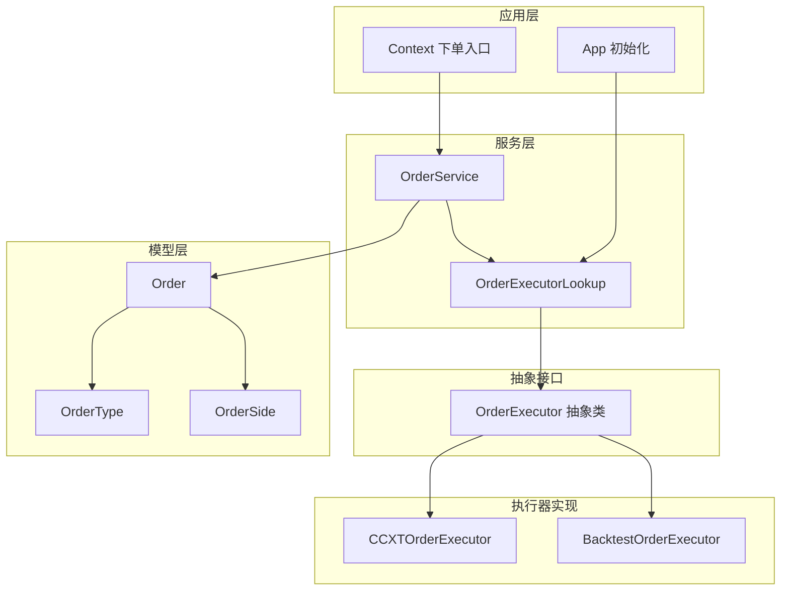
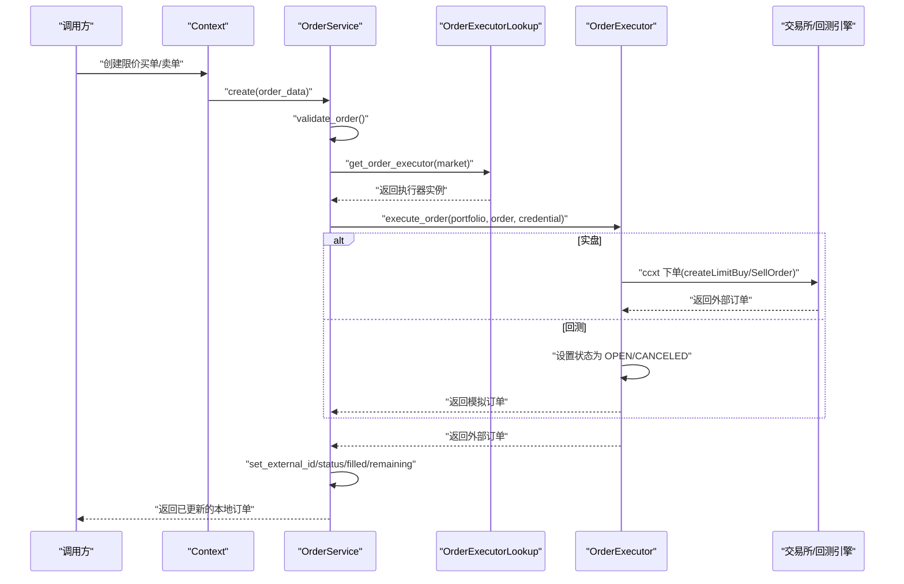
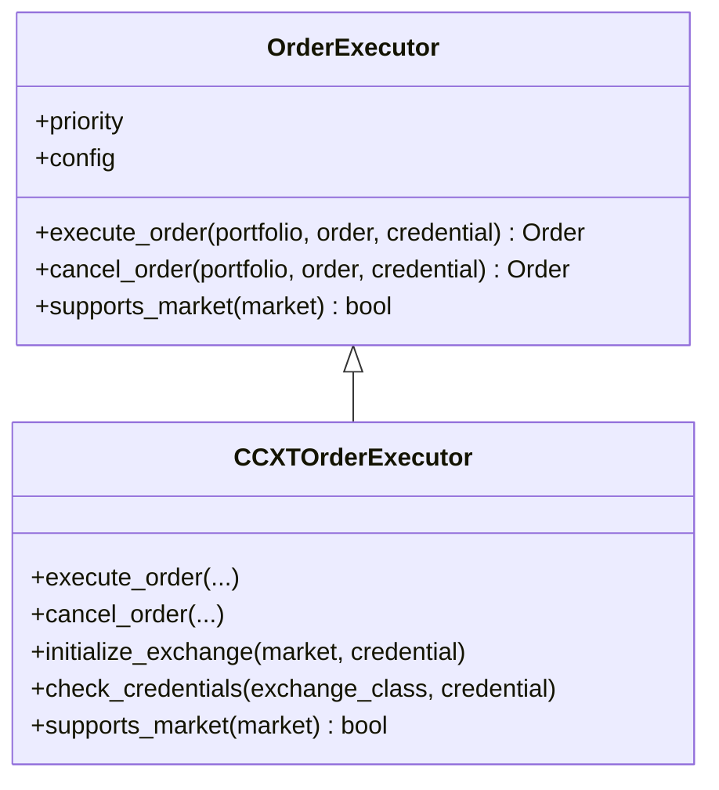
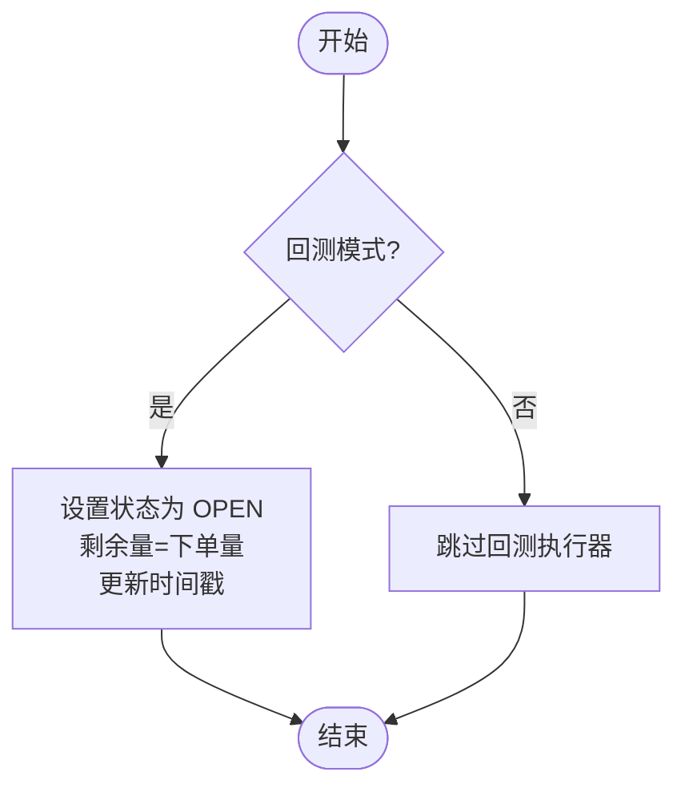
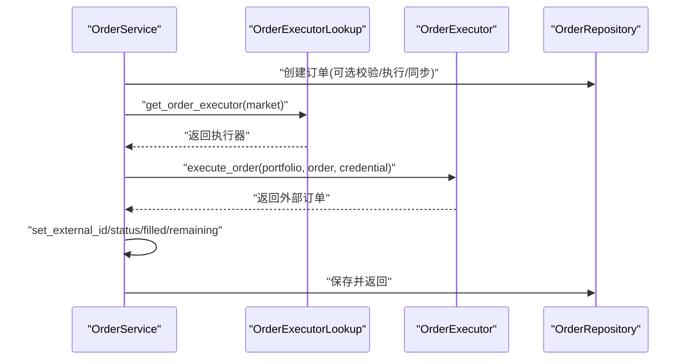
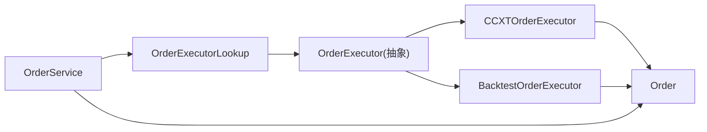
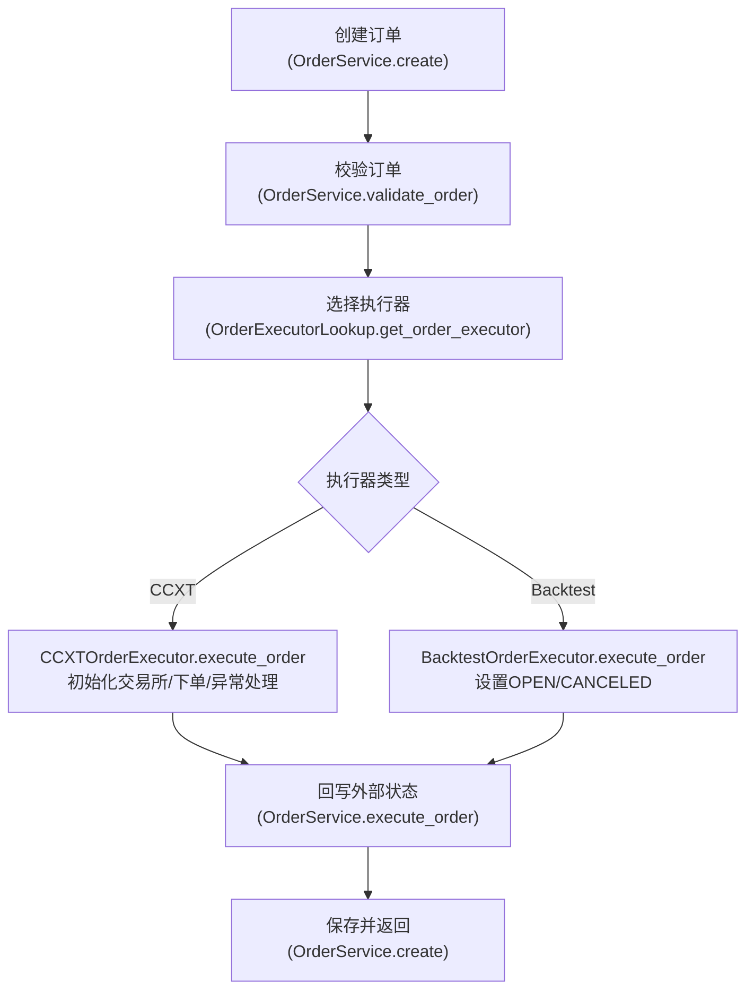

# 订单执行

<cite>
**本文引用的文件**
- [investing_algorithm_framework/domain/order_executor.py](file://investing_algorithm_framework/domain/order_executor.py)
- [investing_algorithm_framework/infrastructure/order_executors/ccxt_order_executor.py](file://investing_algorithm_framework/infrastructure/order_executors/ccxt_order_executor.py)
- [investing_algorithm_framework/infrastructure/order_executors/backtest_oder_executor.py](file://investing_algorithm_framework/infrastructure/order_executors/backtest_oder_executor.py)
- [investing_algorithm_framework/services/order_service/order_service.py](file://investing_algorithm_framework/services/order_service/order_service.py)
- [investing_algorithm_framework/services/order_service/order_executor_lookup.py](file://investing_algorithm_framework/services/order_service/order_executor_lookup.py)
- [investing_algorithm_framework/domain/models/order/order.py](file://investing_algorithm_framework/domain/models/order/order.py)
- [investing_algorithm_framework/domain/models/order/order_type.py](file://investing_algorithm_framework/domain/models/order/order_type.py)
- [investing_algorithm_framework/domain/models/order/order_side.py](file://investing_algorithm_framework/domain/models/order/order_side.py)
- [investing_algorithm_framework/app/app.py](file://investing_algorithm_framework/app/app.py)
- [investing_algorithm_framework/app/context.py](file://investing_algorithm_framework/app/context.py)
- [tests/services/test_order_service.py](file://tests/services/test_order_service.py)
</cite>

## 目录
1. [引言](#引言)
2. [项目结构](#项目结构)
3. [核心组件](#核心组件)
4. [架构总览](#架构总览)
5. [详细组件分析](#详细组件分析)
6. [依赖关系分析](#依赖关系分析)
7. [性能考量](#性能考量)
8. [故障排查指南](#故障排查指南)
9. [结论](#结论)
10. [附录](#附录)

## 引言
本文件聚焦于订单执行子系统，系统性阐述两类订单执行器的实现与差异：
- CCXT 实盘执行器：对接 ccxt 库与交易所 API，负责真实下单、取消、错误处理与状态同步。
- 回测执行器：在回测模式下模拟订单执行，不与外部市场交互，仅更新订单状态与剩余量。

同时，文档梳理了从接收订单指令到发送 API 请求、处理响应与更新订单状态的完整流程，并给出创建市价单、限价单、止损单的实践建议与差异说明。

## 项目结构
围绕订单执行的关键模块组织如下：
- 抽象层：定义统一的 OrderExecutor 接口，约束执行器能力（执行、取消、市场支持）。
- 实现层：CCXTOrderExecutor（实盘）、BacktestOrderExecutor（回测）。
- 服务层：OrderService 负责订单生命周期管理、校验、执行与状态同步；OrderExecutorLookup 提供按市场的执行器选择。
- 模型层：Order 及其枚举类型 OrderType、OrderSide，封装订单字段与 CCXT 响应转换。
- 应用层：App 在启动时根据运行模式注册执行器；Context 提供便捷的下单入口。

图表来源
- [investing_algorithm_framework/domain/order_executor.py](file://investing_algorithm_framework/domain/order_executor.py#L1-L113)
- [investing_algorithm_framework/infrastructure/order_executors/ccxt_order_executor.py](file://investing_algorithm_framework/infrastructure/order_executors/ccxt_order_executor.py#L1-L201)
- [investing_algorithm_framework/infrastructure/order_executors/backtest_oder_executor.py](file://investing_algorithm_framework/infrastructure/order_executors/backtest_oder_executor.py#L1-L29)
- [investing_algorithm_framework/services/order_service/order_service.py](file://investing_algorithm_framework/services/order_service/order_service.py#L1-L827)
- [investing_algorithm_framework/services/order_service/order_executor_lookup.py](file://investing_algorithm_framework/services/order_service/order_executor_lookup.py#L1-L111)
- [investing_algorithm_framework/domain/models/order/order.py](file://investing_algorithm_framework/domain/models/order/order.py#L1-L385)
- [investing_algorithm_framework/domain/models/order/order_type.py](file://investing_algorithm_framework/domain/models/order/order_type.py#L1-L31)
- [investing_algorithm_framework/domain/models/order/order_side.py](file://investing_algorithm_framework/domain/models/order/order_side.py#L1-L37)
- [investing_algorithm_framework/app/app.py](file://investing_algorithm_framework/app/app.py#L1952-L1980)
- [investing_algorithm_framework/app/context.py](file://investing_algorithm_framework/app/context.py#L265-L389)

章节来源
- [investing_algorithm_framework/domain/order_executor.py](file://investing_algorithm_framework/domain/order_executor.py#L1-L113)
- [investing_algorithm_framework/infrastructure/order_executors/ccxt_order_executor.py](file://investing_algorithm_framework/infrastructure/order_executors/ccxt_order_executor.py#L1-L201)
- [investing_algorithm_framework/infrastructure/order_executors/backtest_oder_executor.py](file://investing_algorithm_framework/infrastructure/order_executors/backtest_oder_executor.py#L1-L29)
- [investing_algorithm_framework/services/order_service/order_service.py](file://investing_algorithm_framework/services/order_service/order_service.py#L1-L827)
- [investing_algorithm_framework/services/order_service/order_executor_lookup.py](file://investing_algorithm_framework/services/order_service/order_executor_lookup.py#L1-L111)
- [investing_algorithm_framework/domain/models/order/order.py](file://investing_algorithm_framework/domain/models/order/order.py#L1-L385)
- [investing_algorithm_framework/domain/models/order/order_type.py](file://investing_algorithm_framework/domain/models/order/order_type.py#L1-L31)
- [investing_algorithm_framework/domain/models/order/order_side.py](file://investing_algorithm_framework/domain/models/order/order_side.py#L1-L37)
- [investing_algorithm_framework/app/app.py](file://investing_algorithm_framework/app/app.py#L1952-L1980)
- [investing_algorithm_framework/app/context.py](file://investing_algorithm_framework/app/context.py#L265-L389)

## 核心组件
- OrderExecutor 抽象基类：定义 execute_order、cancel_order、supports_market 三个核心方法，以及优先级与配置注入机制。
- CCXTOrderExecutor：基于 ccxt 的实盘执行器，负责初始化交易所、参数校验、下单、取消、错误处理与日志记录。
- BacktestOrderExecutor：回测执行器，直接设置订单为 OPEN/CANCELED 状态，不调用外部 API。
- OrderService：订单业务编排者，负责创建、校验、执行、更新与同步；通过 OrderExecutorLookup 选择执行器。
- OrderExecutorLookup：按市场快速查找最优执行器（按优先级排序）。
- Order/OrderType/OrderSide：订单数据模型与枚举，提供 CCXT 响应转换与字段访问。

章节来源
- [investing_algorithm_framework/domain/order_executor.py](file://investing_algorithm_framework/domain/order_executor.py#L1-L113)
- [investing_algorithm_framework/infrastructure/order_executors/ccxt_order_executor.py](file://investing_algorithm_framework/infrastructure/order_executors/ccxt_order_executor.py#L1-L201)
- [investing_algorithm_framework/infrastructure/order_executors/backtest_oder_executor.py](file://investing_algorithm_framework/infrastructure/order_executors/backtest_oder_executor.py#L1-L29)
- [investing_algorithm_framework/services/order_service/order_service.py](file://investing_algorithm_framework/services/order_service/order_service.py#L1-L827)
- [investing_algorithm_framework/services/order_service/order_executor_lookup.py](file://investing_algorithm_framework/services/order_service/order_executor_lookup.py#L1-L111)
- [investing_algorithm_framework/domain/models/order/order.py](file://investing_algorithm_framework/domain/models/order/order.py#L1-L385)
- [investing_algorithm_framework/domain/models/order/order_type.py](file://investing_algorithm_framework/domain/models/order/order_type.py#L1-L31)
- [investing_algorithm_framework/domain/models/order/order_side.py](file://investing_algorithm_framework/domain/models/order/order_side.py#L1-L37)

## 架构总览
订单执行的整体流程如下：
- 上层通过 Context 或业务逻辑调用 OrderService.create 创建订单。
- OrderService 校验订单后，依据 OrderExecutorLookup 获取对应执行器。
- 执行器根据订单类型与方向调用 ccxt API（实盘）或直接设置状态（回测）。
- 执行器返回外部订单对象，OrderService 将外部状态、填充量等写回本地订单并更新时间戳。
- 后续通过检查挂单任务，拉取外部状态并同步至本地。

图表来源
- [investing_algorithm_framework/app/context.py](file://investing_algorithm_framework/app/context.py#L265-L389)
- [investing_algorithm_framework/services/order_service/order_service.py](file://investing_algorithm_framework/services/order_service/order_service.py#L1-L827)
- [investing_algorithm_framework/services/order_service/order_executor_lookup.py](file://investing_algorithm_framework/services/order_service/order_executor_lookup.py#L1-L111)
- [investing_algorithm_framework/infrastructure/order_executors/ccxt_order_executor.py](file://investing_algorithm_framework/infrastructure/order_executors/ccxt_order_executor.py#L1-L201)
- [investing_algorithm_framework/infrastructure/order_executors/backtest_oder_executor.py](file://investing_algorithm_framework/infrastructure/order_executors/backtest_oder_executor.py#L1-L29)

## 详细组件分析

### 抽象接口：OrderExecutor
- 职责：定义执行器必须实现的方法与能力边界，包括执行订单、取消订单、市场支持判定。
- 关键点：
  - execute_order 返回外部订单对象，不应抛出异常；失败时应返回状态为失败的订单。
  - cancel_order 支持取消外部订单并返回更新后的订单。
  - supports_market 用于执行器注册与选择。

章节来源
- [investing_algorithm_framework/domain/order_executor.py](file://investing_algorithm_framework/domain/order_executor.py#L1-L113)

### 实盘执行器：CCXTOrderExecutor
- 与 ccxt 集成：
  - 初始化交易所：根据市场名动态获取 ccxt 交易所类，校验凭证是否满足交易所要求，构造带密钥的交易所实例。
  - 下单：当前实现支持限价单（买入/卖出），通过 createLimitBuyOrder/createLimitSellOrder 发送请求。
  - 取消：若交易所支持 cancelOrder，则调用取消接口并更新本地订单状态为 CANCELED。
  - 错误处理：捕获异常并记录日志，抛出业务异常；对不支持的功能进行显式提示。
  - 日志：使用框架日志器输出异常与关键信息。
- 重要细节：
  - 对 ccxt 方法存在性进行检查，避免在不支持的交易所上调用不存在的方法。
  - 使用 Order.from_ccxt_order 将外部订单转换为内部 Order 对象，保留状态、价格、数量、费用等字段。
  - supports_market 基于 ccxt 是否存在该市场类判断。

图表来源
- [investing_algorithm_framework/domain/order_executor.py](file://investing_algorithm_framework/domain/order_executor.py#L1-L113)
- [investing_algorithm_framework/infrastructure/order_executors/ccxt_order_executor.py](file://investing_algorithm_framework/infrastructure/order_executors/ccxt_order_executor.py#L1-L201)

章节来源
- [investing_algorithm_framework/infrastructure/order_executors/ccxt_order_executor.py](file://investing_algorithm_framework/infrastructure/order_executors/ccxt_order_executor.py#L1-L201)
- [investing_algorithm_framework/domain/models/order/order.py](file://investing_algorithm_framework/domain/models/order/order.py#L309-L351)

### 回测执行器：BacktestOrderExecutor
- 行为特征：
  - execute_order：将订单状态置为 OPEN，剩余量等于下单量，更新时间戳。
  - cancel_order：将订单状态置为 CANCELED，剩余量置零，更新时间戳。
  - supports_market：始终返回 True，便于回测模式下无条件使用。
- 适用场景：回测、策略验证、离线评估，无需真实市场交互。

图表来源
- [investing_algorithm_framework/infrastructure/order_executors/backtest_oder_executor.py](file://investing_algorithm_framework/infrastructure/order_executors/backtest_oder_executor.py#L1-L29)

章节来源
- [investing_algorithm_framework/infrastructure/order_executors/backtest_oder_executor.py](file://investing_algorithm_framework/infrastructure/order_executors/backtest_oder_executor.py#L1-L29)

### 订单服务：OrderService
- 职责：
  - 订单创建：生成唯一订单 ID、规范化符号大小写、可选校验、可选立即执行、可选与组合头寸/交易同步。
  - 执行：通过 OrderExecutorLookup 获取执行器，调用执行器执行订单，回写外部状态与填充信息。
  - 更新：根据 filled/status 等字段增量同步头寸、交易与资金占用。
  - 校验：限制买卖方向、金额范围、保证金/持仓可用性等。
  - 挂单检查：遍历 OPEN 订单，通过组合头寸提供器拉取外部状态并更新本地。
- 关键流程：
  - create：validate -> execute_order -> 保存 -> 同步头寸/交易 -> 返回。
  - execute_order：lookup 执行器 -> 调用执行器 -> set 外部字段 -> 更新时间戳。
  - cancel_order：先检查挂单，再调用执行器取消并更新本地。

图表来源
- [investing_algorithm_framework/services/order_service/order_service.py](file://investing_algorithm_framework/services/order_service/order_service.py#L1-L827)
- [investing_algorithm_framework/services/order_service/order_executor_lookup.py](file://investing_algorithm_framework/services/order_service/order_executor_lookup.py#L1-L111)

章节来源
- [investing_algorithm_framework/services/order_service/order_service.py](file://investing_algorithm_framework/services/order_service/order_service.py#L1-L827)

### 执行器选择：OrderExecutorLookup
- 功能：维护执行器列表，按市场筛选支持的执行器，按优先级排序，提供 O(1) 查找。
- 注册：应用启动时根据运行模式添加 CCXT 或 Backtest 执行器，并注入配置。

章节来源
- [investing_algorithm_framework/services/order_service/order_executor_lookup.py](file://investing_algorithm_framework/services/order_service/order_executor_lookup.py#L1-L111)
- [investing_algorithm_framework/app/app.py](file://investing_algorithm_framework/app/app.py#L1952-L1980)

### 订单模型与枚举
- Order：封装订单字段（目标/交易币种、方向、类型、价格、数量、状态、费用、时间戳等），提供 from_ccxt_order 将外部响应映射为内部对象。
- OrderType/OrderSide：标准化字符串与枚举之间的转换，并提供 equals 比较。

章节来源
- [investing_algorithm_framework/domain/models/order/order.py](file://investing_algorithm_framework/domain/models/order/order.py#L1-L385)
- [investing_algorithm_framework/domain/models/order/order_type.py](file://investing_algorithm_framework/domain/models/order/order_type.py#L1-L31)
- [investing_algorithm_framework/domain/models/order/order_side.py](file://investing_algorithm_framework/domain/models/order/order_side.py#L1-L37)

## 依赖关系分析
- 组件耦合：
  - OrderService 依赖 OrderExecutorLookup、MarketCredentialService、RepositoryService 等，承担编排职责。
  - CCXTOrderExecutor 依赖 ccxt 库与 MarketCredential，负责与交易所交互。
  - BacktestOrderExecutor 仅依赖 Order 模型与时间索引常量。
- 外部依赖：
  - ccxt：实盘下单、取消、状态查询的基础。
  - 日志系统：统一记录异常与关键操作。
- 循环依赖：
  - 未发现直接循环依赖；执行器通过抽象接口被服务层调用，模型与服务解耦良好。

图表来源
- [investing_algorithm_framework/services/order_service/order_service.py](file://investing_algorithm_framework/services/order_service/order_service.py#L1-L827)
- [investing_algorithm_framework/services/order_service/order_executor_lookup.py](file://investing_algorithm_framework/services/order_service/order_executor_lookup.py#L1-L111)
- [investing_algorithm_framework/domain/order_executor.py](file://investing_algorithm_framework/domain/order_executor.py#L1-L113)
- [investing_algorithm_framework/infrastructure/order_executors/ccxt_order_executor.py](file://investing_algorithm_framework/infrastructure/order_executors/ccxt_order_executor.py#L1-L201)
- [investing_algorithm_framework/infrastructure/order_executors/backtest_oder_executor.py](file://investing_algorithm_framework/infrastructure/order_executors/backtest_oder_executor.py#L1-L29)
- [investing_algorithm_framework/domain/models/order/order.py](file://investing_algorithm_framework/domain/models/order/order.py#L1-L385)

## 性能考量
- 选择执行器：OrderExecutorLookup 使用字典存储，按市场 O(1) 查找，避免重复扫描。
- 实盘下单：ccxt 调用存在网络延迟与重试开销，建议批量提交与合理并发控制。
- 日志：异常与关键路径使用日志记录，注意在高频场景下的日志级别与采样。
- 回测：BacktestOrderExecutor 不涉及网络，性能开销极低，适合大规模回测。

## 故障排查指南
- 常见问题与定位：
  - 未找到执行器：确认 App 初始化阶段是否正确注册执行器（回测模式仅注册 Backtest，实盘注册 CCXT）。
  - 交易所不支持下单方法：CCXTOrderExecutor 在执行前检查 ccxt 方法是否存在，若不存在会抛出业务异常，需更换支持的交易所或调整策略。
  - 凭证缺失：check_credentials 会校验 requiredCredentials，缺少 apiKey/secret 会抛出异常，需检查环境变量或配置。
  - 订单状态异常：OrderService.execute_order 会将外部状态写回本地，若外部状态未更新，检查挂单检查任务是否执行。
- 建议排查步骤：
  - 检查运行模式与执行器注册情况。
  - 核对 MarketCredential 配置与环境变量。
  - 查看日志中异常堆栈与 ccxt 返回的错误信息。
  - 使用 OrderService.check_pending_orders 手动触发一次外部状态同步。

章节来源
- [investing_algorithm_framework/app/app.py](file://investing_algorithm_framework/app/app.py#L1952-L1980)
- [investing_algorithm_framework/infrastructure/order_executors/ccxt_order_executor.py](file://investing_algorithm_framework/infrastructure/order_executors/ccxt_order_executor.py#L1-L201)
- [investing_algorithm_framework/services/order_service/order_service.py](file://investing_algorithm_framework/services/order_service/order_service.py#L1-L827)

## 结论
- CCXTOrderExecutor 与 BacktestOrderExecutor 分别覆盖实盘与回测两大场景，通过统一的 OrderExecutor 接口实现解耦。
- OrderService 作为编排中心，串联起订单生命周期、执行器选择与状态同步。
- 当前实现以限价单为主，后续可通过扩展执行器与订单类型支持市价单、止损止盈等更复杂订单形态。

## 附录

### 订单执行流程（代码级）

图表来源
- [investing_algorithm_framework/services/order_service/order_service.py](file://investing_algorithm_framework/services/order_service/order_service.py#L1-L827)
- [investing_algorithm_framework/services/order_service/order_executor_lookup.py](file://investing_algorithm_framework/services/order_service/order_executor_lookup.py#L1-L111)
- [investing_algorithm_framework/infrastructure/order_executors/ccxt_order_executor.py](file://investing_algorithm_framework/infrastructure/order_executors/ccxt_order_executor.py#L1-L201)
- [investing_algorithm_framework/infrastructure/order_executors/backtest_oder_executor.py](file://investing_algorithm_framework/infrastructure/order_executors/backtest_oder_executor.py#L1-L29)

### 创建限价单示例（路径参考）
- 通过 Context 快捷入口创建限价买单/卖单：
  - 限价买单入口：[investing_algorithm_framework/app/context.py](file://investing_algorithm_framework/app/context.py#L345-L389)
  - 限价卖单入口：[investing_algorithm_framework/app/context.py](file://investing_algorithm_framework/app/context.py#L269-L336)
- 测试用例参考：
  - 限价买单创建与状态断言：[tests/services/test_order_service.py](file://tests/services/test_order_service.py#L82-L105)
  - 限价卖单创建与状态断言：[tests/services/test_order_service.py](file://tests/services/test_order_service.py#L107-L139)

章节来源
- [investing_algorithm_framework/app/context.py](file://investing_algorithm_framework/app/context.py#L265-L389)
- [tests/services/test_order_service.py](file://tests/services/test_order_service.py#L82-L139)

### 市价单与止损单支持现状与建议
- 现状：
  - CCXTOrderExecutor 当前仅支持限价单（买入/卖出）下单与取消。
  - 回测执行器同样仅支持 OPEN/CANCELED 状态模拟。
- 建议扩展：
  - 市价单：在 CCXTOrderExecutor 中增加 createMarketBuyOrder/createMarketSellOrder 分支，并在 OrderService.validate_order 中补充市价单校验规则。
  - 止损/止盈：可在 OrderService.create 中识别 stop_losses/take_profits 字段，创建元数据并在取消/拒绝时恢复状态；同时扩展 CCXTOrderExecutor 支持相应挂单类型（如 stop/stop_limit）。
  - 回测：在 BacktestOrderExecutor 中引入价格序列驱动的成交判断逻辑，模拟市价单成交与止损止盈触发。

章节来源
- [investing_algorithm_framework/infrastructure/order_executors/ccxt_order_executor.py](file://investing_algorithm_framework/infrastructure/order_executors/ccxt_order_executor.py#L1-L201)
- [investing_algorithm_framework/services/order_service/order_service.py](file://investing_algorithm_framework/services/order_service/order_service.py#L1-L827)
- [investing_algorithm_framework/infrastructure/order_executors/backtest_oder_executor.py](file://investing_algorithm_framework/infrastructure/order_executors/backtest_oder_executor.py#L1-L29)