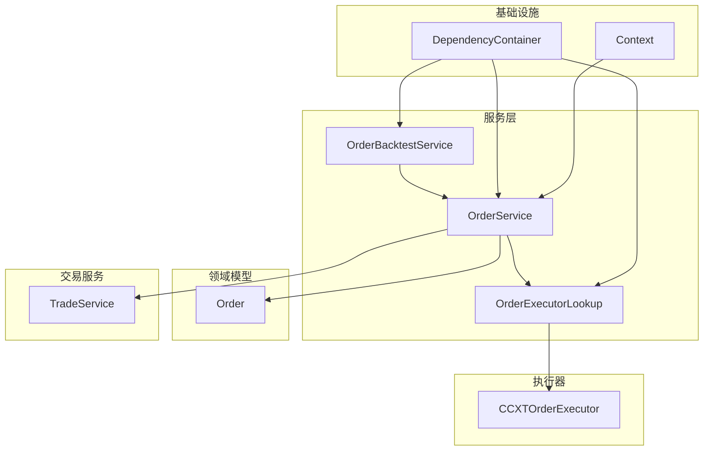
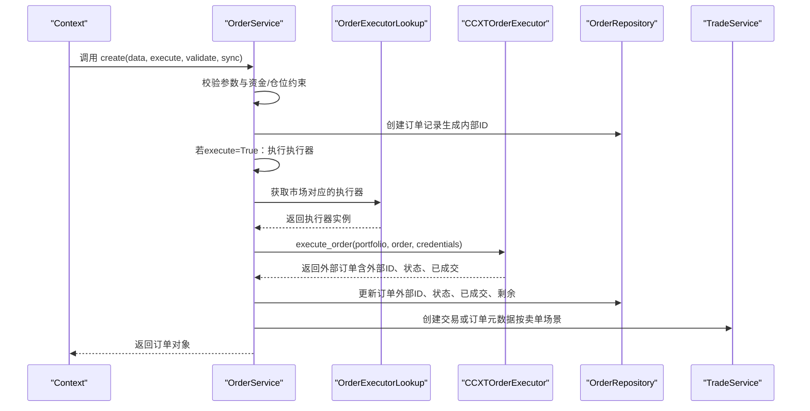
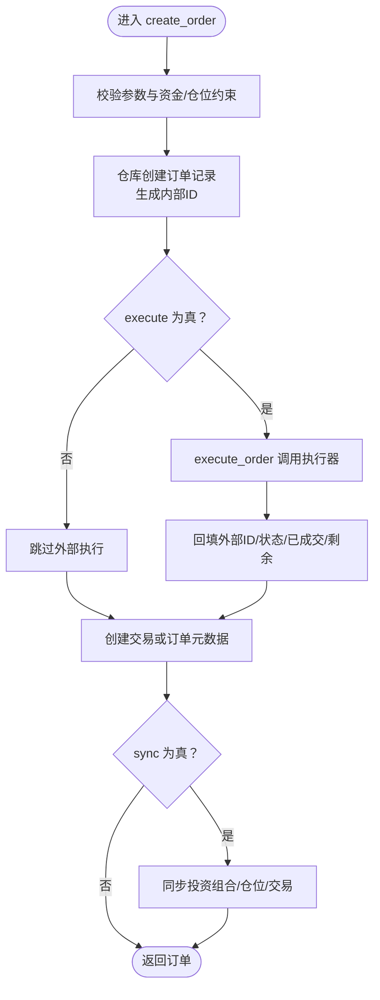
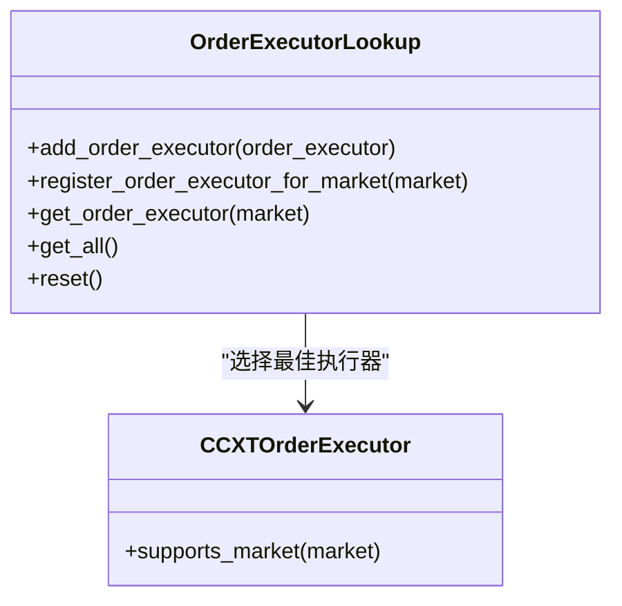
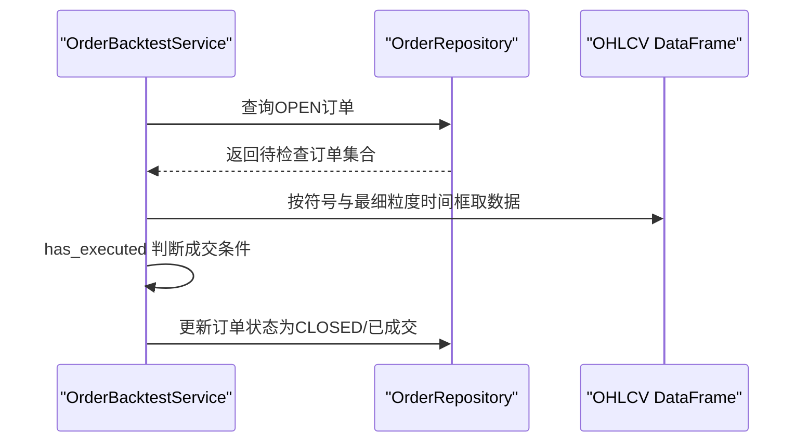
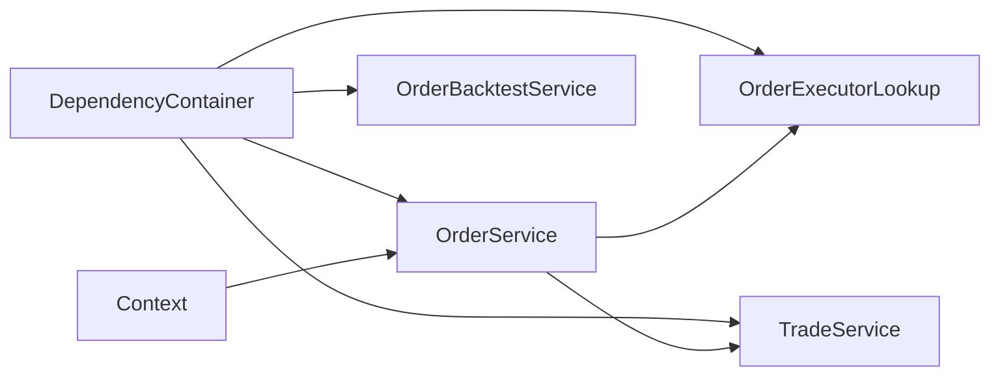

# 订单服务

<cite>
**本文引用的文件**
- [order_service.py](file://investing_algorithm_framework/services/order_service/order_service.py)
- [order_executor_lookup.py](file://investing_algorithm_framework/services/order_service/order_executor_lookup.py)
- [order_backtest_service.py](file://investing_algorithm_framework/services/order_service/order_backtest_service.py)
- [trade_service.py](file://investing_algorithm_framework/services/trade_service/trade_service.py)
- [ccxt_order_executor.py](file://investing_algorithm_framework/infrastructure/order_executors/ccxt_order_executor.py)
- [order.py](file://investing_algorithm_framework/domain/models/order/order.py)
- [dependency_container.py](file://investing_algorithm_framework/dependency_container.py)
- [context.py](file://investing_algorithm_framework/app/context.py)
- [test_order_repository.py](file://tests/infrastructure/repositories/orders/test_order_repository.py)
</cite>

## 目录
1. [简介](#简介)
2. [项目结构](#项目结构)
3. [核心组件](#核心组件)
4. [架构总览](#架构总览)
5. [详细组件分析](#详细组件分析)
6. [依赖关系分析](#依赖关系分析)
7. [性能考量](#性能考量)
8. [故障排查指南](#故障排查指南)
9. [结论](#结论)
10. [附录](#附录)

## 简介
本文件系统性梳理订单服务（OrderService）在该投资算法框架中的职责与实现，重点说明其作为订单管理协调者的角色：通过OrderExecutorLookup选择合适的外部执行器，完成订单创建、执行、状态同步与生命周期管理；并阐述与交易服务（TradeService）、投资组合服务、策略引擎等组件的交互方式。同时给出create_order、get_order、list_orders等核心方法的调用流程与数据流图示，帮助读者快速理解服务层如何处理订单状态更新、错误处理与回测场景下的模拟执行。

## 项目结构
围绕订单服务的关键模块组织如下：
- 服务层：OrderService、OrderBacktestService、OrderExecutorLookup
- 执行器：CCXTOrderExecutor（外部交易所对接）
- 领域模型：Order
- 交易服务：TradeService（负责交易、止盈止损元数据与收益追踪）
- 容器与上下文：DependencyContainer（依赖注入）、Context（应用上下文查询入口）

图表来源
- [order_service.py](file://investing_algorithm_framework/services/order_service/order_service.py#L1-L120)
- [order_backtest_service.py](file://investing_algorithm_framework/services/order_service/order_backtest_service.py#L1-L60)
- [order_executor_lookup.py](file://investing_algorithm_framework/services/order_service/order_executor_lookup.py#L1-L60)
- [ccxt_order_executor.py](file://investing_algorithm_framework/infrastructure/order_executors/ccxt_order_executor.py#L1-L60)
- [trade_service.py](file://investing_algorithm_framework/services/trade_service/trade_service.py#L1-L60)
- [dependency_container.py](file://investing_algorithm_framework/dependency_container.py#L100-L120)
- [context.py](file://investing_algorithm_framework/app/context.py#L549-L601)

章节来源
- [order_service.py](file://investing_algorithm_framework/services/order_service/order_service.py#L1-L120)
- [dependency_container.py](file://investing_algorithm_framework/dependency_container.py#L100-L120)

## 核心组件
- OrderService：订单管理协调者，负责创建、执行、校验、同步与取消订单；维护订单与交易、仓位、投资组合之间的状态一致性。
- OrderBacktestService：回测模式下的订单服务，覆盖创建、执行、挂单检查与取消逻辑，使用OHLCV数据判断是否成交。
- OrderExecutorLookup：基于市场的执行器查找表，O(1)时间复杂度定位对应执行器。
- CCXTOrderExecutor：基于CCXT库对接具体交易所，支持限价买卖下单与撤单。
- TradeService：交易生命周期管理，负责将买入订单映射为交易、跟踪止盈止损元数据、计算收益与净值。
- Order模型：统一的订单数据结构，包含价格、数量、已成交、剩余、手续费、外部ID等字段。

章节来源
- [order_service.py](file://investing_algorithm_framework/services/order_service/order_service.py#L1-L120)
- [order_backtest_service.py](file://investing_algorithm_framework/services/order_service/order_backtest_service.py#L1-L60)
- [order_executor_lookup.py](file://investing_algorithm_framework/services/order_service/order_executor_lookup.py#L1-L60)
- [ccxt_order_executor.py](file://investing_algorithm_framework/infrastructure/order_executors/ccxt_order_executor.py#L1-L60)
- [trade_service.py](file://investing_algorithm_framework/services/trade_service/trade_service.py#L1-L60)
- [order.py](file://investing_algorithm_framework/domain/models/order/order.py#L1-L120)

## 架构总览
OrderService作为协调者，通过以下路径完成订单生命周期管理：
- 创建阶段：校验参数与资金/仓位约束，必要时创建或更新仓位，生成内部订单ID，按需执行外部下单。
- 执行阶段：根据订单所属市场，从OrderExecutorLookup中获取对应执行器，调用CCXTOrderExecutor执行下单，回填外部ID与状态。
- 同步阶段：根据订单状态变化（成交、取消、过期、拒绝），联动更新交易、仓位与投资组合的未分配金额、成本与收益。
- 回测阶段：OrderBacktestService以OHLCV数据驱动挂单检查与成交模拟，无需真实交易所交互。

图表来源
- [order_service.py](file://investing_algorithm_framework/services/order_service/order_service.py#L61-L196)
- [order_executor_lookup.py](file://investing_algorithm_framework/services/order_service/order_executor_lookup.py#L76-L90)
- [ccxt_order_executor.py](file://investing_algorithm_framework/infrastructure/order_executors/ccxt_order_executor.py#L18-L77)
- [trade_service.py](file://investing_algorithm_framework/services/trade_service/trade_service.py#L44-L84)

## 详细组件分析

### OrderService 组件分析
- 角色与职责
  - 协调订单创建、执行、校验与同步，维护订单与交易、仓位、投资组合的一致性。
  - 通过OrderExecutorLookup选择执行器，调用CCXTOrderExecutor完成真实下单。
  - 提供挂单检查、取消、状态变更后的资产与收益同步。
- 关键方法
  - create(data, execute=True, validate=True, sync=True)：创建订单并可选执行与同步。
  - update(object_id, data)：增量同步订单状态变化（成交、取消、过期、拒绝）。
  - execute_order(order, portfolio)：调用执行器执行外部下单，回填外部ID与状态。
  - validate_order(...)：校验买卖方向、限价有效性、资金与仓位约束。
  - check_pending_orders(portfolio=None)：轮询挂单状态并更新本地记录。
  - cancel_order(order)：调用执行器撤单并回写状态。
  - 生命周期同步方法：_sync_with_buy_order_filled/_sell、_sync_with_buy_order_cancelled/_expired/_rejected/_failed等。
- 数据与状态
  - 订单字段：目标币种、交易币种、方向、类型、价格、数量、已成交、剩余、外部ID、手续费、成本等。
  - 状态机：CREATED、OPEN、CLOSED、CANCELED、EXPIRED、REJECTED。
- 错误处理
  - 对不支持的订单类型抛出异常。
  - 对卖单无持仓、卖超、交易币种不匹配等情况进行前置校验。
  - 执行器异常捕获并转换为业务异常，便于上层统一处理。

图表来源
- [order_service.py](file://investing_algorithm_framework/services/order_service/order_service.py#L61-L196)
- [order_service.py](file://investing_algorithm_framework/services/order_service/order_service.py#L256-L291)
- [order_service.py](file://investing_algorithm_framework/services/order_service/order_service.py#L445-L498)

章节来源
- [order_service.py](file://investing_algorithm_framework/services/order_service/order_service.py#L61-L196)
- [order_service.py](file://investing_algorithm_framework/services/order_service/order_service.py#L198-L255)
- [order_service.py](file://investing_algorithm_framework/services/order_service/order_service.py#L256-L291)
- [order_service.py](file://investing_algorithm_framework/services/order_service/order_service.py#L292-L398)
- [order_service.py](file://investing_algorithm_framework/services/order_service/order_service.py#L399-L431)
- [order_service.py](file://investing_algorithm_framework/services/order_service/order_service.py#L499-L517)
- [order_service.py](file://investing_algorithm_framework/services/order_service/order_service.py#L518-L628)
- [order_service.py](file://investing_algorithm_framework/services/order_service/order_service.py#L629-L800)

### OrderExecutorLookup 组件分析
- 角色与职责
  - 基于市场名O(1)查找对应执行器，支持多执行器按优先级排序后择优。
  - 注册阶段校验市场支持情况，缺失时抛出配置异常。
- 关键方法
  - add_order_executor(order_executor)
  - register_order_executor_for_market(market)
  - get_order_executor(market)
  - get_all()
  - reset()

图表来源
- [order_executor_lookup.py](file://investing_algorithm_framework/services/order_service/order_executor_lookup.py#L1-L111)
- [ccxt_order_executor.py](file://investing_algorithm_framework/infrastructure/order_executors/ccxt_order_executor.py#L190-L201)

章节来源
- [order_executor_lookup.py](file://investing_algorithm_framework/services/order_service/order_executor_lookup.py#L1-L111)

### OrderBacktestService 组件分析
- 角色与职责
  - 在回测模式下替代真实执行，使用OHLCV数据判断挂单是否成交，模拟订单状态推进。
- 关键方法
  - create(data, execute=True, validate=True, sync=True)：设置created_at/updated_at为回测时间点。
  - execute_order(order, portfolio)：直接将订单置为OPEN并初始化剩余量。
  - check_pending_orders(market_data)：按最细粒度时间框筛选OHLCV，判断是否触发成交。
  - cancel_order(order)：将OPEN订单置为CANCELED。
  - has_executed(order, ohlcv_df)：根据低/高点与订单价格判断是否成交。

图表来源
- [order_backtest_service.py](file://investing_algorithm_framework/services/order_service/order_backtest_service.py#L66-L107)
- [order_backtest_service.py](file://investing_algorithm_framework/services/order_service/order_backtest_service.py#L125-L170)

章节来源
- [order_backtest_service.py](file://investing_algorithm_framework/services/order_service/order_backtest_service.py#L1-L179)

### TradeService 与订单生命周期协同
- 买入订单到交易的映射：create_trade_from_buy_order，按已成交部分创建交易并设置状态。
- 卖单场景的元数据管理：create_order_metadata_with_trade_context，将卖单与交易、止盈止损关联，用于后续状态回滚与收益计算。
- 成交同步：update_trade_with_buy_order、update_trade_with_filled_sell_order、update_trade_with_removed_sell_order，维护交易可用金额、成本、净收益与止盈止损状态。

章节来源
- [trade_service.py](file://investing_algorithm_framework/services/trade_service/trade_service.py#L44-L84)
- [trade_service.py](file://investing_algorithm_framework/services/trade_service/trade_service.py#L339-L449)
- [trade_service.py](file://investing_algorithm_framework/services/trade_service/trade_service.py#L537-L601)
- [trade_service.py](file://investing_algorithm_framework/services/trade_service/trade_service.py#L602-L703)

### Order 模型与数据结构
- 字段与约束：目标币种、交易币种、方向、类型、价格、数量、已成交、剩余、外部ID、手续费、成本、时间戳等。
- 工具方法：to_dict/from_dict/from_ccxt_order，确保跨组件序列化与外部订单转换一致。
- 计算辅助：get_size（订单金额规模）、available_amount等。

章节来源
- [order.py](file://investing_algorithm_framework/domain/models/order/order.py#L1-L120)
- [order.py](file://investing_algorithm_framework/domain/models/order/order.py#L219-L307)
- [order.py](file://investing_algorithm_framework/domain/models/order/order.py#L308-L352)
- [order.py](file://investing_algorithm_framework/domain/models/order/order.py#L376-L385)

## 依赖关系分析
- 依赖注入
  - DependencyContainer将OrderService、OrderBacktestService、OrderExecutorLookup、TradeService等注册为工厂或单例，确保运行时按需注入。
- 上下文查询
  - Context提供get_order/get_orders接口，封装查询参数（如reference_id、target_symbol、status、order_type、order_side、market），最终委托OrderService完成查询。
- 组件耦合
  - OrderService与TradeService、PositionService、PortfolioRepository存在强耦合，用于状态同步与资产调整。
  - OrderService与OrderExecutorLookup解耦外部执行器选择，便于扩展新市场。

图表来源
- [dependency_container.py](file://investing_algorithm_framework/dependency_container.py#L100-L120)
- [context.py](file://investing_algorithm_framework/app/context.py#L549-L601)

章节来源
- [dependency_container.py](file://investing_algorithm_framework/dependency_container.py#L100-L120)
- [context.py](file://investing_algorithm_framework/app/context.py#L549-L601)

## 性能考量
- 查找与调度
  - OrderExecutorLookup采用字典存储O(1)查找，注册阶段按优先级排序，避免重复扫描。
- 批量轮询
  - check_pending_orders遍历OPEN订单，建议结合市场数据索引与最小粒度时间框减少DataFrame过滤开销。
- 写入与同步
  - 多处更新投资组合与交易，建议批量提交或合并事务以降低数据库压力。
- 回测效率
  - OrderBacktestService对OHLCV数据的过滤与布尔判断为线性扫描，建议在数据预处理阶段建立索引或分桶加速。

[本节为通用指导，不直接分析具体文件]

## 故障排查指南
- 常见异常与定位
  - 不支持的订单类型：validate_order会抛出异常，检查order_type是否为LIMIT。
  - 卖单无持仓/卖超：validate_sell_order会校验仓位与交易币种，确认position是否存在且数量足够。
  - 买入资金不足：validate_limit_order校验未分配资金是否覆盖总价，检查trading_symbol与portfolio配置。
  - 执行器不可用：OrderExecutorLookup在未注册市场时抛出配置异常，确认已注册对应执行器。
  - CCXT凭证缺失：CCXTOrderExecutor在缺少API/Secret时抛出异常，检查MarketCredential配置。
- 日志与可观测性
  - OrderService在执行前后记录日志，便于定位外部执行失败与状态回填问题。
- 回测验证
  - 使用测试仓库验证订单创建与查询行为，确保created_at/updated_at为UTC且排序正确。

章节来源
- [order_service.py](file://investing_algorithm_framework/services/order_service/order_service.py#L292-L398)
- [order_executor_lookup.py](file://investing_algorithm_framework/services/order_service/order_executor_lookup.py#L64-L75)
- [ccxt_order_executor.py](file://investing_algorithm_framework/infrastructure/order_executors/ccxt_order_executor.py#L148-L188)
- [test_order_repository.py](file://tests/infrastructure/repositories/orders/test_order_repository.py#L60-L83)
- [test_order_repository.py](file://tests/infrastructure/repositories/orders/test_order_repository.py#L118-L132)

## 结论
OrderService通过清晰的职责划分与强健的校验机制，实现了订单生命周期的完整闭环：从创建、执行、同步到取消与回测模拟。借助OrderExecutorLookup与CCXTOrderExecutor，系统具备良好的扩展性与可移植性；配合TradeService的交易与止盈止损元数据管理，能够准确追踪收益与风险。建议在生产环境中关注执行器注册、凭证配置与回测数据质量，以确保订单状态与资产数据的准确性与时效性。

[本节为总结性内容，不直接分析具体文件]

## 附录

### API与调用示例（路径指引）
- 创建订单
  - 入口：[create_order](file://investing_algorithm_framework/services/order_service/order_service.py#L61-L196)
  - 执行器选择：[get_order_executor](file://investing_algorithm_framework/services/order_service/order_executor_lookup.py#L76-L90)
  - 外部执行：[execute_order](file://investing_algorithm_framework/infrastructure/order_executors/ccxt_order_executor.py#L18-L77)
- 获取订单
  - 上下文查询：[get_order](file://investing_algorithm_framework/app/context.py#L549-L601)
  - 仓库查询：参考测试用例路径
    - [按ID查询](file://tests/infrastructure/repositories/orders/test_order_repository.py#L79-L83)
    - [按创建时间排序](file://tests/infrastructure/repositories/orders/test_order_repository.py#L118-L132)
- 列举订单
  - 上下文列表：[get_orders](file://investing_algorithm_framework/app/context.py#L578-L601)
- 回测挂单检查
  - [check_pending_orders](file://investing_algorithm_framework/services/order_service/order_backtest_service.py#L66-L107)
  - [has_executed](file://investing_algorithm_framework/services/order_service/order_backtest_service.py#L125-L170)

### 服务间交互要点
- 订单创建后，若execute=True，OrderService会调用执行器并回填外部状态；随后根据订单方向决定是否创建交易或订单元数据。
- 订单状态变更（成交/取消/过期/拒绝）由OrderService统一同步至交易、仓位与投资组合，确保资产与收益数据一致。
- 回测模式下，OrderBacktestService接管执行与挂单检查，避免真实交易所依赖。

[本节为概念性说明，不直接分析具体文件]