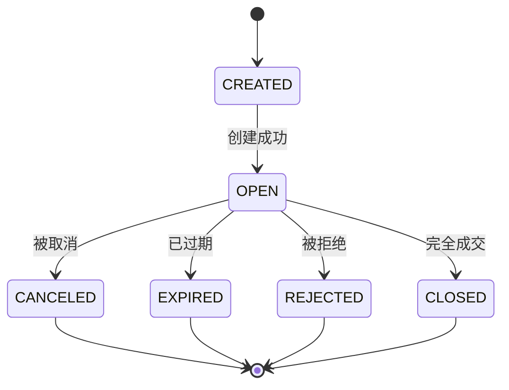
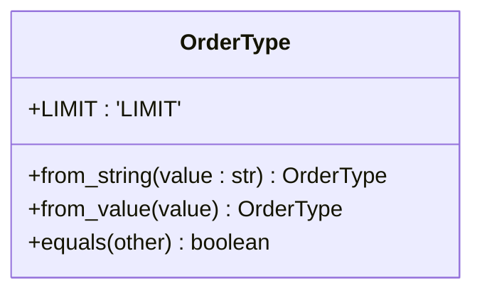
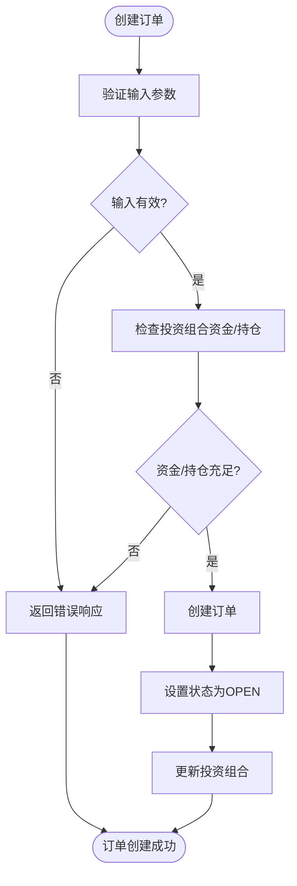
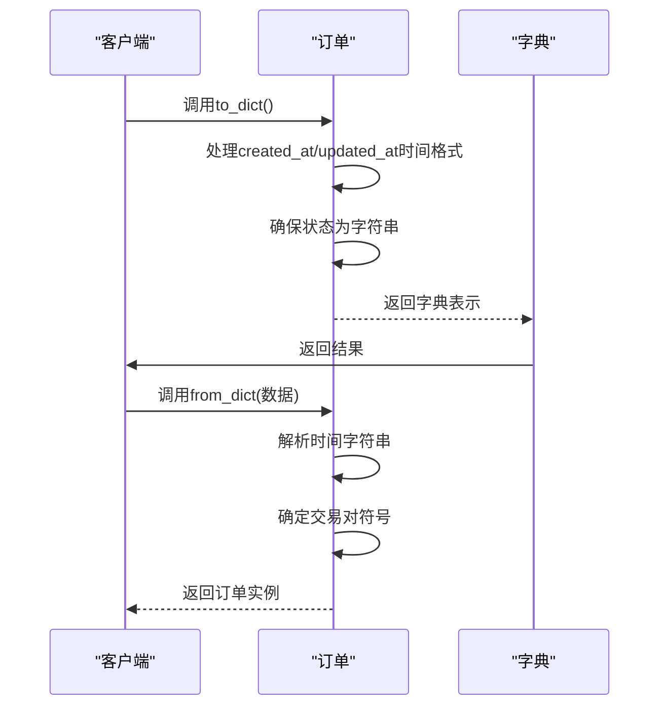
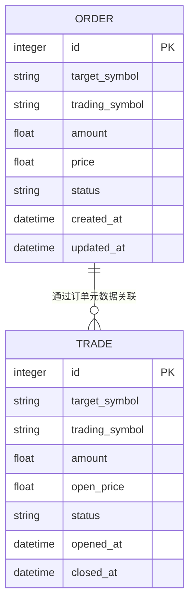
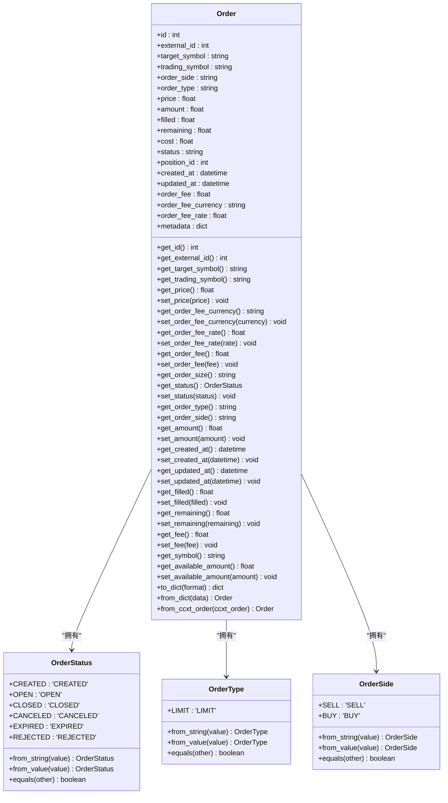

# 订单模型

<cite>
**本文档中引用的文件**   
- [order.py](file://investing_algorithm_framework/domain/models/order/order.py)
- [order_status.py](file://investing_algorithm_framework/domain/models/order/order_status.py)
- [order_type.py](file://investing_algorithm_framework/domain/models/order/order_type.py)
- [order_side.py](file://investing_algorithm_framework/domain/models/order/order_side.py)
- [order_service.py](file://investing_algorithm_framework/services/order_service/order_service.py)
- [trade_service.py](file://investing_algorithm_framework/services/trade_service/trade_service.py)
- [SQLOrder.py](file://investing_algorithm_framework/infrastructure/models/order/order.py)
- [order_trade_association.py](file://investing_algorithm_framework/infrastructure/models/order_trade_association.py)
</cite>

## 目录
1. [简介](#简介)
2. [订单模型字段定义](#订单模型字段定义)
3. [订单状态枚举](#订单状态枚举)
4. [订单类型枚举](#订单类型枚举)
5. [订单业务规则与验证逻辑](#订单业务规则与验证逻辑)
6. [订单创建与序列化](#订单创建与序列化)
7. [订单与投资组合、交易的关系](#订单与投资组合、交易的关系)
8. [订单模型类图](#订单模型类图)

## 简介
订单模型是投资算法框架中的核心组件，用于表示交易机器人中的订单。该模型封装了订单的所有关键属性，包括标识、交易对、数量、价格、状态、类型、创建时间等。订单模型不仅用于在系统内部表示订单，还用于与外部交易所进行交互，以及在回测环境中模拟交易行为。本文档将详细介绍订单模型的实现，包括字段定义、状态流转、类型分类、业务规则、验证逻辑以及与其他核心组件的关系。

## 订单模型字段定义

订单模型包含以下核心字段：

- **id**: 订单的唯一标识符，由系统自动生成
- **external_id**: 外部交易所的订单ID，用于与外部系统同步
- **target_symbol**: 目标交易符号，表示要购买或出售的资产（如BTC、ETH）
- **trading_symbol**: 交易符号，表示用于交易的计价货币（如EUR、USD）
- **symbol**: 交易对，由目标符号和交易符号组成（如BTC/EUR）
- **order_side**: 订单方向，表示买入或卖出
- **order_type**: 订单类型，表示订单的执行方式（如限价单、市价单）
- **status**: 订单状态，表示订单的当前生命周期阶段
- **price**: 订单价格，表示每单位资产的交易价格
- **amount**: 订单数量，表示要交易的资产数量
- **filled**: 已成交数量，表示已经执行的订单数量
- **remaining**: 剩余数量，表示尚未执行的订单数量
- **cost**: 订单成本，表示订单的总成本
- **fee**: 交易费用
- **order_fee**: 订单费用
- **order_fee_currency**: 订单费用货币
- **order_fee_rate**: 订单费用费率
- **position_id**: 关联的持仓ID
- **created_at**: 订单创建时间，使用UTC时区
- **updated_at**: 订单更新时间，使用UTC时区
- **metadata**: 元数据，用于存储额外的订单相关信息

这些字段共同构成了订单的完整表示，支持系统对订单的全生命周期管理。

**Section sources**
- [order.py](file://investing_algorithm_framework/domain/models/order/order.py#L19-L385)

## 订单状态枚举

订单状态枚举（OrderStatus）定义了订单在其生命周期中可能处于的不同状态。这些状态形成了一个状态流转图，反映了订单从创建到最终完成或取消的完整过程。



**Diagram sources**
- [order_status.py](file://investing_algorithm_framework/domain/models/order/order_status.py#L4-L10)

状态说明：

- **CREATED (已创建)**: 订单已创建但尚未提交到交易所
- **OPEN (开放)**: 订单已提交到交易所，正在等待成交
- **CLOSED (已关闭)**: 订单已完全成交
- **CANCELED (已取消)**: 订单已被用户或系统取消
- **EXPIRED (已过期)**: 订单已过期，通常是因为设置了有效期
- **REJECTED (被拒绝)**: 订单被交易所拒绝

订单状态的流转受到严格的业务规则约束。例如，一个订单只能从CREATED状态变为OPEN状态，而不能直接变为CLOSED状态。系统通过`OrderStatus.from_value()`和`OrderStatus.equals()`等静态方法来确保状态转换的正确性和一致性。

**Section sources**
- [order_status.py](file://investing_algorithm_framework/domain/models/order/order_status.py#L4-L38)

## 订单类型枚举

订单类型枚举（OrderType）定义了不同类型的订单，每种类型对应不同的执行策略和市场行为。



**Diagram sources**
- [order_type.py](file://investing_algorithm_framework/domain/models/order/order_type.py#L4-L31)

当前实现中包含以下订单类型：

- **LIMIT (限价单)**: 指定一个特定价格的订单，只有当市场价格达到或优于指定价格时才会成交。限价单允许交易者以期望的价格或更好的价格进行交易。

系统通过`OrderType.from_value()`方法支持从字符串值创建订单类型实例，确保了类型安全和一致性。虽然当前实现只包含LIMIT类型，但枚举结构为未来扩展其他类型（如市价单、止损单等）提供了基础。

**Section sources**
- [order_type.py](file://investing_algorithm_framework/domain/models/order/order_type.py#L4-L31)

## 订单业务规则与验证逻辑

订单系统实施了严格的业务规则和验证逻辑，以确保交易的完整性和系统的稳定性。这些规则在订单创建和更新时通过订单服务（OrderService）进行验证。

### 买入订单验证
对于买入订单，系统验证以下规则：
- 交易符号必须与投资组合的交易符号匹配
- 投资组合中必须有足够的未分配资金来执行订单
- 订单金额必须为正数

### 卖出订单验证
对于卖出订单，系统验证以下规则：
- 必须存在对应的目标资产持仓
- 订单数量不能超过持仓数量
- 交易符号必须与投资组合的交易符号匹配

### 限价单验证
对于限价单，系统验证价格和数量的精度，确保符合交易所的要求。系统还实现了`round_down()`方法来处理数值精度问题，确保订单金额和价格符合交易所的精度要求。



**Diagram sources**
- [order_service.py](file://investing_algorithm_framework/services/order_service/order_service.py#L292-L398)

这些验证逻辑在`OrderService.validate_order()`、`validate_buy_order()`、`validate_sell_order()`和`validate_limit_order()`方法中实现，确保了所有订单都符合业务规则。

**Section sources**
- [order_service.py](file://investing_algorithm_framework/services/order_service/order_service.py#L292-L398)

## 订单创建与序列化

订单可以通过多种方式创建和序列化，支持系统内部操作和外部交互。

### 订单创建
订单可以通过`OrderService.create()`方法创建，该方法接受包含订单数据的字典。创建过程包括：
1. 验证订单数据
2. 创建订单实例
3. 执行订单（可选）
4. 同步投资组合状态（可选）

```python
order_data = {
    "target_symbol": "BTC",
    "trading_symbol": "EUR",
    "amount": 0.5,
    "price": 50000,
    "order_side": "BUY",
    "order_type": "LIMIT",
    "portfolio_id": 1
}
order = order_service.create(order_data)
```

### 订单序列化
订单提供了`to_dict()`和`from_dict()`方法用于序列化和反序列化：



**Diagram sources**
- [order.py](file://investing_algorithm_framework/domain/models/order/order.py#L219-L306)

`to_dict()`方法将订单对象转换为字典表示，支持可选的日期时间格式化。`from_dict()`方法从字典数据创建订单实例，自动处理时间解析和符号拆分。此外，系统还支持从CCXT订单对象创建订单实例，通过`from_ccxt_order()`方法实现跨平台兼容性。

**Section sources**
- [order.py](file://investing_algorithm_framework/domain/models/order/order.py#L219-L306)

## 订单与投资组合、交易的关系

订单模型与投资组合（Portfolio）和交易（Trade）模型之间存在紧密的关系，形成了完整的交易执行和跟踪体系。

### 订单与投资组合的关系
每个订单都关联到一个特定的投资组合，通过`portfolio_id`字段建立连接。当订单执行时，系统会更新投资组合的状态：
- 买入订单：减少投资组合的未分配资金，增加总交易成本和交易量
- 卖出订单：增加投资组合的未分配资金，增加总交易量

投资组合服务负责维护这些关系，并在订单状态变化时同步投资组合的余额和持仓。

### 订单与交易的关系
订单与交易之间存在多对多的关系，通过关联表`order_trade_association`实现：



**Diagram sources**
- [order_trade_association.py](file://investing_algorithm_framework/infrastructure/models/order_trade_association.py#L5-L10)
- [trade_service.py](file://investing_algorithm_framework/services/trade_service/trade_service.py#L44-L83)

具体关系如下：
- **买入订单与交易**: 当一个买入订单成功执行时，系统会创建一个新的交易记录。`create_trade_from_buy_order()`方法负责这一转换过程。
- **卖出订单与交易**: 当一个卖出订单执行时，它可能关闭一个或多个现有的交易。系统通过订单元数据（OrderMetadata）跟踪每个卖出订单与被关闭交易之间的关系，包括关闭的数量。

交易服务（TradeService）负责管理这些复杂的关系，确保交易生命周期的完整跟踪。当订单状态发生变化时，交易服务会相应地更新关联的交易状态，如将部分成交的交易标记为已关闭。

**Section sources**
- [order_trade_association.py](file://investing_algorithm_framework/infrastructure/models/order_trade_association.py#L5-L10)
- [trade_service.py](file://investing_algorithm_framework/services/trade_service/trade_service.py#L44-L83)

## 订单模型类图



**Diagram sources**
- [order.py](file://investing_algorithm_framework/domain/models/order/order.py#L19-L385)
- [order_status.py](file://investing_algorithm_framework/domain/models/order/order_status.py#L4-L10)
- [order_type.py](file://investing_algorithm_framework/domain/models/order/order_type.py#L4-L31)
- [order_side.py](file://investing_algorithm_framework/domain/models/order/order_side.py#L4-L37)

**Section sources**
- [order.py](file://investing_algorithm_framework/domain/models/order/order.py#L19-L385)
- [order_status.py](file://investing_algorithm_framework/domain/models/order/order_status.py#L4-L38)
- [order_type.py](file://investing_algorithm_framework/domain/models/order/order_type.py#L4-L31)
- [order_side.py](file://investing_algorithm_framework/domain/models/order/order_side.py#L4-L37)