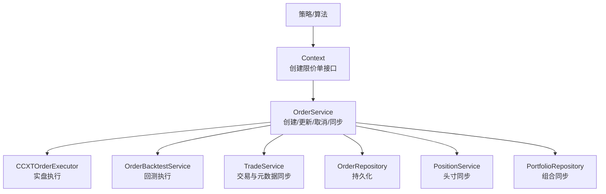
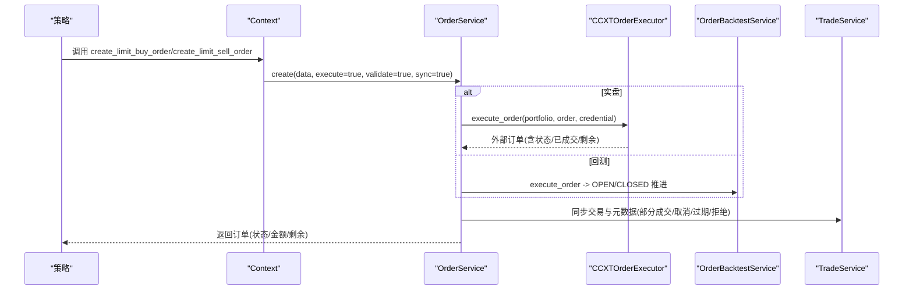
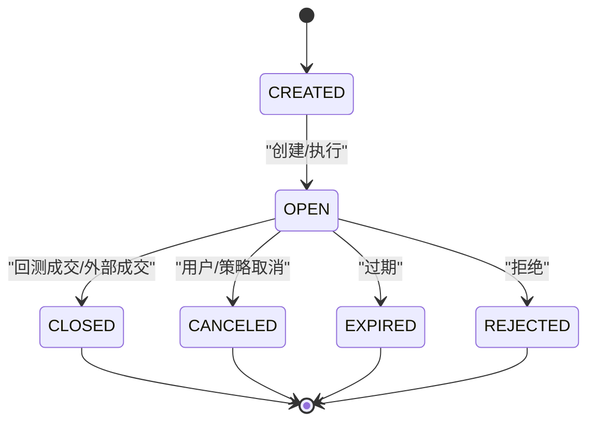
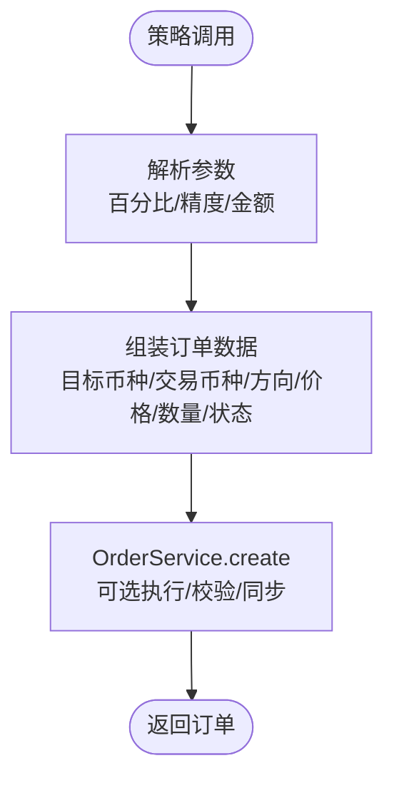
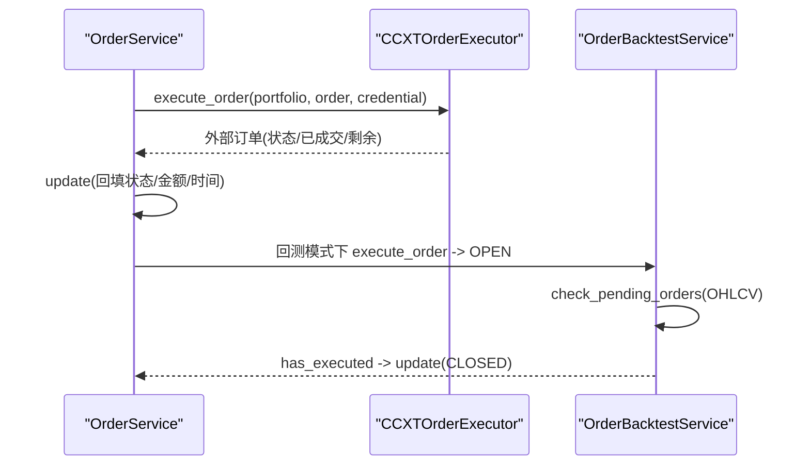
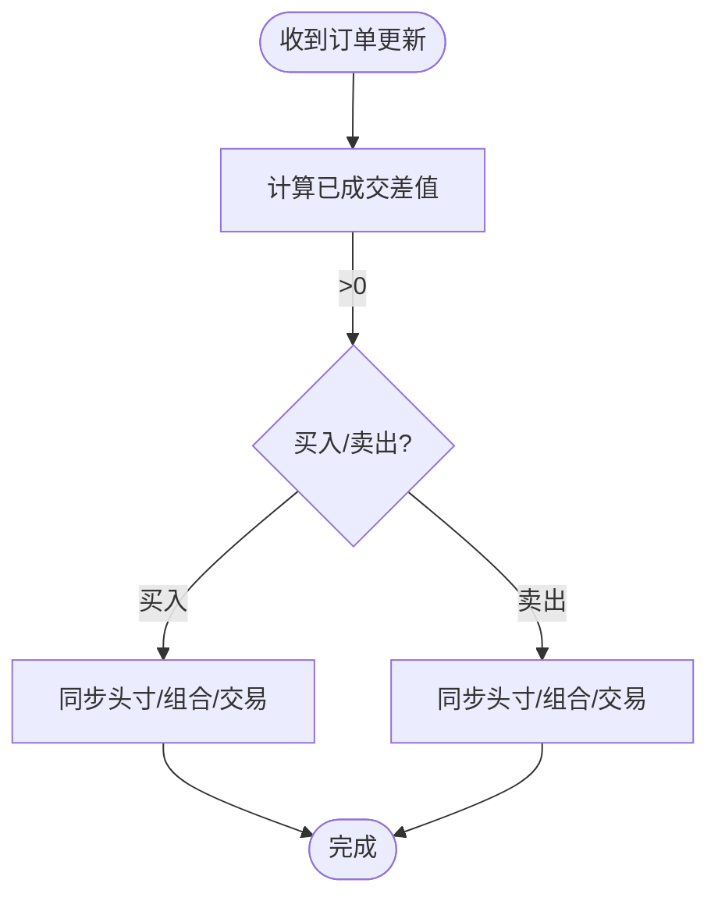
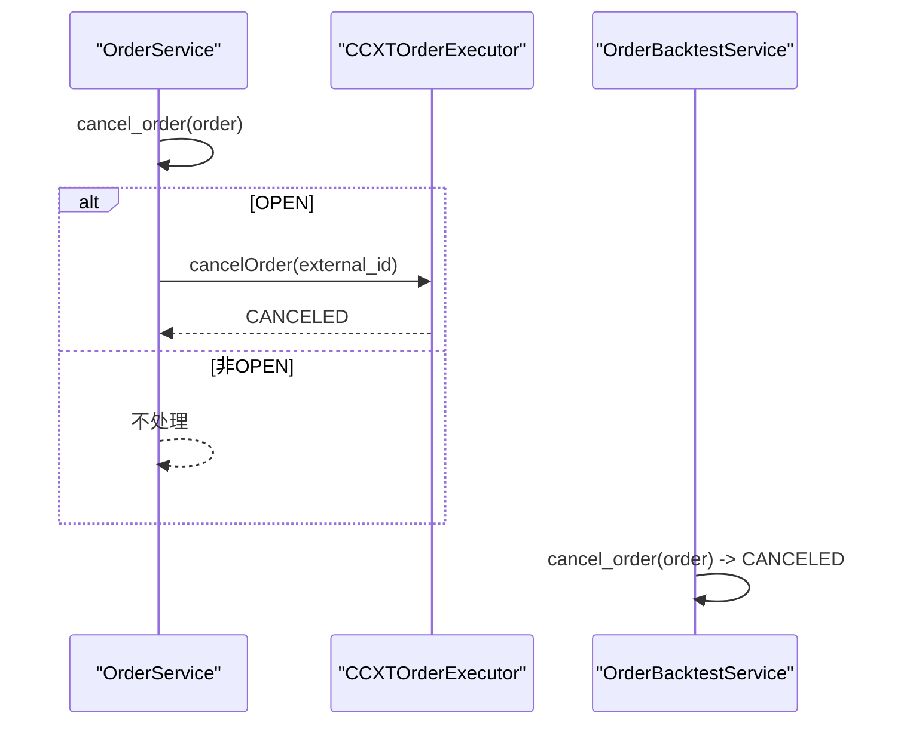
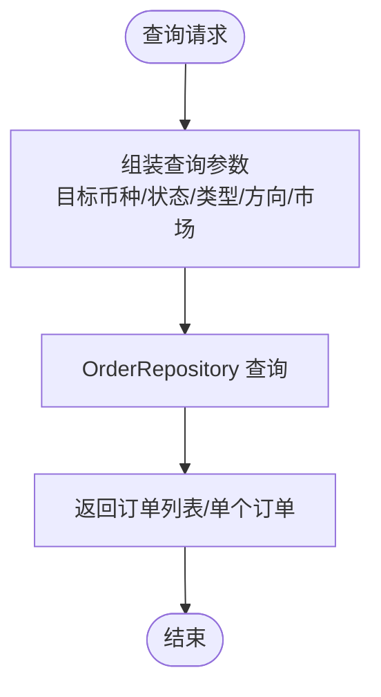
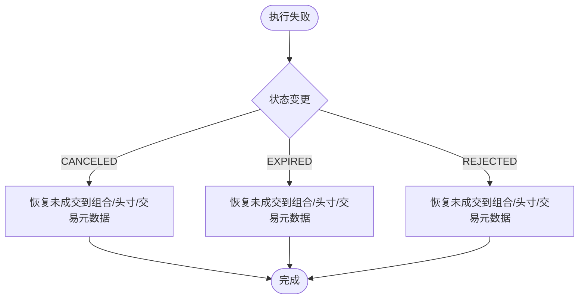
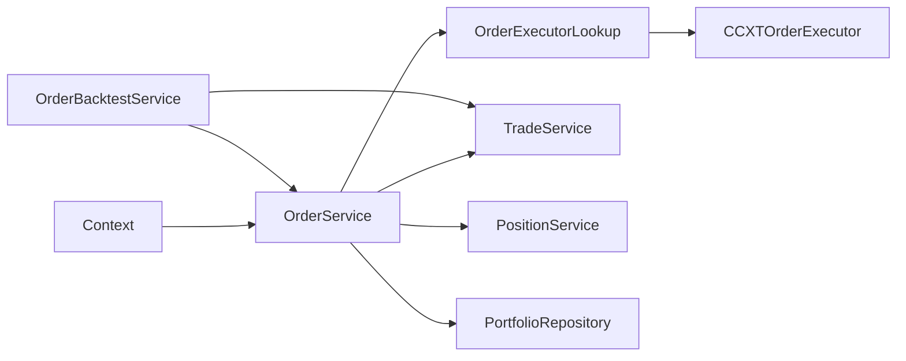

# 订单生命周期

<cite>
**本文引用的文件列表**
- [order_status.py](file://investing_algorithm_framework/domain/models/order/order_status.py)
- [order.py](file://investing_algorithm_framework/domain/models/order/order.py)
- [context.py](file://investing_algorithm_framework/app/context.py)
- [order_service.py](file://investing_algorithm_framework/services/order_service/order_service.py)
- [order_backtest_service.py](file://investing_algorithm_framework/services/order_service/order_backtest_service.py)
- [ccxt_order_executor.py](file://investing_algorithm_framework/infrastructure/order_executors/ccxt_order_executor.py)
- [trade_service.py](file://investing_algorithm_framework/services/trade_service/trade_service.py)
- [test_order_service.py](file://tests/services/test_order_service.py)
- [test_order_backtest_service.py](file://tests/services/test_order_backtest_service.py)
- [test_trade_service.py](file://tests/services/test_trade_service.py)
- [test_get_unfilled_buy_value.py](file://tests/app/algorithm/test_get_unfilled_buy_value.py)
- [test_get_open_trades.py](file://tests/app/algorithm/test_get_open_trades.py)
- [order_repository.py](file://investing_algorithm_framework/infrastructure/repositories/order_repository.py)
</cite>

## 目录
1. [引言](#引言)
2. [项目结构与入口](#项目结构与入口)
3. [核心组件](#核心组件)
4. [架构总览](#架构总览)
5. [详细组件分析](#详细组件分析)
6. [依赖关系分析](#依赖关系分析)
7. [性能与并发特性](#性能与并发特性)
8. [故障排查与异常处理](#故障排查与异常处理)
9. [结论](#结论)
10. [附录：状态转换图与查询示例](#附录状态转换图与查询示例)

## 引言
本文件面向“订单生命周期”主题，系统化梳理从策略创建订单、执行与异步更新、部分成交与取消、到最终完成或终止的全流程。重点覆盖以下内容：
- 订单状态集合与转换条件（CREATED、OPEN、CLOSED、CANCELED、EXPIRED、REJECTED）
- 策略通过 create_limit_buy_order/create_limit_sell_order 等方法创建订单的路径
- 系统如何处理订单的异步更新（实盘与回测）
- 部分成交的处理机制与订单取消流程
- 订单状态监控与查询接口
- 订单执行失败时的处理策略

## 项目结构与入口
- 策略侧入口位于上下文对象中，提供 create_limit_buy_order、create_limit_sell_order 等便捷方法，封装参数解析、校验与调用 OrderService 的 create 流程。
- 订单实体与状态枚举位于 domain 层；服务层负责业务编排（创建、更新、取消、同步）；执行器负责对接外部交易所；回测服务在回测模式下模拟执行与状态推进。

图表来源
- [context.py](file://investing_algorithm_framework/app/context.py#L269-L415)
- [order_service.py](file://investing_algorithm_framework/services/order_service/order_service.py#L61-L196)
- [ccxt_order_executor.py](file://investing_algorithm_framework/infrastructure/order_executors/ccxt_order_executor.py#L18-L80)
- [order_backtest_service.py](file://investing_algorithm_framework/services/order_service/order_backtest_service.py#L12-L64)

章节来源
- [context.py](file://investing_algorithm_framework/app/context.py#L269-L415)
- [order_service.py](file://investing_algorithm_framework/services/order_service/order_service.py#L61-L196)

## 核心组件
- 订单状态枚举：定义 CREATED、OPEN、CLOSED、CANCELED、EXPIRED、REJECTED 六种状态及比较工具。
- 订单实体：封装目标/交易币种、方向、类型、价格、数量、已成交、剩余、费用、时间戳等字段，提供 to_dict/from_ccxt_order 等序列化与外部映射能力。
- 上下文 Context：策略侧统一入口，提供 create_limit_buy_order/create_limit_sell_order 等方法，负责参数计算（百分比、精度）、组装订单数据并委托 OrderService 执行。
- 订单服务 OrderService：负责创建、验证、执行、更新、取消、同步（头寸、组合、交易）等核心逻辑。
- 回测服务 OrderBacktestService：在回测模式下推进订单状态（OPEN/CLOSED/CANCELED），基于 OHLCV 数据判断是否成交。
- 执行器 CCXTOrderExecutor：对接 CCXT，实现限价买单/卖单创建与取消，返回外部订单状态并回填至本地订单。
- 交易服务 TradeService：维护订单与交易、止损止盈之间的元数据关联，支持部分成交时对交易元数据的拆分与扣减。

章节来源
- [order_status.py](file://investing_algorithm_framework/domain/models/order/order_status.py#L1-L38)
- [order.py](file://investing_algorithm_framework/domain/models/order/order.py#L1-L120)
- [context.py](file://investing_algorithm_framework/app/context.py#L269-L415)
- [order_service.py](file://investing_algorithm_framework/services/order_service/order_service.py#L198-L255)
- [order_backtest_service.py](file://investing_algorithm_framework/services/order_service/order_backtest_service.py#L12-L64)
- [ccxt_order_executor.py](file://investing_algorithm_framework/infrastructure/order_executors/ccxt_order_executor.py#L18-L80)
- [trade_service.py](file://investing_algorithm_framework/services/trade_service/trade_service.py#L574-L678)

## 架构总览
下面以“策略创建订单—执行—回测/实盘推进—部分成交/取消—最终完成”的主线展示组件交互。

图表来源
- [context.py](file://investing_algorithm_framework/app/context.py#L269-L415)
- [order_service.py](file://investing_algorithm_framework/services/order_service/order_service.py#L256-L290)
- [ccxt_order_executor.py](file://investing_algorithm_framework/infrastructure/order_executors/ccxt_order_executor.py#L18-L80)
- [order_backtest_service.py](file://investing_algorithm_framework/services/order_service/order_backtest_service.py#L57-L107)
- [trade_service.py](file://investing_algorithm_framework/services/trade_service/trade_service.py#L574-L678)

## 详细组件分析

### 订单状态与转换条件
- 状态集合：CREATED、OPEN、CLOSED、CANCELED、EXPIRED、REJECTED。
- 转换条件（基于代码行为归纳）：
  - 创建后默认进入 OPEN（实盘/回测均如此）。
  - 回测：当 OHLCV 中满足“买低<=委托价/卖高>=委托价”时，OPEN 订单被推进为 CLOSED。
  - 取消：回测直接标记为 CANCELED；实盘通过 CCXTOrderExecutor 取消并回写状态。
  - 过期/拒绝：由上层触发或外部状态驱动，服务层在更新时进行相应同步（恢复未成交份额、更新交易元数据等）。

图表来源
- [order_status.py](file://investing_algorithm_framework/domain/models/order/order_status.py#L1-L38)
- [order_backtest_service.py](file://investing_algorithm_framework/services/order_service/order_backtest_service.py#L96-L106)
- [ccxt_order_executor.py](file://investing_algorithm_framework/infrastructure/order_executors/ccxt_order_executor.py#L81-L112)
- [order_service.py](file://investing_algorithm_framework/services/order_service/order_service.py#L232-L253)

章节来源
- [order_status.py](file://investing_algorithm_framework/domain/models/order/order_status.py#L1-L38)
- [order_backtest_service.py](file://investing_algorithm_framework/services/order_service/order_backtest_service.py#L96-L106)
- [ccxt_order_executor.py](file://investing_algorithm_framework/infrastructure/order_executors/ccxt_order_executor.py#L81-L112)
- [order_service.py](file://investing_algorithm_framework/services/order_service/order_service.py#L232-L253)

### 策略创建订单：create_limit_buy_order / create_limit_sell_order
- 参数解析：支持按“资金百分比/头寸百分比/固定金额/交易币种金额/精度”等多种方式计算下单量。
- 组装数据：设置目标币种、交易币种、方向、类型、价格、数量、状态 CREATED、所属组合等。
- 委托执行：调用 OrderService.create，可选执行外部执行器、校验、同步。

图表来源
- [context.py](file://investing_algorithm_framework/app/context.py#L269-L415)
- [order_service.py](file://investing_algorithm_framework/services/order_service/order_service.py#L61-L196)

章节来源
- [context.py](file://investing_algorithm_framework/app/context.py#L269-L415)
- [order_service.py](file://investing_algorithm_framework/services/order_service/order_service.py#L61-L196)

### 订单执行与异步更新
- 实盘：OrderService.execute_order 通过 OrderExecutorLookup 获取 CCXTOrderExecutor，调用 createLimitBuyOrder/createLimitSellOrder，回填外部订单状态/已成交/剩余，并更新 updated_at。
- 回测：OrderBacktestService.execute_order 将订单置为 OPEN；随后 check_pending_orders 基于 OHLCV 判断是否成交，若成交则更新为 CLOSED。

图表来源
- [order_service.py](file://investing_algorithm_framework/services/order_service/order_service.py#L256-L290)
- [ccxt_order_executor.py](file://investing_algorithm_framework/infrastructure/order_executors/ccxt_order_executor.py#L18-L80)
- [order_backtest_service.py](file://investing_algorithm_framework/services/order_service/order_backtest_service.py#L57-L107)

章节来源
- [order_service.py](file://investing_algorithm_framework/services/order_service/order_service.py#L256-L290)
- [order_backtest_service.py](file://investing_algorithm_framework/services/order_service/order_backtest_service.py#L57-L107)
- [ccxt_order_executor.py](file://investing_algorithm_framework/infrastructure/order_executors/ccxt_order_executor.py#L18-L80)

### 部分成交处理机制
- 订单更新：OrderService.update 比较“当前已成交-之前已成交”差值，若大于 0，则根据方向分别调用同步逻辑。
- 买入部分成交：更新头寸数量与成本，更新组合总成本与交易额，同步交易元数据（创建/更新）。
- 卖出部分成交：更新组合未分配资金与交易额，更新交易元数据（按元数据对象逐个扣减待成交数量）。

图表来源
- [order_service.py](file://investing_algorithm_framework/services/order_service/order_service.py#L198-L255)
- [order_service.py](file://investing_algorithm_framework/services/order_service/order_service.py#L517-L627)
- [trade_service.py](file://investing_algorithm_framework/services/trade_service/trade_service.py#L574-L678)

章节来源
- [order_service.py](file://investing_algorithm_framework/services/order_service/order_service.py#L198-L255)
- [order_service.py](file://investing_algorithm_framework/services/order_service/order_service.py#L517-L627)
- [trade_service.py](file://investing_algorithm_framework/services/trade_service/trade_service.py#L574-L678)

### 订单取消流程
- 回测取消：OrderBacktestService.cancel_order 在 OPEN 状态下直接将订单置为 CANCELED。
- 实盘取消：OrderService.cancel_order 先检查 OPEN 订单，再通过 CCXTOrderExecutor.cancelOrder 完成取消，并回写状态。

图表来源
- [order_service.py](file://investing_algorithm_framework/services/order_service/order_service.py#L499-L516)
- [ccxt_order_executor.py](file://investing_algorithm_framework/infrastructure/order_executors/ccxt_order_executor.py#L81-L112)
- [order_backtest_service.py](file://investing_algorithm_framework/services/order_service/order_backtest_service.py#L108-L124)

章节来源
- [order_service.py](file://investing_algorithm_framework/services/order_service/order_service.py#L499-L516)
- [ccxt_order_executor.py](file://investing_algorithm_framework/infrastructure/order_executors/ccxt_order_executor.py#L81-L112)
- [order_backtest_service.py](file://investing_algorithm_framework/services/order_service/order_backtest_service.py#L108-L124)

### 订单状态监控与查询
- 查询接口：Context 提供 get_order/get_orders，支持按目标币种、状态、类型、方向、市场等过滤。
- 订单仓库：OrderRepository 支持按 portfolio、external_id、side、type、status、price、amount 等条件过滤。
- 回测辅助：回测服务提供 check_pending_orders，用于批量推进 OPEN 订单状态。

图表来源
- [context.py](file://investing_algorithm_framework/app/context.py#L549-L601)
- [order_repository.py](file://investing_algorithm_framework/infrastructure/repositories/order_repository.py#L38-L74)
- [order_backtest_service.py](file://investing_algorithm_framework/services/order_service/order_backtest_service.py#L66-L107)

章节来源
- [context.py](file://investing_algorithm_framework/app/context.py#L549-L601)
- [order_repository.py](file://investing_algorithm_framework/infrastructure/repositories/order_repository.py#L38-L74)
- [order_backtest_service.py](file://investing_algorithm_framework/services/order_service/order_backtest_service.py#L66-L107)

### 订单执行失败的处理
- 失败场景：外部执行器抛出异常、取消失败、回测未成交等。
- 处理策略：服务层在更新订单状态时，针对 CANCELED/EXPIRED/REJECTED 等状态，分别调用相应的同步方法，将未成交部分恢复到组合/头寸/交易元数据中。

图表来源
- [order_service.py](file://investing_algorithm_framework/services/order_service/order_service.py#L232-L253)
- [order_service.py](file://investing_algorithm_framework/services/order_service/order_service.py#L629-L717)

章节来源
- [order_service.py](file://investing_algorithm_framework/services/order_service/order_service.py#L232-L253)
- [order_service.py](file://investing_algorithm_framework/services/order_service/order_service.py#L629-L717)

## 依赖关系分析
- 上下文 Context 依赖 OrderService、PortfolioService、PositionService、TradeService 等，作为策略侧统一入口。
- OrderService 依赖 OrderExecutorLookup、MarketCredentialService、PortfolioRepository、PositionService、TradeService 等，承担核心业务编排。
- 执行器 CCXTOrderExecutor 依赖 CCXT 库与 MarketCredential，负责外部订单创建与取消。
- 回测服务 OrderBacktestService 继承自 OrderService，重写执行与推进逻辑，使用 Polars 进行 OHLCV 判断。

图表来源
- [context.py](file://investing_algorithm_framework/app/context.py#L1-L120)
- [order_service.py](file://investing_algorithm_framework/services/order_service/order_service.py#L1-L120)
- [ccxt_order_executor.py](file://investing_algorithm_framework/infrastructure/order_executors/ccxt_order_executor.py#L1-L80)
- [order_backtest_service.py](file://investing_algorithm_framework/services/order_service/order_backtest_service.py#L1-L64)

章节来源
- [context.py](file://investing_algorithm_framework/app/context.py#L1-L120)
- [order_service.py](file://investing_algorithm_framework/services/order_service/order_service.py#L1-L120)
- [ccxt_order_executor.py](file://investing_algorithm_framework/infrastructure/order_executors/ccxt_order_executor.py#L1-L80)
- [order_backtest_service.py](file://investing_algorithm_framework/services/order_service/order_backtest_service.py#L1-L64)

## 性能与并发特性
- 并发与异步：实盘通过外部执行器异步推进订单状态；回测通过批量扫描 OPEN 订单并基于 OHLCV 快速推进，避免阻塞主循环。
- 批量处理：回测服务在 check_pending_orders 中遍历 OPEN 订单并一次性更新状态，减少数据库往返。
- 代价控制：OrderService.update 在部分成交时仅同步差额，避免重复计算与冗余更新。

[本节为通用性能讨论，不直接分析具体文件]

## 故障排查与异常处理
- 常见异常来源：
  - 未支持的订单类型/方向：在 OrderService.validate_order 中抛出异常。
  - 未支持的执行器方法：CCXTOrderExecutor 在缺少 createLimitBuyOrder/createLimitSellOrder/cancelOrder 时抛出异常。
  - 参数缺失：Context 在 create_limit_buy_order/create_limit_sell_order 缺少必要参数时抛出异常。
- 建议排查步骤：
  - 确认订单方向/类型/金额/价格/组合配置正确。
  - 检查市场凭证是否齐全，交易所是否支持对应方法。
  - 使用 get_orders/get_order 查询订单状态，定位 OPEN 未成交原因（回测未触发/实盘未返回）。
  - 对于取消失败，确认订单仍处于 OPEN 状态且外部订单 ID 正确。

章节来源
- [order_service.py](file://investing_algorithm_framework/services/order_service/order_service.py#L292-L398)
- [ccxt_order_executor.py](file://investing_algorithm_framework/infrastructure/order_executors/ccxt_order_executor.py#L39-L80)
- [context.py](file://investing_algorithm_framework/app/context.py#L378-L415)

## 结论
该系统围绕“策略—订单—执行—回测/实盘—同步”的闭环设计，实现了从订单创建到完成的全生命周期管理。通过明确的状态集合与转换条件、清晰的创建与取消流程、完善的部分成交与失败恢复机制，以及灵活的查询与监控接口，能够支撑策略在实盘与回测两种环境下稳定运行。

[本节为总结性内容，不直接分析具体文件]

## 附录：状态转换图与查询示例

### 订单状态转换图

图表来源
- [order_status.py](file://investing_algorithm_framework/domain/models/order/order_status.py#L1-L38)
- [order_backtest_service.py](file://investing_algorithm_framework/services/order_service/order_backtest_service.py#L96-L106)
- [ccxt_order_executor.py](file://investing_algorithm_framework/infrastructure/order_executors/ccxt_order_executor.py#L81-L112)
- [order_service.py](file://investing_algorithm_framework/services/order_service/order_service.py#L232-L253)

### 订单查询与监控示例（路径参考）
- 查询单个订单：[get_order](file://investing_algorithm_framework/app/context.py#L525-L577)
- 查询多个订单：[get_orders](file://investing_algorithm_framework/app/context.py#L578-L601)
- 订单仓库过滤：[OrderRepository 条件过滤](file://investing_algorithm_framework/infrastructure/repositories/order_repository.py#L38-L74)
- 回测推进 OPEN 订单：[check_pending_orders](file://investing_algorithm_framework/services/order_service/order_backtest_service.py#L66-L107)

章节来源
- [context.py](file://investing_algorithm_framework/app/context.py#L525-L601)
- [order_repository.py](file://investing_algorithm_framework/infrastructure/repositories/order_repository.py#L38-L74)
- [order_backtest_service.py](file://investing_algorithm_framework/services/order_service/order_backtest_service.py#L66-L107)

### 部分成交与取消测试参考
- 部分成交测试：[test_partial_fill](file://tests/services/test_order_service.py#L175-L260)
- 回测取消测试：[test_cancel_order](file://tests/services/test_order_backtest_service.py#L108-L124)
- 未成交金额监控：[get_unfilled_buy_value](file://tests/app/algorithm/test_get_unfilled_buy_value.py#L150-L175)
- 开仓交易监控：[get_open_trades](file://tests/app/algorithm/test_get_open_trades.py#L133-L167)

章节来源
- [test_order_service.py](file://tests/services/test_order_service.py#L175-L260)
- [test_order_backtest_service.py](file://tests/services/test_order_backtest_service.py#L108-L124)
- [test_get_unfilled_buy_value.py](file://tests/app/algorithm/test_get_unfilled_buy_value.py#L150-L175)
- [test_get_open_trades.py](file://tests/app/algorithm/test_get_open_trades.py#L133-L167)