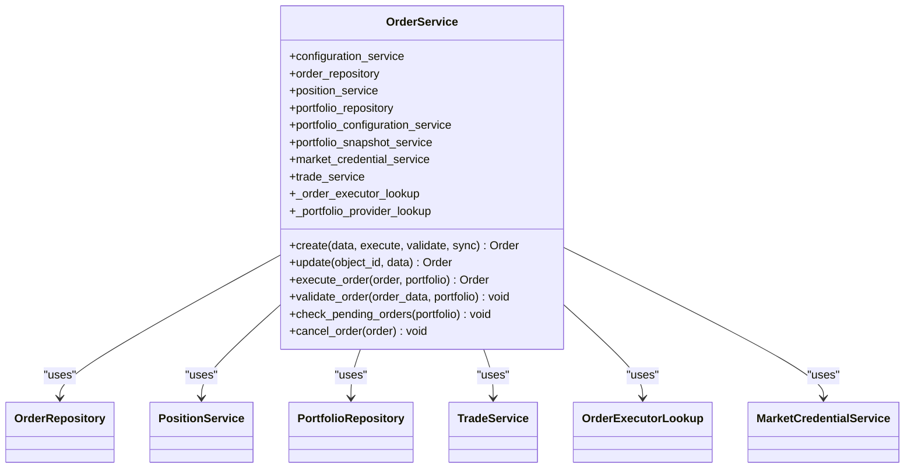
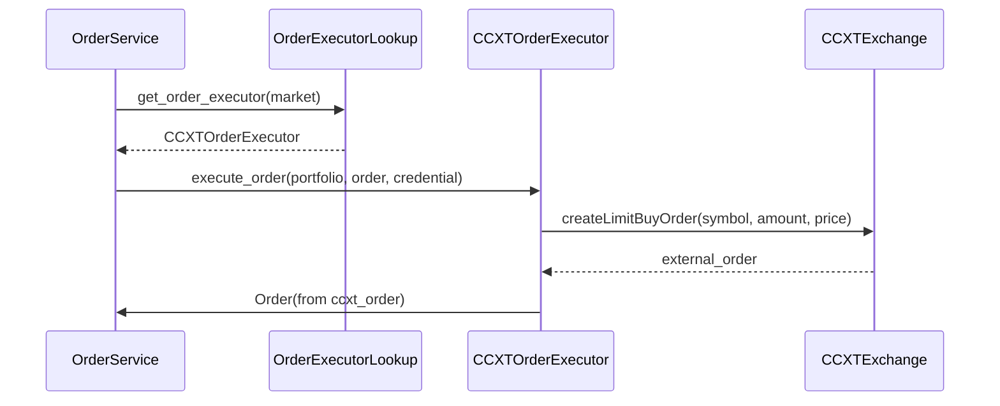
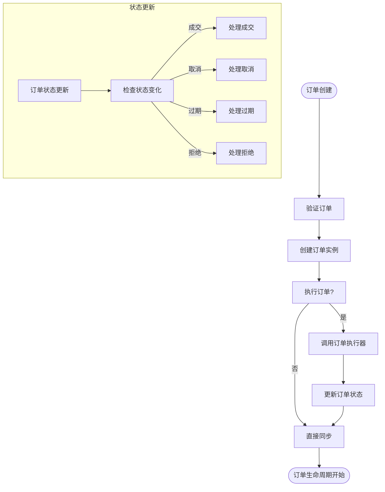
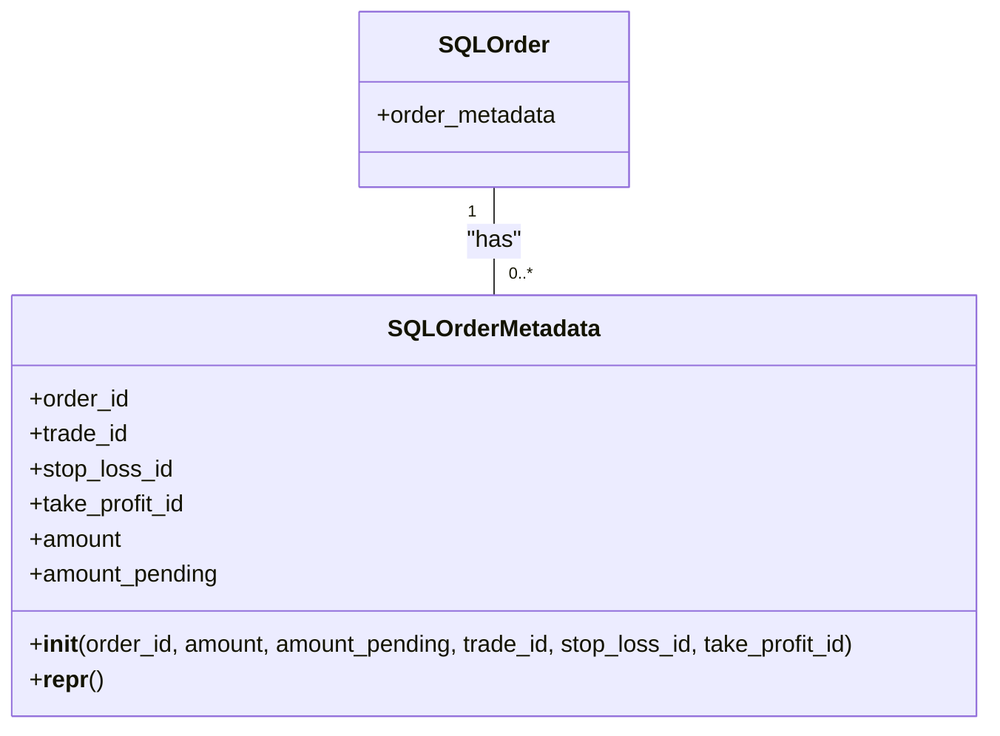

# 订单管理

<cite>
**本文档中引用的文件**   
- [order.py](file://investing_algorithm_framework/domain/models/order/order.py)
- [order_status.py](file://investing_algorithm_framework/domain/models/order/order_status.py)
- [order_type.py](file://investing_algorithm_framework/domain/models/order/order_type.py)
- [order_service.py](file://investing_algorithm_framework/services/order_service/order_service.py)
- [ccxt_order_executor.py](file://investing_algorithm_framework/infrastructure/order_executors/ccxt_order_executor.py)
- [order_repository.py](file://investing_algorithm_framework/infrastructure/repositories/order_repository.py)
- [order_metadata.py](file://investing_algorithm_framework/infrastructure/models/order/order_metadata.py)
- [order_executor.py](file://investing_algorithm_framework/domain/order_executor.py)
- [order_executor_lookup.py](file://investing_algorithm_framework/services/order_service/order_executor_lookup.py)
</cite>

## 目录
1. [订单模型](#订单模型)
2. [订单状态机](#订单状态机)
3. [订单类型](#订单类型)
4. [订单服务](#订单服务)
5. [订单执行器](#订单执行器)
6. [订单生命周期管理](#订单生命周期管理)
7. [订单元数据存储与查询](#订单元数据存储与查询)

## 订单模型

订单模型（Order）是订单管理系统的核心数据结构，定义了订单的所有关键属性。该模型在 `investing_algorithm_framework/domain/models/order/order.py` 文件中实现，继承自 `BaseModel` 类。

订单模型的主要字段定义如下：

- **id**: 订单的唯一标识符
- **external_id**: 交易所或经纪商提供的外部订单ID
- **target_symbol**: 目标交易符号（如 BTC）
- **trading_symbol**: 交易对符号（如 EUR）
- **order_side**: 订单方向（BUY/SELL）
- **order_type**: 订单类型（目前仅支持 LIMIT）
- **status**: 订单状态（CREATED, OPEN, CLOSED, CANCELED, EXPIRED, REJECTED）
- **price**: 订单价格
- **amount**: 订单数量
- **filled**: 已成交数量
- **remaining**: 剩余数量
- **cost**: 订单成本
- **created_at**: 创建时间
- **updated_at**: 更新时间
- **position_id**: 关联的持仓ID
- **order_fee**: 订单手续费
- **order_fee_currency**: 手续费货币
- **order_fee_rate**: 手续费率
- **metadata**: 订单元数据，用于存储与交易、止损、止盈等相关的上下文信息

订单模型提供了丰富的访问器方法（getter）和修改器方法（setter），以及 `to_dict()` 和 `from_dict()` 方法用于序列化和反序列化。此外，还提供了 `from_ccxt_order()` 静态方法，用于从 CCXT 库的订单对象创建订单实例。

**Section sources**
- [order.py](file://investing_algorithm_framework/domain/models/order/order.py#L19-L385)

## 订单状态机

订单状态机（OrderStatus）定义了订单在其生命周期中可能经历的各种状态。该状态机在 `investing_algorithm_framework/domain/models/order/order_status.py` 文件中实现，是一个枚举类（Enum）。

订单状态包括：

- **CREATED**: 订单已创建但尚未提交到交易所
- **OPEN**: 订单已提交到交易所，正在等待成交
- **CLOSED**: 订单已完全成交
- **CANCELED**: 订单已被取消
- **EXPIRED**: 订单已过期
- **REJECTED**: 订单被交易所拒绝

状态机提供了 `from_value()` 静态方法，用于从字符串或枚举值创建状态实例，以及 `equals()` 方法用于比较状态是否相等。这些方法确保了状态处理的一致性和可靠性。

订单状态的转换由订单服务（OrderService）协调管理，当订单状态发生变化时，系统会执行相应的同步操作，如更新投资组合、持仓和交易记录。

**Section sources**
- [order_status.py](file://investing_algorithm_framework/domain/models/order/order_status.py#L4-L38)

## 订单类型

订单类型（OrderType）定义了支持的订单种类。该类型在 `investing_algorithm_framework/domain/models/order/order_type.py` 文件中实现，目前系统仅支持限价单（LIMIT）。

- **LIMIT**: 限价单，指定一个价格，只有当市场价格达到或优于该价格时才会成交

订单类型同样是一个枚举类，提供了 `from_value()` 静态方法用于从值创建类型实例，以及 `equals()` 方法用于比较类型是否相等。虽然目前只支持限价单，但该设计为未来扩展其他订单类型（如市价单、止损单等）提供了良好的基础。

**Section sources**
- [order_type.py](file://investing_algorithm_framework/domain/models/order/order_type.py#L4-L31)

## 订单服务

订单服务（OrderService）是订单管理系统的核心协调者，负责管理订单的整个生命周期。该服务在 `investing_algorithm_framework/services/order_service/order_service.py` 文件中实现，继承自 `RepositoryService` 类。

订单服务的主要职责包括：

- **订单创建**: `create()` 方法负责创建订单，可选择是否立即执行、验证和同步投资组合
- **订单执行**: `execute_order()` 方法通过订单执行器查找（OrderExecutorLookup）找到匹配的执行器来执行订单
- **订单更新**: `update()` 方法处理订单状态更新，包括成交、取消、过期和拒绝等情况
- **订单验证**: `validate_order()` 方法验证订单的合法性，包括买卖方向、订单类型和资金/持仓检查
- **投资组合同步**: 多个私有方法（如 `_sync_portfolio_with_created_buy_order`）负责在订单状态变化时同步投资组合、持仓和交易

订单服务通过依赖注入获取必要的服务，如配置服务、订单仓库、持仓服务、投资组合仓库等，实现了良好的解耦和可测试性。

**Diagram sources **
- [order_service.py](file://investing_algorithm_framework/services/order_service/order_service.py#L11-L827)

**Section sources**
- [order_service.py](file://investing_algorithm_framework/services/order_service/order_service.py#L11-L827)

## 订单执行器

订单执行器（OrderExecutor）是抽象基类，定义了执行订单的接口。具体实现如 `CCXTOrderExecutor` 负责与实际的交易所进行交互。这些组件在 `investing_algorithm_framework/domain/order_executor.py` 和 `investing_algorithm_framework/infrastructure/order_executors/ccxt_order_executor.py` 文件中实现。

### CCXT 订单执行器

`CCXTOrderExecutor` 使用 CCXT 库与支持的交易所进行交互。它实现了 `OrderExecutor` 接口的三个抽象方法：

- **execute_order()**: 执行订单，支持限价单的买卖操作
- **cancel_order()**: 取消订单
- **supports_market()**: 检查是否支持特定市场

对于限价单，执行器会检查交易所是否支持相应的 `createLimitBuyOrder` 或 `createLimitSellOrder` 方法。执行成功后，会从 CCXT 的订单对象创建并返回一个框架的订单实例。

**Diagram sources **
- [ccxt_order_executor.py](file://investing_algorithm_framework/infrastructure/order_executors/ccxt_order_executor.py#L12-L201)
- [order_executor.py](file://investing_algorithm_framework/domain/order_executor.py#L6-L113)

### 订单执行器查找

`OrderExecutorLookup` 类提供了高效的订单执行器查找机制，基于市场进行 O(1) 时间复杂度的查找。它维护一个执行器列表，并通过 `register_order_executor_for_market()` 方法为每个市场注册最合适的执行器（基于优先级排序）。

**Section sources**
- [ccxt_order_executor.py](file://investing_algorithm_framework/infrastructure/order_executors/ccxt_order_executor.py#L12-L201)
- [order_executor.py](file://investing_algorithm_framework/domain/order_executor.py#L6-L113)
- [order_executor_lookup.py](file://investing_algorithm_framework/services/order_service/order_executor_lookup.py#L8-L111)

## 订单生命周期管理

订单生命周期管理涵盖了订单从创建到最终状态的完整流程。系统通过订单服务协调各个组件来管理这一过程。

### 订单创建与提交

当调用 `OrderService.create()` 方法时，系统会：
1. 验证订单数据
2. 创建订单实例
3. 如果 `execute` 参数为 `True`，则通过匹配的订单执行器执行订单
4. 创建或获取关联的持仓
5. 根据订单方向（买入/卖出）同步投资组合

### 部分成交与完全成交

当订单部分或完全成交时，`OrderService.update()` 方法会被调用。系统会：
1. 计算成交数量差异
2. 调用相应的同步方法（如 `_sync_with_buy_order_filled`）
3. 更新持仓、投资组合和相关交易
4. 对于买入订单，减少未分配资金；对于卖出订单，增加未分配资金

### 订单取消

订单取消通过 `OrderService.cancel_order()` 方法处理：
1. 首先检查待处理订单状态
2. 获取订单并验证其存在
3. 如果订单状态为 OPEN，则调用订单执行器的 `cancel_order()` 方法
4. 更新订单状态为 CANCELED
5. 调用 `_sync_with_buy_order_cancelled` 或 `_sync_with_sell_order_cancelled` 恢复投资组合和持仓

**Diagram sources **
- [order_service.py](file://investing_algorithm_framework/services/order_service/order_service.py#L61-L196)
- [order_service.py](file://investing_algorithm_framework/services/order_service/order_service.py#L198-L254)

**Section sources**
- [order_service.py](file://investing_algorithm_framework/services/order_service/order_service.py#L61-L827)

## 订单元数据存储与查询

订单元数据系统用于存储与订单相关的上下文信息，特别是在处理与交易、止损和止盈相关的订单时。该系统在 `investing_algorithm_framework/infrastructure/models/order/order_metadata.py` 文件中实现。

### 元数据结构

`SQLOrderMetadata` 模型包含以下字段：
- **order_id**: 关联的订单ID
- **trade_id**: 关联的交易ID（可选）
- **stop_loss_id**: 关联的止损ID（可选）
- **take_profit_id**: 关联的止盈ID（可选）
- **amount**: 金额
- **amount_pending**: 待处理金额

### 元数据使用场景

元数据主要用于以下场景：
1. **卖出订单**: 当订单由止损或止盈触发时，系统会创建元数据对象存储止损/止盈ID和金额
2. **交易关闭**: 当订单用于关闭特定交易时，系统会创建元数据对象存储交易ID和金额
3. **状态恢复**: 当订单被取消或拒绝时，系统使用元数据将未成交金额恢复到原始状态

### 查询功能

通过 `SQLOrderMetadataRepository` 提供查询功能，支持基于 `order_id` 的查询。这使得系统能够快速检索特定订单的元数据，用于状态管理和审计。

**Diagram sources **
- [order_metadata.py](file://investing_algorithm_framework/infrastructure/models/order/order_metadata.py#L13-L45)
- [order.py](file://investing_algorithm_framework/infrastructure/models/order/order.py#L22-L125)

**Section sources**
- [order_metadata.py](file://investing_algorithm_framework/infrastructure/models/order/order_metadata.py#L13-L45)
- [order_repository.py](file://investing_algorithm_framework/infrastructure/repositories/order_metadata_repository.py#L6-L18)