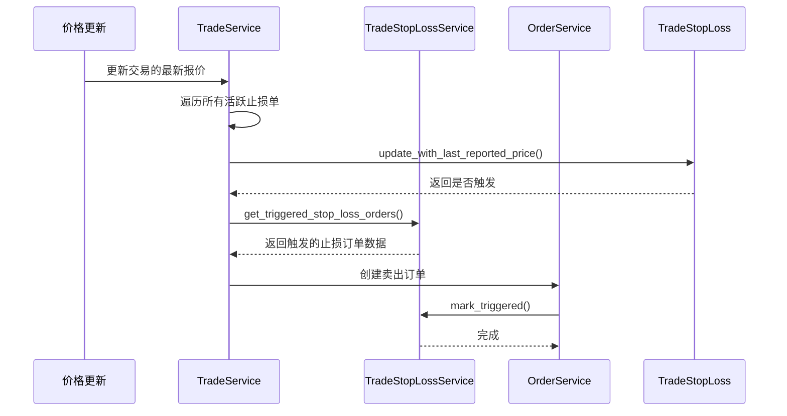
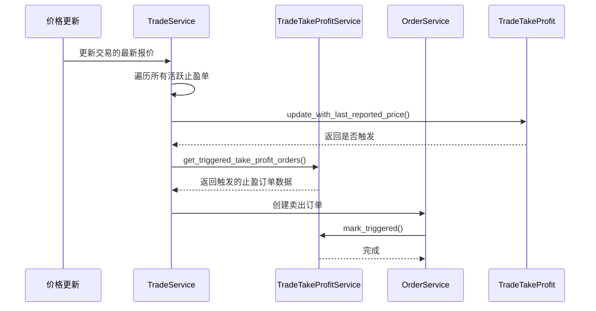
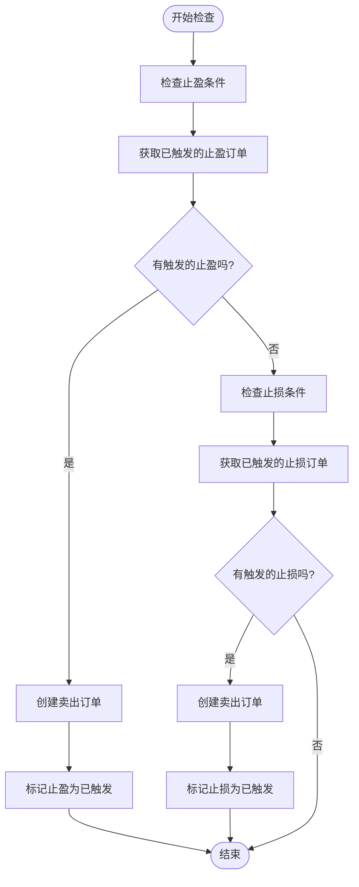
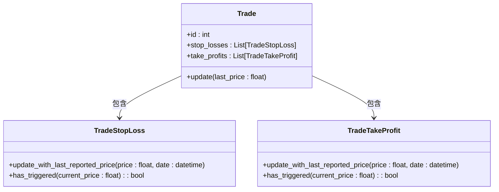

# 风险管理

<cite>
**本文档中引用的文件**  
- [stop_loss_rule.py](file://investing_algorithm_framework/domain/models/risk_rules/stop_loss_rule.py)
- [take_profit_rule.py](file://investing_algorithm_framework/domain/models/risk_rules/take_profit_rule.py)
- [trade_stop_loss.py](file://investing_algorithm_framework/domain/models/trade/trade_stop_loss.py)
- [trade_take_profit.py](file://investing_algorithm_framework/domain/models/trade/trade_take_profit.py)
- [trade_service.py](file://investing_algorithm_framework/services/trade_service/trade_service.py)
- [trade_stop_loss_service.py](file://investing_algorithm_framework/services/trade_service/trade_stop_loss_service.py)
- [trade_take_profit_service.py](file://investing_algorithm_framework/services/trade_service/trade_take_profit_service.py)
- [trade_order_evaluator.py](file://investing_algorithm_framework/services/trade_order_evaluator/trade_order_evaluator.py)
- [test_strategy_with_stop_losses_take_profits.py](file://investing_algorithm_framework/tests/scenarios/test_strategy_with_stop_losses_take_profits.py)
- [strategy.py](file://investing_algorithm_framework/app/strategy.py)
</cite>

## 目录
1. [引言](#引言)
2. [止损与止盈规则配置](#止损与止盈规则配置)
3. [监控与执行机制](#监控与执行机制)
4. [策略配置示例](#策略配置示例)
5. [风险规则与交易对象的关联](#风险规则与交易对象的关联)
6. [回测与实盘环境差异](#回测与实盘环境差异)

## 引言
本系统提供了一套完整的风险管理机制，通过止损规则（StopLossRule）和止盈规则（TakeProfitRule）来控制交易风险。这些规则允许用户基于价格、百分比或时间等条件设置自动化的交易退出策略。系统支持固定和追踪两种类型的止损止盈策略，并能灵活配置触发条件和执行动作。

## 止损与止盈规则配置

### 止损规则（StopLossRule）
止损规则用于在资产价格下跌到预设阈值时自动卖出，以限制潜在损失。其主要配置选项包括：
- **percentage_threshold** (float): 触发止损的价格下跌百分比。
- **trailing** (bool): 指示是否为追踪止损。若为`True`，则止损价格会随最高价动态调整；若为`False`，则为固定止损。
- **sell_percentage** (float): 触发时卖出的持仓比例。
- **symbol** (str): 应用该规则的资产符号。

当`trailing`为`False`时，止损价格计算公式为：买入价 × (1 - 百分比阈值/100)。例如，以100美元买入，设置5%的固定止损，则止损价为95美元。

当`trailing`为`True`时，系统会跟踪交易期间的最高价（高水位线），止损价格为高水位线 × (1 - 百分比阈值/100)。例如，买入价100美元，设置5%的追踪止损，若价格上涨至120美元，则止损价调整为114美元。

**Section sources**
- [stop_loss_rule.py](file://investing_algorithm_framework/domain/models/risk_rules/stop_loss_rule.py#L1-L52)

### 止盈规则（TakeProfitRule）
止盈规则用于在资产价格上涨到预设目标时自动卖出，以锁定利润。其配置选项与止损规则类似：
- **percentage_threshold** (float): 触发止盈的价格上涨百分比。
- **trailing** (bool): 是否为追踪止盈。
- **sell_percentage** (float): 触发时卖出的持仓比例。
- **symbol** (str): 应用该规则的资产符号。

对于固定止盈（`trailing=False`），止盈价格直接基于买入价计算：买入价 × (1 + 百分比阈值/100)。

对于追踪止盈（`trailing=True`），系统首先等待价格达到初始止盈阈值（买入价 × (1 + 百分比阈值/100)），然后将此时的价格设为高水位线，并计算实际止盈价格：高水位线 × (1 - 百分比阈值/100)。此后，若价格继续上涨，高水位线和止盈价格会同步上移。

**Section sources**
- [take_profit_rule.py](file://investing_algorithm_framework/domain/models/risk_rules/take_profit_rule.py#L1-L56)

## 监控与执行机制

### 交易停止损失服务（TradeStopLossService）
`TradeStopLossService`负责管理所有止损单的生命周期。其核心功能是`mark_triggered`方法，当止损条件满足时，该方法会将指定的止损单标记为已触发，并记录触发时间。



**Diagram sources**
- [trade_stop_loss_service.py](file://investing_algorithm_framework/services/trade_service/trade_stop_loss_service.py#L12-L40)
- [trade_service.py](file://investing_algorithm_framework/services/trade_service/trade_service.py#L216-L277)

### 交易止盈服务（TradeTakeProfitService）
`TradeTakeProfitService`的运作机制与止损服务类似，负责管理止盈单的触发和标记。其`mark_triggered`方法用于在止盈条件满足时更新止盈单状态。



**Diagram sources**
- [trade_take_profit_service.py](file://investing_algorithm_framework/services/trade_service/trade_take_profit_service.py#L12-L42)
- [trade_service.py](file://investing_algorithm_framework/services/trade_service/trade_service.py#L199-L215)

### 触发条件检查流程
系统通过`trade_order_evaluator`定期检查所有开放交易的止损止盈条件。其核心流程如下：



**Diagram sources**
- [trade_order_evaluator.py](file://investing_algorithm_framework/services/trade_order_evaluator/trade_order_evaluator.py#L49-L80)

## 策略配置示例

### 基于价格的止损止盈策略
```python
class MyStrategy(TradingStrategy):
    stop_losses = [
        StopLossRule(
            symbol="BTC",
            percentage_threshold=10.0,  # 10%止损
            trailing=False,             # 固定止损
            sell_percentage=100       # 全部卖出
        )
    ]
    take_profits = [
        TakeProfitRule(
            symbol="BTC",
            percentage_threshold=15.0,  # 15%止盈
            trailing=False,             # 固定止盈
            sell_percentage=100       # 全部卖出
        )
    ]
```

### 基于百分比的追踪止损策略
```python
class MyStrategy(TradingStrategy):
    stop_losses = [
        StopLossRule(
            symbol="ETH",
            percentage_threshold=8.0,   # 8%追踪止损
            trailing=True,              # 追踪止损
            sell_percentage=50        # 卖出一半
        )
    ]
```

### 基于时间的策略（需结合其他逻辑）
虽然核心规则基于价格，但可以通过策略的定时执行机制实现时间相关的风险管理。例如，在特定时间点检查并手动触发止损止盈。

**Section sources**
- [test_strategy_with_stop_losses_take_profits.py](file://investing_algorithm_framework/tests/scenarios/test_strategy_with_stop_losses_take_profits.py#L14-L50)

## 风险规则与交易对象的关联

### 动态更新机制
当交易的最新报价更新时，`TradeService`会自动调用`update`方法，进而触发对关联止损和止盈单的检查与更新。



**Diagram sources**
- [trade_service.py](file://investing_algorithm_framework/services/trade_service/trade_service.py#L216-L277)
- [trade_stop_loss.py](file://investing_algorithm_framework/domain/models/trade/trade_stop_loss.py#L104-L166)
- [trade_take_profit.py](file://investing_algorithm_framework/domain/models/trade/trade_take_profit.py#L106-L201)

### 关联方式
风险规则在策略层面定义，当创建交易时，系统会根据交易的资产符号（symbol）自动查找并关联相应的止损和止盈规则。这些规则实例化为`TradeStopLoss`和`TradeTakeProfit`对象，并与`Trade`对象建立关联。

**Section sources**
- [strategy.py](file://investing_algorithm_framework/app/strategy.py#L116-L120)
- [trade_service.py](file://investing_algorithm_framework/services/trade_service/trade_service.py#L44-L83)

## 回测与实盘环境差异

### 时间处理差异
在回测环境中，系统使用配置的`INDEX_DATETIME`作为当前时间；而在实盘环境中，则使用`datetime.now(tz=timezone.utc)`。

```python
if Environment.BACKTEST.equals(environment):
    last_reported_price_date = config[INDEX_DATETIME]
else:
    last_reported_price_date = datetime.now(tz=timezone.utc)
```

### 数据源差异
回测使用历史数据文件（如CSV），而实盘使用实时市场数据API。这可能导致价格更新频率和精度的差异，进而影响止损止盈的触发时机。

### 执行延迟
实盘环境中存在网络延迟和订单执行延迟，可能导致止损止盈订单无法在精确的触发价格成交。回测环境通常假设订单能立即以触发价成交，这可能过于理想化。

**Section sources**
- [trade_service.py](file://investing_algorithm_framework/services/trade_service/trade_service.py#L248-L253)
- [test_strategy_with_stop_losses_take_profits.py](file://investing_algorithm_framework/tests/scenarios/test_strategy_with_stop_losses_take_profits.py#L108-L117)