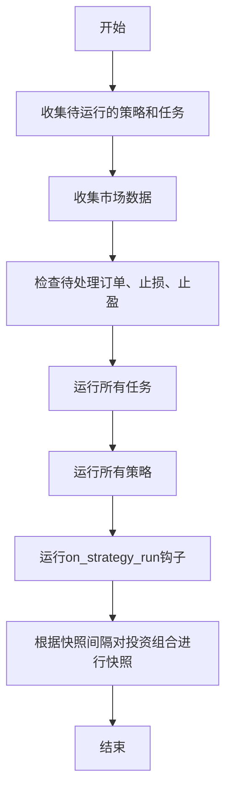
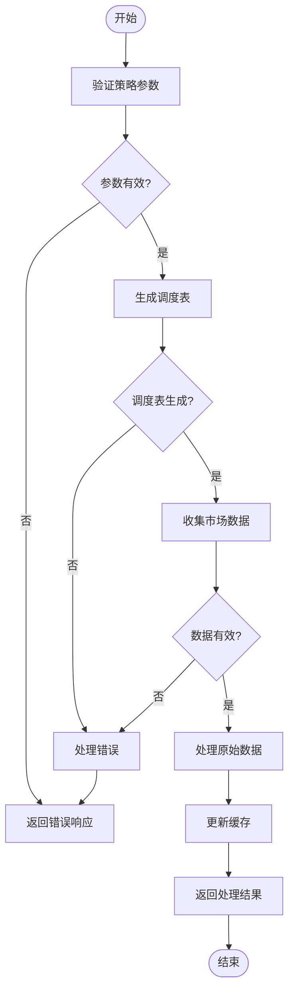
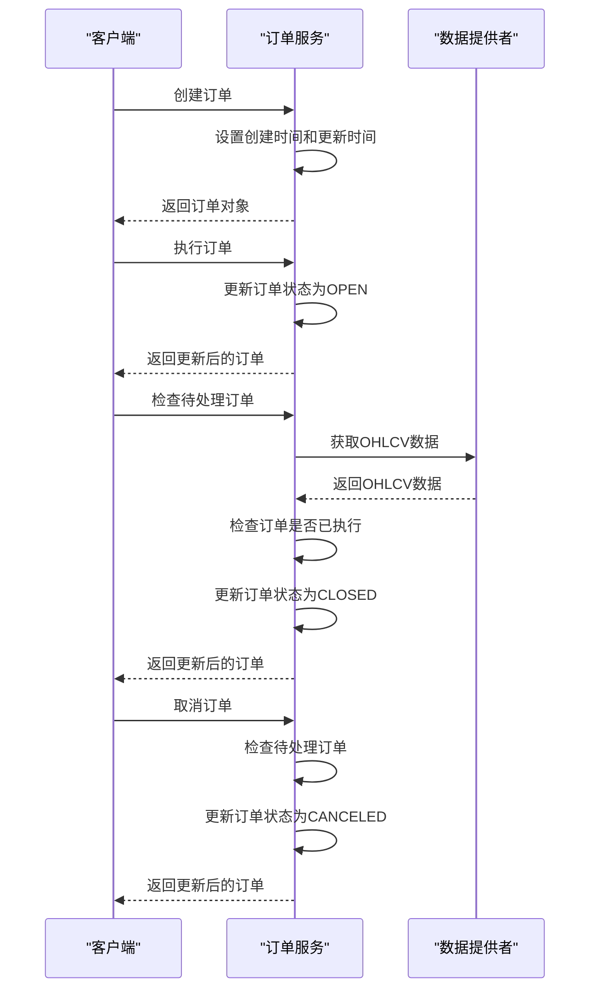
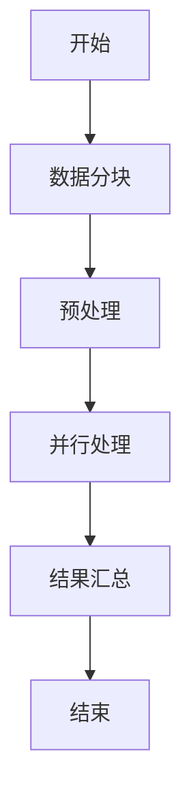
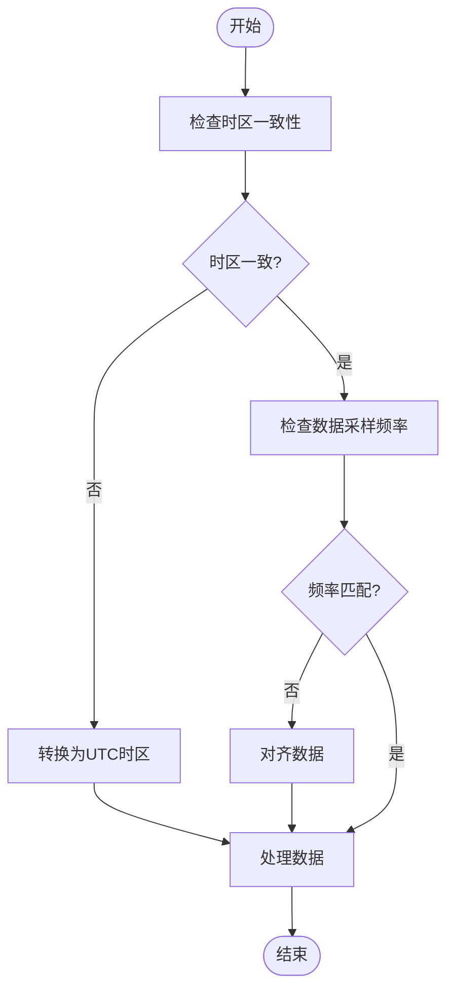

# 事件驱动回测

<cite>
**本文档引用的文件**   
- [eventloop.py](file://investing_algorithm_framework/app/eventloop.py)
- [order_backtest_service.py](file://investing_algorithm_framework/services/order_service/order_backtest_service.py)
- [backtest_oder_executor.py](file://investing_algorithm_framework/infrastructure/order_executors/backtest_oder_executor.py)
- [backtest_service.py](file://investing_algorithm_framework/services/backtesting/backtest_service.py)
- [backtest_trade_oder_evaluator.py](file://investing_algorithm_framework/services/trade_order_evaluator/backtest_trade_oder_evaluator.py)
- [data_source.py](file://investing_algorithm_framework/domain/models/data/data_source.py)
- [data_provider_service.py](file://investing_algorithm_framework/services/data_providers/data_provider_service.py)
- [time_frame.py](file://investing_algorithm_framework/domain/models/time_frame.py)
- [time_unit.py](file://investing_algorithm_framework/domain/models/time_unit.py)
- [strategy_v1.py](file://examples/backtest_example/strategies/strategy_v1/strategy_v1.py)
</cite>

## 目录
1. [简介](#简介)
2. [事件循环架构](#事件循环架构)
3. [时间对齐算法](#时间对齐算法)
4. [订单执行模拟器](#订单执行模拟器)
5. [多资产组合与多时间框架策略](#多资产组合与多时间框架策略)
6. [性能分析与优化](#性能分析与优化)
7. [常见问题与解决方案](#常见问题与解决方案)
8. [结论](#结论)

## 简介
事件驱动回测系统是一种基于时间序列事件处理的回测实现机制，它通过按时间顺序处理市场数据点来触发策略更新和订单执行。该系统确保了不同时间框架数据的正确同步，避免了未来数据泄漏的问题。本文档详细介绍了事件驱动回测的实现机制，包括事件循环如何工作、时间对齐算法的具体实现、订单执行模拟器的功能以及如何配置多资产组合和多时间框架策略。

## 事件循环架构
事件驱动回测的核心是事件循环服务（EventLoopService），它负责管理交易机器人的事件循环。这个服务的主要职责是运行交易策略并处理其生命周期中的各种事件，如待处理订单的变化、止损变化、止盈变化和价格数据更新。

事件循环以所谓的“迭代”形式运行策略和任务，每个迭代包含以下任务：
- 收集所有需要运行的策略和任务（根据其预定时间表过期）
- 收集所有策略的市场数据
- 检查待处理的订单、止损和止盈
- 运行所有任务
- 运行所有策略
- 运行所有on_strategy_run钩子
- 根据定义的快照间隔对投资组合进行快照

事件循环服务的目标是在实盘交易和回测中尽可能高效地运行交易。这是通过在一个循环中运行策略和任务来实现的，其中每次迭代都会检查哪些策略和任务由于其定义的时间间隔和时间单位（秒、分钟、小时）而需要运行。每个策略的下次运行时间初始化为UTC当前时间。服务还从策略和任务中收集所有数据配置，并在单次迭代中运行它们，以避免对数据提供服务进行多次调用，这在性能方面可能是昂贵的。



**图表来源**
- [eventloop.py](file://investing_algorithm_framework/app/eventloop.py#L19-L48)

**章节来源**
- [eventloop.py](file://investing_algorithm_framework/app/eventloop.py#L19-L48)

## 时间对齐算法
时间对齐算法确保了不同时间框架的数据能够正确同步，避免了未来数据泄漏的问题。在事件驱动回测中，数据源（DataSource）对象定义了数据的来源，包括符号、数据类型、时间框架、市场等属性。这些数据源被用来从数据提供者服务中获取相应的数据。

当执行回测时，系统会生成一个基于策略和任务的调度表。这个调度表是一个字典，键为日期时间，值为包含策略ID和任务ID的字典。调度表的生成过程如下：
1. 对于每个策略，根据其时间单位和间隔计算出步长。
2. 从开始日期开始，逐步增加步长，直到结束日期，将每个时间点添加到调度表中，并关联相应的策略ID。



**图表来源**
- [backtest_service.py](file://investing_algorithm_framework/services/backtesting/backtest_service.py#L453-L495)

**章节来源**
- [backtest_service.py](file://investing_algorithm_framework/services/backtesting/backtest_service.py#L453-L495)

## 订单执行模拟器
订单执行模拟器负责处理市价单、限价单和止损单的执行，同时计算滑点和交易费用。在回测环境中，订单执行模拟器不会实际在任何市场上执行订单，而是模拟订单的执行过程。

订单执行模拟器的关键功能包括：
- **创建订单**：当创建订单时，系统会设置创建时间和更新时间到当前回测时间。
- **执行订单**：当订单被执行时，订单状态被设置为OPEN，剩余数量被设置为订单数量，已填充数量被设置为0。
- **检查待处理订单**：系统会查询待处理订单，并根据OHLCV数据检查订单是否已执行。如果订单已执行，订单状态将被设置为CLOSED，已填充数量将被设置为订单数量。
- **取消订单**：当订单被取消时，系统会检查待处理订单，如果订单状态为OPEN，则将其状态更新为CANCELED，剩余数量设置为0。



**图表来源**
- [order_backtest_service.py](file://investing_algorithm_framework/services/order_service/order_backtest_service.py#L35-L170)

**章节来源**
- [order_backtest_service.py](file://investing_algorithm_framework/services/order_service/order_backtest_service.py#L35-L170)

## 多资产组合与多时间框架策略
配置多资产组合和多时间框架策略是事件驱动回测的重要组成部分。通过定义多个数据源，可以支持不同资产和时间框架的策略。每个数据源可以指定不同的符号、数据类型、时间框架、市场等属性。

例如，一个策略可能需要同时使用1小时和4小时的时间框架数据来进行分析。在这种情况下，可以在策略中定义两个数据源，分别对应1小时和4小时的时间框架。系统会自动从数据提供者服务中获取相应的数据，并将其传递给策略进行处理。

```python
from investing_algorithm_framework import TradingStrategy, DataSource

class MultiTimeFrameStrategy(TradingStrategy):
    def __init__(self):
        super().__init__()
        self.data_sources = [
            DataSource(
                symbol="BTC/EUR",
                data_type="ohlcv",
                time_frame="1h",
                market="BINANCE"
            ),
            DataSource(
                symbol="BTC/EUR",
                data_type="ohlcv",
                time_frame="4h",
                market="BINANCE"
            )
        ]

    def run_strategy(self, context, data):
        # 处理1小时时间框架数据
        hourly_data = data.get("OHLCV_BINANCE_BTC/EUR_1h")
        # 处理4小时时间框架数据
        four_hourly_data = data.get("OHLCV_BINANCE_BTC/EUR_4h")
        # 实现策略逻辑
        pass
```

**章节来源**
- [data_source.py](file://investing_algorithm_framework/domain/models/data/data_source.py#L11-L223)
- [strategy_v1.py](file://examples/backtest_example/strategies/strategy_v1/strategy_v1.py#L1-L189)

## 性能分析与优化
事件驱动回测的精度优势在于其能够精确地模拟真实交易环境中的事件顺序，从而提供更准确的回测结果。然而，这种高精度也带来了性能瓶颈，特别是在处理大量数据和复杂策略时。

为了优化执行效率，可以采取以下措施：
- **数据分块**：将大数据集分成较小的块进行处理，减少内存占用和提高处理速度。
- **预处理**：在回测开始前对数据进行预处理，如清洗、格式化和索引建立，以减少回测过程中的计算开销。
- **并行处理**：利用多线程或多进程技术并行处理不同的策略或数据源，提高整体处理速度。



**图表来源**
- [data_provider_service.py](file://investing_algorithm_framework/services/data_providers/data_provider_service.py#L334-L851)

**章节来源**
- [data_provider_service.py](file://investing_algorithm_framework/services/data_providers/data_provider_service.py#L334-L851)

## 常见问题与解决方案
在实现事件驱动回测时，可能会遇到一些常见问题，如时区不一致和数据采样频率不匹配。以下是这些问题的解决方案：

- **时区不一致**：确保所有时间戳都使用UTC时区，避免因时区差异导致的数据同步问题。
- **数据采样频率不匹配**：使用时间对齐算法确保不同时间框架的数据能够正确同步。例如，当处理1小时和4小时时间框架的数据时，应确保它们的时间戳对齐。



**图表来源**
- [data_source.py](file://investing_algorithm_framework/domain/models/data/data_source.py#L11-L223)
- [time_frame.py](file://investing_algorithm_framework/domain/models/time_frame.py#L1-L154)

**章节来源**
- [data_source.py](file://investing_algorithm_framework/domain/models/data/data_source.py#L11-L223)
- [time_frame.py](file://investing_algorithm_framework/domain/models/time_frame.py#L1-L154)

## 结论
事件驱动回测系统通过精确的时间序列事件处理机制，提供了高度准确的回测结果。该系统不仅能够处理复杂的多资产组合和多时间框架策略，还能有效避免未来数据泄漏的问题。尽管存在性能瓶颈，但通过数据分块、预处理和并行处理等优化措施，可以显著提高执行效率。此外，通过解决时区不一致和数据采样频率不匹配等问题，可以进一步提升回测的准确性和可靠性。