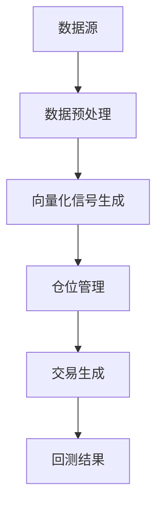

# 向量化回测

<cite>
**本文档引用的文件**   
- [backtest.py](file://investing_algorithm_framework/domain/backtesting/backtest.py)
- [backtest_service.py](file://investing_algorithm_framework/services/backtesting/backtest_service.py)
- [pandas.py](file://investing_algorithm_framework/infrastructure/data_providers/pandas.py)
- [polars.py](file://investing_algorithm_framework/domain/utils/polars.py)
- [strategy.py](file://investing_algorithm_framework/app/strategy.py)
- [backtest_run.py](file://investing_algorithm_framework/domain/backtesting/backtest_run.py)
- [app.py](file://investing_algorithm_framework/app/app.py)
- [position_size.py](file://investing_algorithm_framework/domain/models/position/position_size.py)
</cite>

## 目录
1. [引言](#引言)
2. [向量化回测架构](#向量化回测架构)
3. [核心组件分析](#核心组件分析)
4. [向量化策略实现](#向量化策略实现)
5. [数据处理与性能优化](#数据处理与性能优化)
6. [向量化与事件驱动回测对比](#向量化与事件驱动回测对比)
7. [配置与参数设置](#配置与参数设置)
8. [常见问题与解决方案](#常见问题与解决方案)
9. [结论](#结论)

## 引言
向量化回测是一种高效的回测方法，它利用Pandas或Polars数据帧的批量处理机制，通过向量化操作实现策略逻辑的高效计算。与传统的事件驱动回测相比，向量化回测在处理大规模数据集时具有显著的性能优势。本文档将详细介绍向量化回测的实现机制，包括指标计算、信号生成和仓位管理的向量化实现，以及如何配置和优化向量化回测参数。

## 向量化回测架构
向量化回测的架构设计旨在最大化计算效率和数据处理能力。该架构通过将策略逻辑向量化，利用Pandas或Polars数据帧的批量处理能力，实现了高效的计算。向量化回测的核心是将策略逻辑转换为向量化操作，从而避免了逐行处理数据的低效性。

**Diagram sources**
- [backtest_service.py](file://investing_algorithm_framework/services/backtesting/backtest_service.py#L114-L451)
- [app.py](file://investing_algorithm_framework/app/app.py#L1080-L1217)

## 核心组件分析
向量化回测的核心组件包括数据预处理、信号生成、仓位管理和交易生成。这些组件协同工作，确保回测过程的高效性和准确性。

### 数据预处理
数据预处理是向量化回测的第一步，它负责加载和准备回测所需的数据。数据预处理组件确保数据的完整性和一致性，为后续的向量化操作提供可靠的数据基础。

**Section sources**
- [pandas.py](file://investing_algorithm_framework/infrastructure/data_providers/pandas.py#L207-L313)
- [backtest_service.py](file://investing_algorithm_framework/services/backtesting/backtest_service.py#L183-L187)

### 信号生成
信号生成是向量化回测的核心，它通过向量化操作生成买卖信号。信号生成组件利用Pandas或Polars数据帧的批量处理能力，高效地计算指标和生成信号。

**Section sources**
- [strategy.py](file://investing_algorithm_framework/app/strategy.py#L136-L193)
- [backtest_service.py](file://investing_algorithm_framework/services/backtesting/backtest_service.py#L189-L191)

### 仓位管理
仓位管理组件负责根据生成的信号调整仓位。它通过向量化操作计算仓位大小，并确保仓位调整的及时性和准确性。

**Section sources**
- [position_size.py](file://investing_algorithm_framework/domain/models/position/position_size.py#L21-L34)
- [backtest_service.py](file://investing_algorithm_framework/services/backtesting/backtest_service.py#L266-L276)

### 交易生成
交易生成组件根据仓位管理的结果生成交易。它通过向量化操作生成交易订单，并确保交易的执行符合策略逻辑。

**Section sources**
- [backtest_service.py](file://investing_algorithm_framework/services/backtesting/backtest_service.py#L278-L365)
- [backtest_run.py](file://investing_algorithm_framework/domain/backtesting/backtest_run.py#L76-L78)

## 向量化策略实现
向量化策略的实现依赖于Pandas或Polars数据帧的批量处理机制。策略逻辑被转换为向量化操作，从而实现高效的计算。

### 指标计算
指标计算是向量化策略的基础，它通过向量化操作计算技术指标。例如，移动平均线（MA）和相对强弱指数（RSI）等指标可以通过向量化操作高效地计算。

**Section sources**
- [strategy.py](file://investing_algorithm_framework/app/strategy.py#L136-L193)
- [backtest_service.py](file://investing_algorithm_framework/services/backtesting/backtest_service.py#L248-L257)

### 信号生成
信号生成是向量化策略的核心，它通过向量化操作生成买卖信号。信号生成组件利用Pandas或Polars数据帧的批量处理能力，高效地计算指标和生成信号。

**Section sources**
- [strategy.py](file://investing_algorithm_framework/app/strategy.py#L136-L193)
- [backtest_service.py](file://investing_algorithm_framework/services/backtesting/backtest_service.py#L189-L191)

### 仓位管理
仓位管理组件负责根据生成的信号调整仓位。它通过向量化操作计算仓位大小，并确保仓位调整的及时性和准确性。

**Section sources**
- [position_size.py](file://investing_algorithm_framework/domain/models/position/position_size.py#L21-L34)
- [backtest_service.py](file://investing_algorithm_framework/services/backtesting/backtest_service.py#L266-L276)

## 数据处理与性能优化
向量化回测在处理大规模数据集时面临内存使用和计算性能的挑战。通过数据分块和延迟计算等优化策略，可以有效提升回测的性能。

### 数据分块
数据分块是一种内存优化策略，它将大规模数据集分割为较小的块，逐块处理。这种方法可以有效减少内存使用，避免内存溢出。

**Section sources**
- [pandas.py](file://investing_algorithm_framework/infrastructure/data_providers/pandas.py#L474-L522)
- [backtest_service.py](file://investing_algorithm_framework/services/backtesting/backtest_service.py#L207-L213)

### 延迟计算
延迟计算是一种性能优化策略，它将计算操作延迟到实际需要时才执行。这种方法可以减少不必要的计算，提升回测的效率。

**Section sources**
- [polars.py](file://investing_algorithm_framework/domain/utils/polars.py#L5-L54)
- [backtest_service.py](file://investing_algorithm_framework/services/backtesting/backtest_service.py#L248-L257)

## 向量化与事件驱动回测对比
向量化回测与事件驱动回测在精度和性能上存在显著差异。向量化回测在处理大规模数据集时具有显著的性能优势，但在精度上可能略逊于事件驱动回测。

### 精度对比
事件驱动回测通过逐行处理数据，确保了回测的高精度。而向量化回测通过批量处理数据，可能在某些边界条件下出现精度损失。

**Section sources**
- [test_vector_vs_event_backtest_results.py](file://tests/scenarios/test_vector_vs_event_backtest_results.py#L267-L294)
- [backtest_service.py](file://investing_algorithm_framework/services/backtesting/backtest_service.py#L256-L257)

### 性能对比
向量化回测在处理大规模数据集时具有显著的性能优势。通过向量化操作，向量化回测可以高效地处理大量数据，显著提升回测速度。

**Section sources**
- [test_moving_average_crossover_vectorized_backtest.py](file://tests/scenarios/vectorized_backtests/test_moving_average_crossover_vectorized_backtest.py#L148-L202)
- [test_multiple_vectorized_backtests.py](file://tests/scenarios/vectorized_backtests/test_multiple_vectorized_backtests.py#L371-L390)

## 配置与参数设置
向量化回测的配置和参数设置对回测结果有重要影响。通过合理配置参数，可以优化回测的性能和精度。

### 数据预处理
数据预处理参数包括数据源、时间范围和数据类型。合理配置这些参数可以确保数据的完整性和一致性。

**Section sources**
- [pandas.py](file://investing_algorithm_framework/infrastructure/data_providers/pandas.py#L207-L313)
- [backtest_service.py](file://investing_algorithm_framework/services/backtesting/backtest_service.py#L183-L187)

### 信号对齐
信号对齐参数包括信号生成的时间范围和对齐方式。合理配置这些参数可以确保信号的准确性和及时性。

**Section sources**
- [backtest_service.py](file://investing_algorithm_framework/services/backtesting/backtest_service.py#L248-L257)
- [strategy.py](file://investing_algorithm_framework/app/strategy.py#L136-L193)

### 交易成本计算
交易成本计算参数包括交易费用和滑点。合理配置这些参数可以更真实地模拟实际交易环境。

**Section sources**
- [backtest_service.py](file://investing_algorithm_framework/services/backtesting/backtest_service.py#L304-L315)
- [backtest_run.py](file://investing_algorithm_framework/domain/backtesting/backtest_run.py#L76-L78)

## 常见问题与解决方案
向量化回测在实现过程中可能遇到各种问题，如边界条件处理和浮点精度误差。通过合理的解决方案，可以有效应对这些问题。

### 边界条件处理
边界条件处理是向量化回测中的一个重要问题。通过合理的边界条件处理策略，可以确保回测的准确性和稳定性。

**Section sources**
- [backtest_service.py](file://investing_algorithm_framework/services/backtesting/backtest_service.py#L256-L257)
- [strategy.py](file://investing_algorithm_framework/app/strategy.py#L136-L193)

### 浮点精度误差
浮点精度误差是向量化回测中的一个常见问题。通过合理的浮点精度处理策略，可以减少精度误差，提升回测的准确性。

**Section sources**
- [backtest_service.py](file://investing_algorithm_framework/services/backtesting/backtest_service.py#L256-L257)
- [polars.py](file://investing_algorithm_framework/domain/utils/polars.py#L5-L54)

## 结论
向量化回测是一种高效的回测方法，它利用Pandas或Polars数据帧的批量处理机制，通过向量化操作实现策略逻辑的高效计算。通过合理配置和优化参数，可以显著提升回测的性能和精度。向量化回测在处理大规模数据集时具有显著的性能优势，但在精度上可能略逊于事件驱动回测。通过合理的解决方案，可以有效应对向量化回测中的各种问题，确保回测的准确性和稳定性。