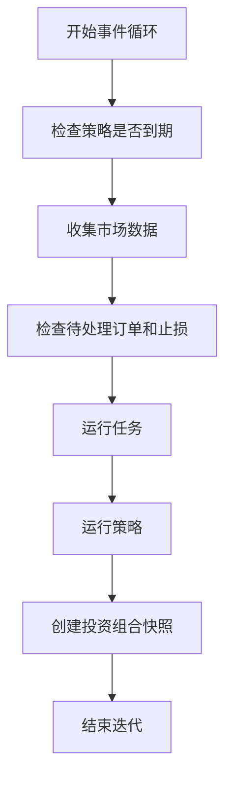
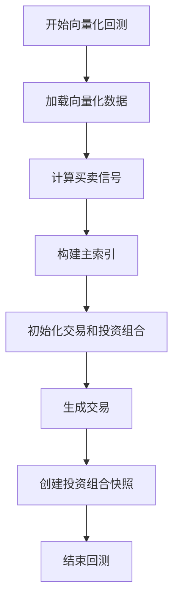
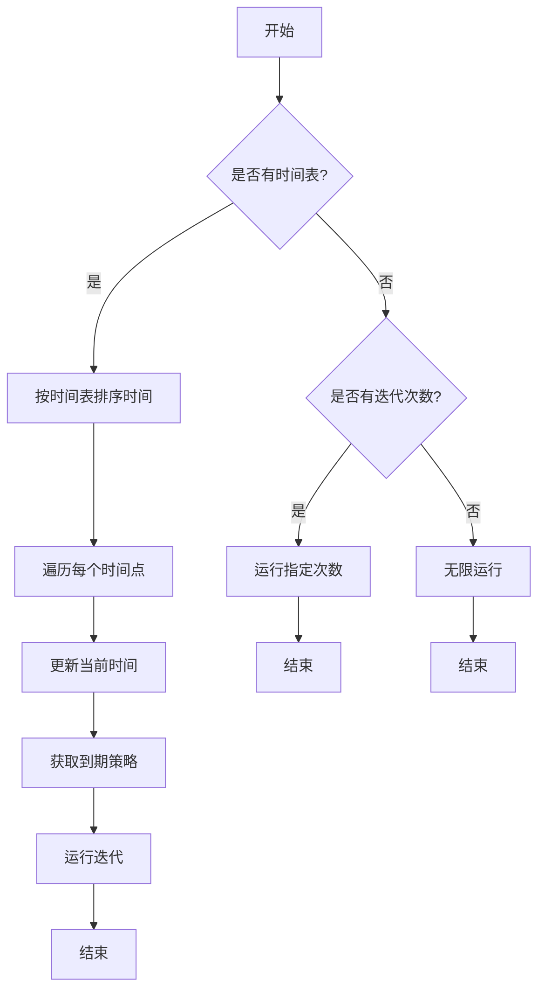

# 回测执行

<cite>
**本文档引用的文件**
- [backtest.py](file://investing_algorithm_framework/domain/backtesting/backtest.py)
- [backtest_service.py](file://investing_algorithm_framework/services/backtesting/backtest_service.py)
- [eventloop.py](file://investing_algorithm_framework/app/eventloop.py)
- [backtest_oder_executor.py](file://investing_algorithm_framework/infrastructure/order_executors/backtest_oder_executor.py)
- [order_backtest_service.py](file://investing_algorithm_framework/services/order_service/order_backtest_service.py)
- [backtest_run.py](file://investing_algorithm_framework/domain/backtesting/backtest_run.py)
- [backtest_date_range.py](file://investing_algorithm_framework/domain/backtesting/backtest_date_range.py)
- [strategy.py](file://investing_algorithm_framework/app/strategy.py)
- [backtest_metrics.py](file://investing_algorithm_framework/domain/backtesting/backtest_metrics.py)
- [run_backtest.ipynb](file://examples/backtest_example/run_backtest.ipynb)
- [strategy_v1.py](file://examples/backtest_example/strategies/strategy_v1/strategy_v1.py)
</cite>

## 目录
1. [引言](#引言)
2. [回测模式实现原理](#回测模式实现原理)
3. [Backtest类构造函数参数](#backtest类构造函数参数)
4. [回测引擎事件循环机制](#回测引擎事件循环机制)
5. [策略生命周期管理](#策略生命周期管理)
6. [多时间框架与多资产组合回测](#多时间框架与多资产组合回测)
7. [性能优化策略](#性能优化策略)
8. [常见问题与解决方案](#常见问题与解决方案)
9. [结论](#结论)

## 引言
本文档详细介绍了投资算法框架中的回测执行机制，重点阐述了事件驱动和向量化两种回测模式的实现原理。文档详细说明了Backtest类的构造函数参数，包括时间范围、初始资本、交易费用和数据源配置。同时，解释了回测引擎的事件循环机制，如何处理市场数据流、生成交易信号和执行订单。文档还描述了策略在回测环境中的生命周期管理，包括初始化、数据更新和状态保存。此外，提供了配置多时间框架数据和多资产组合回测的代码示例，并分析了回测执行性能优化策略，如数据预加载和并行回测。最后，记录了常见的回测执行问题，如数据对齐错误和时区处理问题及其解决方案。

## 回测模式实现原理

### 事件驱动回测模式
事件驱动回测模式模拟了实时交易环境，通过事件循环机制逐步处理市场数据。该模式的核心是`EventLoopService`类，它负责管理事件循环，运行交易策略并处理其生命周期中的各种事件，如待处理订单、止损和止盈变化以及价格数据更新。

事件循环的迭代过程包括以下任务：
1. 收集所有需要运行的策略和任务（根据其计划安排）。
2. 收集所有策略的市场数据。
3. 检查待处理订单、止损和止盈。
4. 运行所有任务。
5. 运行所有策略。
6. 运行所有`on_strategy_run`钩子。
7. 根据定义的快照间隔对投资组合进行快照。

该模式通过在单次迭代中收集所有数据配置，避免了对数据提供服务的多次调用，从而提高了性能。



**Diagram sources**
- [eventloop.py](file://investing_algorithm_framework/app/eventloop.py#L20-L621)

### 向量化回测模式
向量化回测模式利用向量化操作来高效地处理大量数据。该模式的核心是`create_vector_backtest`方法，它使用策略的`generate_buy_signals`和`generate_sell_signals`方法来生成买卖信号。

向量化回测的流程如下：
1. 加载向量化回测数据。
2. 从策略中计算信号。
3. 构建主索引（信号字典中所有索引的并集）。
4. 初始化交易和投资组合价值。
5. 生成交易。
6. 创建投资组合快照。

该模式通过向量化操作显著提高了回测速度，特别适用于处理大量历史数据。



**Diagram sources**
- [backtest_service.py](file://investing_algorithm_framework/services/backtesting/backtest_service.py#L114-L451)

**Section sources**
- [backtest_service.py](file://investing_algorithm_framework/services/backtesting/backtest_service.py#L114-L451)

## Backtest类构造函数参数

### 时间范围
`Backtest`类使用`BacktestDateRange`对象来定义回测的时间范围。该对象包含开始日期、结束日期和可选的名称。时间范围必须是有效的，即结束日期不能早于开始日期，且日期必须四舍五入到最近的小时。

```python
backtest_date_range = BacktestDateRange(
    start_date=datetime(2022, 1, 1, tzinfo=timezone.utc),
    end_date=datetime(2024, 12, 31, tzinfo=timezone.utc),
    name="In-Sample Test"
)
```

**Section sources**
- [backtest_date_range.py](file://investing_algorithm_framework/domain/backtesting/backtest_date_range.py#L11-L97)

### 初始资本
初始资本是回测开始时投资组合的初始余额。该值可以通过`initial_amount`参数在`run_vector_backtest`方法中指定，或从投资组合配置中获取。

```python
backtest = app.run_vector_backtest(
    initial_amount=1000,
    backtest_date_range=backtest_date_range,
    strategy=strategy,
    risk_free_rate=0.027,
    trading_symbol="EUR",
    market="BITVAVO"
)
```

**Section sources**
- [backtest_service.py](file://investing_algorithm_framework/services/backtesting/backtest_service.py#L119-L122)

### 交易费用
交易费用在订单执行过程中处理。`BacktestOrderExecutor`类负责模拟订单执行，但不实际在任何市场上执行订单。它仅用于回测目的。

```python
class BacktestOrderExecutor(OrderExecutor):
    def execute_order(self, portfolio, order, market_credential) -> Order:
        order.status = OrderStatus.OPEN.value
        order.remaining = order.get_amount()
        order.filled = 0
        order.updated_at = self.config[INDEX_DATETIME]
        return order
```

**Section sources**
- [backtest_oder_executor.py](file://investing_algorithm_framework/infrastructure/order_executors/backtest_oder_executor.py#L5-L29)

### 数据源配置
数据源配置通过`DataSource`对象定义，这些对象指定了策略所需的数据。数据源包括符号、数据类型、时间框架和窗口大小等信息。

```python
data_sources = [
    DataSource(
        identifier="OHLCV_BTC-EUR_1h",
        symbol="BTC/EUR",
        time_frame="1h",
        data_type=DataType.OHLCV,
        window_size=100,
        market="BITVAVO"
    )
]
```

**Section sources**
- [strategy.py](file://investing_algorithm_framework/app/strategy.py#L13-L802)

## 回测引擎事件循环机制

### 事件循环初始化
事件循环通过`initialize`方法进行初始化，该方法计算运行策略和任务的时间表。策略的下次运行时间初始化为当前UTC时间。

```python
def initialize(
    self,
    algorithm: Algorithm,
    trade_order_evaluator: TradeOrderEvaluator,
):
    self._algorithm = algorithm
    self.strategies = algorithm.strategies
    self.tasks = algorithm.tasks

    if len(self.strategies) == 0:
        raise OperationalException(
            "No strategies are defined in the algorithm. "
            "Please add at least one strategy to the algorithm."
        )

    self._trade_order_evaluator = trade_order_evaluator
    start_date = self._configuration_service.config[INDEX_DATETIME]

    self.next_run_times = {
        strategy.strategy_id: {
            "next_run": start_date,
            "data_sources": strategy.data_sources
        }
        for strategy in self.strategies
    }
```

**Section sources**
- [eventloop.py](file://investing_algorithm_framework/app/eventloop.py#L260-L320)

### 事件循环执行
事件循环通过`start`方法执行，该方法根据指定的迭代次数或时间表运行事件循环。在每次迭代中，系统检查哪些策略到期，获取其数据配置，并运行策略。



**Diagram sources**
- [eventloop.py](file://investing_algorithm_framework/app/eventloop.py#L334-L445)

**Section sources**
- [eventloop.py](file://investing_algorithm_framework/app/eventloop.py#L334-L445)

## 策略生命周期管理

### 策略初始化
策略通过`TradingStrategy`类初始化，该类定义了策略的时间单位、间隔、数据源和其他属性。策略的初始化包括设置时间单位、间隔和数据源。

```python
def __init__(
    self,
    strategy_id=None,
    time_unit=None,
    interval=None,
    data_sources=None,
    metadata=None,
    position_sizes=None,
    stop_losses=None,
    take_profits=None,
    symbols=None,
    trading_symbol=None,
    worker_id=None,
    decorated=None
):
    if time_unit is not None:
        self.time_unit = TimeUnit.from_value(time_unit)
    else:
        if self.time_unit is None:
            raise OperationalException(
                f"Time unit attribute not set for "
                f"strategy instance {self.strategy_id}"
            )
        self.time_unit = TimeUnit.from_value(self.time_unit)

    if interval is not None:
        self.interval = interval

    if data_sources is not None:
        self.data_sources = data_sources
```

**Section sources**
- [strategy.py](file://investing_algorithm_framework/app/strategy.py#L51-L115)

### 数据更新
策略在每次运行时通过`run_strategy`方法更新数据。该方法生成买卖信号，并根据信号执行交易。

```python
def run_strategy(self, context: Context, data: Dict[str, Any]):
    self.context = context
    index_datetime = context.config[INDEX_DATETIME]
    buy_signals = self.generate_buy_signals(data)
    sell_signals = self.generate_sell_signals(data)

    for symbol in self.symbols:
        if self.has_open_orders(symbol):
            continue

        if not self.has_position(symbol):
            if symbol not in buy_signals:
                continue

            signals = buy_signals[symbol]
            last_row = signals.iloc[-1]

            if last_row:
                position_size = self.get_position_size(symbol)
                full_symbol = (f"{symbol}/"
                               f"{self.context.get_trading_symbol()}")
                price = self.context.get_latest_price(full_symbol)
                amount = position_size.get_size(
                    self.context.get_portfolio(), price
                )
                order_amount = amount / price
                order = self.create_limit_order(
                    target_symbol=symbol,
                    order_side=OrderSide.BUY,
                    amount=order_amount,
                    price=price,
                    execute=True,
                    validate=True,
                    sync=True
                )
```

**Section sources**
- [strategy.py](file://investing_algorithm_framework/app/strategy.py#L195-L343)

### 状态保存
状态保存通过`_snapshot`方法实现，该方法根据配置的快照间隔创建投资组合快照。快照可以按策略迭代或每日创建。

```python
def _snapshot(
    self,
    current_datetime,
    open_orders,
    created_orders
):
    snapshot_interval = self._configuration_service.config[SNAPSHOT_INTERVAL]
    portfolio = self._portfolio_service.get_all()[0]
    if SnapshotInterval.STRATEGY_ITERATION.equals(snapshot_interval):
        snapshot = self._portfolio_snapshot_service.create_snapshot(
            created_at=current_datetime,
            portfolio=portfolio,
            open_orders=open_orders,
            created_orders=created_orders,
            save=False,
        )
        self._snapshots.append(snapshot)
        self._configuration_service.add_value(
            LAST_SNAPSHOT_DATETIME, current_datetime
        )
    elif SnapshotInterval.DAILY.equals(snapshot_interval):
        last_snapshot_datetime = self._configuration_service.config[
            LAST_SNAPSHOT_DATETIME
        ]

        if last_snapshot_datetime is None or \
                (current_datetime - last_snapshot_datetime).total_seconds() >= 86400:
            snapshot = self._portfolio_snapshot_service.create_snapshot(
                created_at=current_datetime,
                portfolio=portfolio,
                open_orders=open_orders,
                created_orders=created_orders,
                save=False,
            )
            self._snapshots.append(snapshot)
            self._configuration_service.add_value(
                LAST_SNAPSHOT_DATETIME, current_datetime
            )
```

**Section sources**
- [eventloop.py](file://investing_algorithm_framework/app/eventloop.py#L200-L258)

## 多时间框架与多资产组合回测

### 配置多时间框架数据
多时间框架数据通过在`DataSource`对象中指定不同的时间框架来配置。例如，可以同时使用1小时和4小时的时间框架。

```python
data_sources = [
    DataSource(
        identifier="OHLCV_BTC-EUR_1h",
        symbol="BTC/EUR",
        time_frame="1h",
        data_type=DataType.OHLCV,
        window_size=100,
        market="BITVAVO"
    ),
    DataSource(
        identifier="OHLCV_BTC-EUR_4h",
        symbol="BTC/EUR",
        time_frame="4h",
        data_type=DataType.OHLCV,
        window_size=100,
        market="BITVAVO"
    )
]
```

**Section sources**
- [strategy.py](file://investing_algorithm_framework/app/strategy.py#L13-L802)

### 配置多资产组合回测
多资产组合回测通过在策略中定义多个符号来配置。策略将为每个符号生成买卖信号并执行交易。

```python
class EMACrossoverRSIStrategy(TradingStrategy):
    def __init__(
        self,
        time_unit,
        interval,
        market,
        symbols: List[str],
        data_sources,
        ema_short_period,
        ema_long_period,
        rsi_period,
        rsi_oversold_threshold,
        rsi_overbought_threshold,
        alignment_window_size,
        trailing_stop_loss_percentage=5,
        trailing_take_profit_percentage=10,
        position_sizes: Dict[str, float] = None
    ):
        super().__init__(time_unit=time_unit, interval=interval)
        self.data_sources = data_sources
        self.ema_short_period = ema_short_period
        self.ema_long_period = ema_long_period
        self.rsi_period = rsi_period
        self.symbols = symbols
        self.alignment_window_size = alignment_window_size
        self.rsi_oversold_threshold = rsi_oversold_threshold
        self.rsi_overbought_threshold = rsi_overbought_threshold
        self.market = market
        self.trailing_stop_loss_percentage = trailing_stop_loss_percentage
        self.trailing_take_profit_percentage = trailing_take_profit_percentage
        self.position_sizes = position_sizes

        if self.position_sizes is None:
            self.position_sizes = {symbol: ((100 / len(self.symbols)) - 2) for symbol in self.symbols}
```

**Section sources**
- [strategy_v1.py](file://examples/backtest_example/strategies/strategy_v1/strategy_v1.py#L11-L70)

## 性能优化策略

### 数据预加载
数据预加载通过在回测开始前加载所有所需数据来优化性能。这避免了在每次迭代中重复调用数据提供服务。

```python
def initialize_data_sources_backtest(
    self,
    data_sources,
    backtest_date_range: BacktestDateRange,
    show_progress: bool = True
):
    """
    Initialize data sources for backtesting by loading all data in advance.
    """
    for data_source in data_sources:
        self._data_provider_service.get_backtest_data(
            data_source=data_source,
            backtest_index_date=backtest_date_range.start_date,
            start_date=data_source.start_date,
            end_date=data_source.end_date,
        )
```

**Section sources**
- [app.py](file://investing_algorithm_framework/app/app.py#L916-L1506)

### 并行回测
并行回测通过同时运行多个回测来优化性能。这可以通过`run_vector_backtests`方法实现。

```python
def run_vector_backtests(
    self,
    initial_amount,
    strategies: List[TradingStrategy],
    backtest_date_range: BacktestDateRange = None,
    backtest_date_ranges: List[BacktestDateRange] = None,
    snapshot_interval: SnapshotInterval = SnapshotInterval.DAILY,
    risk_free_rate: Optional[float] = None,
    skip_data_sources_initialization: bool = False,
    show_progress: bool = True,
    market: Optional[str] = None,
    trading_symbol: Optional[str] = None,
    continue_on_error: bool = False,
) -> List[Backtest]:
    """
    Run vectorized backtests for a set of strategies in parallel.
    """
    backtests = []
    for strategy in strategies:
        backtest = self.run_vector_backtest(
            backtest_date_range=backtest_date_range,
            strategy=strategy,
            snapshot_interval=snapshot_interval,
            risk_free_rate=risk_free_rate,
            skip_data_sources_initialization=skip_data_sources_initialization,
            show_data_initialization_progress=show_progress,
            initial_amount=initial_amount,
            market=market,
            trading_symbol=trading_symbol,
            continue_on_error=continue_on_error,
        )
        backtests.append(backtest)
    return backtests
```

**Section sources**
- [app.py](file://investing_algorithm_framework/app/app.py#L916-L1506)

## 常见问题与解决方案

### 数据对齐错误
数据对齐错误通常发生在不同时间框架的数据之间。解决方案是确保所有数据源的时间框架一致，或使用最细粒度的时间框架作为主索引。

```python
def get_most_granular_ohlcv_data_source(data_sources):
    """
    Get the most granular data source from a list of data sources.
    """
    granularity_order = {
        TimeFrame.ONE_MINUTE: 1,
        TimeFrame.FIVE_MINUTE: 5,
        TimeFrame.FIFTEEN_MINUTE: 15,
        TimeFrame.ONE_HOUR: 60,
        TimeFrame.TWO_HOUR: 120,
        TimeFrame.FOUR_HOUR: 240,
        TimeFrame.TWELVE_HOUR: 720,
        TimeFrame.ONE_DAY: 1440,
        TimeFrame.ONE_WEEK: 10080,
        TimeFrame.ONE_MONTH: 43200
    }

    most_granular = None
    highest_granularity = float('inf')

    ohlcv_data_sources = [
        ds for ds in data_sources if DataType.OHLCV.equals(ds.data_type)
    ]

    if len(ohlcv_data_sources) == 0:
        raise OperationalException("No OHLCV data sources found")

    for source in ohlcv_data_sources:
        if granularity_order[source.time_frame] < highest_granularity:
            highest_granularity = granularity_order[source.time_frame]
            most_granular = source

    return most_granular
```

**Section sources**
- [backtest_service.py](file://investing_algorithm_framework/services/backtesting/backtest_service.py#L611-L652)

### 时区处理问题
时区处理问题通常发生在日期和时间的处理中。解决方案是确保所有日期和时间都使用UTC时区。

```python
def __init__(self, start_date, end_date=None, name=None):
    if isinstance(start_date, str):
        start_date = parse(start_date)

    if end_date is not None and isinstance(end_date, str):
        end_date = parse(end_date)

    if end_date is None:
        self._end_date = datetime.now(tz=timezone.utc)

    time_zone_info = start_date.tzinfo

    if time_zone_info is None or time_zone_info is not timezone.utc:
        logger.warning(
            "Start date must be a UTC datetime object. "
            f"Received: {start_date}"
        )
        start_date = start_date.astimezone(timezone.utc)

    time_zone_info = end_date.tzinfo

    if time_zone_info is None or time_zone_info is not timezone.utc:
        logger.warning(
            "End date must be a UTC datetime object. "
            f"Received: {end_date}"
        )
        end_date = end_date.astimezone(timezone.utc)

    self._start_date = start_date
    self._end_date = end_date
    self._name = name
```

**Section sources**
- [backtest_date_range.py](file://investing_algorithm_framework/domain/backtesting/backtest_date_range.py#L11-L97)

## 结论
本文档详细介绍了投资算法框架中的回测执行机制，涵盖了事件驱动和向量化两种回测模式的实现原理。文档详细说明了Backtest类的构造函数参数，包括时间范围、初始资本、交易费用和数据源配置。同时，解释了回测引擎的事件循环机制，如何处理市场数据流、生成交易信号和执行订单。文档还描述了策略在回测环境中的生命周期管理，包括初始化、数据更新和状态保存。此外，提供了配置多时间框架数据和多资产组合回测的代码示例，并分析了回测执行性能优化策略，如数据预加载和并行回测。最后，记录了常见的回测执行问题，如数据对齐错误和时区处理问题及其解决方案。通过这些详细的说明和示例，用户可以更好地理解和使用该框架进行回测。