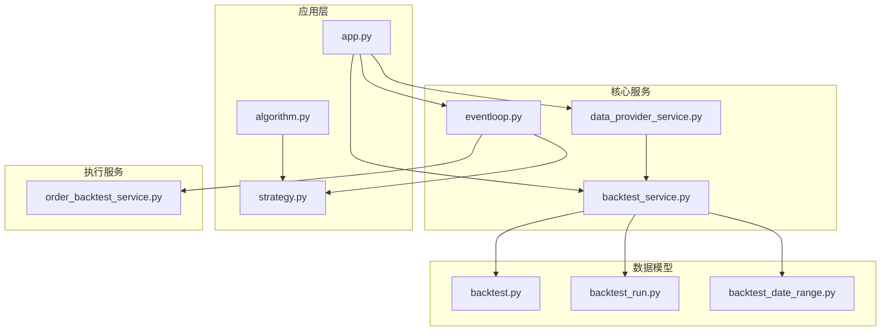
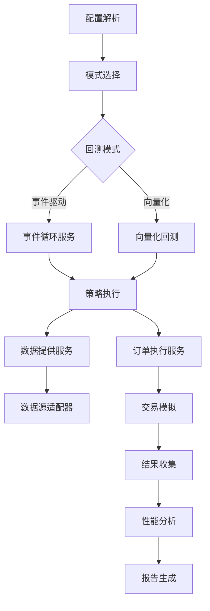
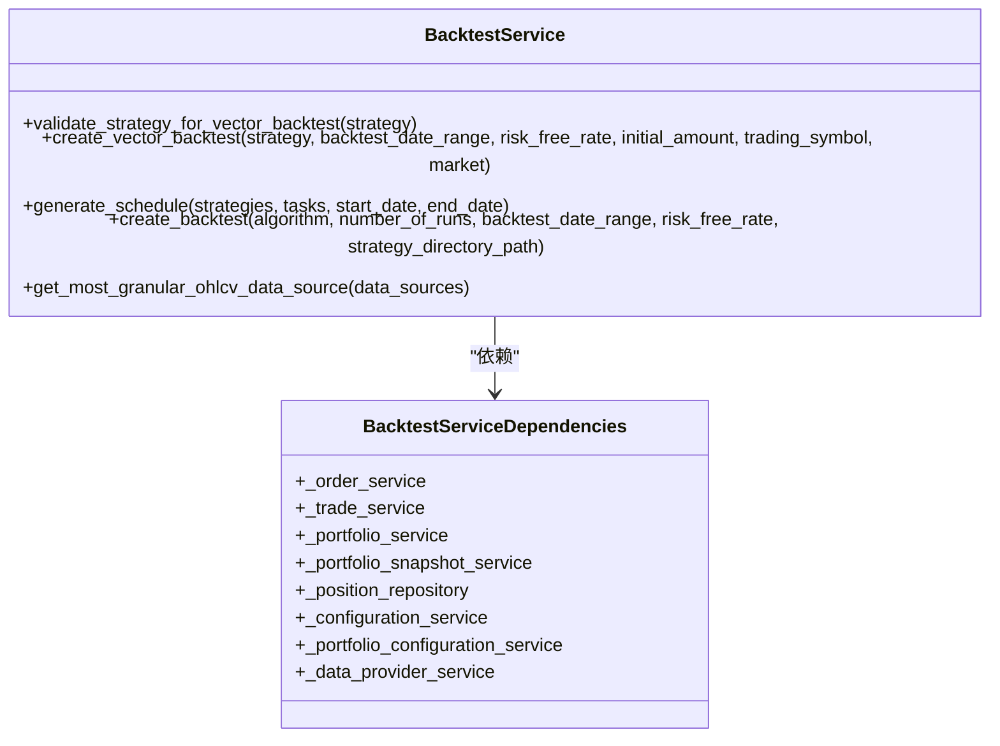
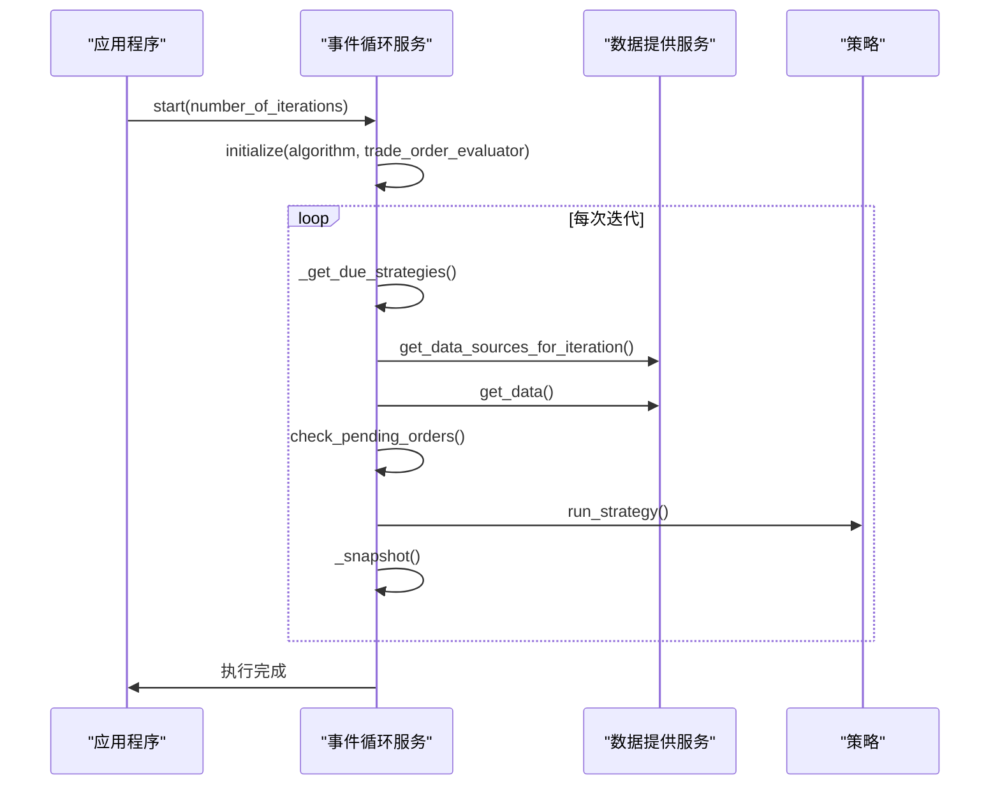
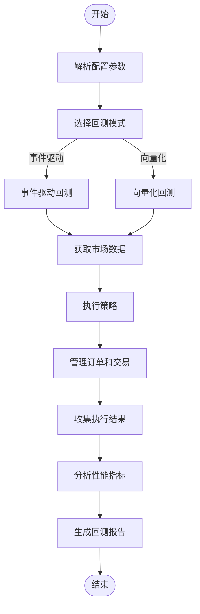
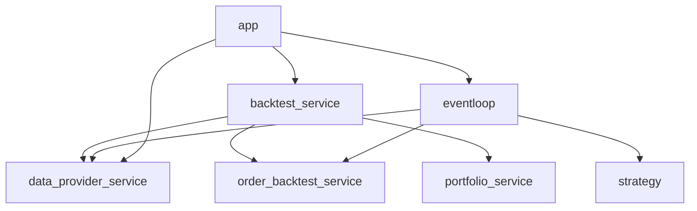

# 回测执行引擎

<cite>
**本文档引用的文件**  
- [backtest_service.py](file://investing_algorithm_framework/services/backtesting/backtest_service.py)
- [backtest.py](file://investing_algorithm_framework/domain/backtesting/backtest.py)
- [backtest_run.py](file://investing_algorithm_framework/domain/backtesting/backtest_run.py)
- [eventloop.py](file://investing_algorithm_framework/app/eventloop.py)
- [data_provider_service.py](file://investing_algorithm_framework/services/data_providers/data_provider_service.py)
- [app.py](file://investing_algorithm_framework/app/app.py)
- [algorithm.py](file://investing_algorithm_framework/app/algorithm/algorithm.py)
- [strategy.py](file://investing_algorithm_framework/app/strategy.py)
- [order_backtest_service.py](file://investing_algorithm_framework/services/order_service/order_backtest_service.py)
- [backtest_date_range.py](file://investing_algorithm_framework/domain/backtesting/backtest_date_range.py)
</cite>

## 目录
1. [引言](#引言)
2. [项目结构](#项目结构)
3. [核心组件](#核心组件)
4. [架构概述](#架构概述)
5. [详细组件分析](#详细组件分析)
6. [依赖分析](#依赖分析)
7. [性能考虑](#性能考虑)
8. [故障排除指南](#故障排除指南)
9. [结论](#结论)

## 引言
回测执行引擎是投资算法框架的核心组件，负责协调事件驱动和向量化回测模式。该引擎根据配置选择适当的回测模式，管理数据流和执行上下文。它处理回测的整个生命周期，包括初始化、执行和结果收集阶段。引擎还负责解析和验证配置参数，确保回测设置的正确性。此外，它提供了自定义扩展点，允许用户添加新的数据源适配器和执行策略。引擎集成了性能监控和日志记录功能，便于调试复杂的回测执行流程，并提供了常见问题的解决方案。

## 项目结构
项目结构展示了回测引擎在整体框架中的位置。核心回测功能位于`investing_algorithm_framework/services/backtesting/`目录下，其中`backtest_service.py`是主要的回测服务实现。回测相关的数据模型定义在`investing_algorithm_framework/domain/backtesting/`目录中。事件循环服务`eventloop.py`负责协调策略执行，而数据提供服务`data_provider_service.py`管理数据源。应用程序入口`app.py`协调所有组件的初始化和执行。

**Diagram sources**
- [backtest_service.py](file://investing_algorithm_framework/services/backtesting/backtest_service.py)
- [backtest.py](file://investing_algorithm_framework/domain/backtesting/backtest.py)
- [backtest_run.py](file://investing_algorithm_framework/domain/backtesting/backtest_run.py)
- [eventloop.py](file://investing_algorithm_framework/app/eventloop.py)
- [data_provider_service.py](file://investing_algorithm_framework/services/data_providers/data_provider_service.py)
- [app.py](file://investing_algorithm_framework/app/app.py)
- [algorithm.py](file://investing_algorithm_framework/app/algorithm/algorithm.py)
- [strategy.py](file://investing_algorithm_framework/app/strategy.py)
- [order_backtest_service.py](file://investing_algorithm_framework/services/order_service/order_backtest_service.py)
- [backtest_date_range.py](file://investing_algorithm_framework/domain/backtesting/backtest_date_range.py)

**Section sources**
- [backtest_service.py](file://investing_algorithm_framework/services/backtesting/backtest_service.py)
- [backtest.py](file://investing_algorithm_framework/domain/backtesting/backtest.py)
- [backtest_run.py](file://investing_algorithm_framework/domain/backtesting/backtest_run.py)
- [eventloop.py](file://investing_algorithm_framework/app/eventloop.py)
- [data_provider_service.py](file://investing_algorithm_framework/services/data_providers/data_provider_service.py)
- [app.py](file://investing_algorithm_framework/app/app.py)
- [algorithm.py](file://investing_algorithm_framework/app/algorithm/algorithm.py)
- [strategy.py](file://investing_algorithm_framework/app/strategy.py)
- [order_backtest_service.py](file://investing_algorithm_framework/services/order_service/order_backtest_service.py)
- [backtest_date_range.py](file://investing_algorithm_framework/domain/backtesting/backtest_date_range.py)

## 核心组件
回测执行引擎的核心组件包括回测服务、事件循环服务、数据提供服务和订单执行服务。回测服务负责协调整个回测过程，包括模式选择、执行和结果收集。事件循环服务管理策略的执行调度，确保在正确的时间点运行策略。数据提供服务负责从各种数据源获取市场数据，为回测提供必要的输入。订单执行服务模拟交易执行，处理订单的创建、执行和状态更新。这些组件协同工作，实现了完整的回测功能。

**Section sources**
- [backtest_service.py](file://investing_algorithm_framework/services/backtesting/backtest_service.py)
- [eventloop.py](file://investing_algorithm_framework/app/eventloop.py)
- [data_provider_service.py](file://investing_algorithm_framework/services/data_providers/data_provider_service.py)
- [order_backtest_service.py](file://investing_algorithm_framework/services/order_service/order_backtest_service.py)

## 架构概述
回测执行引擎采用分层架构，将配置管理、数据获取、策略执行和结果收集分离。引擎的核心是事件循环服务，它根据配置的调度运行策略。回测服务作为协调者，根据配置选择适当的回测模式（事件驱动或向量化），并管理整个回测生命周期。数据提供服务为引擎提供市场数据，支持多种数据源适配器。订单执行服务模拟真实交易环境，处理订单的执行和状态管理。这种架构设计使得引擎具有良好的可扩展性和可维护性。

**Diagram sources**
- [backtest_service.py](file://investing_algorithm_framework/services/backtesting/backtest_service.py)
- [eventloop.py](file://investing_algorithm_framework/app/eventloop.py)
- [data_provider_service.py](file://investing_algorithm_framework/services/data_providers/data_provider_service.py)
- [order_backtest_service.py](file://investing_algorithm_framework/services/order_service/order_backtest_service.py)

## 详细组件分析

### 回测服务分析
回测服务是引擎的核心协调者，负责管理回测的整个生命周期。它根据配置选择适当的回测模式，并协调数据获取、策略执行和结果收集。

#### 回测服务类图

**Diagram sources**
- [backtest_service.py](file://investing_algorithm_framework/services/backtesting/backtest_service.py)

### 事件循环分析
事件循环服务负责管理策略的执行调度，确保在正确的时间点运行策略。它根据策略的配置间隔生成执行计划，并协调数据获取和策略执行。

#### 事件循环序列图

**Diagram sources**
- [eventloop.py](file://investing_algorithm_framework/app/eventloop.py)
- [data_provider_service.py](file://investing_algorithm_framework/services/data_providers/data_provider_service.py)
- [strategy.py](file://investing_algorithm_framework/app/strategy.py)

### 数据流分析
回测引擎的数据流从配置解析开始，经过模式选择、数据获取、策略执行，最终到结果收集和报告生成。

#### 回测数据流图

**Diagram sources**
- [backtest_service.py](file://investing_algorithm_framework/services/backtesting/backtest_service.py)
- [eventloop.py](file://investing_algorithm_framework/app/eventloop.py)
- [data_provider_service.py](file://investing_algorithm_framework/services/data_providers/data_provider_service.py)

**Section sources**
- [backtest_service.py](file://investing_algorithm_framework/services/backtesting/backtest_service.py)
- [eventloop.py](file://investing_algorithm_framework/app/eventloop.py)
- [data_provider_service.py](file://investing_algorithm_framework/services/data_providers/data_provider_service.py)

## 依赖分析
回测执行引擎依赖于多个核心服务和数据模型。主要依赖包括回测服务、事件循环服务、数据提供服务和订单执行服务。这些服务通过依赖注入容器进行管理，确保组件之间的松耦合。回测服务依赖于数据提供服务来获取市场数据，依赖于订单执行服务来处理交易模拟。事件循环服务依赖于策略配置和数据提供服务来执行策略。这种依赖关系确保了引擎的模块化设计，便于扩展和维护。

**Diagram sources**
- [backtest_service.py](file://investing_algorithm_framework/services/backtesting/backtest_service.py)
- [eventloop.py](file://investing_algorithm_framework/app/eventloop.py)
- [data_provider_service.py](file://investing_algorithm_framework/services/data_providers/data_provider_service.py)
- [order_backtest_service.py](file://investing_algorithm_framework/services/order_service/order_backtest_service.py)
- [app.py](file://investing_algorithm_framework/app/app.py)

**Section sources**
- [backtest_service.py](file://investing_algorithm_framework/services/backtesting/backtest_service.py)
- [eventloop.py](file://investing_algorithm_framework/app/eventloop.py)
- [data_provider_service.py](file://investing_algorithm_framework/services/data_providers/data_provider_service.py)
- [order_backtest_service.py](file://investing_algorithm_framework/services/order_service/order_backtest_service.py)
- [app.py](file://investing_algorithm_framework/app/app.py)

## 性能考虑
回测执行引擎在设计时考虑了多个性能因素。首先，引擎采用批量数据获取策略，减少对数据源的频繁调用。其次，事件循环服务通过预计算执行计划，避免在每次迭代中重复计算。向量化回测模式利用Pandas和Polars库的向量化操作，显著提高了大规模数据处理的效率。引擎还实现了数据缓存机制，避免重复获取相同的数据。此外，通过异步I/O操作和多线程处理，引擎能够充分利用系统资源，提高整体执行效率。

## 故障排除指南
回测执行引擎可能遇到的常见问题包括配置冲突、资源管理问题和数据源连接问题。对于配置冲突，应检查配置参数的一致性，确保所有相关配置项都正确设置。资源管理问题通常与内存使用和文件句柄有关，建议定期监控系统资源使用情况。数据源连接问题可能由网络故障或API限制引起，应实施重试机制和错误处理策略。调试复杂的回测执行流程时，建议启用详细的日志记录，逐步跟踪执行过程，定位问题根源。

**Section sources**
- [backtest_service.py](file://investing_algorithm_framework/services/backtesting/backtest_service.py)
- [eventloop.py](file://investing_algorithm_framework/app/eventloop.py)
- [data_provider_service.py](file://investing_algorithm_framework/services/data_providers/data_provider_service.py)

## 结论
回测执行引擎作为投资算法框架的核心组件，成功实现了事件驱动和向量化回测模式的协调。引擎通过清晰的架构设计和模块化组件，提供了灵活、高效的回测功能。其配置驱动的设计使得用户能够轻松定制回测参数，而扩展点机制则支持自定义数据源适配器和执行策略的开发。集成的性能监控和日志记录功能为调试和优化提供了有力支持。总体而言，该引擎为量化策略的开发和验证提供了一个强大、可靠的平台。