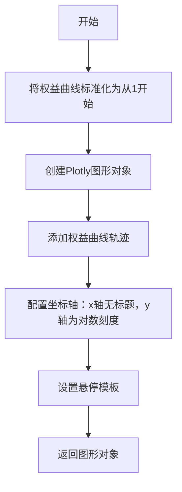
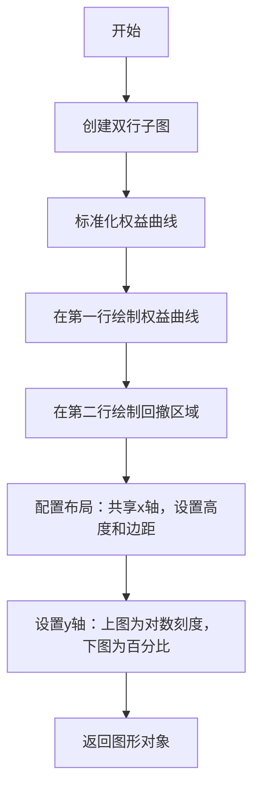
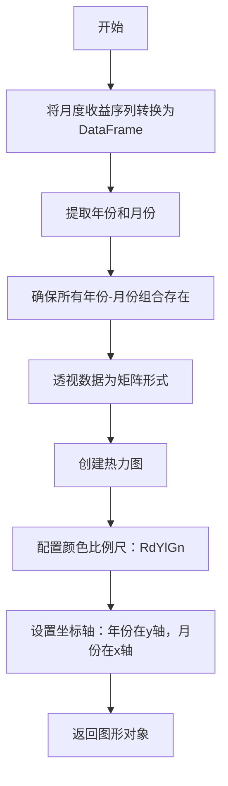
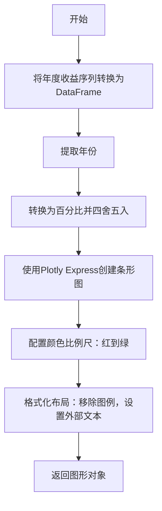
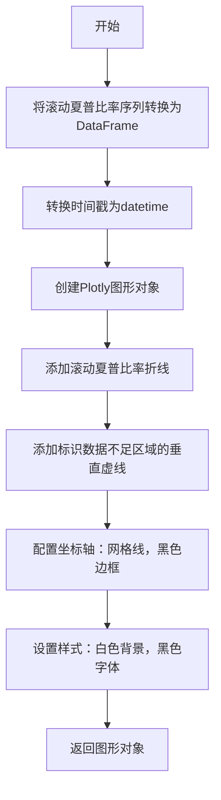
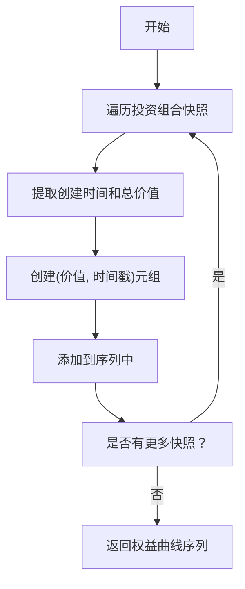
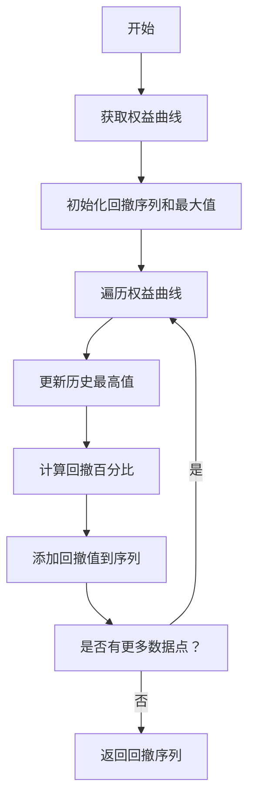
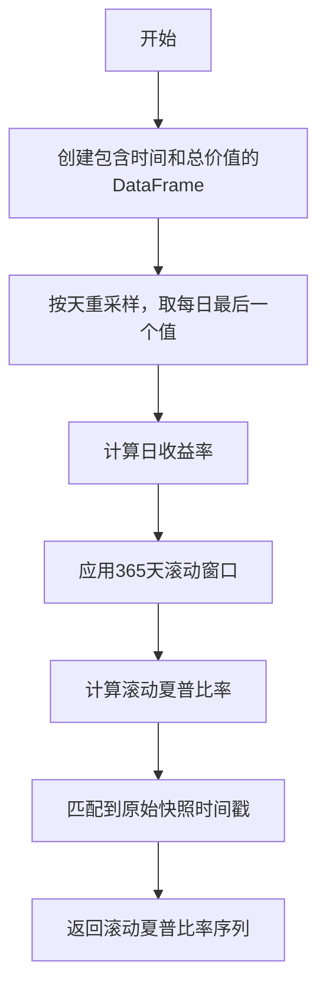
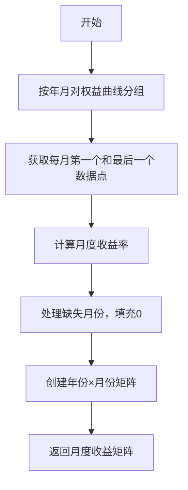
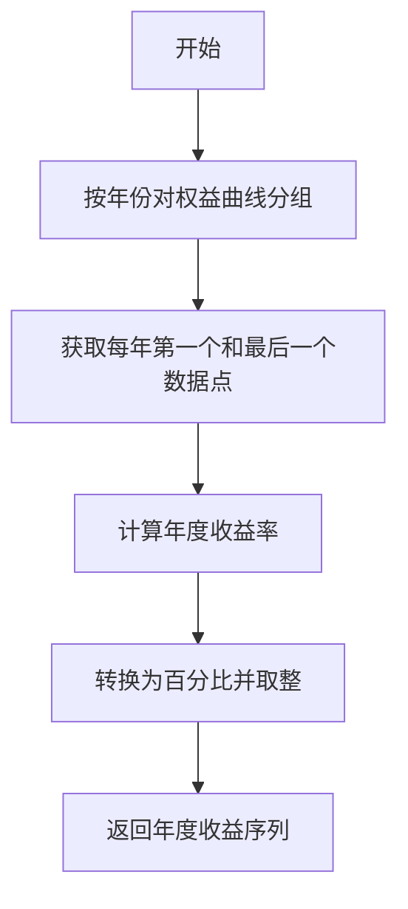

# 可视化图表系统

<cite>
**本文档引用的文件**   
- [equity_curve_drawdown.py](file://investing_algorithm_framework/app/reporting/charts/equity_curve_drawdown.py)
- [equity_curve.py](file://investing_algorithm_framework/app/reporting/charts/equity_curve.py)
- [rolling_sharp_ratio.py](file://investing_algorithm_framework/app/reporting/charts/rolling_sharp_ratio.py)
- [monthly_returns_heatmap.py](file://investing_algorithm_framework/app/reporting/charts/monthly_returns_heatmap.py)
- [yearly_returns_barchart.py](file://investing_algorithm_framework/app/reporting/charts/yearly_returns_barchart.py)
- [backtest_report.py](file://investing_algorithm_framework/app/reporting/backtest_report.py)
- [generate.py](file://investing_algorithm_framework/app/reporting/generate.py)
- [report_template.html.j2](file://investing_algorithm_framework/app/reporting/templates/report_template.html.j2)
- [drawdown.py](file://investing_algorithm_framework/services/metrics/drawdown.py)
- [sharpe_ratio.py](file://investing_algorithm_framework/services/metrics/sharpe_ratio.py)
- [equity_curve.py](file://investing_algorithm_framework/services/metrics/equity_curve.py)
</cite>

## 目录
1. [引言](#引言)
2. [核心图表类型](#核心图表类型)
3. [数据预处理流程](#数据预处理流程)
4. [图表配置与交互功能](#图表配置与交互功能)
5. [Jupyter Notebook集成](#jupyter-notebook集成)
6. [自定义图表扩展](#自定义图表扩展)
7. [性能优化与故障排除](#性能优化与故障排除)

## 引言

可视化图表系统是投资算法框架中的关键组件，用于展示回测结果和金融分析指标。该系统基于Plotly库构建，提供了一系列专业级的金融图表，包括权益曲线图、权益曲线回撤图、月度收益热图、年度收益柱状图和滚动夏普比率图。这些图表不仅提供了直观的视觉展示，还支持交互式探索，帮助用户深入理解策略表现。

系统通过模块化设计将数据计算、图表生成和报告集成分离，确保了高可维护性和可扩展性。所有图表都遵循一致的视觉风格和交互模式，同时支持在Jupyter Notebook环境中无缝嵌入和显示。

**图表来源**
- [equity_curve_drawdown.py](file://investing_algorithm_framework/app/reporting/charts/equity_curve_drawdown.py)
- [rolling_sharp_ratio.py](file://investing_algorithm_framework/app/reporting/charts/rolling_sharp_ratio.py)
- [monthly_returns_heatmap.py](file://investing_algorithm_framework/app/reporting/charts/monthly_returns_heatmap.py)
- [yearly_returns_barchart.py](file://investing_algorithm_framework/app/reporting/charts/yearly_returns_barchart.py)

## 核心图表类型

### 权益曲线图

权益曲线图展示了投资组合价值随时间的变化趋势。该图表采用对数刻度y轴，能够清晰地显示长期增长趋势。图表通过将初始权益标准化为1来实现不同策略之间的可比性。



**图表来源**
- [equity_curve.py](file://investing_algorithm_framework/app/reporting/charts/equity_curve.py)

### 权益曲线回撤图

权益曲线回撤图采用双子图布局，上图显示标准化的权益曲线，下图显示回撤幅度。回撤区域以红色半透明填充，直观地标识出资本损失期。



**图表来源**
- [equity_curve_drawdown.py](file://investing_algorithm_framework/app/reporting/charts/equity_curve_drawdown.py)

### 月度收益热图

月度收益热图以热力图形式展示各年各月的收益表现。颜色从红色（负收益）经黄色过渡到绿色（正收益），便于快速识别表现优劣的月份。



**图表来源**
- [monthly_returns_heatmap.py](file://investing_algorithm_framework/app/reporting/charts/monthly_returns_heatmap.py)

### 年度收益柱状图

年度收益柱状图以条形图形式展示每年的总收益百分比。正值以绿色显示，负值以红色显示，提供清晰的年度表现概览。



**图表来源**
- [yearly_returns_barchart.py](file://investing_algorithm_framework/app/reporting/charts/yearly_returns_barchart.py)

### 滚动夏普比率图

滚动夏普比率图显示了365天滚动窗口内的夏普比率变化。图表包含一条垂直虚线，标识出数据不足365天的区域，提醒用户该区域的比率可能不可靠。



**图表来源**
- [rolling_sharp_ratio.py](file://investing_algorithm_framework/app/reporting/charts/rolling_sharp_ratio.py)

## 数据预处理流程

### 权益曲线数据处理

权益曲线数据处理从投资组合快照中提取总价值，并将其标准化为从1开始的序列。



**图表来源**
- [equity_curve.py](file://investing_algorithm_framework/services/metrics/equity_curve.py)

### 回撤数据处理

回撤数据处理基于权益曲线计算每个时间点的回撤百分比，即当前价值与历史最高价值之间的差额百分比。



**图表来源**
- [drawdown.py](file://investing_algorithm_framework/services/metrics/drawdown.py)

### 滚动夏普比率数据处理

滚动夏普比率数据处理将每日投资组合价值转换为日收益率，然后计算365天滚动窗口内的年化夏普比率。



**图表来源**
- [sharpe_ratio.py](file://investing_algorithm_framework/services/metrics/sharpe_ratio.py)

### 月度收益数据处理

月度收益数据处理将权益曲线数据按月分组，计算每月的累积收益率。



**图表来源**
- [monthly_returns_heatmap.py](file://investing_algorithm_framework/app/reporting/charts/monthly_returns_heatmap.py)

### 年度收益数据处理

年度收益数据处理将权益曲线数据按年分组，计算每年的累积收益率。



**图表来源**
- [yearly_returns_barchart.py](file://investing_algorithm_framework/app/reporting/charts/yearly_returns_barchart.py)

## 图表配置与交互功能

### Plotly参数设置

所有图表都使用一致的Plotly配置参数，确保视觉风格统一。主要配置包括：

- **模板**: 使用`plotly_white`模板，提供清晰的白色背景
- **响应式**: 启用`responsive`配置，确保图表在不同设备上良好显示
- **图例**: 大多数图表禁用图例，通过布局设计提供清晰的信息
- **悬停模式**: 使用`x unified`悬停模式，显示垂直对齐的悬停信息
- **边距**: 最小化边距，最大化数据展示区域

```python
config = {'responsive': True}
fig.update_layout(
    template="plotly_white",
    hovermode="x unified",
    margin=dict(l=0, r=0, t=0, b=0),
    showlegend=False
)
```

**图表来源**
- [equity_curve_drawdown.py](file://investing_algorithm_framework/app/reporting/charts/equity_curve_drawdown.py)
- [rolling_sharp_ratio.py](file://investing_algorithm_framework/app/reporting/charts/rolling_sharp_ratio.py)

### 交互功能实现

系统实现了多种交互功能，提升用户体验：

1. **悬停信息**: 所有图表都提供详细的悬停信息，显示精确的数值和时间
2. **缩放和平移**: 用户可以缩放和平移图表以查看特定时间段的细节
3. **下载图像**: 提供下载图表为PNG图像的功能
4. **跨图表联动**: 在报告中，多个图表共享相同的x轴范围，实现联动浏览

交互功能通过Plotly的内置功能实现，无需额外JavaScript代码。图表导出为HTML时自动包含所有交互功能。

**图表来源**
- [backtest_report.py](file://investing_algorithm_framework/app/reporting/backtest_report.py)
- [generate.py](file://investing_algorithm_framework/app/reporting/generate.py)

## Jupyter Notebook集成

### 嵌入图表

图表可以通过`BacktestReport.show()`方法直接在Jupyter Notebook中显示。该方法自动检测运行环境，如果是Jupyter Notebook，则使用IPython的display功能嵌入HTML内容。

```python
# 在Jupyter Notebook中显示回测报告
report.show(backtest_date_range, browser=False)
```

系统通过检查`get_ipython().__class__.__name__`来确定是否在Jupyter环境中运行，并相应地选择显示方式。

**图表来源**
- [backtest_report.py](file://investing_algorithm_framework/app/reporting/backtest_report.py)

### 自定义显示

用户可以通过修改报告模板来自定义图表显示。模板位于`report_template.html.j2`，使用Jinja2语法，允许用户修改布局、样式和组件顺序。

```html
<div class="grid-container">
    <div class="heatmap-cell">
        {{ monthly_returns_heatmap_html | safe }}
    </div>
    <div class="yearly-returns-cell">
        {{ yearly_returns_histogram_html | safe }}
    </div>
</div>
```

用户可以调整CSS样式、添加新组件或重新排列现有组件，以满足特定的展示需求。

**图表来源**
- [report_template.html.j2](file://investing_algorithm_framework/app/reporting/templates/report_template.html.j2)

## 自定义图表扩展

### 添加新图表类型

要添加新的自定义图表类型，需要遵循以下步骤：

1. 在`investing_algorithm_framework/app/reporting/charts/`目录下创建新的Python文件
2. 实现一个返回Plotly Figure对象的函数
3. 在`__init__.py`中导入新函数并添加到`__all__`
4. 在报告生成代码中调用新图表函数

```python
# 示例：添加新的自定义图表
def get_custom_chart(data):
    fig = go.Figure()
    # 添加自定义图表元素
    return fig
```

**图表来源**
- [__init__.py](file://investing_algorithm_framework/app/reporting/charts/__init__.py)

### 数据格式要求

自定义图表的数据输入应遵循以下格式约定：

- **时间序列数据**: 使用包含"value"和"datetime"列的列表或DataFrame
- **分类数据**: 使用包含"value"和"category"列的列表或DataFrame
- **矩阵数据**: 使用包含"row"、"column"和"value"的列表或DataFrame

所有时间戳应为Python datetime对象或可转换为datetime的字符串。

**图表来源**
- [equity_curve_drawdown.py](file://investing_algorithm_framework/app/reporting/charts/equity_curve_drawdown.py)
- [monthly_returns_heatmap.py](file://investing_algorithm_framework/app/reporting/charts/monthly_returns_heatmap.py)

### 模板集成方法

新图表通过Jinja2模板集成到报告中。在`report_template.html.j2`中添加新的HTML占位符，并在报告生成代码中将图表HTML传递给模板。

```python
# 在generate.py中
custom_fig = get_custom_chart(data)
custom_plot_html = custom_fig.to_html(
    full_html=False, include_plotlyjs='cdn',
    config={'responsive': True}
)

# 在模板中
{{ custom_plot_html | safe }}
```

**图表来源**
- [generate.py](file://investing_algorithm_framework/app/reporting/generate.py)
- [report_template.html.j2](file://investing_algorithm_framework/app/reporting/templates/report_template.html.j2)

## 性能优化与故障排除

### 性能优化建议

1. **数据采样**: 对于长时间序列，考虑对数据进行采样以减少图表复杂度
2. **CDN加载**: 使用`include_plotlyjs='cdn'`从CDN加载Plotly库，减少HTML文件大小
3. **延迟渲染**: 对于包含多个图表的报告，考虑实现延迟渲染，只在需要时加载图表
4. **缓存机制**: 缓存频繁使用的图表，避免重复计算和渲染

```python
# 性能优化的图表导出设置
fig.to_html(
    full_html=False, 
    include_plotlyjs='cdn',  # 从CDN加载Plotly
    config={'responsive': True}, 
    default_width="90%"
)
```

**图表来源**
- [backtest_report.py](file://investing_algorithm_framework/app/reporting/backtest_report.py)

### 常见显示问题解决方案

1. **图表不显示**: 确保Jupyter Notebook环境正确安装了Plotly和IPython
2. **交互功能失效**: 检查是否正确设置了`include_plotlyjs='cdn'`
3. **样式错乱**: 验证CSS类名是否与模板中的定义匹配
4. **数据缺失**: 确保输入数据格式正确，时间戳为有效datetime对象

对于在非Jupyter环境中运行的情况，系统会自动将报告保存到临时文件并使用默认浏览器打开，确保图表始终可访问。

**图表来源**
- [backtest_report.py](file://investing_algorithm_framework/app/reporting/backtest_report.py)
- [generate.py](file://investing_algorithm_framework/app/reporting/generate.py)