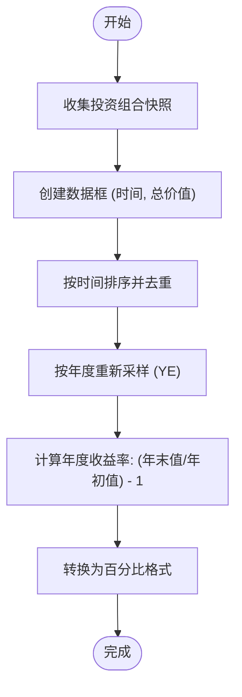
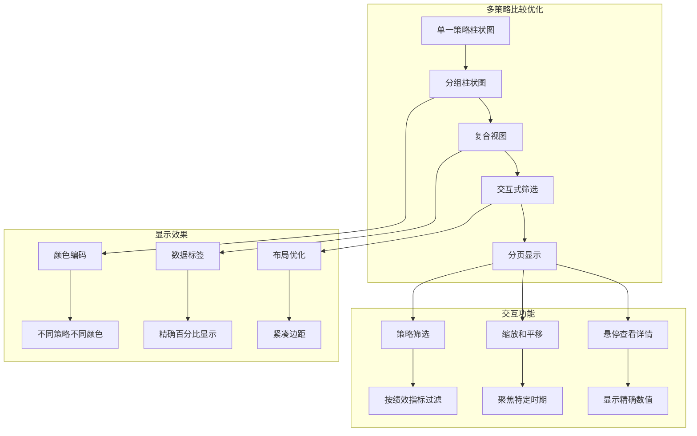

# 年度收益柱状图

<cite>
**本文档引用的文件**
- [yearly_returns_barchart.py](file://investing_algorithm_framework/app/reporting/charts/yearly_returns_barchart.py)
- [returns.py](file://investing_algorithm_framework/services/metrics/returns.py)
- [cagr.py](file://investing_algorithm_framework/services/metrics/cagr.py)
- [backtest_report.py](file://investing_algorithm_framework/app/reporting/backtest_report.py)
- [generate.py](file://investing_algorithm_framework/services/metrics/generate.py)
- [monthly_returns_heatmap.py](file://investing_algorithm_framework/app/reporting/charts/monthly_returns_heatmap.py)
</cite>

## 目录
1. [简介](#简介)
2. [年度收益计算方法](#年度收益计算方法)
3. [柱状图视觉设计](#柱状图视觉设计)
4. [配置选项](#配置选项)
5. [策略比较分析](#策略比较分析)
6. [跨年数据边界处理](#跨年数据边界处理)
7. [多策略并排比较优化](#多策略并排比较优化)
8. [结论](#结论)

## 简介

年度收益柱状图是投资算法框架中用于长期绩效评估的核心可视化工具。该图表通过直观的柱状图形式展示投资组合在不同年份的收益表现，帮助投资者和分析师评估策略的长期稳定性和盈利能力。柱状图集成在回测报告系统中，作为评估投资策略的重要组成部分。

该图表的实现基于投资组合快照数据，通过计算每年末投资组合价值相对于年初的变化率来确定年度收益率。图表不仅展示了收益的绝对值，还通过颜色编码直观地反映了收益的正负情况，使用户能够快速识别表现优异和表现不佳的年份。

**Section sources**
- [yearly_returns_barchart.py](file://investing_algorithm_framework/app/reporting/charts/yearly_returns_barchart.py)
- [backtest_report.py](file://investing_algorithm_framework/app/reporting/backtest_report.py)

## 年度收益计算方法

年度收益的计算基于投资组合快照数据，采用时间加权收益率方法来确保计算的准确性。系统首先收集指定时间段内的所有投资组合快照，然后按年度对这些快照进行分组和处理。

计算过程从创建一个包含快照创建时间和投资组合总价值的数据框开始。为了确保计算的准确性，系统会移除重复的时间戳并按时间顺序排序。然后，使用Pandas的`resample('YE')`方法将数据重新采样为年度频率，该方法使用每年最后一个有效值作为该年度的代表值。

年度收益率的计算公式为：`年度收益率 = (年末投资组合价值 / 年初投资组合价值) - 1`。这一计算方法确保了收益率的计算不受期间内资金流入流出的影响，真正反映了投资策略本身的表现。对于跨年度的回测，系统会计算每个完整年度的收益率，而对于不完整的年度，则根据实际持有期进行计算。

除了年度收益率，系统还实现了复合年增长率（CAGR）的计算，用于标准化不同时间段的回报率。CAGR的计算公式为：`CAGR = (最终价值 / 初始价值) ^ (365 / 天数) - 1`。这种方法使得不同长度的投资期可以进行公平比较，特别适用于评估长期投资策略的表现。



**Diagram sources**
- [returns.py](file://investing_algorithm_framework/services/metrics/returns.py#L44-L80)
- [cagr.py](file://investing_algorithm_framework/services/metrics/cagr.py#L18-L60)

**Section sources**
- [returns.py](file://investing_algorithm_framework/services/metrics/returns.py#L44-L80)
- [cagr.py](file://investing_algorithm_framework/services/metrics/cagr.py#L18-L60)

## 柱状图视觉设计

年度收益柱状图的视觉设计旨在提供清晰、直观的收益表现视图。图表采用Plotly Express库创建，确保了高质量的交互式可视化效果。X轴表示年份，Y轴表示以百分比表示的年度收益率。

图表最显著的视觉特征是使用颜色编码来区分正负收益。系统采用从红色到绿色的连续颜色尺度，其中负收益显示为红色调，正收益显示为绿色调。这种设计使得用户能够立即识别哪些年份实现了盈利，哪些年份出现了亏损，无需仔细阅读具体数值。

数据标签的格式经过精心设计，每个柱子上方都显示了精确的百分比数值。标签使用`texttemplate="%{text}"`和`textposition="outside"`配置，确保数值清晰可见且不会与柱子重叠。此外，图表的高度设置为350像素，边距经过优化，确保在各种显示环境下都有良好的可读性。

Y轴的范围被限制在[-10, 30]之间，这有助于突出显示极端的收益或亏损情况，同时保持图表的紧凑性。X轴使用线性刻度模式，确保年份均匀分布。图表标题"年度收益 (%)"清晰地传达了图表的内容，而图例和颜色尺度图例被禁用，以减少视觉干扰，使用户能够专注于数据本身。

```mermaid
classDiagram
class YearlyReturnsBarChart {
+str title "年度收益 (%)"
+str x_axis_label "时间"
+str y_axis_label ""
+list[int] y_axis_range [-10, 30]
+str color_scale ["red", "green"]
+bool show_legend false
+bool show_color_scale false
+int height 350
+dict margin {l : 0, r : 0, t : 40, b : 20}
+str text_template "%{text}"
+str text_position "outside"
}
class DataProcessing {
+DataFrame convert_to_dataframe(series)
+DateTime convert_to_datetime(column)
+int extract_year(datetime_column)
+float convert_to_percentage(return_column)
+int round_and_convert_to_int(column)
}
YearlyReturnsBarChart --> DataProcessing : "使用"
```

**Diagram sources**
- [yearly_returns_barchart.py](file://investing_algorithm_framework/app/reporting/charts/yearly_returns_barchart.py#L32-L53)

**Section sources**
- [yearly_returns_barchart.py](file://investing_algorithm_framework/app/reporting/charts/yearly_returns_barchart.py#L5-L54)

## 配置选项

年度收益柱状图支持多种配置选项，允许用户根据特定分析需求定制图表的显示。这些配置选项主要通过回测报告系统的参数设置来实现，为用户提供灵活的分析能力。

时间范围筛选是最重要的配置选项之一，允许用户指定分析的起止日期。通过设置`BacktestDateRange`对象，用户可以专注于特定历史时期的表现，如最近五年或某个特定的经济周期。这对于评估策略在不同市场条件下的表现至关重要。

货币单位转换功能允许用户在不同货币基准下查看收益。虽然图表本身显示的是相对收益率（百分比），但底层的回测系统支持以不同货币计价的投资组合价值计算。这使得国际投资者能够以本国货币为基准评估策略表现，消除汇率波动对收益计算的影响。

比较基准设置是另一个关键配置选项，允许用户将策略收益与市场指数或其他基准进行比较。虽然年度收益柱状图本身主要显示单一策略的表现，但回测框架支持创建多个策略的并行回测，从而实现直接的绩效比较。用户可以设置一个基准策略（如买入并持有策略），然后将主动管理策略的表现与之对比。

其他配置选项包括风险自由率设置（用于计算夏普比率等风险调整后收益指标）、数据完整性检查窗口大小，以及是否包含交易成本等。这些选项共同构成了一个全面的策略评估框架，使用户能够从多个角度深入分析投资策略的绩效。

**Section sources**
- [backtest_report.py](file://investing_algorithm_framework/app/reporting/backtest_report.py#L108-L110)
- [generate.py](file://investing_algorithm_framework/services/metrics/generate.py#L40-L41)

## 策略比较分析

年度收益柱状图在策略比较分析中发挥着重要作用，帮助评估不同策略的年度稳定性。通过并排显示多个策略的年度收益柱状图，分析师可以直观地比较它们在不同市场环境下的表现一致性。

在代码实现层面，策略比较分析通过运行多个回测实例来实现。每个策略配置一个独立的回测，系统为每个回测生成完整的绩效指标，包括年度收益数据。然后，这些数据可以被提取并用于创建比较图表。在Jupyter笔记本环境中，用户可以使用`rank_results`函数对多个回测结果进行排序和比较，根据不同的评估重点（如总净收益、胜率等）筛选最佳策略。

以下代码示例展示了如何进行策略比较分析：

```python
# 创建应用实例
app = create_app(config={RESOURCE_DIRECTORY: "./resources"})

# 为不同参数变体创建多个策略
strategies = []
for variant in param_variants:
    strategy = EMACrossoverRSIFFilterStrategy(
        time_unit=TimeUnit.HOUR,
        market=market,
        interval=2,
        **variant,
        metadata={"params": variant}
    )
    strategies.append(strategy)

# 运行向量回测
backtests = app.run_vector_backtests(
    backtest_date_range=evaluation_date_range,
    initial_amount=1000,
    strategies=strategies,
    risk_free_rate=0.027,
)

# 对结果进行排名
ranked = rank_results(
    backtests,
    filter_fn={
        "number_of_trades": lambda x: x > 1,
    },
    focus=evaluation_focuss
)
```

通过分析排名结果，用户可以识别出在多年中表现稳定且收益较高的策略。年度收益柱状图的比较特别有助于识别"幸存者偏差"——即在特定历史时期表现优异但缺乏长期稳定性的策略。真正优秀的策略应该在大多数年份都能产生正收益，且收益波动较小。

**Section sources**
- [exploration.ipynb](file://examples/tutorial/exploration.ipynb#L116-L150)
- [generate.py](file://investing_algorithm_framework/services/metrics/generate.py#L38-L77)

## 跨年数据边界处理

处理跨年数据边界情况是年度收益计算中的关键挑战，系统采用多种策略确保计算的准确性和一致性。当回测期跨越多个完整年度时，系统会为每个完整年度计算一个年度收益率。对于不完整的年度（即回测开始或结束的年份），系统会根据实际持有期计算收益率。

对于回测开始年份，如果开始日期不是1月1日，系统会使用开始日期的投资组合价值作为该年度的"年初"价值，并使用该年12月31日的快照价值作为"年末"价值。同样，对于回测结束年份，如果结束日期不是12月31日，系统会使用该年1月1日的快照价值作为"年初"价值，并使用结束日期的价值作为"年末"价值。

系统还处理了快照数据不完整的情况。在重新采样为年度频率时，`resample('YE')`方法会自动选择每年最后一个有效快照。如果某一年没有快照数据，该年度将不会出现在年度收益计算中。这种处理方式确保了计算结果的可靠性，避免了基于不完整数据的错误推断。

时区信息的处理也是边界情况处理的重要部分。系统会检查快照时间戳是否包含时区信息，如果存在则将其本地化为无时区的时间戳，以避免在日期计算中出现歧义。这种处理确保了在不同地理位置和时区设置下，年度收益计算结果的一致性。

**Section sources**
- [returns.py](file://investing_algorithm_framework/services/metrics/returns.py#L66-L68)
- [returns.py](file://investing_algorithm_framework/services/metrics/returns.py#L70-L73)

## 多策略并排比较优化

为了优化多策略并排比较的显示效果，系统采用了多种技术和设计策略。最直接的方法是将多个策略的年度收益数据整合到一个复合图表中，允许用户在同一视觉空间内直接比较不同策略的表现。

在实现层面，系统可以通过修改`get_yearly_returns_bar_chart`函数来支持多策略数据输入。而不是接受单个年度收益序列，函数可以接受一个包含多个策略收益数据的字典或数据框。然后，使用Plotly的分组柱状图功能，将不同策略的年度收益并排显示，每个策略使用不同的颜色或图案进行区分。

另一种优化方法是创建一个"收益稳定性矩阵"，结合年度收益柱状图和月度收益热力图。这种复合视图可以让用户同时看到年度总体表现和年内波动情况。月度收益热力图使用红-黄-绿颜色尺度，直观地显示了收益的季节性模式和波动性。

对于大量策略的比较，系统支持分页显示和交互式筛选。用户可以通过滑块或下拉菜单选择要比较的策略子集，或根据特定绩效指标（如CAGR、最大回撤等）进行过滤。在Jupyter笔记本环境中，这些交互功能通过Plotly的内置交互能力实现，允许用户缩放、平移和悬停查看详细信息。

这些优化策略共同确保了即使在分析数十个策略时，用户也能获得清晰、有用的信息，避免信息过载，专注于识别真正优秀的投资策略。



**Diagram sources**
- [monthly_returns_heatmap.py](file://investing_algorithm_framework/app/reporting/charts/monthly_returns_heatmap.py#L35-L53)
- [yearly_returns_barchart.py](file://investing_algorithm_framework/app/reporting/charts/yearly_returns_barchart.py#L39-L40)

**Section sources**
- [yearly_returns_barchart.py](file://investing_algorithm_framework/app/reporting/charts/yearly_returns_barchart.py)
- [monthly_returns_heatmap.py](file://investing_algorithm_framework/app/reporting/charts/monthly_returns_heatmap.py)

## 结论

年度收益柱状图作为投资绩效评估的核心工具，通过直观的视觉表示和精确的数学计算，为投资者提供了评估长期策略表现的有力手段。该图表的实现结合了严谨的金融计算方法和现代数据可视化技术，确保了分析结果的准确性和可解释性。

通过时间加权收益率和复合年增长率的计算，系统能够公平地比较不同时间段和不同策略的表现。颜色编码、数据标签和布局优化等视觉设计元素使得复杂的数据变得易于理解，即使是非专业的投资者也能快速把握策略的绩效特征。

配置选项的灵活性和多策略比较功能进一步增强了该工具的实用性，使其不仅适用于单一策略的评估，也适用于复杂的策略优化和选择过程。对跨年数据边界情况的妥善处理确保了计算结果的可靠性，避免了常见的数据处理错误。

总的来说，年度收益柱状图是连接复杂金融计算和直观决策支持的桥梁，帮助投资者在不确定的市场环境中做出更明智的投资决策。