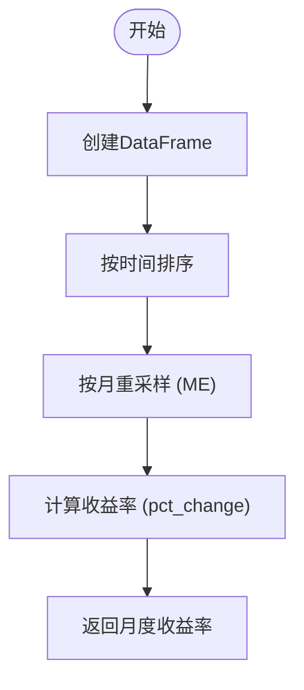
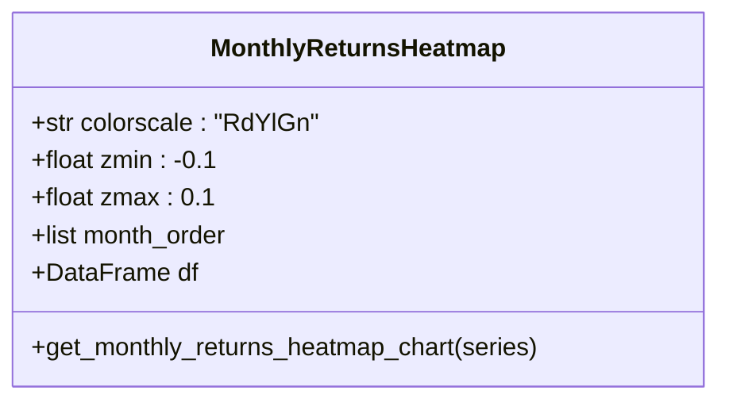

# 月度收益热图

<cite>
**本文档引用的文件**   
- [monthly_returns_heatmap.py](file://investing_algorithm_framework/app/reporting/charts/monthly_returns_heatmap.py)
- [returns.py](file://investing_algorithm_framework/services/metrics/returns.py)
- [backtest_report.py](file://investing_algorithm_framework/app/reporting/backtest_report.py)
- [generate.py](file://investing_algorithm_framework/app/reporting/generate.py)
</cite>

## 目录
1. [简介](#简介)
2. [月度收益热图实现机制](#月度收益热图实现机制)
3. [数据聚合与收益率计算](#数据聚合与收益率计算)
4. [颜色编码与分类逻辑](#颜色编码与分类逻辑)
5. [自定义选项](#自定义选项)
6. [投资组合分析应用](#投资组合分析应用)
7. [缺失数据处理策略](#缺失数据处理策略)
8. [大规模数据集性能优化](#大规模数据集性能优化)

## 简介
月度收益热图是一种用于绩效分析的可视化工具，通过颜色编码的矩阵形式展示投资组合在不同月份的收益表现。该图表能够帮助投资者识别季节性模式和绩效周期，为投资决策提供有力支持。

## 月度收益热图实现机制

月度收益热图的实现主要依赖于 `get_monthly_returns_heatmap_chart` 函数，该函数接收月度收益序列作为输入，并生成相应的热图。热图的生成过程包括数据预处理、矩阵转换和可视化配置。

**月度收益热图实现机制**
- [monthly_returns_heatmap.py](file://investing_algorithm_framework/app/reporting/charts/monthly_returns_heatmap.py#L5-L70)

## 数据聚合与收益率计算

月度收益的计算基于投资组合快照数据，通过时间序列重采样技术将日收益数据聚合为月度收益。具体步骤如下：

1. **数据准备**：从投资组合快照中提取创建时间和总价值。
2. **时间序列重采样**：使用 `resample('ME')` 方法将数据按月重采样，取每月最后一个值。
3. **收益率计算**：计算每月总价值的百分比变化，得到月度收益率。



**数据聚合与收益率计算**
- [returns.py](file://investing_algorithm_framework/services/metrics/returns.py#L10-L41)

## 颜色编码与分类逻辑

热图的颜色编码方案采用 `RdYlGn` 色谱，其中红色表示负收益，绿色表示正收益，黄色表示接近零的收益。颜色强度反映收益的绝对值大小。

分类逻辑包括：
- **正负收益区分**：正值用绿色调表示，负值用红色调表示。
- **波动率分级**：通过设置 `zmin` 和 `zmax` 参数（分别为 -0.1 和 0.1）来标准化颜色映射范围，确保不同规模的收益变化在视觉上具有可比性。



**颜色编码与分类逻辑**
- [monthly_returns_heatmap.py](file://investing_algorithm_framework/app/reporting/charts/monthly_returns_heatmap.py#L48-L52)

## 自定义选项

月度收益热图支持多种自定义选项，以满足不同的分析需求：

- **时间范围选择**：用户可以指定分析的时间范围，系统会自动过滤相关数据。
- **颜色主题**：支持更换颜色主题，如 `Viridis`、`Plasma` 等。
- **单元格标注**：可选择是否显示具体的收益率数值，以及数值的格式（如百分比或小数）。

这些选项通过函数参数传递，允许用户灵活调整图表外观。

**自定义选项**
- [monthly_returns_heatmap.py](file://investing_algorithm_framework/app/reporting/charts/monthly_returns_heatmap.py#L5-L70)

## 投资组合分析应用

在投资组合分析中，月度收益热图可用于识别季节性模式和绩效周期。例如，通过观察热图中特定月份的收益趋势，投资者可以发现某些月份通常表现较好或较差，从而调整投资策略。

代码示例展示了如何生成并使用月度收益热图进行分析：

```python
# 示例代码路径
# file://investing_algorithm_framework/app/reporting/generate.py#L103-L108
```

**投资组合分析应用**
- [generate.py](file://investing_algorithm_framework/app/reporting/generate.py#L103-L108)
- [backtest_report.py](file://investing_algorithm_framework/app/reporting/backtest_report.py#L177-L180)

## 缺失数据处理策略

对于缺失的月度数据，系统采用填充策略确保热图的完整性。具体做法是创建一个包含所有年份和月份的完整数据框，然后与实际数据进行左连接，缺失值填充为 0.0。这样可以保证热图中每个单元格都有值，避免出现空白区域。


**缺失数据处理策略**
- [monthly_returns_heatmap.py](file://investing_algorithm_framework/app/reporting/charts/monthly_returns_heatmap.py#L18-L28)

## 大规模数据集性能优化

为了优化大规模数据集的渲染性能，系统采取了以下措施：

- **数据预处理**：在生成热图前，对数据进行必要的预处理，减少不必要的计算。
- **高效的数据结构**：使用 Pandas DataFrame 进行数据操作，利用其高效的内部实现。
- **批量渲染**：通过 Plotly 的批量渲染功能，一次性生成整个热图，减少渲染开销。

这些优化措施确保了即使在处理大量数据时，热图也能快速生成并流畅显示。

**大规模数据集性能优化**
- [monthly_returns_heatmap.py](file://investing_algorithm_framework/app/reporting/charts/monthly_returns_heatmap.py#L31-L35)
- [backtest_report.py](file://investing_algorithm_framework/app/reporting/backtest_report.py#L177-L180)