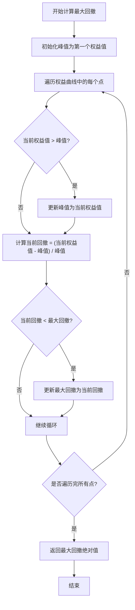
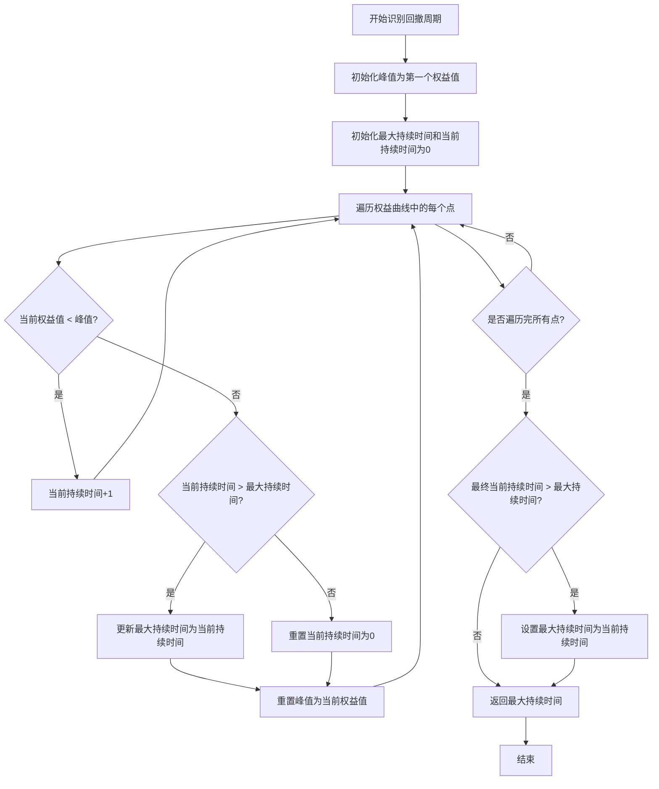
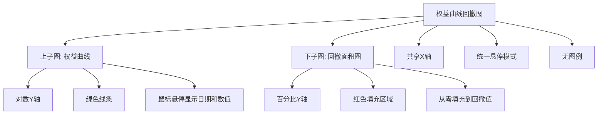
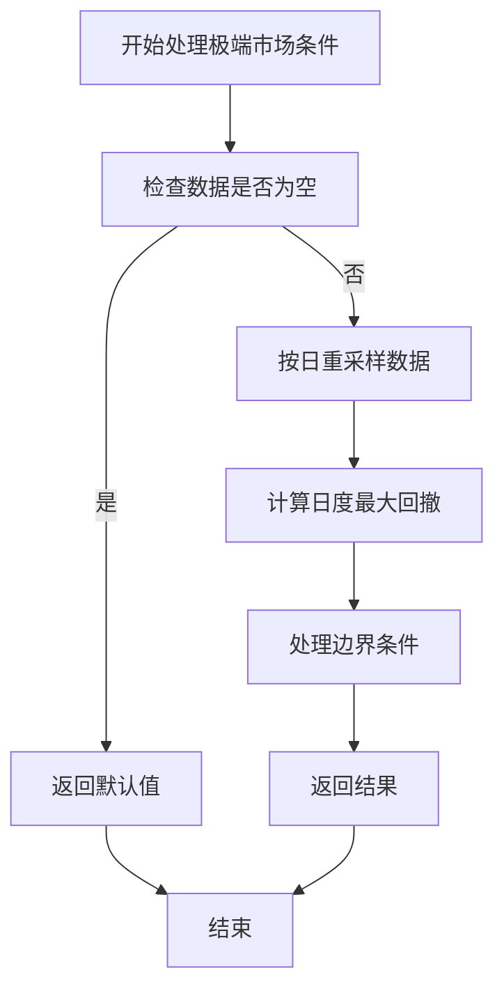

# 权益曲线回撤图

<cite>
**本文档引用文件**   
- [drawdown.py](file://investing_algorithm_framework/services/metrics/drawdown.py)
- [equity_curve_drawdown.py](file://investing_algorithm_framework/app/reporting/charts/equity_curve_drawdown.py)
- [backtest_report.py](file://investing_algorithm_framework/app/reporting/backtest_report.py)
- [equity_curve.py](file://investing_algorithm_framework/services/metrics/equity_curve.py)
- [test_drawdowns.py](file://tests/app/reporting/metrics/test_drawdowns.py)
</cite>

## 目录
1. [引言](#引言)
2. [核心实现机制](#核心实现机制)
3. [最大回撤计算方法](#最大回撤计算方法)
4. [回撤周期识别算法](#回撤周期识别算法)
5. [数据可视化实现](#数据可视化实现)
6. [配置选项说明](#配置选项说明)
7. [实际应用示例](#实际应用示例)
8. [性能优化建议](#性能优化建议)
9. [极端市场条件处理](#极端市场条件处理)
10. [结论](#结论)

## 引言
权益曲线回撤图是投资策略风险分析中的关键可视化工具，用于展示投资组合在历史回测期间的风险特征。该图表通过将原始权益曲线与回撤面积图进行对比展示，帮助投资者识别策略的关键风险事件和最大损失周期。本文档详细说明了该图表在投资算法框架中的实现机制，包括最大回撤的计算方法、回撤周期的识别算法以及相关的性能优化策略。

## 核心实现机制
权益曲线回撤图的实现基于投资组合快照数据，通过计算权益曲线和相应的回撤序列来生成可视化图表。系统首先从回测结果中获取投资组合的快照数据，然后计算权益曲线和回撤序列，最后使用Plotly库生成双子图可视化。

**Section sources**
- [backtest_report.py](file://investing_algorithm_framework/app/reporting/backtest_report.py#L161-L191)
- [equity_curve_drawdown.py](file://investing_algorithm_framework/app/reporting/charts/equity_curve_drawdown.py#L6-L74)

## 最大回撤计算方法
最大回撤（Max Drawdown）是衡量投资组合风险的关键指标，表示从峰值到谷值的最大损失百分比。系统通过以下算法计算最大回撤：



**Diagram sources**
- [drawdown.py](file://investing_algorithm_framework/services/metrics/drawdown.py#L52-L82)

**Section sources**
- [drawdown.py](file://investing_algorithm_framework/services/metrics/drawdown.py#L52-L82)
- [test_drawdowns.py](file://tests/app/reporting/metrics/test_drawdowns.py#L49-L52)

## 回撤周期识别算法
回撤周期识别算法用于确定最大回撤的持续时间，即从峰值开始到恢复到新峰值所需的天数。该算法通过跟踪权益值低于峰值的连续天数来识别回撤周期。



**Diagram sources**
- [drawdown.py](file://investing_algorithm_framework/services/metrics/drawdown.py#L121-L151)

**Section sources**
- [drawdown.py](file://investing_algorithm_framework/services/metrics/drawdown.py#L121-L151)

## 数据可视化实现
权益曲线回撤图采用双子图布局，上图显示对数尺度的权益曲线，下图显示回撤面积图。系统使用Plotly库实现交互式可视化，支持鼠标悬停查看详细信息和缩放功能。



**Diagram sources**
- [equity_curve_drawdown.py](file://investing_algorithm_framework/app/reporting/charts/equity_curve_drawdown.py#L19-L74)

**Section sources**
- [equity_curve_drawdown.py](file://investing_algorithm_framework/app/reporting/charts/equity_curve_drawdown.py#L6-L74)
- [backtest_report.py](file://investing_algorithm_framework/app/reporting/backtest_report.py#L164-L166)

## 配置选项说明
系统提供了多种配置选项来定制回撤图的显示效果，包括颜色映射、交互功能和显示参数。

### 回撤阈值设置
系统支持设置回撤阈值，用于过滤显示的回撤事件。只有超过指定阈值的回撤才会在图表中突出显示。

### 颜色映射
回撤图使用预定义的颜色映射方案：
- 权益曲线：绿色（rgba(0, 128, 0, 0.8)）
- 回撤区域：红色填充（rgba(255, 99, 71, 0.3)）
- 回撤线条：红色（rgba(255, 99, 71, 0.8)）

### 交互功能
图表支持以下交互功能：
- 鼠标悬停显示详细信息
- X轴统一悬停模式
- 响应式布局
- CDN加载Plotly.js以减少文件大小

**Section sources**
- [equity_curve_drawdown.py](file://investing_algorithm_framework/app/reporting/charts/equity_curve_drawdown.py#L34-L51)
- [equity_curve_drawdown.py](file://investing_algorithm_framework/app/reporting/charts/equity_curve_drawdown.py#L58-L72)

## 实际应用示例
在实际回测报告中，权益曲线回撤图被用于识别关键回撤事件和分析风险特征。以下是在代码中使用该图表的示例：

```python
# 获取回测指标
metrics = backtest.get_backtest_metrics(backtest_date_range)

# 生成权益曲线与回撤图表
equity_with_drawdown_fig = get_equity_curve_with_drawdown_chart(
    metrics.equity_curve, 
    metrics.drawdown_series
)

# 将图表转换为HTML
equity_with_drawdown_plot_html = equity_with_drawdown_fig.to_html(
    full_html=False, 
    include_plotlyjs='cdn',
    config={'responsive': True}, 
    default_width="90%"
)
```

**Section sources**
- [backtest_report.py](file://investing_algorithm_framework/app/reporting/backtest_report.py#L164-L170)

## 性能优化建议
为确保在处理大量数据时的性能，系统采用了以下优化策略：

1. **数据预处理优化**：在计算回撤序列时，使用向量化操作而非循环，提高计算效率。
2. **内存管理**：及时释放不再需要的数据对象，避免内存泄漏。
3. **图表渲染优化**：使用CDN加载Plotly.js，减少HTML文件大小，提高加载速度。
4. **数据采样**：对于长时间跨度的回测，可考虑对数据进行适当采样，保持图表的可读性同时减少渲染负担。

**Section sources**
- [backtest_report.py](file://investing_algorithm_framework/app/reporting/backtest_report.py#L168-L170)
- [drawdown.py](file://investing_algorithm_framework/services/metrics/drawdown.py#L98-L103)

## 极端市场条件处理
在极端市场条件下，系统通过以下机制确保回撤图的正确显示：

1. **空数据处理**：当回测结果为空时，系统返回默认值（如最大回撤为0），避免程序异常。
2. **异常值过滤**：在计算日度最大回撤时，使用日线数据而非更细粒度的数据，减少市场噪声的影响。
3. **边界条件处理**：在计算回撤周期时，正确处理回测期开始和结束的边界情况。



**Diagram sources**
- [drawdown.py](file://investing_algorithm_framework/services/metrics/drawdown.py#L108-L119)
- [drawdown.py](file://investing_algorithm_framework/services/metrics/drawdown.py#L69-L70)

**Section sources**
- [drawdown.py](file://investing_algorithm_framework/services/metrics/drawdown.py#L67-L82)
- [drawdown.py](file://investing_algorithm_framework/services/metrics/drawdown.py#L105-L119)

## 结论
权益曲线回撤图是投资策略风险分析的重要工具，通过可视化的方式直观展示了策略的历史风险特征。本文档详细介绍了该图表在投资算法框架中的实现机制，包括最大回撤的计算方法、回撤周期的识别算法以及相关的配置选项和性能优化策略。这些实现确保了图表的准确性、可读性和性能，为投资者提供了可靠的风险分析工具。