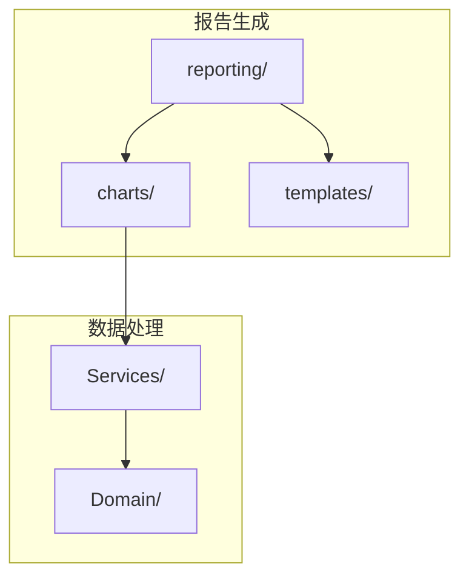
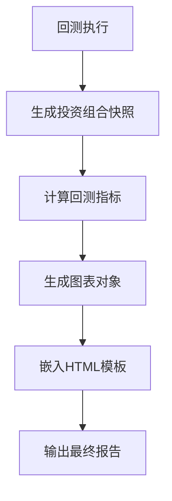
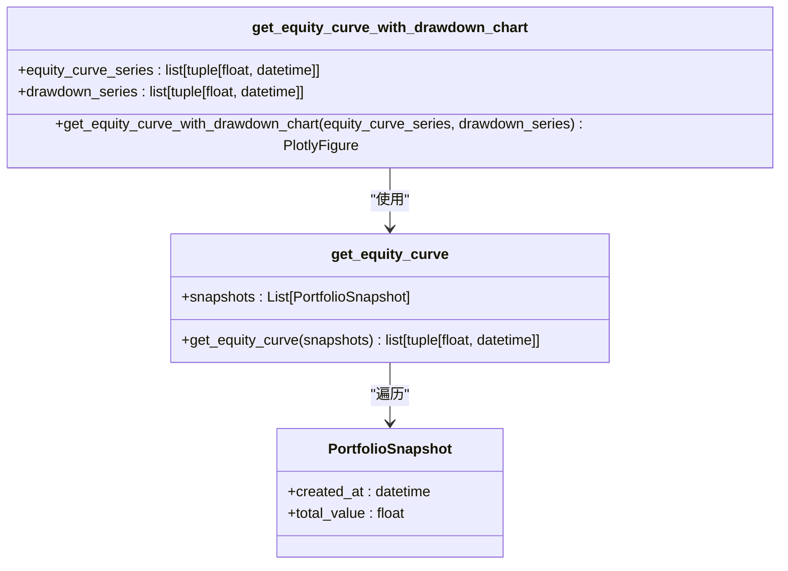
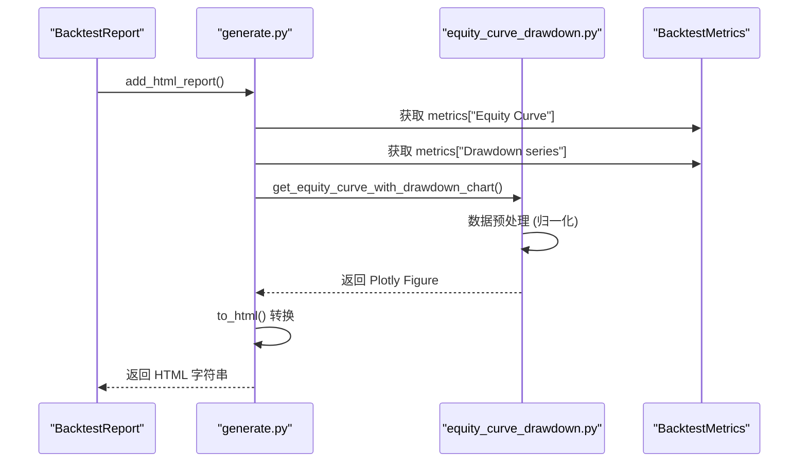
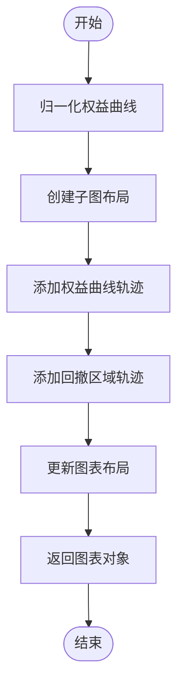
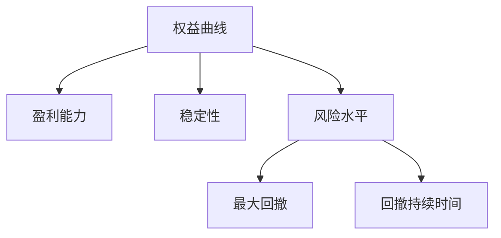
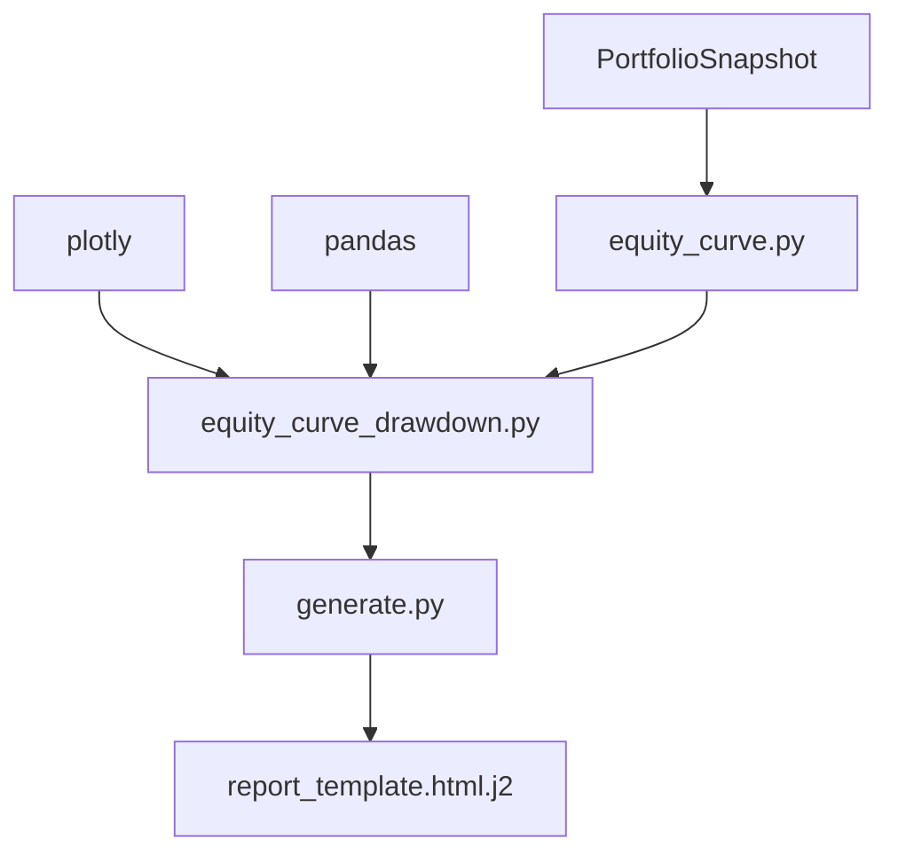

# 权益曲线图

<cite>
**本文档中引用的文件**   
- [equity_curve.py](file://investing_algorithm_framework/app/reporting/charts/equity_curve.py)
- [equity_curve_drawdown.py](file://investing_algorithm_framework/app/reporting/charts/equity_curve_drawdown.py)
- [generate.py](file://investing_algorithm_framework/app/reporting/generate.py)
- [backtest_report.py](file://investing_algorithm_framework/app/reporting/backtest_report.py)
- [equity_curve.py](file://investing_algorithm_framework/services/metrics/equity_curve.py)
- [report_template.html.j2](file://investing_algorithm_framework/app/reporting/templates/report_template.html.j2)
- [run_backtest.ipynb](file://examples/backtest_example/run_backtest.ipynb)
- [metrics.json](file://tests/resources/backtest_reports_for_testing/test_algorithm_backtest/runs/backtest_EUR_20231201_20231202/metrics.json)
</cite>

## 目录
1. [简介](#简介)
2. [项目结构](#项目结构)
3. [核心组件](#核心组件)
4. [架构概述](#架构概述)
5. [详细组件分析](#详细组件分析)
6. [依赖分析](#依赖分析)
7. [性能考虑](#性能考虑)
8. [故障排除指南](#故障排除指南)
9. [结论](#结论)
10. [附录](#附录)（如有必要）

## 简介
本文档详细介绍了投资算法框架中权益曲线图的实现机制，重点阐述了其在回测报告中的应用。文档涵盖了从回测结果中提取时间序列数据和累计收益的数据预处理流程，深入解析了Plotly图表配置参数如线条样式、颜色方案和布局设置。同时提供了在Jupyter Notebook中嵌入和自定义权益曲线图的代码示例，包括调整时间范围、添加基准比较和修改视觉样式的方法。此外，文档还说明了处理大规模数据集的性能优化策略，以及解决数据点重叠或渲染延迟等常见显示问题的方案。

## 项目结构
投资算法框架的项目结构清晰地组织了其功能模块，其中与权益曲线图相关的文件主要集中在`investing_algorithm_framework/app/reporting/`目录下。该目录包含了生成回测报告所需的所有图表、表格和模板。`charts`子目录专门存放各种图表的生成函数，包括权益曲线图、滚动夏普比率图、月度收益热力图等。`templates`目录则存放了用于生成HTML报告的Jinja2模板文件。数据处理和指标计算的相关逻辑分布在`services/metrics`和`domain`等模块中，确保了数据从原始回测结果到可视化图表的完整处理流程。

**图表来源**
- [equity_curve_drawdown.py](file://investing_algorithm_framework/app/reporting/charts/equity_curve_drawdown.py#L1-L75)
- [generate.py](file://investing_algorithm_framework/app/reporting/generate.py#L1-L186)

**章节来源**
- [equity_curve_drawdown.py](file://investing_algorithm_framework/app/reporting/charts/equity_curve_drawdown.py#L1-L75)
- [generate.py](file://investing_algorithm_framework/app/reporting/generate.py#L1-L186)

## 核心组件
权益曲线图的核心实现由`investing_algorithm_framework/app/reporting/charts/equity_curve_drawdown.py`文件中的`get_equity_curve_with_drawdown_chart`函数负责。该函数接收权益曲线序列和回撤序列作为输入，利用Plotly库生成一个包含两个子图的复合图表：上方为主图，展示对数化的累计权益曲线；下方为子图，以填充区域的形式展示回撤情况。数据预处理工作由`investing_algorithm_framework/services/metrics/equity_curve.py`中的`get_equity_curve`函数完成，它从一系列投资组合快照中提取出时间戳和总价值，形成时间序列数据。

**章节来源**
- [equity_curve_drawdown.py](file://investing_algorithm_framework/app/reporting/charts/equity_curve_drawdown.py#L6-L75)
- [equity_curve.py](file://investing_algorithm_framework/services/metrics/equity_curve.py#L6-L25)

## 架构概述
整个权益曲线图的生成流程遵循一个清晰的架构：首先，回测引擎执行策略并生成一系列投资组合快照；然后，`BacktestMetrics`类计算包括权益曲线和回撤在内的各项指标；接着，`generate.py`模块调用`get_equity_curve_with_drawdown_chart`等图表生成函数，将指标数据转换为Plotly图表对象；最后，通过Jinja2模板引擎，将这些图表对象嵌入到HTML报告模板中，生成最终的交互式回测报告。这种分层架构确保了数据处理、图表生成和报告呈现的职责分离。

**图表来源**
- [backtest_report.py](file://investing_algorithm_framework/app/reporting/backtest_report.py#L161-L191)
- [generate.py](file://investing_algorithm_framework/app/reporting/generate.py#L89-L116)

## 详细组件分析

### 权益曲线图组件分析
权益曲线图的实现主要依赖于`get_equity_curve_with_drawdown_chart`函数。该函数首先将输入的权益曲线和回撤序列转换为Pandas DataFrame，以便于数据处理。关键的预处理步骤是将权益曲线归一化，使其从1开始，这通过将所有值除以第一个值来实现。随后，函数使用`make_subplots`创建一个包含两个垂直子图的画布，并分别添加权益曲线和回撤区域的散点图。图表的视觉样式通过`update_layout`方法进行精细配置。

#### 对象导向组件：

**图表来源**
- [equity_curve_drawdown.py](file://investing_algorithm_framework/app/reporting/charts/equity_curve_drawdown.py#L6-L75)
- [equity_curve.py](file://investing_algorithm_framework/services/metrics/equity_curve.py#L6-L25)

#### API/服务组件：

**图表来源**
- [backtest_report.py](file://investing_algorithm_framework/app/reporting/backtest_report.py#L164-L166)
- [generate.py](file://investing_algorithm_framework/app/reporting/generate.py#L89-L95)

#### 复杂逻辑组件：

**图表来源**
- [equity_curve_drawdown.py](file://investing_algorithm_framework/app/reporting/charts/equity_curve_drawdown.py#L14-L74)

**章节来源**
- [equity_curve_drawdown.py](file://investing_algorithm_framework/app/reporting/charts/equity_curve_drawdown.py#L6-L75)
- [equity_curve.py](file://investing_algorithm_framework/services/metrics/equity_curve.py#L6-L25)

### 概念概述
权益曲线图是评估交易策略表现的核心工具，它直观地展示了策略在回测期间的资本增长轨迹。通过观察曲线的斜率、波动性和回撤深度，可以快速判断策略的盈利能力、稳定性和风险水平。对数化坐标轴的使用使得长期增长趋势更加清晰，而下方的回撤图则突出了策略经历的最大资金损失，这对于风险评估至关重要。

## 依赖分析
权益曲线图的生成依赖于多个核心模块。`app/reporting/charts`模块直接依赖`plotly`和`pandas`库进行数据可视化和处理。`services/metrics`模块依赖`domain`模块中的`PortfolioSnapshot`模型来获取原始数据。`app/reporting/generate.py`模块则依赖所有图表生成函数来构建完整的报告。这种依赖关系确保了数据从底层模型到最终可视化的单向流动，避免了循环依赖。

**图表来源**
- [equity_curve_drawdown.py](file://investing_algorithm_framework/app/reporting/charts/equity_curve_drawdown.py#L1-L75)
- [equity_curve.py](file://investing_algorithm_framework/services/metrics/equity_curve.py#L1-L25)
- [generate.py](file://investing_algorithm_framework/app/reporting/generate.py#L1-L186)

**章节来源**
- [equity_curve_drawdown.py](file://investing_algorithm_framework/app/reporting/charts/equity_curve_drawdown.py#L1-L75)
- [equity_curve.py](file://investing_algorithm_framework/services/metrics/equity_curve.py#L1-L25)
- [generate.py](file://investing_algorithm_framework/app/reporting/generate.py#L1-L186)

## 性能考虑
对于大规模数据集，权益曲线图的性能优化主要体现在两个方面：一是数据采样，在生成图表前可以对时间序列数据进行降采样，以减少需要渲染的数据点数量；二是前端优化，通过将`include_plotlyjs`参数设置为'cdn'，可以避免在HTML文件中嵌入庞大的Plotly JavaScript库，从而显著减小文件体积并加快加载速度。此外，使用`full_html=False`参数仅生成图表的HTML片段，也提高了模板渲染的效率。

**章节来源**
- [generate.py](file://investing_algorithm_framework/app/reporting/generate.py#L93-L95)
- [equity_curve_drawdown.py](file://investing_algorithm_framework/app/reporting/charts/equity_curve_drawdown.py#L67-L71)

## 故障排除指南
常见的显示问题包括数据点重叠和渲染延迟。数据点重叠通常发生在数据频率过高时，解决方案是调整数据采样率或使用更粗的时间粒度。渲染延迟则多由数据量过大或网络加载Plotly库缓慢引起，可通过数据降采样和确保使用CDN加载外部库来解决。如果图表无法显示，应检查`metrics.json`文件中是否存在有效的`equity_curve`和`drawdown_series`数据，确保数据源的完整性。

**章节来源**
- [metrics.json](file://tests/resources/backtest_reports_for_testing/test_algorithm_backtest/runs/backtest_EUR_20231201_20231202/metrics.json#L4-L13)
- [generate.py](file://investing_algorithm_framework/app/reporting/generate.py#L93-L95)

## 结论
本文档全面解析了投资算法框架中权益曲线图的实现机制。从数据预处理到图表生成，再到最终的报告集成，整个流程设计精巧且高效。通过深入理解其架构和组件，用户不仅可以有效地使用该功能，还能根据自身需求进行定制和优化。权益曲线图作为回测分析的核心，为评估和比较不同交易策略提供了直观而有力的可视化工具。