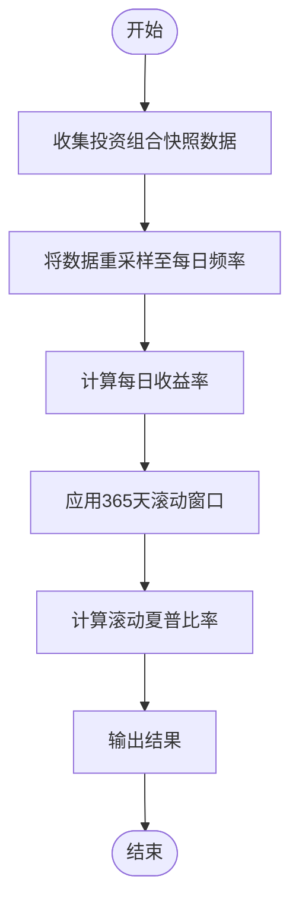
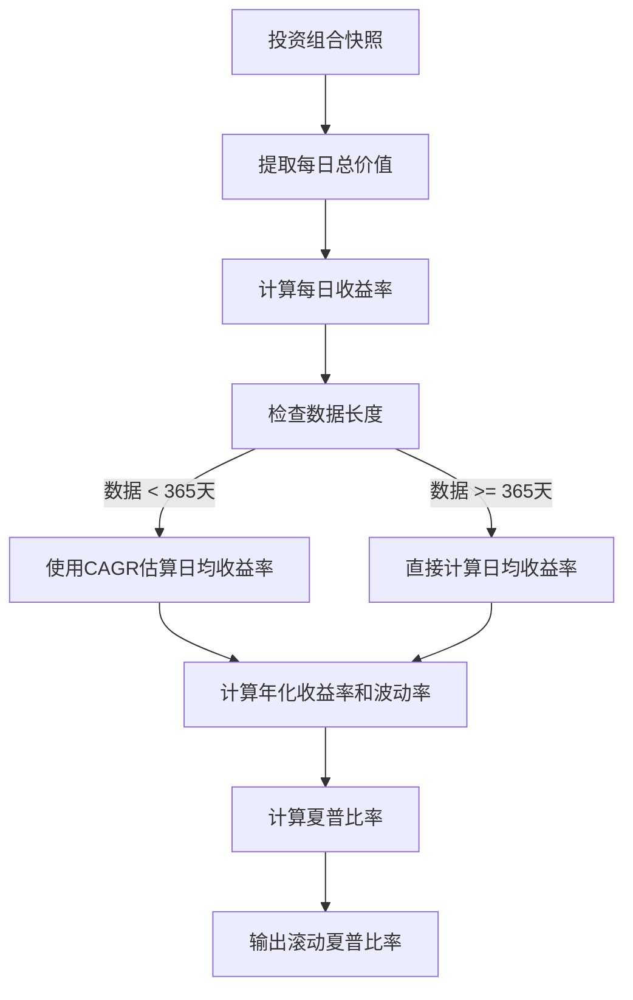

# 滚动夏普比率图

<cite>
**本文档中引用的文件**   
- [sharpe_ratio.py](file://investing_algorithm_framework/services/metrics/sharpe_ratio.py)
- [rolling_sharp_ratio.py](file://investing_algorithm_framework/app/reporting/charts/rolling_sharp_ratio.py)
- [backtest_metrics.py](file://investing_algorithm_framework/domain/backtesting/backtest_metrics.py)
- [backtest_report.py](file://investing_algorithm_framework/app/reporting/backtest_report.py)
- [generate.py](file://investing_algorithm_framework/services/metrics/generate.py)
- [mean_daily_return.py](file://investing_algorithm_framework/services/metrics/mean_daily_return.py)
- [standard_deviation.py](file://investing_algorithm_framework/services/metrics/standard_deviation.py)
- [returns.py](file://investing_algorithm_framework/services/metrics/returns.py)
</cite>

## 目录
1. [简介](#简介)
2. [核心实现机制](#核心实现机制)
3. [滚动窗口计算方法](#滚动窗口计算方法)
4. [配置选项说明](#配置选项说明)
5. [策略稳定性评估中的应用](#策略稳定性评估中的应用)
6. [边界条件与优化](#边界条件与优化)

## 简介
滚动夏普比率图是一种用于风险调整收益分析的重要工具，它通过计算在固定时间窗口（默认为365天）内滚动的夏普比率，来评估投资策略在不同时间段内的风险调整后表现。该图表能够帮助识别策略表现的持续性以及风险特征的变化，为投资者提供关于策略稳定性的深入洞察。

**Section sources**
- [sharpe_ratio.py](file://investing_algorithm_framework/services/metrics/sharpe_ratio.py#L1-L141)
- [rolling_sharp_ratio.py](file://investing_algorithm_framework/app/reporting/charts/rolling_sharp_ratio.py#L1-L80)

## 核心实现机制
滚动夏普比率的计算基于投资组合快照（PortfolioSnapshot）的时间序列数据。系统首先从这些快照中提取每日的投资组合总价值，并计算每日收益率。然后，利用这些收益率数据，在一个固定的滚动窗口（例如365天）上计算夏普比率。

夏普比率的计算公式如下：
- 年化收益率 = (日均收益率 × 365 - 无风险利率)
- 年化波动率 = (日收益率标准差 × √365)
- 夏普比率 = 年化收益率 / 年化波动率

此过程确保了即使在数据频率不一致的情况下也能得到一致的夏普比率估计。

**Diagram sources **
- [sharpe_ratio.py](file://investing_algorithm_framework/services/metrics/sharpe_ratio.py#L93-L141)

**Section sources**
- [sharpe_ratio.py](file://investing_algorithm_framework/services/metrics/sharpe_ratio.py#L93-L141)
- [returns.py](file://investing_algorithm_framework/services/metrics/returns.py#L10-L453)

## 滚动窗口计算方法
滚动窗口的计算方法是滚动夏普比率图的核心。具体步骤包括：
1. **收益率序列处理**：从投资组合快照中提取每日总价值，并计算相邻日期之间的百分比变化作为每日收益率。
2. **无风险利率扣除**：从年化收益率中减去预设的年化无风险利率，以反映超额回报。
3. **标准差计算**：计算每日收益率的标准差，用以衡量投资组合的波动性或风险。

对于不足365天的数据，系统会使用复合年增长率（CAGR）来估算日均收益率，从而避免因数据不足而导致的偏差。

**Diagram sources **
- [sharpe_ratio.py](file://investing_algorithm_framework/services/metrics/sharpe_ratio.py#L106-L141)
- [mean_daily_return.py](file://investing_algorithm_framework/services/metrics/mean_daily_return.py#L7-L65)

**Section sources**
- [sharpe_ratio.py](file://investing_algorithm_framework/services/metrics/sharpe_ratio.py#L106-L141)
- [mean_daily_return.py](file://investing_algorithm_framework/services/metrics/mean_daily_return.py#L7-L65)
- [standard_deviation.py](file://investing_algorithm_framework/services/metrics/standard_deviation.py#L91-L120)

## 配置选项说明
滚动夏普比率图提供了多种配置选项，以适应不同的分析需求：
- **窗口长度调整**：默认窗口大小为365天，但用户可以根据需要调整窗口大小，以观察不同时间尺度下的表现。
- **无风险利率设置**：允许用户指定年化无风险利率，默认值通常设为0.027（即2.7%）。这有助于更准确地反映超额回报。
- **移动平均平滑**：虽然当前实现未直接提供移动平均平滑功能，但可以通过调整窗口大小间接实现一定程度的平滑效果。

此外，系统还支持通过配置文件或API参数动态修改这些设置，以便于进行多场景对比分析。

**Section sources**
- [sharpe_ratio.py](file://investing_algorithm_framework/services/metrics/sharpe_ratio.py#L94-L105)
- [backtest_metrics.py](file://investing_algorithm_framework/domain/backtesting/backtest_metrics.py#L42-L43)

## 策略稳定性评估中的应用
在策略稳定性评估中，滚动夏普比率图被广泛用于识别策略表现的持续性和风险特征变化。通过观察滚动夏普比率随时间的变化趋势，可以判断策略是否在不同市场环境下保持稳定的超额回报能力。例如，如果滚动夏普比率长期维持在较高水平（如大于2），则表明该策略具有较强的风险调整后收益能力；反之，若比率频繁波动或低于1，则可能意味着策略存在较大的不确定性或风险。

此外，结合其他指标如最大回撤、年化波动率等，可以进一步全面评估策略的整体表现。

**Section sources**
- [backtest_report.py](file://investing_algorithm_framework/app/reporting/backtest_report.py#L170-L177)
- [generate.py](file://investing_algorithm_framework/services/metrics/generate.py#L322-L323)

## 边界条件与优化
在处理数据不足的情况时，系统采取了特定的边界条件处理措施。当可用数据少于一年时，系统将采用CAGR来估算日均收益率，以确保即使在数据有限的情况下也能给出合理的夏普比率估计。同时，为了避免除零错误，当标准差为零时，系统会返回NaN值。

为了提高计算效率，系统利用Pandas库的向量化操作对数据进行批量处理，减少了循环迭代带来的性能开销。此外，通过合理选择数据类型和内存管理策略，进一步优化了整体性能。

**Section sources**
- [sharpe_ratio.py](file://investing_algorithm_framework/services/metrics/sharpe_ratio.py#L84-L85)
- [mean_daily_return.py](file://investing_algorithm_framework/services/metrics/mean_daily_return.py#L40-L48)
- [standard_deviation.py](file://investing_algorithm_framework/services/metrics/standard_deviation.py#L102-L120)