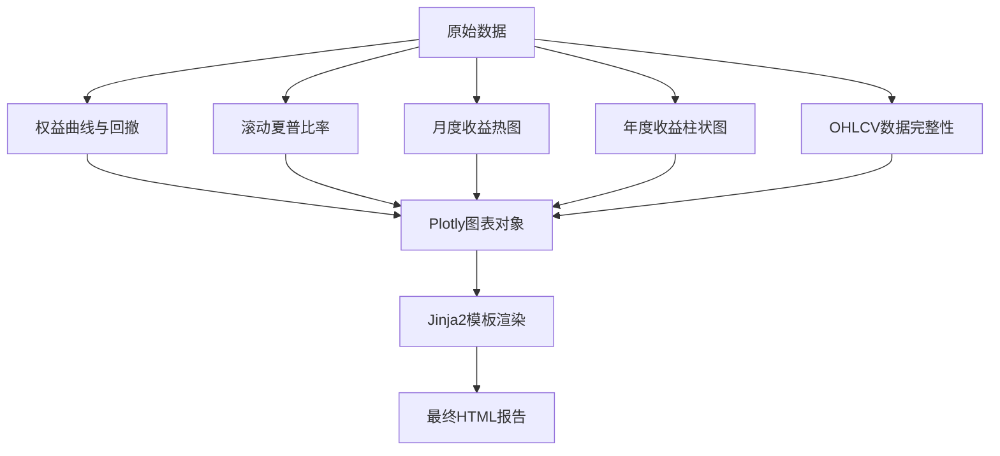
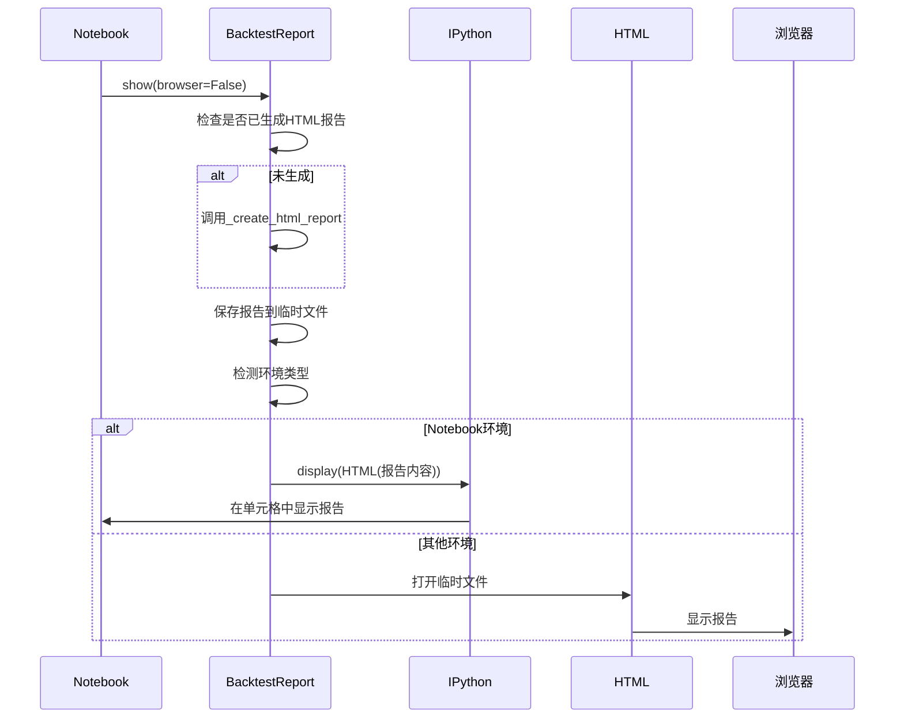
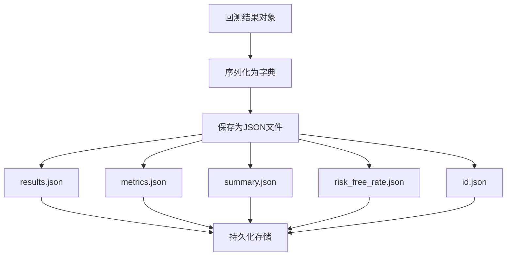
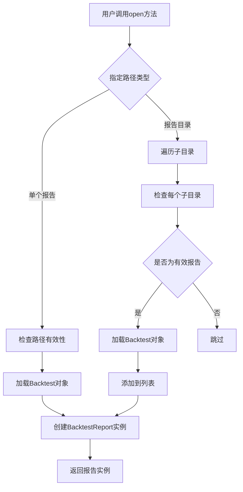
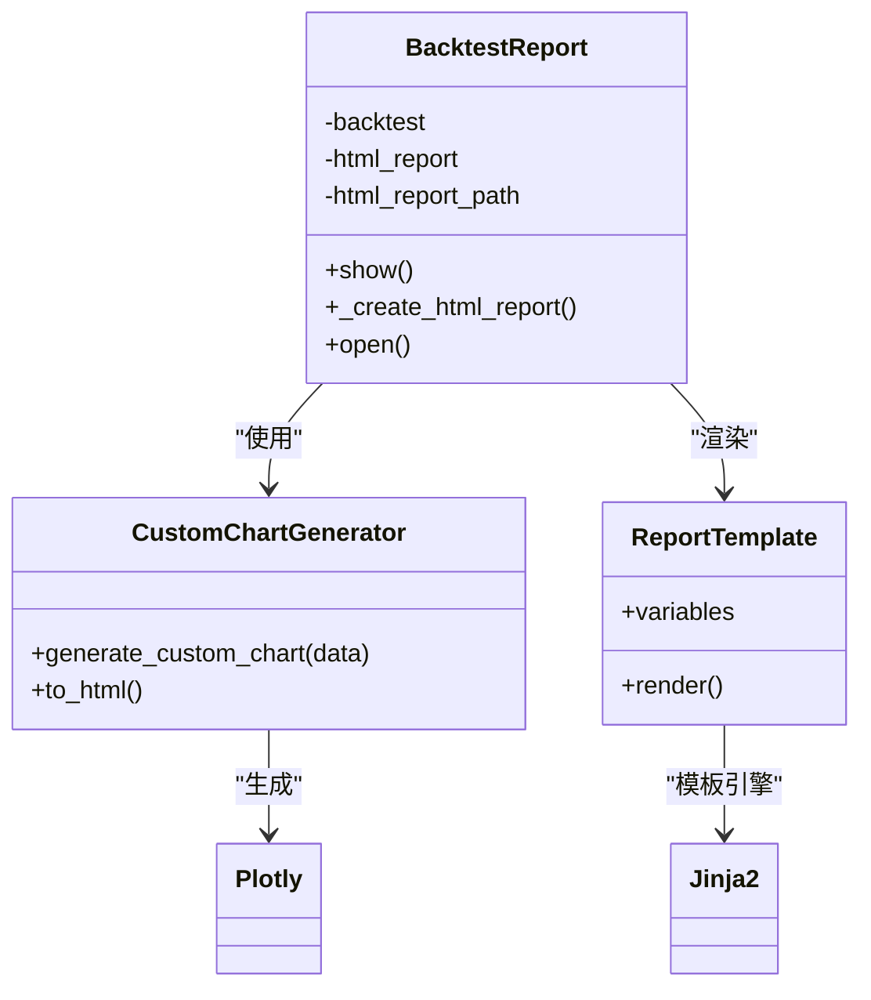

# 回测报告生成

<cite>
**本文档中引用的文件**  
- [backtest_report.py](file://investing_algorithm_framework/app/reporting/backtest_report.py)
- [generate.py](file://investing_algorithm_framework/app/reporting/generate.py)
- [report_template.html.j2](file://investing_algorithm_framework/app/reporting/templates/report_template.html.j2)
- [equity_curve_drawdown.py](file://investing_algorithm_framework/app/reporting/charts/equity_curve_drawdown.py)
- [monthly_returns_heatmap.py](file://investing_algorithm_framework/app/reporting/charts/monthly_returns_heatmap.py)
- [yearly_returns_barchart.py](file://investing_algorithm_framework/app/reporting/charts/yearly_returns_barchart.py)
- [rolling_sharp_ratio.py](file://investing_algorithm_framework/app/reporting/charts/rolling_sharp_ratio.py)
- [key_metrics_table.py](file://investing_algorithm_framework/app/reporting/tables/key_metrics_table.py)
- [trades_table.py](file://investing_algorithm_framework/app/reporting/tables/trades_table.py)
- [ohlcv_data_completeness.py](file://investing_algorithm_framework/app/reporting/charts/ohlcv_data_completeness.py)
- [utils.py](file://investing_algorithm_framework/app/reporting/tables/utils.py)
</cite>

## 目录
1. [简介](#简介)
2. [HTML报告结构组成](#html报告结构组成)
3. [报告模板引擎](#报告模板引擎)
4. [可视化功能](#可视化功能)
5. [图表生成机制](#图表生成机制)
6. [在Notebook环境中嵌入报告图表](#在notebook环境中嵌入报告图表)
7. [报告数据的序列化和持久化](#报告数据的序列化和持久化)
8. [加载历史报告进行比较分析](#加载历史报告进行比较分析)
9. [添加自定义图表和扩展报告功能](#添加自定义图表和扩展报告功能)
10. [总结](#总结)

## 简介
回测报告生成系统是投资算法框架中的核心组件，用于评估和展示交易策略的性能。该系统通过Jinja2模板引擎生成详细的HTML报告，包含摘要、关键指标、交易明细和多种可视化图表。报告不仅提供策略执行结果的全面视图，还支持在Jupyter Notebook等交互式环境中直接展示，便于分析和分享。

**本节不分析具体源文件，因此不提供来源**

## HTML报告结构组成
回测报告采用模块化结构，通过多个组件展示策略的各个方面。报告主要由摘要、关键指标、交易明细和图表展示四部分组成。

报告的HTML结构基于Jinja2模板，通过`report_template.html.j2`文件定义。该模板使用CSS样式和JavaScript实现选项卡式界面，包含"概览"、"交易"、"持仓和订单"和"数据分析"四个标签页。每个标签页展示不同类型的分析内容，用户可以通过点击标签在不同视图间切换。

在"概览"标签页中，报告首先展示权益曲线与回撤图，直观显示策略的整体表现。下方是滚动夏普比率图，反映策略风险调整后收益的稳定性。在网格布局中，左侧是月度收益热图，右侧是年度收益柱状图，便于比较不同时间段的收益表现。

关键指标部分以表格形式展示，包括时间指标、性能指标和交易指标。这些表格使用Pandas的样式功能，根据数值大小应用不同的颜色编码，帮助用户快速识别优劣。交易明细部分则列出所有交易记录，包括交易ID、净收益、入场和出场时间等详细信息。

**本节不分析具体源文件，因此不提供来源**

## 报告模板引擎
报告模板引擎基于Jinja2实现，通过`backtest_report.py`和`generate.py`文件中的代码将数据渲染到HTML模板中。模板引擎的核心是`_create_html_report`方法，该方法收集所有需要的数据和图表，然后将其传递给Jinja2模板进行渲染。

模板引擎的工作流程如下：首先，系统收集回测结果和指标数据；然后，生成各种图表和表格的HTML代码；最后，将这些内容作为变量传递给`report_template.html.j2`模板。模板中的Jinja2语法（如`{{ variable }}`）会被实际内容替换，生成最终的HTML报告。

模板引擎支持高度自定义。用户可以通过修改`report_template.html.j2`文件来改变报告的外观和内容布局。例如，可以调整CSS样式来改变颜色方案，或修改HTML结构来重新排列内容。此外，还可以通过添加新的Jinja2变量来扩展报告内容，如添加新的图表或指标。

**Section sources**
- [backtest_report.py](file://investing_algorithm_framework/app/reporting/backtest_report.py#L139-L257)
- [generate.py](file://investing_algorithm_framework/app/reporting/generate.py#L76-L183)
- [report_template.html.j2](file://investing_algorithm_framework/app/reporting/templates/report_template.html.j2#L1-L155)

## 可视化功能
回测报告系统提供丰富的可视化功能，帮助用户直观理解策略表现。这些功能主要通过Plotly库实现，生成交互式图表，支持缩放、悬停显示详细信息等操作。

系统支持多种图表类型，包括权益曲线图、回撤图、月度收益热图、年度收益柱状图和滚动夏普比率图。这些图表被组织在"概览"标签页中，形成一个综合的性能视图。此外，系统还提供OHLCV数据完整性图表，用于检查输入数据的质量。

在Jupyter Notebook环境中，报告可以通过`show`方法直接嵌入。该方法会检测当前环境是否为Notebook，如果是，则使用IPython的display功能展示HTML内容；否则，会在默认浏览器中打开报告。这种设计使得报告既可以在独立HTML文件中查看，也可以在交互式分析环境中使用。

**Section sources**
- [backtest_report.py](file://investing_algorithm_framework/app/reporting/backtest_report.py#L106-L137)
- [equity_curve_drawdown.py](file://investing_algorithm_framework/app/reporting/charts/equity_curve_drawdown.py#L6-L74)
- [monthly_returns_heatmap.py](file://investing_algorithm_framework/app/reporting/charts/monthly_returns_heatmap.py#L5-L70)
- [yearly_returns_barchart.py](file://investing_algorithm_framework/app/reporting/charts/yearly_returns_barchart.py#L5-L54)
- [rolling_sharp_ratio.py](file://investing_algorithm_framework/app/reporting/charts/rolling_sharp_ratio.py#L5-L79)

## 图表生成机制
回测报告中的各种图表通过专门的函数生成，这些函数位于`investing_algorithm_framework/app/reporting/charts/`目录下。每个图表函数接收相应的数据系列作为输入，使用Plotly创建交互式图表，并返回图表对象。

**Diagram sources**
- [equity_curve_drawdown.py](file://investing_algorithm_framework/app/reporting/charts/equity_curve_drawdown.py#L6-L74)
- [rolling_sharp_ratio.py](file://investing_algorithm_framework/app/reporting/charts/rolling_sharp_ratio.py#L5-L79)
- [monthly_returns_heatmap.py](file://investing_algorithm_framework/app/reporting/charts/monthly_returns_heatmap.py#L5-L70)
- [yearly_returns_barchart.py](file://investing_algorithm_framework/app/reporting/charts/yearly_returns_barchart.py#L5-L54)
- [ohlcv_data_completeness.py](file://investing_algorithm_framework/app/reporting/charts/ohlcv_data_completeness.py#L5-L51)

权益曲线与回撤图使用`make_subplots`创建双子图布局，上方显示对数尺度的权益曲线，下方显示回撤区域。滚动夏普比率图使用简单的折线图展示随时间变化的夏普比率。月度收益热图将月度收益数据转换为矩阵形式，使用红黄绿颜色映射表示收益高低。年度收益柱状图使用Plotly Express的条形图功能，根据收益值自动着色。

所有图表在生成后都会转换为HTML字符串，通过`to_html`方法设置`full_html=False`和`include_plotlyjs='cdn'`，确保图表可以在不同环境中正确显示，同时减少文件大小。

**Section sources**
- [equity_curve_drawdown.py](file://investing_algorithm_framework/app/reporting/charts/equity_curve_drawdown.py#L6-L74)
- [rolling_sharp_ratio.py](file://investing_algorithm_framework/app/reporting/charts/rolling_sharp_ratio.py#L5-L79)
- [monthly_returns_heatmap.py](file://investing_algorithm_framework/app/reporting/charts/monthly_returns_heatmap.py#L5-L70)
- [yearly_returns_barchart.py](file://investing_algorithm_framework/app/reporting/charts/yearly_returns_barchart.py#L5-L54)
- [ohlcv_data_completeness.py](file://investing_algorithm_framework/app/reporting/charts/ohlcv_data_completeness.py#L5-L51)

## 在Notebook环境中嵌入报告图表
在Jupyter Notebook环境中嵌入报告图表是通过`BacktestReport`类的`show`方法实现的。该方法首先检查当前环境是否为Notebook，然后相应地展示报告。

**Diagram sources**
- [backtest_report.py](file://investing_algorithm_framework/app/reporting/backtest_report.py#L106-L137)

当在Notebook中调用`show`方法时，系统会先检查HTML报告是否已生成。如果未生成，则调用`_create_html_report`方法创建报告。然后，系统将报告内容保存到临时文件，并使用`get_ipython`函数检测当前环境。如果在Notebook环境中，系统会使用`IPython.display.display`和`IPython.display.HTML`将报告内容直接嵌入当前单元格；否则，会在默认浏览器中打开报告。

这种方法使得用户可以在Notebook中无缝地查看和分析回测结果，而无需切换到外部浏览器。同时，通过将Plotly JavaScript库设置为CDN引用，确保了图表在Notebook中的交互性。

**Section sources**
- [backtest_report.py](file://investing_algorithm_framework/app/reporting/backtest_report.py#L106-L137)

## 报告数据的序列化和持久化
回测报告的数据通过JSON格式进行序列化和持久化存储。系统使用`Backtest`类的`save`方法将报告数据保存到指定目录，包含多个JSON文件，如`results.json`、`metrics.json`、`summary.json`等。

**Diagram sources**
- [backtest_run.py](file://investing_algorithm_framework/domain/backtesting/backtest_run.py#L284-L299)
- [test_backtest_run.py](file://tests/domain/models/backtesting/test_backtest_run.py#L191-L192)
- [test_backtest_metrics.py](file://tests/domain/models/backtesting/test_backtest_metrics.py#L227-L228)

`results.json`文件包含回测的基本信息，如回测开始和结束日期、创建时间等。`metrics.json`文件包含所有计算的性能指标，如夏普比率、最大回撤等。`summary.json`文件提供回测的摘要信息，便于快速查看关键结果。`risk_free_rate.json`文件存储无风险利率，用于计算风险调整后收益指标。

这种分文件存储的设计使得数据可以被独立访问和处理。例如，用户可以只加载指标数据进行比较分析，而无需加载完整的回测结果。同时，JSON格式的使用确保了数据的可读性和跨平台兼容性。

**Section sources**
- [backtest_run.py](file://investing_algorithm_framework/domain/backtesting/backtest_run.py#L284-L299)
- [test_backtest_run.py](file://tests/domain/models/backtesting/test_backtest_run.py#L191-L192)
- [test_backtest_metrics.py](file://tests/domain/models/backtesting/test_backtest_metrics.py#L227-L228)

## 加载历史报告进行比较分析
系统支持加载历史报告进行比较分析，通过`BacktestReport.open`静态方法实现。该方法可以加载单个报告目录或包含多个报告的目录，便于对不同策略或参数的回测结果进行对比。

**Diagram sources**
- [backtest_report.py](file://investing_algorithm_framework/app/reporting/backtest_report.py#L294-L349)

当加载单个报告时，系统会检查指定路径是否包含`results.json`和`metrics.json`文件，以验证其有效性。当加载报告目录时，系统会递归遍历所有子目录，识别并加载有效的报告。加载后的报告可以用于生成比较报告，或将关键指标提取到DataFrame中进行统计分析。

这种设计使得用户可以轻松地对多个回测结果进行横向比较，识别最优策略或参数组合。例如，可以创建一个包含所有历史报告的仪表板，按不同维度（如夏普比率、最大回撤）排序和筛选。

**Section sources**
- [backtest_report.py](file://investing_algorithm_framework/app/reporting/backtest_report.py#L294-L349)

## 添加自定义图表和扩展报告功能
扩展报告功能主要通过修改或添加图表生成函数和模板变量实现。用户可以在`investing_algorithm_framework/app/reporting/charts/`目录下创建新的图表函数，然后在`_create_html_report`方法中调用这些函数，并将生成的HTML添加到模板变量中。

**Diagram sources**
- [backtest_report.py](file://investing_algorithm_framework/app/reporting/backtest_report.py#L84-L349)
- [equity_curve_drawdown.py](file://investing_algorithm_framework/app/reporting/charts/equity_curve_drawdown.py#L6-L74)

例如，要添加一个新的自定义图表，用户可以创建一个新的Python文件（如`custom_chart.py`），定义一个生成图表的函数。然后，在`backtest_report.py`的`_create_html_report`方法中调用这个函数，并将生成的HTML字符串作为新变量传递给模板。最后，在`report_template.html.j2`中添加相应的HTML代码来显示这个新图表。

此外，用户还可以通过修改表格生成函数来添加新的指标。`key_metrics_table.py`文件中的`create_html_key_metrics_table`函数可以扩展以包含新的性能指标。通过`pandas.DataFrame.style`的`apply`方法，可以为新指标添加条件格式化，使其在视觉上更加突出。

**Section sources**
- [backtest_report.py](file://investing_algorithm_framework/app/reporting/backtest_report.py#L139-L257)
- [key_metrics_table.py](file://investing_algorithm_framework/app/reporting/tables/key_metrics_table.py#L151-L217)
- [trades_table.py](file://investing_algorithm_framework/app/reporting/tables/trades_table.py#L50-L74)

## 总结
回测报告生成系统通过Jinja2模板引擎和Plotly可视化库，为投资策略的评估提供了强大而灵活的工具。系统不仅生成详细的HTML报告，还支持在Notebook环境中直接展示，便于交互式分析。报告的模块化设计和开放的扩展机制使得用户可以根据需要自定义报告内容和外观。

通过合理的数据序列化和持久化策略，系统确保了回测结果的可重现性和可比较性。加载历史报告的功能使得长期策略优化和参数调优成为可能。整体而言，该系统为量化交易策略的开发和评估提供了一个完整的解决方案。

**本节不分析具体源文件，因此不提供来源**