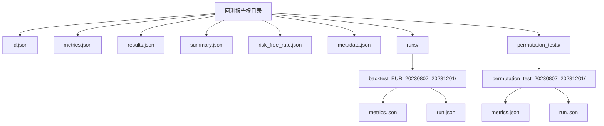
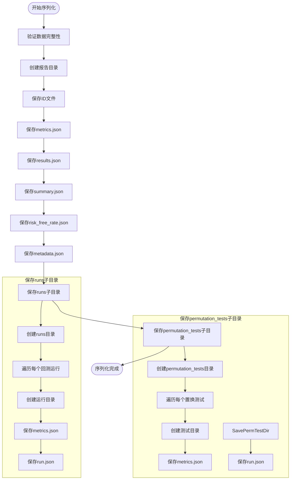
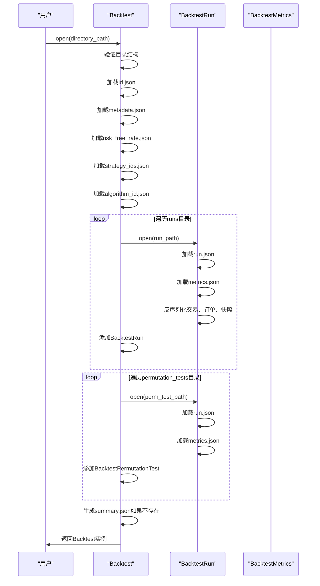
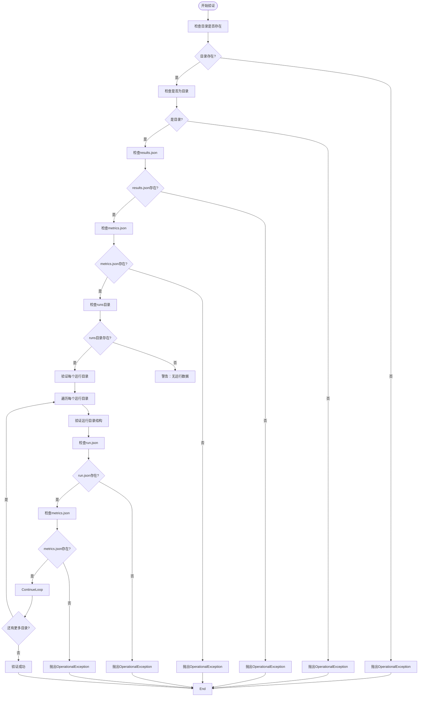

# 报告数据持久化

<cite>
**本文档引用的文件**
- [backtest.py](file://investing_algorithm_framework/domain/backtesting/backtest.py#L1-L504)
- [backtest_run.py](file://investing_algorithm_framework/domain/backtesting/backtest_run.py#L1-L606)
- [backtest_report.py](file://investing_algorithm_framework/app/reporting/backtest_report.py#L1-L350)
- [generate.py](file://investing_algorithm_framework/services/metrics/generate.py#L1-L359)
- [metrics.json](file://tests/resources/backtest_report/metrics.json#L1-L44)
- [results.json](file://tests/resources/backtest_report/results.json#L1-L38)
- [summary.json](file://tests/resources/backtest_report/summary.json#L1-L32)
- [report_template.html.j2](file://investing_algorithm_framework/app/reporting/templates/report_template.html.j2#L1-L155)
- [backtest_service.py](file://investing_algorithm_framework/services/backtesting/backtest_service.py#L1-L652)
- [backtest_summary_metrics.py](file://investing_algorithm_framework/domain/backtesting/backtest_summary_metrics.py#L1-L163)
</cite>

## 目录
1. [引言](#引言)
2. [报告数据存储结构](#报告数据存储结构)
3. [核心数据文件格式](#核心数据文件格式)
4. [序列化与反序列化机制](#序列化与反序列化机制)
5. [报告重建与加载](#报告重建与加载)
6. [数据完整性与错误恢复](#数据完整性与错误恢复)
7. [大规模数据管理与优化](#大规模数据管理与优化)
8. [API使用示例](#api使用示例)
9. [结论](#结论)

## 引言

本报告详细阐述了投资算法框架中的报告数据持久化机制，重点介绍回测结果的序列化和反序列化过程。该系统通过结构化的JSON文件存储回测数据，实现了完整的报告重建、历史数据比较和趋势分析功能。系统设计遵循模块化原则，将不同类型的指标和数据分离存储，确保数据的可读性和可维护性。

**Section sources**
- [backtest.py](file://investing_algorithm_framework/domain/backtesting/backtest.py#L1-L504)
- [backtest_run.py](file://investing_algorithm_framework/domain/backtesting/backtest_run.py#L1-L606)

## 报告数据存储结构

报告数据采用分层目录结构进行组织，确保数据的有序性和可追溯性。每个回测报告都有一个独立的根目录，其中包含核心数据文件和子目录。



**Diagram sources**
- [backtest.py](file://investing_algorithm_framework/domain/backtesting/backtest.py#L320-L390)
- [backtest_run.py](file://investing_algorithm_framework/domain/backtesting/backtest_run.py#L215-L225)

**Section sources**
- [backtest.py](file://investing_algorithm_framework/domain/backtesting/backtest.py#L320-L390)
- [backtest_run.py](file://investing_algorithm_framework/domain/backtesting/backtest_run.py#L215-L225)

## 核心数据文件格式

### metrics.json 文件结构

`metrics.json` 文件存储了回测的核心性能指标，采用标准化的JSON格式，便于程序解析和数据分析。

```json
{
    "backtest_start_date": "2023-08-07T07:59:00",
    "backtest_end_date": "2023-12-01T23:00:00",
    "equity_curve": [1000, 1050, 1030, 1100, ...],
    "total_net_gain": 120.5,
    "total_net_gain_percentage": 12.05,
    "final_value": 1120.5,
    "cagr": 0.15,
    "sharpe_ratio": 1.8,
    "rolling_sharpe_ratio": [1.5, 1.6, 1.7, 1.8, ...],
    "sortino_ratio": 1.4,
    "calmar_ratio": 0.9,
    "profit_factor": 1.6,
    "annual_volatility": 0.18,
    "monthly_returns": [0.02, 0.03, -0.01, 0.04, ...],
    "yearly_returns": [0.15],
    "drawdown_series": [0, 0.02, 0.05, 0.03, ...],
    "max_drawdown": 0.12,
    "max_drawdown_absolute": 120.0,
    "max_daily_drawdown": 0.04,
    "max_drawdown_duration": 15,
    "trades_per_year": 25.5,
    "trade_per_day": 0.07,
    "exposure_ratio": 0.65,
    "cumulative_exposure": 180.5,
    "best_trade": 45.2,
    "worst_trade": -23.1,
    "average_trade_duration": 3.5,
    "number_of_trades": 50,
    "win_rate": 0.6,
    "win_loss_ratio": 1.8,
    "percentage_winning_months": 0.7,
    "percentage_winning_years": 1.0,
    "average_monthly_return": 0.025,
    "average_monthly_return_losing_months": -0.015,
    "average_monthly_return_winning_months": 0.045,
    "best_month": 0.08,
    "best_year": 0.15,
    "worst_month": -0.03,
    "worst_year": 0.15
}
```

**Diagram sources**
- [metrics.json](file://tests/resources/backtest_report/metrics.json#L1-L44)
- [generate.py](file://investing_algorithm_framework/services/metrics/generate.py#L169-L358)

### results.json 文件结构

`results.json` 文件存储了回测的运行结果和元数据，包括交易、订单、投资组合快照等详细信息。

```json
{
    "name": "MACD Divergence Strategy",
    "backtest_date_range_identifier": "2023 Q3 Backtest",
    "backtest_start_date": "2023-08-07 05:00:00",
    "backtest_end_date": "2023-12-01 23:00:00",
    "number_of_runs": 1,
    "symbols": ["BTC/EUR", "ETH/EUR"],
    "number_of_days": 116,
    "number_of_orders": 120,
    "number_of_positions": 2,
    "percentage_positive_trades": 0.62,
    "percentage_negative_trades": 0.38,
    "number_of_trades_closed": 48,
    "number_of_trades_open": 2,
    "total_cost": 240.0,
    "growth_percentage": 12.05,
    "growth": 120.5,
    "initial_unallocated": 1000,
    "trading_symbol": "EUR",
    "total_value": 1120.5,
    "average_trade_duration": 3.5,
    "average_trade_size": 25.0,
    "trades": [
        {
            "id": "123e4567-e89b-12d3-a456-426614174000",
            "target_symbol": "BTC",
            "trading_symbol": "EUR",
            "amount": 0.01,
            "open_price": 25000,
            "opened_at": "2023-08-07T07:00:00",
            "status": "CLOSED",
            "net_gain": 45.2,
            "cost": 250.0
        }
    ],
    "orders": [
        {
            "id": "123e4567-e89b-12d3-a456-426614174001",
            "order_type": "LIMIT",
            "price": 25000,
            "amount": 0.01,
            "target_symbol": "BTC",
            "trading_symbol": "EUR",
            "created_at": "2023-08-07T07:00:00",
            "status": "CLOSED",
            "order_side": "BUY"
        }
    ],
    "portfolio_snapshots": [
        {
            "net_size": null,
            "created_at": "2023-08-07 07:00:00",
            "total_value": 1000,
            "unallocated": 750,
            "total_net_gain": 0
        },
        {
            "net_size": null,
            "created_at": "2023-12-02 00:00:00",
            "total_value": 1120.5,
            "unallocated": 800,
            "total_net_gain": 120.5
        }
    ],
    "created_at": "2023-12-02 10:30:00"
}
```

**Diagram sources**
- [results.json](file://tests/resources/backtest_report/results.json#L1-L38)
- [backtest_run.py](file://investing_algorithm_framework/domain/backtesting/backtest_run.py#L92-L129)

### summary.json 文件结构

`summary.json` 文件存储了多个回测运行的聚合指标，用于跨回测的比较和分析。

```json
{
    "total_net_gain": 120.5,
    "total_net_gain_percentage": 12.05,
    "total_growth": 120.5,
    "total_growth_percentage": 12.05,
    "total_loss": 45.3,
    "total_loss_percentage": 4.53,
    "average_net_gain": 120.5,
    "average_net_gain_percentage": 12.05,
    "average_growth": 120.5,
    "average_growth_percentage": 12.05,
    "average_trade_return": 2.5,
    "average_trade_return_percentage": 0.025,
    "average_trade_loss": 1.8,
    "average_trade_loss_percentage": 0.018,
    "average_trade_gain": 3.2,
    "average_trade_gain_percentage": 0.032,
    "cagr": 0.15,
    "sharpe_ratio": 1.8,
    "sortino_ratio": 1.4,
    "calmar_ratio": 0.9,
    "profit_factor": 1.6,
    "annual_volatility": 0.18,
    "max_drawdown": 0.12,
    "max_drawdown_duration": 15,
    "trades_per_year": 25.5,
    "win_rate": 0.6,
    "win_loss_ratio": 1.8,
    "number_of_trades": 50,
    "cumulative_exposure": 180.5,
    "exposure_ratio": 0.65
}
```

**Diagram sources**
- [summary.json](file://tests/resources/backtest_report/summary.json#L1-L32)
- [backtest_summary_metrics.py](file://investing_algorithm_framework/domain/backtesting/backtest_summary_metrics.py#L94-L137)

## 序列化与反序列化机制

### 序列化过程

序列化过程将内存中的回测对象转换为持久化的JSON文件，确保数据的完整性和一致性。



**Diagram sources**
- [backtest.py](file://investing_algorithm_framework/domain/backtesting/backtest.py#L320-L421)
- [backtest_run.py](file://investing_algorithm_framework/domain/backtesting/backtest_run.py#L227-L300)

### 反序列化过程

反序列化过程从JSON文件重建内存中的回测对象，支持从单个文件或整个目录加载数据。



**Diagram sources**
- [backtest.py](file://investing_algorithm_framework/domain/backtesting/backtest.py#L181-L318)
- [backtest_run.py](file://investing_algorithm_framework/domain/backtesting/backtest_run.py#L132-L213)

**Section sources**
- [backtest.py](file://investing_algorithm_framework/domain/backtesting/backtest.py#L181-L318)
- [backtest_run.py](file://investing_algorithm_framework/domain/backtesting/backtest_run.py#L132-L213)

## 报告重建与加载

### 单个报告加载

系统支持从单个目录加载回测报告，重建完整的Backtest对象。

```python
# 从目录加载单个回测报告
backtest = Backtest.open("/path/to/backtest_report")

# 从Backtest创建报告视图
report = BacktestReport(backtest=backtest)
report.show(backtest_date_range)
```

### 多报告批量加载

系统支持从父目录批量加载多个回测报告，便于进行比较分析。

```python
# 从目录批量加载多个回测报告
backtest_report = BacktestReport.open(
    directory_path="/path/to/backtest_reports_directory"
)
```

### 报告合并

系统提供合并功能，将多个Backtest实例合并为一个，用于聚合分析。

```python
# 合并两个回测报告
merged_backtest = backtest1.merge(backtest2)
```

**Section sources**
- [backtest_report.py](file://investing_algorithm_framework/app/reporting/backtest_report.py#L294-L349)
- [backtest.py](file://investing_algorithm_framework/domain/backtesting/backtest.py#L433-L468)

## 数据完整性与错误恢复

### 数据验证机制

系统在序列化和反序列化过程中实施严格的数据验证，确保数据的完整性和一致性。



**Diagram sources**
- [backtest_report.py](file://investing_algorithm_framework/app/reporting/backtest_report.py#L275-L291)
- [backtest.py](file://investing_algorithm_framework/domain/backtesting/backtest.py#L203-L213)

### 错误恢复策略

当关键文件缺失时，系统能够动态重建部分数据，确保报告的可用性。

```python
# 当summary.json缺失时，系统会自动从运行数据生成
if not os.path.isfile(summary_file):
    # 从加载的回测运行中生成新的摘要
    temp_metrics = []
    for br in backtest_runs:
        if br.backtest_metrics:
            temp_metrics.append(br.backtest_metrics)
    
    backtest_summary_metrics = generate_backtest_summary_metrics(temp_metrics)
```

**Section sources**
- [backtest.py](file://investing_algorithm_framework/domain/backtesting/backtest.py#L262-L277)

## 大规模数据管理与优化

### 目录组织策略

对于大规模回测数据集，建议采用分层目录结构进行管理：

```
backtest_reports/
├── strategy_v1/
│   ├── 2023_Q1/
│   │   ├── backtest_20230101_20230331/
│   │   ├── backtest_20230201_20230430/
│   │   └── ...
│   ├── 2023_Q2/
│   │   ├── backtest_20230401_20230630/
│   │   └── ...
│   └── ...
├── strategy_v2/
│   ├── 2023_Q1/
│   │   ├── backtest_20230101_20230331/
│   │   └── ...
│   └── ...
└── ...
```

### 性能优化建议

1. **索引优化**：为频繁查询的字段（如日期范围、策略ID）建立索引
2. **数据分片**：将大型回测数据集按时间或策略分片存储
3. **缓存机制**：对常用的聚合指标进行缓存
4. **异步处理**：对于大型报告的生成采用异步处理模式

## API使用示例

### 加载历史报告进行比较

```python
# 加载两个历史回测报告
backtest_2023 = Backtest.open("/path/to/2023_report")
backtest_2024 = Backtest.open("/path/to/2024_report")

# 提取关键指标进行比较
comparison_data = {
    "year": ["2023", "2024"],
    "cagr": [backtest_2023.backtest_summary.cagr, backtest_2024.backtest_summary.cagr],
    "sharpe_ratio": [backtest_2023.backtest_summary.sharpe_ratio, backtest_2024.backtest_summary.sharpe_ratio],
    "max_drawdown": [backtest_2023.backtest_summary.max_drawdown, backtest_2024.backtest_summary.max_drawdown],
    "win_rate": [backtest_2023.backtest_summary.win_rate, backtest_2024.backtest_summary.win_rate]
}

# 创建比较图表
import pandas as pd
import matplotlib.pyplot as plt

df = pd.DataFrame(comparison_data)
df.set_index('year').plot(kind='bar', figsize=(10, 6))
plt.title('年度回测指标比较')
plt.ylabel('指标值')
plt.xticks(rotation=0)
plt.legend(bbox_to_anchor=(1.05, 1), loc='upper left')
plt.tight_layout()
plt.show()
```

### 数据合并与趋势分析

```python
# 合并多个回测结果进行趋势分析
backtest_q1 = Backtest.open("/path/to/q1_report")
backtest_q2 = Backtest.open("/path/to/q2_report")
backtest_q3 = Backtest.open("/path/to/q3_report")

# 逐个合并回测
merged = backtest_q1.merge(backtest_q2).merge(backtest_q3)

# 提取时间序列数据进行趋势分析
equity_curves = []
for run in merged.backtest_runs:
    if run.backtest_metrics and run.backtest_metrics.equity_curve:
        equity_curves.append({
            'start_date': run.backtest_start_date,
            'end_date': run.backtest_end_date,
            'final_value': run.backtest_metrics.final_value,
            'cagr': run.backtest_metrics.cagr
        })

# 分析CAGR趋势
import numpy as np
cagrs = [item['cagr'] for item in equity_curves]
trend = np.polyfit(range(len(cagrs)), cagrs, 1)
trend_line = np.poly1d(trend)

print(f"CAGR趋势斜率: {trend[0]:.4f}")
print(f"趋势方向: {'上升' if trend[0] > 0 else '下降'}")
```

### 差异对比分析

```python
def compare_backtests(backtest_a, backtest_b, name_a="A", name_b="B"):
    """
    比较两个回测报告的差异
    """
    summary_a = backtest_a.backtest_summary
    summary_b = backtest_b.backtest_summary
    
    comparison = {
        'metric': [
            'CAGR', 'Sharpe Ratio', 'Max Drawdown', 'Win Rate', 
            'Profit Factor', 'Annual Volatility', 'Total Net Gain'
        ],
        name_a: [
            summary_a.cagr, summary_a.sharpe_ratio, summary_a.max_drawdown,
            summary_a.win_rate, summary_a.profit_factor, 
            summary_a.annual_volatility, summary_a.total_net_gain
        ],
        name_b: [
            summary_b.cagr, summary_b.sharpe_ratio, summary_b.max_drawdown,
            summary_b.win_rate, summary_b.profit_factor, 
            summary_b.annual_volatility, summary_b.total_net_gain
        ],
        'difference': [
            summary_b.cagr - summary_a.cagr,
            summary_b.sharpe_ratio - summary_a.sharpe_ratio,
            summary_b.max_drawdown - summary_a.max_drawdown,
            summary_b.win_rate - summary_a.win_rate,
            summary_b.profit_factor - summary_a.profit_factor,
            summary_b.annual_volatility - summary_a.annual_volatility,
            summary_b.total_net_gain - summary_a.total_net_gain
        ]
    }
    
    return pd.DataFrame(comparison)

# 使用示例
comparison_df = compare_backtests(backtest_strategy_v1, backtest_strategy_v2, "V1", "V2")
print(comparison_df.to_string(index=False))
```

**Section sources**
- [backtest.py](file://investing_algorithm_framework/domain/backtesting/backtest.py#L433-L468)
- [backtest_summary_metrics.py](file://investing_algorithm_framework/domain/backtesting/backtest_summary_metrics.py#L139-L157)

## 结论

本报告详细阐述了投资算法框架中的报告数据持久化机制。该系统通过结构化的JSON文件存储回测数据，实现了完整的序列化、反序列化和报告重建功能。核心设计特点包括：

1. **模块化存储**：将不同类型的数据分离存储，提高数据的可读性和可维护性
2. **分层目录结构**：采用清晰的目录组织方式，便于大规模数据管理
3. **完整的CRUD操作**：支持回测数据的创建、读取、更新和删除
4. **数据完整性验证**：在序列化和反序列化过程中实施严格的数据验证
5. **灵活的加载机制**：支持从单个文件或整个目录加载数据
6. **强大的分析功能**：提供数据合并、比较和趋势分析的API

该持久化机制为回测结果的长期存储、历史比较和策略优化提供了坚实的基础，是投资算法开发和评估流程中的关键组成部分。