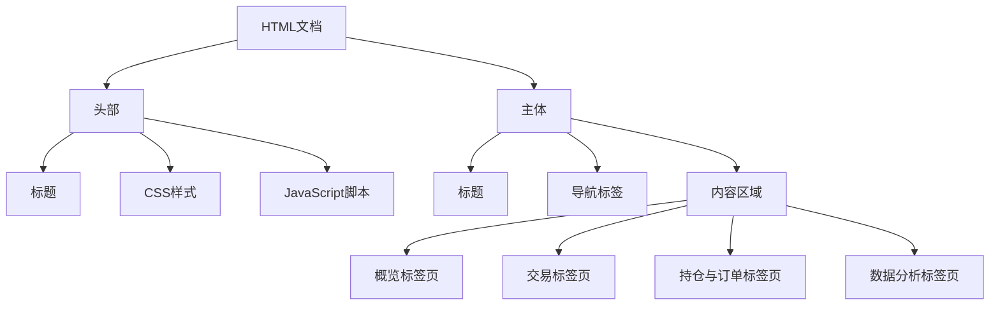
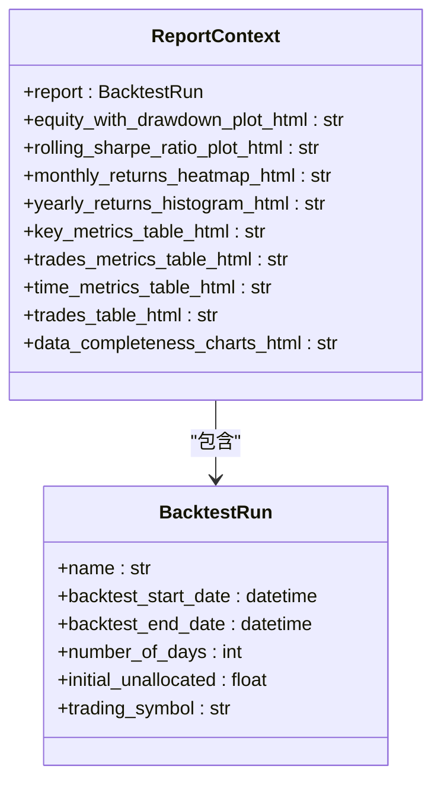
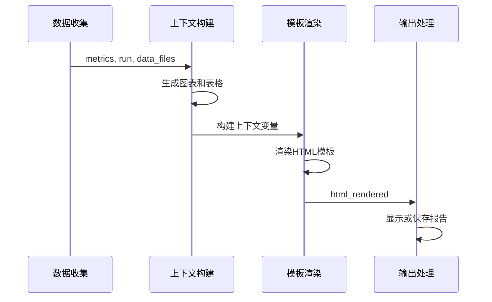
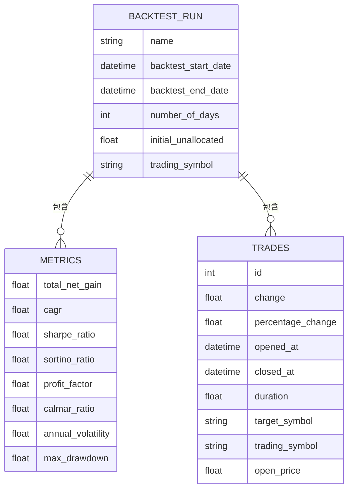

# 报告模板引擎

<cite>
**本文档中引用的文件**  
- [report_template.html.j2](file://investing_algorithm_framework/app/reporting/templates/report_template.html.j2)
- [backtest_report.py](file://investing_algorithm_framework/app/reporting/backtest_report.py)
- [generate.py](file://investing_algorithm_framework/app/reporting/generate.py)
- [key_metrics_table.py](file://investing_algorithm_framework/app/reporting/tables/key_metrics_table.py)
- [trade_metrics_table.py](file://investing_algorithm_framework/app/reporting/tables/trade_metrics_table.py)
- [time_metrics_table.py](file://investing_algorithm_framework/app/reporting/tables/time_metrics_table.py)
- [trades_table.py](file://investing_algorithm_framework/app/reporting/tables/trades_table.py)
- [equity_curve_drawdown.py](file://investing_algorithm_framework/app/reporting/charts/equity_curve_drawdown.py)
- [monthly_returns_heatmap.py](file://investing_algorithm_framework/app/reporting/charts/monthly_returns_heatmap.py)
- [yearly_returns_barchart.py](file://investing_algorithm_framework/app/reporting/charts/yearly_returns_barchart.py)
</cite>

## 目录
1. [简介](#简介)
2. [报告模板结构](#报告模板结构)
3. [变量注入机制](#变量注入机制)
4. [模板渲染流程](#模板渲染流程)
5. [自定义模板开发指南](#自定义模板开发指南)
6. [模板与数据模型映射](#模板与数据模型映射)
7. [多语言与多主题支持](#多语言与多主题支持)
8. [模板调试方法](#模板调试方法)
9. [结论](#结论)

## 简介

报告模板引擎是投资算法框架中的核心组件，负责生成详细的HTML格式回测报告。该引擎基于Jinja2模板系统，通过将后端计算的指标数据注入到HTML模板中，生成包含摘要信息、关键指标、交易表格和图表的完整报告。报告模板引擎不仅提供了可视化分析工具，还支持用户自定义模板以满足特定需求。

**本节来源**
- [backtest_report.py](file://investing_algorithm_framework/app/reporting/backtest_report.py#L1-L350)
- [generate.py](file://investing_algorithm_framework/app/reporting/generate.py#L1-L186)

## 报告模板结构

报告模板`report_template.html.j2`采用标准的HTML5结构，包含CSS样式、JavaScript脚本和Jinja2模板变量。模板设计为响应式布局，支持在不同设备上查看。

模板主要由以下几个部分组成：

1. **头部区域**：包含文档标题、CSS样式定义和JavaScript库引用
2. **导航标签页**：提供"概览"、"交易"、"持仓与订单"和"数据分析"四个标签页
3. **内容区域**：根据标签页显示不同的图表和表格

模板使用内联CSS定义了整体样式，包括字体、颜色、表格样式和响应式布局。同时引入了jQuery和DataTables库，为交易表格提供排序、搜索和分页功能。



**图表来源**
- [report_template.html.j2](file://investing_algorithm_framework/app/reporting/templates/report_template.html.j2#L1-L155)

**本节来源**
- [report_template.html.j2](file://investing_algorithm_framework/app/reporting/templates/report_template.html.j2#L1-L155)

## 变量注入机制

报告模板引擎通过Jinja2模板系统将后端数据注入到HTML模板中。变量注入过程涉及多个关键组件和数据结构。

### 摘要信息

摘要信息通过`report`对象注入，包含回测的基本信息：

- `report.name`：回测报告名称
- `report.backtest_start_date`：回测开始日期
- `report.backtest_end_date`：回测结束日期
- `report.number_of_days`：回测天数
- `report.initial_unallocated`：初始未分配资金

### 关键指标

关键指标分为三类表格注入：

1. **时间指标表格**：包含开始日期、结束日期、盈利月份百分比等时间相关指标
2. **性能指标表格**：包含总回报、CAGR、夏普比率、索提诺比率等核心性能指标
3. **交易指标表格**：包含年化交易次数、胜率、盈亏比等交易相关指标

### 交易表格

交易表格通过`trades_table_html`变量注入，显示所有交易的详细信息，包括：

- 交易标识和交易对
- 净收益（金额和百分比）
- 入场价格和日期
- 出场价格和日期
- 持仓时长

### 图表占位符

图表通过HTML片段变量注入，每个图表变量包含完整的HTML和JavaScript代码：

- `equity_with_drawdown_plot_html`：权益曲线与回撤图表
- `rolling_sharpe_ratio_plot_html`：滚动夏普比率图表
- `monthly_returns_heatmap_html`：月度收益热力图
- `yearly_returns_histogram_html`：年度收益柱状图
- `data_completeness_charts_html`：OHLCV数据完整性图表



**图表来源**
- [report_template.html.j2](file://investing_algorithm_framework/app/reporting/templates/report_template.html.j2#L105-L154)
- [backtest_report.py](file://investing_algorithm_framework/app/reporting/backtest_report.py#L245-L255)

**本节来源**
- [report_template.html.j2](file://investing_algorithm_framework/app/reporting/templates/report_template.html.j2#L105-L154)
- [backtest_report.py](file://investing_algorithm_framework/app/reporting/backtest_report.py#L245-L255)

## 模板渲染流程

模板渲染流程从数据收集开始，经过上下文构建，最终生成HTML输出。整个流程可分为四个主要阶段：

### 数据收集

数据收集阶段从回测结果中提取所需指标：

1. 获取回测指标数据（`metrics`）
2. 获取回测运行结果（`run`）
3. 收集OHLCV数据文件用于完整性分析

### 上下文构建

上下文构建阶段将原始数据转换为模板可用的格式：

1. **图表生成**：使用Plotly库生成交互式图表
2. **表格创建**：使用Pandas Styler创建格式化的HTML表格
3. **变量准备**：将所有生成的内容组织为模板上下文变量

### 模板渲染

模板渲染阶段使用Jinja2引擎将上下文变量注入模板：

1. 设置Jinja2环境和文件系统加载器
2. 加载`report_template.html.j2`模板
3. 调用`template.render()`方法注入所有变量
4. 生成最终的HTML字符串

### 输出处理

输出处理阶段负责将渲染后的HTML报告呈现给用户：

1. 在Jupyter Notebook中直接显示HTML
2. 或保存到临时文件并通过浏览器打开



**图表来源**
- [backtest_report.py](file://investing_algorithm_framework/app/reporting/backtest_report.py#L139-L257)
- [generate.py](file://investing_algorithm_framework/app/reporting/generate.py#L80-L185)

**本节来源**
- [backtest_report.py](file://investing_algorithm_framework/app/reporting/backtest_report.py#L139-L257)
- [generate.py](file://investing_algorithm_framework/app/reporting/generate.py#L80-L185)

## 自定义模板开发指南

### 添加新的数据字段

要添加新的数据字段，需要修改模板和相应的数据准备代码：

1. 在模板中添加新的Jinja2变量占位符：
```html
<p>新指标: {{ new_metric }}</p>
```

2. 在数据准备代码中添加变量：
```python
html_rendered = template.render(
    # ... existing variables
    new_metric=value
)
```

### 修改CSS样式

可以直接在模板的`<style>`标签内修改CSS规则，或添加新的CSS类：

```css
.new-style {
    color: #ff6b6b;
    font-weight: bold;
    font-size: 16px;
}
```

### 修改布局结构

可以重新组织内容区域的布局，例如将图表排列方式从垂直改为水平：

```html
<div class="horizontal-layout">
    <div class="chart-cell">
        {{ equity_with_drawdown_plot_html | safe }}
    </div>
    <div class="chart-cell">
        {{ rolling_sharpe_ratio_plot_html | safe }}
    </div>
</div>
```

### 创建自定义表格

可以创建新的表格来显示特定数据：

```html
<div class="custom-table">
    <h2>自定义指标</h2>
    {{ custom_metrics_table_html | safe }}
</div>
```

然后在Python代码中创建相应的表格生成函数。

**本节来源**
- [report_template.html.j2](file://investing_algorithm_framework/app/reporting/templates/report_template.html.j2#L1-L155)
- [backtest_report.py](file://investing_algorithm_framework/app/reporting/backtest_report.py#L245-L255)

## 模板与数据模型映射

报告模板与后端数据模型之间存在明确的映射关系。理解这种映射对于扩展和维护模板至关重要。

### BacktestRun模型

`BacktestRun`数据模型包含报告所需的基本信息，直接映射到模板中的`report`变量：

- `name` → `{{ report.name }}`
- `backtest_start_date` → 在时间指标表格中使用
- `backtest_end_date` → 在时间指标表格中使用
- `trading_symbol` → 用于格式化货币值

### 指标数据模型

各种指标数据模型通过专门的表格生成函数转换为HTML：

- `equity_curve` → `get_equity_curve_with_drawdown_chart()` → `equity_with_drawdown_plot_html`
- `drawdown_series` → `get_equity_curve_with_drawdown_chart()` → `equity_with_drawdown_plot_html`
- `monthly_returns` → `get_monthly_returns_heatmap_chart()` → `monthly_returns_heatmap_html`
- `yearly_returns` → `get_yearly_returns_bar_chart()` → `yearly_returns_histogram_html`

### 表格数据映射

表格数据通过特定的函数从数据模型转换为HTML：

- `create_html_key_metrics_table()`：将核心性能指标转换为HTML表格
- `create_html_trade_metrics_table()`：将交易指标转换为HTML表格  
- `create_html_time_metrics_table()`：将时间相关指标转换为HTML表格
- `create_html_trades_table()`：将交易记录转换为HTML表格



**图表来源**
- [backtest_report.py](file://investing_algorithm_framework/app/reporting/backtest_report.py#L102-L105)
- [key_metrics_table.py](file://investing_algorithm_framework/app/reporting/tables/key_metrics_table.py#L151-L217)
- [trade_metrics_table.py](file://investing_algorithm_framework/app/reporting/tables/trade_metrics_table.py#L67-L146)

**本节来源**
- [backtest_report.py](file://investing_algorithm_framework/app/reporting/backtest_report.py#L102-L105)
- [key_metrics_table.py](file://investing_algorithm_framework/app/reporting/tables/key_metrics_table.py#L151-L217)
- [trade_metrics_table.py](file://investing_algorithm_framework/app/reporting/tables/trade_metrics_table.py#L67-L146)

## 多语言与多主题支持

### 多语言支持

实现多语言支持需要创建语言包和国际化机制：

1. 创建语言资源文件（如`locales/zh_CN.json`）：
```json
{
    "report_title": "回测报告",
    "overview": "概览",
    "trades": "交易",
    "positions_and_orders": "持仓与订单",
    "data_analysis": "数据分析"
}
```

2. 在模板中使用语言变量：
```html
<h1>{{ translations.report_title }}: {{ report.name }}</h1>
<button class="tablink active" onclick="openTab(event, 'Overview')">{{ translations.overview }}</button>
```

3. 在渲染时注入语言包：
```python
html_rendered = template.render(
    # ... other variables
    translations=load_translations(language)
)
```

### 多主题支持

实现多主题支持可以通过CSS变量和主题切换功能：

1. 定义CSS变量：
```css
:root {
    --primary-color: #007bff;
    --secondary-color: #6c757d;
    --success-color: #28a745;
    --danger-color: #dc3545;
    --background-color: #ffffff;
    --text-color: #212529;
}
```

2. 创建主题CSS文件：
```css
/* dark-theme.css */
:root {
    --primary-color: #0d6efd;
    --secondary-color: #6c757d;
    --success-color: #198754;
    --danger-color: #dc3545;
    --background-color: #212529;
    --text-color: #ffffff;
}
```

3. 在模板中添加主题切换功能：
```html
<select id="theme-selector" onchange="changeTheme(this.value)">
    <option value="light">浅色主题</option>
    <option value="dark">深色主题</option>
</select>

<script>
function changeTheme(theme) {
    document.getElementById('theme-link').href = `${theme}-theme.css`;
}
</script>
```

**本节来源**
- [report_template.html.j2](file://investing_algorithm_framework/app/reporting/templates/report_template.html.j2#L5-L71)
- [backtest_report.py](file://investing_algorithm_framework/app/reporting/backtest_report.py#L245-L255)

## 模板调试方法

### 常见问题及解决方案

1. **变量未定义错误**：
   - 检查变量是否在`template.render()`调用中正确传递
   - 验证数据准备函数是否正确执行
   - 使用Jinja2的`default`过滤器提供默认值

2. **图表不显示**：
   - 检查图表生成函数是否返回有效的HTML
   - 确认外部JavaScript库（如Plotly）是否正确加载
   - 验证图表HTML片段是否使用`| safe`过滤器

3. **样式不生效**：
   - 检查CSS选择器是否正确
   - 验证CSS规则是否被其他样式覆盖
   - 确认内联样式优先级

### 调试工具

1. **日志记录**：
   ```python
   logger.debug(f"Rendering template with variables: {list(context.keys())}")
   ```

2. **模板上下文检查**：
   在开发环境中添加临时代码打印上下文变量：
   ```python
   # 临时调试代码
   print("Available variables:", list(context.keys()))
   for k, v in context.items():
       print(f"{k}: {type(v)}")
   ```

3. **浏览器开发者工具**：
   - 使用控制台检查JavaScript错误
   - 使用元素检查器查看HTML结构和CSS应用情况
   - 使用网络面板确认资源加载状态

4. **单元测试**：
   为模板和数据准备函数编写单元测试，确保各组件正常工作。

**本节来源**
- [backtest_report.py](file://investing_algorithm_framework/app/reporting/backtest_report.py#L245-L257)
- [generate.py](file://investing_algorithm_framework/app/reporting/generate.py#L172-L183)

## 结论

报告模板引擎是投资算法框架中功能强大且灵活的组件，基于Jinja2模板系统实现了高质量的HTML报告生成。通过清晰的模板结构、系统的变量注入机制和完整的渲染流程，该引擎能够将复杂的回测数据转化为直观易懂的可视化报告。

模板引擎的设计具有良好的扩展性，支持自定义模板开发、多语言和多主题功能。通过理解模板与后端数据模型的映射关系，开发者可以轻松扩展报告功能，添加新的指标和可视化元素。

对于模板渲染问题，建议使用系统化的调试方法，包括日志记录、上下文检查、浏览器开发者工具和单元测试，以确保报告生成的稳定性和可靠性。