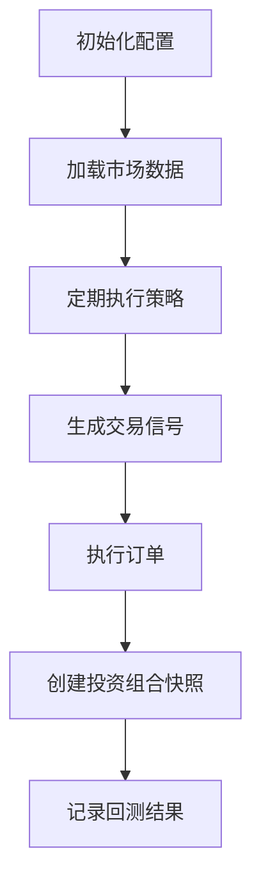
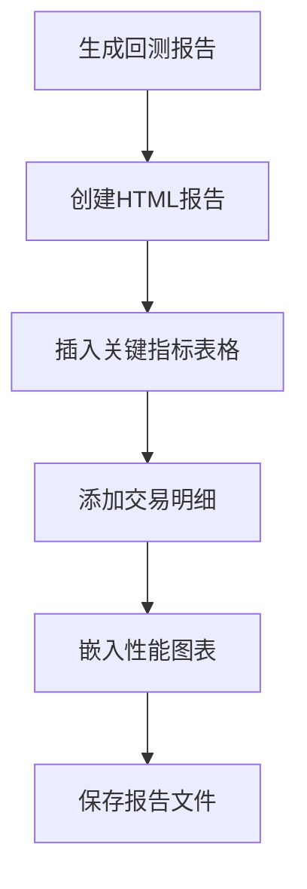

# 回测系统

<cite>
**本文档引用的文件**  
- [backtest.py](file://investing_algorithm_framework/domain/backtesting/backtest.py)
- [backtest_service.py](file://investing_algorithm_framework/services/backtesting/backtest_service.py)
- [backtest_metrics.py](file://investing_algorithm_framework/domain/backtesting/backtest_metrics.py)
- [generate.py](file://investing_algorithm_framework/services/metrics/generate.py)
- [backtest_run.py](file://investing_algorithm_framework/domain/backtesting/backtest_run.py)
- [backtest_report.py](file://investing_algorithm_framework/app/reporting/backtest_report.py)
- [backtest_utils.py](file://investing_algorithm_framework/app/analysis/backtest_utils.py)
- [run_backtest.ipynb](file://examples/backtest_example/run_backtest.ipynb)
- [app.py](file://investing_algorithm_framework/app/app.py)
</cite>

## 目录
1. [引言](#引言)
2. [回测模式](#回测模式)
3. [Backtest类配置与执行](#backtest类配置与执行)
4. [回测结果评估指标](#回测结果评估指标)
5. [回测报告生成与可视化](#回测报告生成与可视化)
6. [Jupyter Notebook示例](#jupyter-notebook示例)
7. [回测与实盘交易的一致性](#回测与实盘交易的一致性)

## 引言
回测系统是投资算法框架的核心组件，用于在历史数据上评估交易策略的性能。该系统支持两种主要的回测模式：事件驱动回测和向量化回测。通过Backtest类，用户可以配置时间范围、初始资本和交易费用等参数，并执行回测以生成详细的性能报告。回测结果包括夏普比率、最大回撤和收益率等关键指标，帮助用户全面评估策略的有效性。

## 回测模式
### 事件驱动回测
事件驱动回测模拟了实盘交易中的事件处理流程。系统根据预定义的时间间隔（如每小时或每天）触发策略执行，检查市场数据并生成交易信号。这种模式能够精确模拟交易过程中的时间延迟和订单执行情况，适用于需要高精度时间控制的策略。

### 向量化回测
向量化回测利用Pandas和NumPy等库对历史数据进行批量处理，快速生成买卖信号。这种方法通过向量化操作提高了计算效率，适合处理大量数据和复杂策略。向量化回测在保持较高准确度的同时，显著减少了回测所需的时间。

**Section sources**
- [backtest_service.py](file://investing_algorithm_framework/services/backtesting/backtest_service.py#L114-L451)
- [app.py](file://investing_algorithm_framework/app/app.py#L1080-L1098)

## Backtest类配置与执行
### 配置参数
Backtest类提供了丰富的配置选项，允许用户自定义回测环境。主要配置参数包括：
- **时间范围**：指定回测的开始和结束日期，确保覆盖足够的市场周期。
- **初始资本**：设置回测开始时的投资金额，影响策略的资金管理和风险控制。
- **交易费用**：定义每次交易的手续费率，更真实地反映实际交易成本。

### 执行流程
回测的执行流程分为以下几个步骤：
1. **初始化配置**：调用`initialize_backtest_config`方法，设置回测的时间范围、初始金额和快照间隔。
2. **数据准备**：加载指定时间范围内的市场数据，包括OHLCV（开盘价、最高价、最低价、收盘价、成交量）数据。
3. **策略执行**：根据时间表定期调用策略的`run`方法，生成交易信号并执行订单。
4. **结果记录**：在每个时间点创建投资组合快照，记录资产价值、未平仓头寸和已成交订单等信息。



**Diagram sources**
- [app.py](file://investing_algorithm_framework/app/app.py#L1342-L1410)
- [backtest_service.py](file://investing_algorithm_framework/services/backtesting/backtest_service.py#L453-L494)

**Section sources**
- [backtest.py](file://investing_algorithm_framework/domain/backtesting/backtest.py#L23-L504)
- [app.py](file://investing_algorithm_framework/app/app.py#L279-L297)

## 回测结果评估指标
### 夏普比率
夏普比率衡量单位风险带来的超额回报，计算公式为：
```
夏普比率 = (年化收益率 - 无风险利率) / 年化波动率
```
较高的夏普比率表示策略在承担相同风险的情况下获得了更高的收益。

### 最大回撤
最大回撤是指投资组合从峰值到谷值的最大跌幅，反映了策略在最坏情况下的损失程度。较低的最大回撤意味着策略具有更好的风险控制能力。

### 收益率
收益率是衡量投资回报的重要指标，包括总收益率和年化收益率。总收益率表示整个回测期间的累计收益，而年化收益率则将总收益转换为年度基准，便于不同时间段的比较。

**Section sources**
- [backtest_metrics.py](file://investing_algorithm_framework/domain/backtesting/backtest_metrics.py#L16-L137)
- [generate.py](file://investing_algorithm_framework/services/metrics/generate.py#L38-L358)

## 回测报告生成与可视化
### 报告生成机制
回测报告通过`BacktestReport`类生成，包含HTML格式的详细分析。报告内容包括关键指标表格、交易明细和性能图表。用户可以通过`show`方法在Jupyter Notebook中直接查看报告。

### 可视化功能
系统提供多种图表来直观展示回测结果：
- **权益曲线**：显示投资组合价值随时间的变化趋势。
- **月度收益热图**：用颜色深浅表示各个月份的收益情况，便于识别季节性模式。
- **滚动夏普比率图**：展示夏普比率随时间的变化，帮助评估策略的稳定性。



**Diagram sources**
- [backtest_report.py](file://investing_algorithm_framework/app/reporting/backtest_report.py#L84-L349)
- [charts](file://investing_algorithm_framework/app/reporting/charts/)

**Section sources**
- [backtest_report.py](file://investing_algorithm_framework/app/reporting/backtest_report.py#L84-L349)
- [backtest_utils.py](file://investing_algorithm_framework/app/analysis/backtest_utils.py#L13-L71)

## Jupyter Notebook示例
### 参数优化
在Jupyter Notebook中，用户可以方便地调整策略参数并运行多次回测，以寻找最优参数组合。例如，通过改变移动平均线的周期，观察其对策略性能的影响。

### 策略比较
用户可以同时运行多个策略的回测，并将结果汇总到一个报告中进行对比。这有助于选择表现最佳的策略，或结合多个策略的优势构建复合策略。

**Section sources**
- [run_backtest.ipynb](file://examples/backtest_example/run_backtest.ipynb)

## 回测与实盘交易的一致性
### 一致性保证
为了确保回测结果与实盘交易的一致性，系统采取了多项措施：
- **精确的时间对齐**：确保回测中的时间戳与实盘数据完全匹配。
- **真实的交易成本**：考虑滑点和手续费，使回测更贴近实际情况。
- **数据完整性检查**：验证历史数据的完整性和准确性，避免因数据缺失导致的偏差。

### 潜在差异
尽管回测系统力求真实，但仍存在一些潜在差异：
- **市场冲击**：大规模交易可能影响市场价格，而回测通常假设价格不变。
- **流动性限制**：某些资产在特定时间可能缺乏足够的流动性，影响订单执行。
- **突发事件**：黑天鹅事件等不可预测因素可能导致实盘表现与回测结果大相径庭。

**Section sources**
- [backtest_service.py](file://investing_algorithm_framework/services/backtesting/backtest_service.py)
- [app.py](file://investing_algorithm_framework/app/app.py)