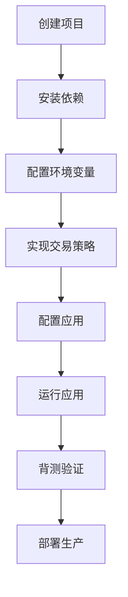
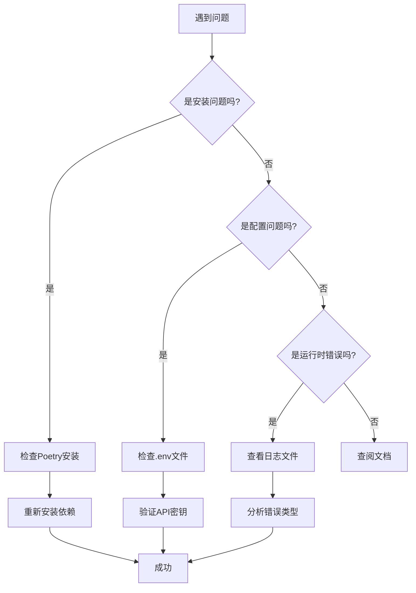

# 快速入门

<cite>
**本文档中引用的文件**  
- [create_app.py](file://investing_algorithm_framework/create_app.py)
- [app.py](file://investing_algorithm_framework/app/app.py)
- [config.py](file://investing_algorithm_framework/domain/config.py)
- [simple_trading_bot_example.py](file://examples/simple_trading_bot_example.py)
- [bitvavo_trading_bot.py](file://examples/bitvavo_trading_bot.py)
- [pyproject.toml](file://pyproject.toml)
- [README.md](file://README.md)
- [initialize_app.py](file://investing_algorithm_framework/cli/initialize_app.py)
- [env.example.template](file://investing_algorithm_framework/cli/templates/env.example.template)
- [app.py.template](file://investing_algorithm_framework/cli/templates/app.py.template)
- [exceptions.py](file://investing_algorithm_framework/domain/exceptions.py)
</cite>

## 目录
1. [安装与依赖管理](#安装与依赖管理)
2. [项目初始化](#项目初始化)
3. [应用实例创建](#应用实例创建)
4. [交易机器人示例](#交易机器人示例)
5. [关键配置选项](#关键配置选项)
6. [环境变量使用](#环境变量使用)
7. [完整工作流程](#完整工作流程)
8. [常见问题与故障排除](#常见问题与故障排除)
9. [最佳实践](#最佳实践)

## 安装与依赖管理

本框架使用Poetry作为依赖管理工具，确保了依赖关系的确定性和可重复性。首先需要安装Poetry，然后通过它来安装框架。

```bash
# 安装Poetry（如果尚未安装）
curl -sSL https://install.python-poetry.org | python3 -

# 克隆项目并安装依赖
git clone https://github.com/coding-kitties/investing-algorithm-framework.git
cd investing-algorithm-framework
poetry install
```

框架的依赖关系在`pyproject.toml`文件中定义，主要依赖包括：
- **Flask**: Web API服务
- **ccxt**: 与多个交易所的集成
- **SQLAlchemy**: 数据库管理
- **polars**: 高性能数据处理
- **python-dotenv**: 环境变量管理

**Section sources**
- [pyproject.toml](file://pyproject.toml#L1-L51)
- [README.md](file://README.md#L414-L422)

## 项目初始化

使用框架提供的CLI工具可以快速初始化一个新项目。这将创建必要的文件结构和配置文件。

```bash
# 初始化默认项目
investing-algorithm-framework init

# 初始化适用于AWS Lambda的项目
investing-algorithm-framework init --type aws_lambda

# 初始化Web应用项目
investing-algorithm-framework init --type default_web
```

初始化过程会创建以下文件和目录：
- `app.py`: 应用程序的入口点
- `strategy.py`: 交易策略实现
- `.env.example`: 环境变量模板
- `requirements.txt`: Python依赖列表
- `strategies/`: 策略模块目录
- `resources/`: 资源文件目录

**Section sources**
- [initialize_app.py](file://investing_algorithm_framework/cli/initialize_app.py#L103-L604)
- [README.md](file://README.md#L107-L126)

## 应用实例创建

通过`create_app()`函数创建应用实例是使用框架的第一步。这个工厂方法负责初始化应用的核心组件。

```python
from investing_algorithm_framework import create_app

# 创建基本应用实例
app = create_app()

# 创建带有配置的应用实例
config = {
    "environment": "development",
    "resource_directory": "resources"
}
app = create_app(config=config)

# 创建Web应用实例
app = create_app(web=True)
```

`create_app()`函数的主要参数：
- `config`: 配置字典，用于设置应用参数
- `web`: 布尔值，指示是否创建Web应用
- `state_handler`: 状态处理器，用于持久化应用状态
- `name`: 应用名称

**Section sources**
- [create_app.py](file://investing_algorithm_framework/create_app.py#L13-L55)
- [app.py](file://investing_algorithm_framework/app/app.py#L63-L81)

## 交易机器人示例

下面是一个完整的简单交易机器人示例，实现了基于RSI和EMA指标的交易策略。

```python
from investing_algorithm_framework import TradingStrategy, DataSource, TimeUnit, create_app
from datetime import datetime, timezone

class RSIEMACrossoverStrategy(TradingStrategy):
    time_unit = TimeUnit.HOUR
    interval = 2
    symbols = ["BTC"]

    def __init__(self, market, rsi_period=14, ema_short_period=12, ema_long_period=26):
        self.rsi_period = rsi_period
        self.ema_short_period = ema_short_period
        self.ema_long_period = ema_long_period
        
        data_sources = [
            DataSource(
                identifier="btc_ohlcv",
                data_type="OHLCV",
                market=market,
                symbol="BTC/EUR",
                time_frame="2h",
                window_size=800
            )
        ]
        
        super().__init__(data_sources=data_sources, time_unit=TimeUnit.HOUR, interval=2)

    def generate_buy_signals(self, data):
        # 实现买入信号生成逻辑
        pass

    def generate_sell_signals(self, data):
        # 实现卖出信号生成逻辑
        pass

if __name__ == "__main__":
    app = create_app()
    app.add_strategy(RSIEMACrossoverStrategy(market="bitvavo"))
    app.add_market(market="bitvavo", trading_symbol="EUR")
    app.run()
```

**Section sources**
- [simple_trading_bot_example.py](file://examples/simple_trading_bot_example.py#L12-L254)
- [bitvavo_trading_bot.py](file://examples/bitvavo_trading_bot.py#L23-L45)

## 关键配置选项

框架提供了多种配置选项来定制应用行为。这些配置可以通过字典传递给`create_app()`函数或通过环境变量设置。

### 主要配置参数

| 配置项 | 描述 | 默认值 |
|--------|------|--------|
| `environment` | 运行环境 (DEV, PROD, TEST, BACKTEST) | PROD |
| `resource_directory` | 资源文件目录路径 | 当前工作目录下的resources |
| `database_directory_path` | 数据库文件目录路径 | resource_directory/databases |
| `app_mode` | 应用模式 (WEB, DEFAULT) | DEFAULT |
| `logging_config` | 日志配置 | DEFAULT_LOGGING_CONFIG |

### 配置示例

```python
config = {
    "environment": "development",
    "resource_directory": "/path/to/resources",
    "app_mode": "WEB",
    "logging_config": {
        "version": 1,
        "disable_existing_loggers": False,
        "formatters": {
            "default": {
                "format": "%(asctime)s - %(name)s - %(levelname)s - %(message)s"
            }
        },
        "handlers": {
            "console": {
                "class": "logging.StreamHandler",
                "formatter": "default"
            }
        },
        "loggers": {
            "investing_algorithm_framework": {
                "level": "INFO",
                "handlers": ["console"]
            }
        }
    }
}
```

**Section sources**
- [config.py](file://investing_algorithm_framework/domain/config.py#L9-L112)
- [app.py](file://investing_algorithm_framework/app/app.py#L229-L328)

## 环境变量使用

环境变量是管理敏感信息（如API密钥）的安全方式。框架通过`.env`文件和环境变量模板来管理这些配置。

### 环境变量模板

框架提供了`.env.example.template`文件作为模板：

```
<MARKET>_API_KEY=your_api_key
<MARKET>_API_SECRET=your_api_secret
```

### 使用方法

1. 复制模板文件：
```bash
cp .env.example .env
```

2. 编辑`.env`文件，填入实际的API密钥：
```
BINANCE_API_KEY=your_binance_api_key
BINANCE_API_SECRET=your_binance_api_secret
BITVAVO_API_KEY=your_bitvavo_api_key
BITVAVO_API_SECRET=your_bitvavo_api_secret
```

3. 在代码中加载环境变量：
```python
from dotenv import load_dotenv
load_dotenv()  # 加载.env文件中的环境变量
```

当创建`MarketCredential`时，如果未直接提供API密钥，框架会自动从相应环境变量中读取。

**Section sources**
- [env.example.template](file://investing_algorithm_framework/cli/templates/env.example.template#L1-L2)
- [market_credential.py](file://investing_algorithm_framework/domain/models/market/market_credential.py#L10-L88)

## 完整工作流程

从项目创建到运行第一个策略的完整工作流程如下：

### 1. 创建项目
```bash
mkdir my-trading-bot
cd my-trading-bot
investing-algorithm-framework init
```

### 2. 安装依赖
```bash
poetry init
poetry add investing-algorithm-framework
```

### 3. 配置环境变量
创建并编辑`.env`文件，添加交易所API密钥。

### 4. 实现交易策略
编辑`strategies/strategy.py`文件，实现自定义交易逻辑。

### 5. 配置应用
在`app.py`中配置应用实例、市场和策略。

### 6. 运行应用
```bash
python app.py
```

### 7. 背测验证
使用`run_backtest.py`脚本对策略进行背测验证。



**Diagram sources**
- [app.py.template](file://investing_algorithm_framework/cli/templates/app.py.template#L1-L19)
- [initialize_app.py](file://investing_algorithm_framework/cli/initialize_app.py#L142-L243)

**Section sources**
- [app.py.template](file://investing_algorithm_framework/cli/templates/app.py.template#L1-L19)
- [initialize_app.py](file://investing_algorithm_framework/cli/initialize_app.py#L142-L243)

## 常见问题与故障排除

### 安装问题

**问题**: Poetry安装失败
**解决方案**: 
```bash
# 使用pipx安装poetry
pipx install poetry

# 或使用pip
pip install poetry
```

**问题**: 依赖安装失败
**解决方案**: 
```bash
# 清除缓存后重试
poetry cache clear pypi --all
poetry install
```

### 环境配置错误

**问题**: API密钥无法读取
**解决方案**: 
1. 确认`.env`文件存在且格式正确
2. 确认环境变量名称与交易所匹配
3. 确认在代码中调用了`load_dotenv()`

**问题**: 数据库连接失败
**解决方案**: 
1. 检查`resource_directory`配置
2. 确认有权限创建目录和文件
3. 检查磁盘空间

### 运行时错误

**问题**: `OperationalException: No portfolios configured`
**解决方案**: 确保调用了`app.add_market()`方法配置了市场。

**问题**: `DataError: Missing data points`
**解决方案**: 
1. 检查数据源配置
2. 确认交易所API正常工作
3. 调整`window_size`参数



**Diagram sources**
- [exceptions.py](file://investing_algorithm_framework/domain/exceptions.py#L1-L113)
- [app.py](file://investing_algorithm_framework/app/app.py#L555-L557)

## 最佳实践

### 使用虚拟环境

始终在虚拟环境中开发，避免依赖冲突：

```bash
# 使用Poetry管理虚拟环境
poetry shell
poetry add investing-algorithm-framework

# 或使用venv
python -m venv venv
source venv/bin/activate
pip install investing-algorithm-framework
```

### API密钥管理

1. **永远不要**将API密钥提交到版本控制系统
2. 使用`.env`文件管理密钥，并将`.env`添加到`.gitignore`
3. 为不同环境使用不同的API密钥
4. 定期轮换API密钥

### 代码组织

遵循框架推荐的目录结构：
```
project/
├── app.py
├── strategies/
│   └── strategy.py
├── resources/
│   ├── databases/
│   └── data/
├── .env
└── requirements.txt
```

### 测试策略

1. 先在模拟账户上测试
2. 进行充分的背测验证
3. 从小额资金开始实盘交易
4. 监控策略表现并持续优化

**Section sources**
- [.gitignore](file://.gitignore)
- [README.md](file://README.md#L440-L444)
- [env.example.template](file://investing_algorithm_framework/cli/templates/env.example.template#L1-L2)