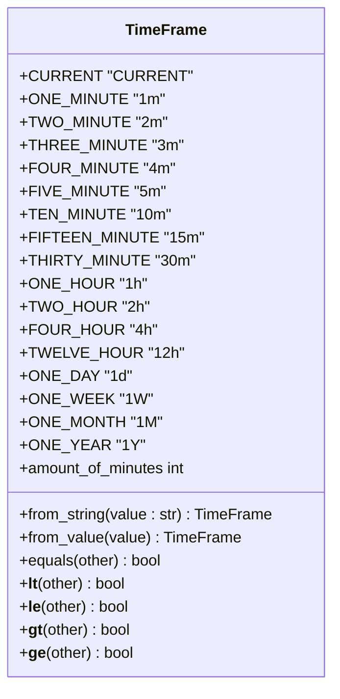
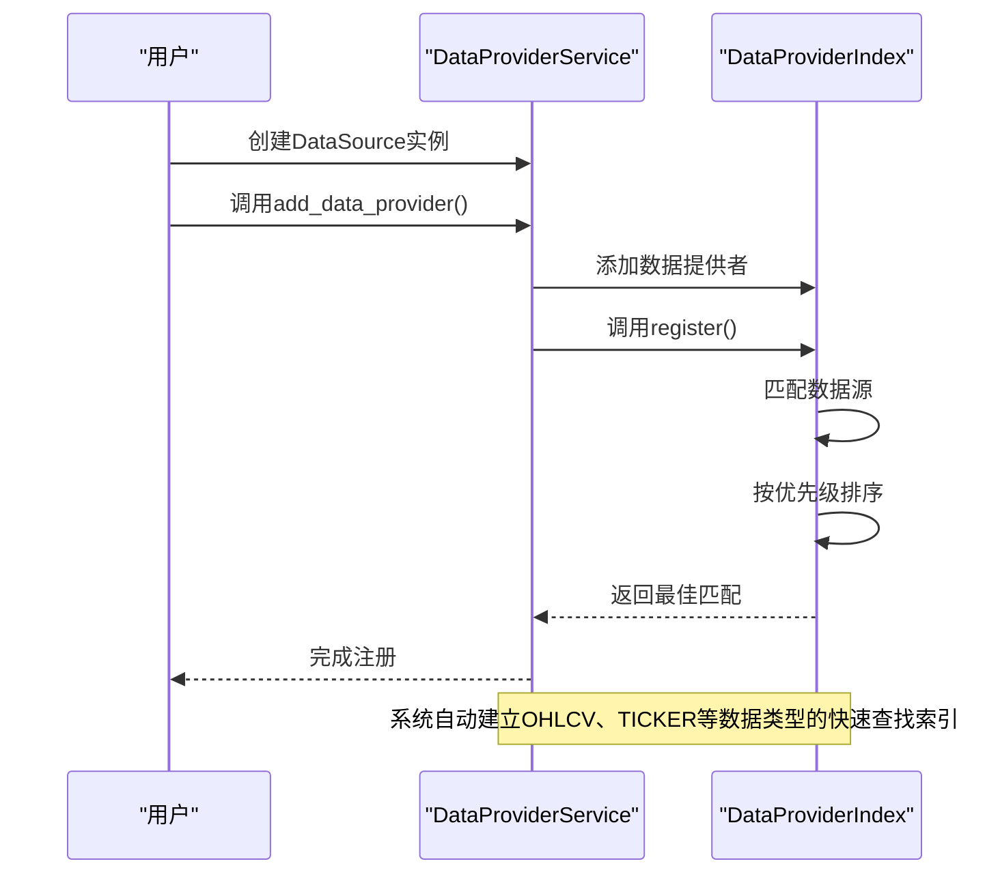
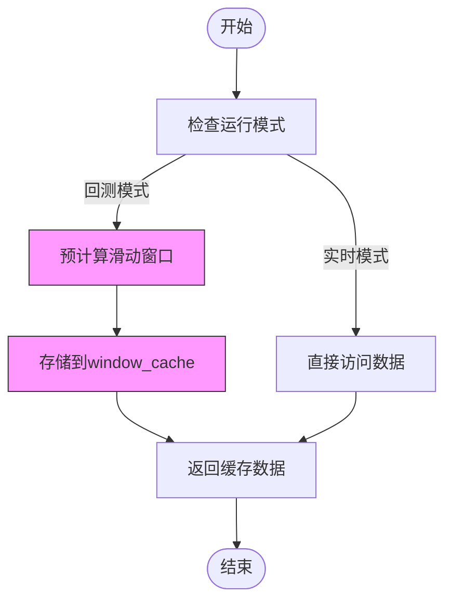
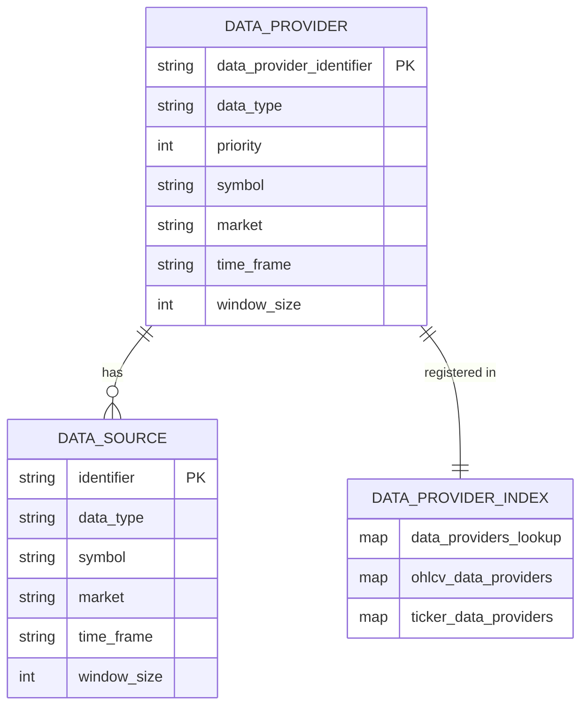

# 市场数据源配置

<cite>
**本文档引用的文件**   
- [ccxt.py](file://investing_algorithm_framework/infrastructure/data_providers/ccxt.py)
- [csv.py](file://investing_algorithm_framework/infrastructure/data_providers/csv.py)
- [data_provider.py](file://investing_algorithm_framework/domain/data_provider.py)
- [data_provider_service.py](file://investing_algorithm_framework/services/data_providers/data_provider_service.py)
- [time_frame.py](file://investing_algorithm_framework/domain/models/time_frame.py)
- [data_source.py](file://investing_algorithm_framework/domain/models/data/data_source.py)
- [market_data_providers.py.template](file://investing_algorithm_framework/cli/templates/market_data_providers.py.template)
- [env.example.template](file://investing_algorithm_framework/cli/templates/env.example.template)
</cite>

## 目录
1. [简介](#简介)
2. [市场数据源配置](#市场数据源配置)
3. [时间框架枚举类型](#时间框架枚举类型)
4. [数据源注册流程](#数据源注册流程)
5. [数据缓存策略](#数据缓存策略)
6. [配置文件示例](#配置文件示例)
7. [启用/禁用机制与优先级设置](#启用禁用机制与优先级设置)
8. [环境变量配置最佳实践](#环境变量配置最佳实践)

## 简介
本指南全面介绍如何在投资算法框架中配置和管理多个市场数据源。文档详细说明了如何定义交易所名称、交易对、时间框架等参数，以及数据源的注册流程、命名约定和缓存策略。同时涵盖了环境变量配置的最佳实践和安全考虑。

## 市场数据源配置
市场数据源的配置通过`DataSource`类实现，该类定义了数据源的各种属性，包括标识符、数据提供者标识符、数据类型、交易对、窗口大小、时间框架、市场、存储路径等。系统支持多种数据提供者，包括基于CCXT的实时数据提供者和基于CSV文件的历史数据提供者。

数据源配置的核心是`DataSource`类，它通过以下关键参数进行定义：
- **identifier**: 数据源的唯一标识符
- **data_type**: 数据类型（如OHLCV、TICKER等）
- **symbol**: 交易对符号（如BTC/EUR）
- **window_size**: 数据窗口大小
- **time_frame**: 时间框架（如1m、2h、1d等）
- **market**: 交易所名称（如BINANCE、BITVAVO）
- **storage_path**: 数据存储路径

系统通过`DataProviderService`管理所有数据源，实现高效的查找和访问。

**Section sources**
- [data_source.py](file://investing_algorithm_framework/domain/models/data/data_source.py#L11-L223)
- [data_provider_service.py](file://investing_algorithm_framework/services/data_providers/data_provider_service.py#L15-L851)

## 时间框架枚举类型
时间框架（TimeFrame）枚举类型定义了支持的各种时间粒度，从分钟级到年级别，为技术分析提供了灵活的时间选择。



**Diagram sources**
- [time_frame.py](file://investing_algorithm_framework/domain/models/time_frame.py#L4-L154)

**Section sources**
- [time_frame.py](file://investing_algorithm_framework/domain/models/time_frame.py#L4-L154)

## 数据源注册流程
数据源的注册流程通过`DataProviderIndex`类实现，该类提供了高效的O(1)时间复杂度的查找机制。注册流程包括以下步骤：

1. 创建数据源实例
2. 将数据源注册到索引中
3. 系统自动选择最佳匹配的数据提供者
4. 建立快速查找索引



**Diagram sources**
- [data_provider_service.py](file://investing_algorithm_framework/services/data_providers/data_provider_service.py#L15-L851)
- [data_provider.py](file://investing_algorithm_framework/domain/data_provider.py#L12-L335)

**Section sources**
- [data_provider_service.py](file://investing_algorithm_framework/services/data_providers/data_provider_service.py#L15-L851)
- [data_provider.py](file://investing_algorithm_framework/domain/data_provider.py#L12-L335)

## 数据缓存策略
系统实现了多层次的数据缓存策略以提高性能，包括内存缓存和磁盘缓存。

### 内存缓存
系统使用`window_cache`字段存储预计算的滑动窗口数据，避免重复计算。对于回测模式，系统会预先计算所有滑动窗口并存储在内存中。



### 磁盘缓存
对于基于CCXT的数据提供者，系统会自动将获取的数据保存到CSV文件中，实现磁盘缓存。文件命名遵循标准化格式：`OHLCV_{symbol}_{market}_{time_frame}_{start_date}_{end_date}.csv`

**Diagram sources**
- [ccxt.py](file://investing_algorithm_framework/infrastructure/data_providers/ccxt.py#L21-L1144)
- [csv.py](file://investing_algorithm_framework/infrastructure/data_providers/csv.py#L11-L569)

**Section sources**
- [ccxt.py](file://investing_algorithm_framework/infrastructure/data_providers/ccxt.py#L21-L1144)
- [csv.py](file://investing_algorithm_framework/infrastructure/data_providers/csv.py#L11-L569)

## 配置文件示例
以下示例展示了如何同时配置Bitvavo和Binance等多个交易所的数据源。

```python
from investing_algorithm_framework import CCXTOHLCVMarketDataSource

# Bitvavo交易所配置
btc_eur_bitvavo_1d = CCXTOHLCVMarketDataSource(
    identifier="BTC/EUR-bitvavo-1d",
    market="BITVAVO",
    symbol="BTC/EUR",
    time_frame="1d",
    window_size=200
)

eth_eur_bitvavo_4h = CCXTOHLCVMarketDataSource(
    identifier="ETH/EUR-bitvavo-4h",
    market="BITVAVO",
    symbol="ETH/EUR",
    time_frame="4h",
    window_size=100
)

# Binance交易所配置
btc_eur_binance_2h = CCXTOHLCVMarketDataSource(
    identifier="BTC/EUR-binance-2h",
    market="BINANCE",
    symbol="BTC/EUR",
    time_frame="2h",
    window_size=150
)

ada_eur_binance_15m = CCXTOHLCVMarketDataSource(
    identifier="ADA/EUR-binance-15m",
    market="BINANCE",
    symbol="ADA/EUR",
    time_frame="15m",
    window_size=50
)
```

**Section sources**
- [market_data_providers.py.template](file://investing_algorithm_framework/cli/templates/market_data_providers.py.template#L1-L10)

## 启用/禁用机制与优先级设置
系统通过优先级机制管理多个数据源的启用/禁用状态。每个数据提供者都有一个优先级属性，数值越低优先级越高。



优先级设置示例：
```python
# 高优先级数据源（优先级0）
high_priority_provider = CCXTOHLCVMarketDataSource(
    identifier="high-priority",
    market="BINANCE",
    symbol="BTC/EUR",
    time_frame="1h",
    priority=0
)

# 低优先级数据源（优先级3）
low_priority_provider = CCXTOHLCVMarketDataSource(
    identifier="low-priority", 
    market="BITVAVO",
    symbol="BTC/EUR", 
    time_frame="1h", 
    priority=3
)
```

当多个数据提供者支持相同的交易对时，系统会选择优先级最高的数据提供者。

**Diagram sources**
- [data_provider.py](file://investing_algorithm_framework/domain/data_provider.py#L42-L335)
- [data_provider_service.py](file://investing_algorithm_framework/services/data_providers/data_provider_service.py#L15-L851)

**Section sources**
- [data_provider.py](file://investing_algorithm_framework/domain/data_provider.py#L42-L335)
- [data_provider_service.py](file://investing_algorithm_framework/services/data_providers/data_provider_service.py#L15-L851)

## 环境变量配置最佳实践
环境变量配置遵循安全最佳实践，确保敏感信息的安全存储和访问。

### 环境变量模板
```bash
# 交易所API密钥配置
BINANCE_API_KEY=your_binance_api_key
BINANCE_API_SECRET=your_binance_api_secret

BITVAVO_API_KEY=your_bitvavo_api_key  
BITVAVO_API_SECRET=your_bitvavo_api_secret

# 应用配置
ENVIRONMENT=PROD
LOG_LEVEL=INFO
RESOURCE_DIRECTORY=./resources
```

### 安全考虑
1. **敏感信息保护**: API密钥等敏感信息不应硬编码在代码中，而应通过环境变量配置
2. **环境隔离**: 不同环境（开发、测试、生产）应使用不同的API密钥
3. **权限最小化**: API密钥应仅授予必要的权限
4. **定期轮换**: 定期更换API密钥以降低安全风险

系统通过`MarketCredential`类管理市场凭证，支持从环境变量自动加载凭证信息。

**Section sources**
- [env.example.template](file://investing_algorithm_framework/cli/templates/env.example.template#L1-L2)
- [ccxt.py](file://investing_algorithm_framework/infrastructure/data_providers/ccxt.py#L633-L711)