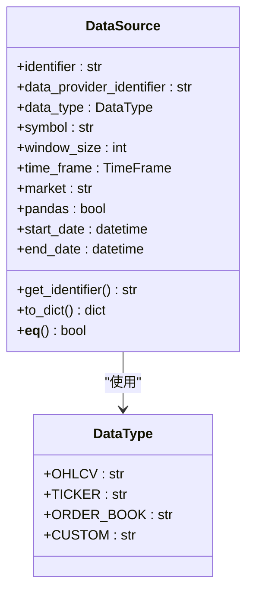
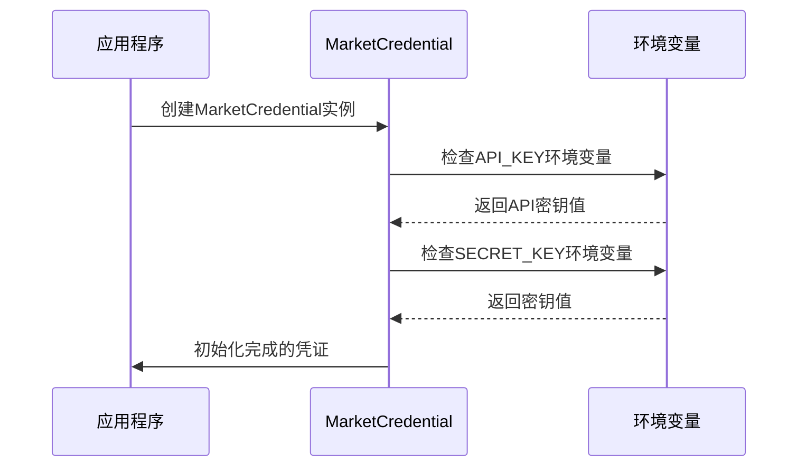
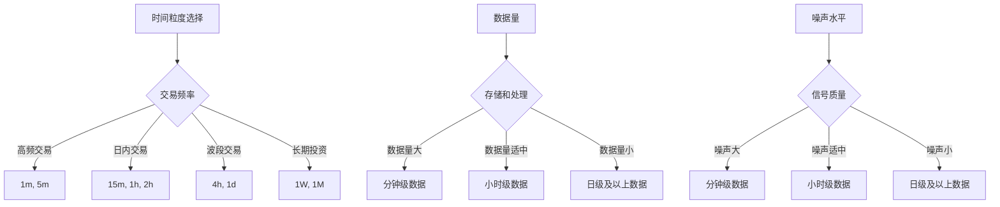
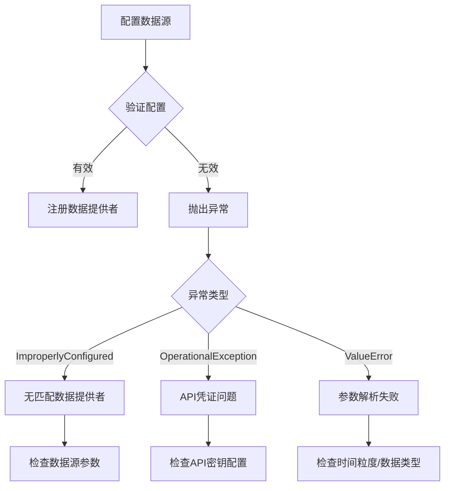

# 数据源配置

<cite>
**本文档中引用的文件**   
- [data_source.py](file://investing_algorithm_framework/domain/models/data/data_source.py)
- [time_frame.py](file://investing_algorithm_framework/domain/models/time_frame.py)
- [market_credential.py](file://investing_algorithm_framework/domain/models/market/market_credential.py)
- [app.py](file://investing_algorithm_framework/app/app.py)
- [data_provider_service.py](file://investing_algorithm_framework/services/data_providers/data_provider_service.py)
- [bitvavo_trading_bot.py](file://examples/bitvavo_trading_bot.py)
- [simple_trading_bot_example.py](file://examples/simple_trading_bot_example.py)
- [env.example.template](file://investing_algorithm_framework/cli/templates/env.example.template)
</cite>

## 目录
1. [简介](#简介)
2. [核心组件](#核心组件)
3. [数据源参数配置](#数据源参数配置)
4. [交易所API密钥配置](#交易所api密钥配置)
5. [多交易所数据源配置示例](#多交易所数据源配置示例)
6. [时间粒度枚举类型](#时间粒度枚举类型)
7. [数据源命名与唯一性](#数据源命名与唯一性)
8. [配置验证与错误处理](#配置验证与错误处理)

## 简介
本文档全面介绍如何在投资算法框架中配置市场数据源。详细说明数据源配置方法、参数设置、环境变量使用、多交易所集成、时间粒度选择、命名约定以及错误处理机制。

## 核心组件

本文档分析了数据源配置的核心组件，包括DataSource类、TimeFrame枚举、MarketCredential类以及应用程序配置方法。

**Section sources**
- [data_source.py](file://investing_algorithm_framework/domain/models/data/data_source.py#L1-L223)
- [time_frame.py](file://investing_algorithm_framework/domain/models/time_frame.py#L1-L153)
- [market_credential.py](file://investing_algorithm_framework/domain/models/market/market_credential.py#L1-L88)

## 数据源参数配置

数据源通过`DataSource`类进行配置，该类定义了获取市场数据所需的所有参数。主要配置参数包括：

- **identifier**: 数据源的唯一标识符
- **data_provider_identifier**: 数据提供者标识符
- **data_type**: 数据类型（OHLCV, TICKER, ORDER_BOOK, CUSTOM）
- **symbol**: 交易对符号（如BTC/EUR）
- **window_size**: 窗口大小，用于指定需要的历史数据点数量
- **time_frame**: 时间粒度（如1m, 2h, 1d）
- **market**: 交易所名称（如BINANCE, BITVAVO）
- **pandas**: 布尔值，指定是否以pandas DataFrame格式返回数据
- **start_date/end_date**: 数据获取的起止日期

在策略初始化时，可以通过创建`DataSource`实例并将其添加到策略中来配置数据源。



**Diagram sources**
- [data_source.py](file://investing_algorithm_framework/domain/models/data/data_source.py#L11-L223)
- [data_type.py](file://investing_algorithm_framework/domain/models/data/data_type.py#L4-L8)

**Section sources**
- [data_source.py](file://investing_algorithm_framework/domain/models/data/data_source.py#L1-L223)

## 交易所API密钥配置

通过环境变量配置交易所API密钥和交易对信息。框架支持从环境变量中自动读取API凭证，也可以在代码中直接指定。

### 环境变量配置
在`.env`文件中配置API密钥，格式如下：
```
<MARKET>_API_KEY=your_api_key
<MARKET>_SECRET_KEY=your_api_secret
```

其中`<MARKET>`是交易所名称的大写形式（如BINANCE、BITVAVO）。

### 代码中直接配置
可以在`add_market`方法中直接提供API密钥：

```python
app.add_market(
    market="binance",
    trading_symbol="EUR",
    api_key="your_api_key",
    secret_key="your_secret_key"
)
```



**Diagram sources**
- [market_credential.py](file://investing_algorithm_framework/domain/models/market/market_credential.py#L10-L88)
- [env.example.template](file://investing_algorithm_framework/cli/templates/env.example.template#L1-L2)

**Section sources**
- [market_credential.py](file://investing_algorithm_framework/domain/models/market/market_credential.py#L1-L88)
- [env.example.template](file://investing_algorithm_framework/cli/templates/env.example.template#L1-L2)

## 多交易所数据源配置示例

以下示例展示如何配置Bitvavo和Binance等多个交易所的数据源。

### Bitvavo交易所配置示例
```python
class BitvavoTradingStrategy(TradingStrategy):
    time_unit = TimeUnit.SECOND
    interval = 10
    data_sources = [
        DataSource(data_type="OHLCV", market="bitvavo", symbol="BTC/EUR", window_size=200, time_frame="2h", identifier="BTC/EUR-ohlcv"),
        DataSource(data_type="Ticker", market="bitvavo", symbol="BTC/EUR", identifier="BTC/EUR-ticker")
    ]
```

### Binance交易所配置示例
```python
app.add_strategy(
    RSIEMACrossoverStrategy(
        time_unit=TimeUnit.HOUR,
        interval=2,
        market="binance",
        rsi_time_frame="2h",
        ema_time_frame="2h"
    )
)

app.add_market(
    market="binance",
    trading_symbol="EUR",
)
```

### 多交易所混合配置
可以同时配置多个交易所的数据源，实现数据源的组合使用：

```python
data_sources = []
for symbol in self.symbols:
    full_symbol = f"{symbol}/EUR"
    # 从Bitvavo获取RSI数据
    data_sources.append(
        DataSource(
            identifier=f"{symbol}_rsi_data",
            data_type=DataType.OHLCV,
            time_frame=self.rsi_time_frame,
            market="bitvavo",
            symbol=full_symbol,
            pandas=True,
            window_size=800
        )
    )
    # 从Binance获取EMA数据
    data_sources.append(
        DataSource(
            identifier=f"{symbol}_ema_data",
            data_type=DataType.OHLCV,
            time_frame=self.ema_time_frame,
            market="binance",
            symbol=full_symbol,
            pandas=True,
            window_size=800
        )
    )
```

**Section sources**
- [bitvavo_trading_bot.py](file://examples/bitvavo_trading_bot.py#L23-L34)
- [simple_trading_bot_example.py](file://examples/simple_trading_bot_example.py#L57-L77)

## 时间粒度枚举类型

`TimeFrame`枚举类型支持多种时间粒度，适用于不同的分析场景。

### 支持的时间粒度
```python
class TimeFrame(Enum):
    ONE_MINUTE = "1m"
    TWO_MINUTE = "2m"
    FIVE_MINUTE = "5m"
    FIFTEEN_MINUTE = "15m"
    THIRTY_MINUTE = "30m"
    ONE_HOUR = "1h"
    TWO_HOUR = "2h"
    FOUR_HOUR = "4h"
    TWELVE_HOUR = "12h"
    ONE_DAY = "1d"
    ONE_WEEK = "1W"
    ONE_MONTH = "1M"
    ONE_YEAR = "1Y"
```

### 使用场景
- **分钟级数据 (1m, 5m, 15m)**: 适用于高频交易和短期技术分析
- **小时级数据 (1h, 2h, 4h)**: 适用于日内交易和中短期趋势分析
- **日级及以上数据 (1d, 1W, 1M)**: 适用于长期投资策略和基本面分析

### 时间粒度比较


**Diagram sources**
- [time_frame.py](file://investing_algorithm_framework/domain/models/time_frame.py#L4-L21)

**Section sources**
- [time_frame.py](file://investing_algorithm_framework/domain/models/time_frame.py#L1-L153)

## 数据源命名与唯一性

### 命名约定
数据源的命名遵循以下约定：
- 标识符应具有描述性，便于识别其用途
- 推荐使用`{symbol}_{data_type}_{time_frame}`格式
- 对于同一交易对的不同数据源，应使用不同的标识符

### 唯一性要求
数据源的唯一性由以下属性组合确定：
- **OHLCV数据源**: data_type、symbol、time_frame和market的组合必须唯一
- **自定义数据源**: data_type、symbol、window_size、time_frame和market的组合必须唯一
- **行情数据源**: data_type、symbol和market的组合必须唯一

当未指定market和time_frame时，仅通过symbol和data_type确定唯一性。

```mermaid
classDiagram
class DataSource {
+identifier : str
+data_type : DataType
+symbol : str
+time_frame : TimeFrame
+market : str
+window_size : int
+__eq__() bool
+get_identifier() str
}
DataSource : "唯一性规则"
note right of DataSource
OHLCV数据源唯一性 :
- data_type
- symbol
- time_frame
- market
自定义数据源唯一性 :
- data_type
- symbol
- window_size
- time_frame
- market
行情数据源唯一性 :
- data_type
- symbol
- market
end note
```

**Diagram sources**
- [data_source.py](file://investing_algorithm_framework/domain/models/data/data_source.py#L153-L179)

**Section sources**
- [data_source.py](file://investing_algorithm_framework/domain/models/data/data_source.py#L94-L114)

## 配置验证与错误处理

### 配置验证机制
系统在初始化时会自动验证数据源配置的有效性：

1. **数据提供者验证**: 检查是否存在能够提供指定数据的数据提供者
2. **参数完整性验证**: 确保必需参数已正确设置
3. **市场支持验证**: 验证指定交易所是否被支持
4. **凭证验证**: 检查API密钥是否有效

### 错误处理策略
当配置无效时，系统会抛出相应的异常：

- **ImproperlyConfigured异常**: 当没有找到匹配的数据提供者时抛出
- **OperationalException异常**: 当API密钥缺失或无效时抛出
- **ValueError异常**: 当时间粒度或数据类型无法解析时抛出

### 异常处理示例
```python
try:
    app.initialize_data_sources(data_sources)
except ImproperlyConfigured as e:
    logger.error(f"数据源配置错误: {e}")
    # 处理配置错误
except OperationalException as e:
    logger.error(f"操作异常: {e}")
    # 处理操作异常
except ValueError as e:
    logger.error(f"值错误: {e}")
    # 处理值错误
```



**Diagram sources**
- [data_provider_service.py](file://investing_algorithm_framework/services/data_providers/data_provider_service.py#L70-L75)
- [market_credential.py](file://investing_algorithm_framework/domain/models/market/market_credential.py#L38-L43)

**Section sources**
- [data_provider_service.py](file://investing_algorithm_framework/services/data_providers/data_provider_service.py#L39-L75)
- [market_credential.py](file://investing_algorithm_framework/domain/models/market/market_credential.py#L10-L43)