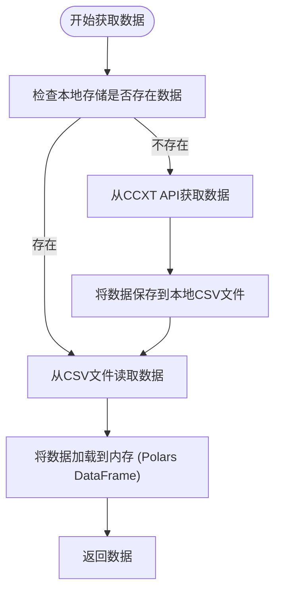
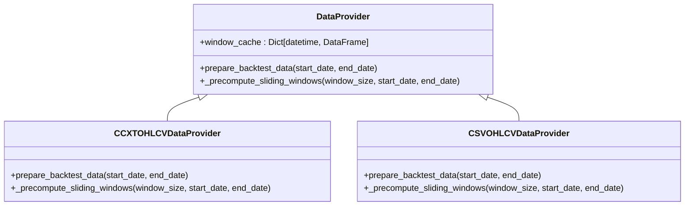
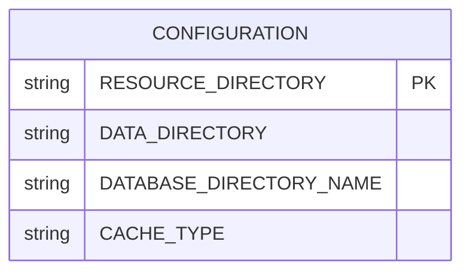

# 数据缓存策略

<cite>
**本文档引用的文件**   
- [ccxt.py](file://investing_algorithm_framework/infrastructure/data_providers/ccxt.py)
- [csv.py](file://investing_algorithm_framework/infrastructure/data_providers/csv.py)
- [data_provider_service.py](file://investing_algorithm_framework/services/data_providers/data_provider_service.py)
- [data_provider.py](file://investing_algorithm_framework/domain/data_provider.py)
- [configuration_service.py](file://investing_algorithm_framework/services/configuration_service.py)
- [app.py](file://investing_algorithm_framework/app/app.py)
</cite>

## 目录
1. [引言](#引言)
2. [数据缓存机制概述](#数据缓存机制概述)
3. [缓存策略实现原理](#缓存策略实现原理)
4. [配置数据缓存](#配置数据缓存)
5. [缓存过期与数据更新](#缓存过期与数据更新)
6. [内存使用与性能优化](#内存使用与性能优化)
7. [缓存清理与监控](#缓存清理与监控)
8. [结论](#结论)

## 引言
本文档深入讲解投资算法框架中的数据缓存机制。详细说明如何配置数据缓存以提高回测和实时交易性能。解释缓存策略的实现原理，包括数据持久化和读取优化。介绍缓存过期机制和数据更新策略。提供配置示例，展示如何为不同时间框架的数据设置合适的缓存周期。说明缓存对内存使用的影响及优化建议。涵盖缓存清理方法和性能监控指标，帮助用户在数据新鲜度和系统性能之间取得平衡。

## 数据缓存机制概述
该框架的数据缓存机制主要通过`DataProvider`类及其子类实现，为回测和实时交易提供高性能的数据访问。核心机制包括：

1.  **内存缓存**：数据被加载到内存中，使用Polars或Pandas DataFrame进行高效处理。
2.  **持久化存储**：数据从远程API（如CCXT）获取后，会以CSV格式保存到本地文件系统，避免重复下载。
3.  **滑动窗口预计算**：为回测场景预计算滑动窗口数据，实现O(1)时间复杂度的数据检索。
4.  **索引与查找**：通过`DataProviderIndex`建立高效的数据提供者查找表，实现O(1)时间复杂度的匹配。

该机制显著提升了数据访问速度，特别是在需要频繁访问历史数据的回测场景中。

**Section sources**
- [data_provider.py](file://investing_algorithm_framework/domain/data_provider.py#L12-L335)
- [data_provider_service.py](file://investing_algorithm_framework/services/data_providers/data_provider_service.py#L15-L851)

## 缓存策略实现原理

### 数据持久化与读取优化
框架通过`CCXTOHLCVDataProvider`和`CSVOHLCVDataProvider`两个核心类实现数据的持久化和读取。

当在回测模式下请求数据时，系统会首先检查本地存储目录中是否存在所需时间范围的数据文件。如果文件存在，则直接从CSV文件加载数据到内存；如果不存在，则通过CCXT库从交易所API获取数据，并在返回结果的同时将数据保存到本地，实现数据的持久化。



**Diagram sources**
- [ccxt.py](file://investing_algorithm_framework/infrastructure/data_providers/ccxt.py#L212-L237)
- [csv.py](file://investing_algorithm_framework/infrastructure/data_providers/csv.py#L390-L430)

### 滑动窗口预计算
为了优化回测性能，框架在`prepare_backtest_data`阶段会预计算所有可能的滑动窗口。具体流程如下：

1.  确定回测的时间范围。
2.  计算每个时间点所需的窗口数据（例如，200个周期的历史数据）。
3.  将每个时间点的窗口数据作为键值对存入`window_cache`字典，其中键为时间戳，值为包含该时间点及之前N个周期数据的DataFrame。

这种预计算使得在回测循环中，无论需要哪个时间点的历史数据，都可以通过一次哈希查找快速获取，极大地提升了回测速度。



**Diagram sources**
- [ccxt.py](file://investing_algorithm_framework/infrastructure/data_providers/ccxt.py#L249-L257)
- [csv.py](file://investing_algorithm_framework/infrastructure/data_providers/csv.py#L251-L256)
- [ccxt.py](file://investing_algorithm_framework/infrastructure/data_providers/ccxt.py#L965-L992)
- [csv.py](file://investing_algorithm_framework/infrastructure/data_providers/csv.py#L437-L473)

## 配置数据缓存

### 配置文件与参数
数据缓存的配置主要通过`ConfigurationService`管理。关键配置项包括：

-   **`RESOURCE_DIRECTORY`**: 定义了资源目录，所有数据文件（如CSV）和数据库都存储在此目录下。
-   **`DATA_DIRECTORY`**: 定义了数据子目录的名称，默认为"data"。
-   **`DATABASE_DIRECTORY_NAME`**: 定义了数据库子目录的名称。

这些配置可以在应用初始化时通过字典传入，或通过环境变量设置。



**Diagram sources**
- [configuration_service.py](file://investing_algorithm_framework/services/configuration_service.py#L10-L30)
- [app.py](file://investing_algorithm_framework/app/app.py#L236-L269)

### 为不同时间框架设置缓存周期
缓存周期（即滑动窗口大小）是通过`DataSource`对象的`window_size`参数来配置的。用户在定义数据源时，可以为不同的时间框架（如1小时、4小时）指定不同的窗口大小。

例如，一个使用200周期移动平均线的策略，其数据源应配置`window_size=200`。框架会自动根据此配置预计算包含200个数据点的滑动窗口。

```python
# 配置示例（概念性代码，非实际文件内容）
data_source = DataSource(
    market="BINANCE",
    symbol="BTC/EUR",
    data_type=DataType.OHLCV,
    time_frame="1h",        # 时间框架
    window_size=200         # 缓存周期/窗口大小
)
```

**Section sources**
- [data_provider.py](file://investing_algorithm_framework/domain/data_provider.py#L53-L54)
- [data_provider_service.py](file://investing_algorithm_framework/services/data_providers/data_provider_service.py#L487-L496)

## 缓存过期与数据更新

### 缓存过期机制
该框架的缓存没有内置的基于时间的过期机制。缓存的“新鲜度”由以下因素决定：

1.  **数据源范围**：`CSVOHLCVDataProvider`在加载数据时，会检查其内部的`_start_date_data_source`和`_end_date_data_source`。任何超出此范围的请求都会导致`OperationalException`。
2.  **文件存在性**：`CCXTOHLCVDataProvider`在`has_data`方法中会检查存储路径中是否存在覆盖请求时间范围的文件。如果文件存在，它就认为数据是“可用的”。

因此，缓存的过期是通过数据的**完整性**和**范围**来隐式管理的，而不是通过TTL（Time To Live）。

### 数据更新策略
数据更新主要通过以下两种方式实现：

1.  **首次获取**：当本地没有数据时，`CCXTOHLCVDataProvider`会从API获取数据并保存，这是最彻底的更新。
2.  **手动触发**：用户可以通过删除本地CSV文件来强制系统在下次请求时重新从API获取最新数据。

框架本身不提供增量更新（如只获取最新K线）的功能，每次获取都是一个完整的时间范围。

**Section sources**
- [csv.py](file://investing_algorithm_framework/infrastructure/data_providers/csv.py#L231-L241)
- [ccxt.py](file://investing_algorithm_framework/infrastructure/data_providers/ccxt.py#L144-L154)

## 内存使用与性能优化

### 内存使用分析
数据缓存机制对内存的使用主要体现在：

1.  **DataFrame内存占用**：整个数据集会被加载到内存中的Polars DataFrame。数据量越大，内存占用越高。
2.  **滑动窗口缓存**：`window_cache`字典会存储大量DataFrame的副本。对于一个包含N个时间点、窗口大小为W的数据集，理论上最多可能有N个大小为W的DataFrame，这会显著增加内存消耗。

### 性能优化建议
为了在性能和资源消耗之间取得平衡，建议采取以下措施：

1.  **合理设置窗口大小**：仅配置策略实际需要的最小`window_size`，避免不必要的内存开销。
2.  **管理数据范围**：在回测时，只请求必要的时间范围数据，避免加载过长的历史数据。
3.  **选择合适的数据提供者**：对于已有历史数据的回测，优先使用`CSVOHLCVDataProvider`，因为它避免了网络请求的延迟。
4.  **监控系统资源**：在运行大型回测时，监控内存使用情况，必要时升级硬件或优化数据集。

**Section sources**
- [ccxt.py](file://investing_algorithm_framework/infrastructure/data_providers/ccxt.py#L100-L101)
- [csv.py](file://investing_algorithm_framework/infrastructure/data_providers/csv.py#L68-L69)

## 缓存清理与监控

### 缓存清理方法
由于缓存是持久化在文件系统中的，清理方法非常直接：

1.  **删除CSV文件**：直接删除`RESOURCE_DIRECTORY/data`目录下的相关CSV文件即可清除特定数据源的缓存。
2.  **清空数据目录**：删除整个`data`目录可以清除所有OHLCV数据缓存。

### 性能监控指标
框架通过日志和内置的`tqdm`进度条提供性能监控：

1.  **日志记录**：`logger`会记录数据加载、缓存准备等关键步骤的开始和完成信息。
2.  **进度条**：在`index_backtest_data_providers`和`prepare_backtest_data`方法中，使用`tqdm`显示数据提供者注册和数据准备的进度，帮助用户直观了解耗时操作的状态。

**Section sources**
- [app.py](file://investing_algorithm_framework/app/app.py#L440-L482)
- [data_provider_service.py](file://investing_algorithm_framework/services/data_providers/data_provider_service.py#L734-L754)

## 结论
该投资算法框架的数据缓存机制通过内存缓存、文件持久化和滑动窗口预计算，为回测和交易提供了强大的性能支持。通过合理配置`DataSource`的`window_size`和管理`RESOURCE_DIRECTORY`下的文件，用户可以有效控制缓存的范围和生命周期。虽然该机制会增加内存消耗，但其带来的性能提升对于复杂的量化策略至关重要。用户应在数据新鲜度、内存使用和计算性能之间根据具体需求进行权衡。