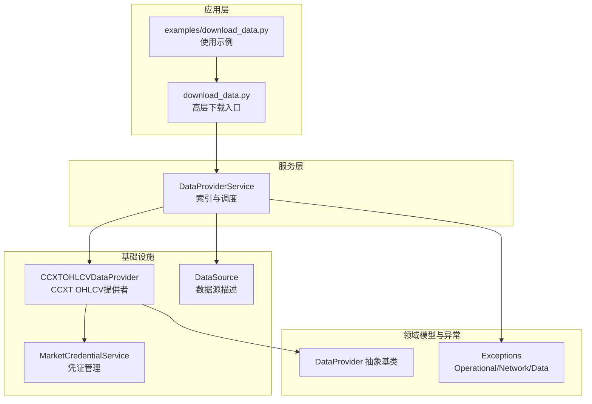
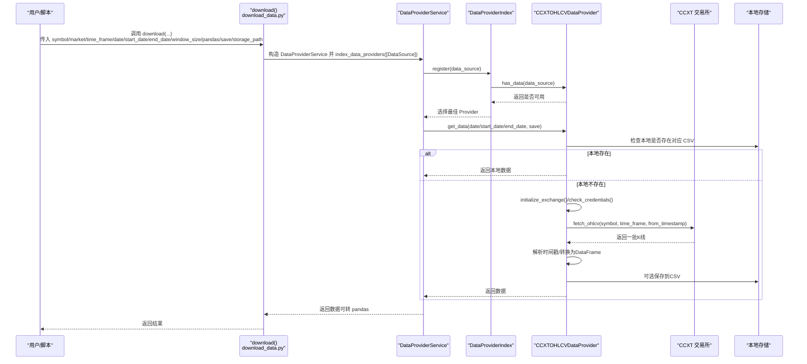
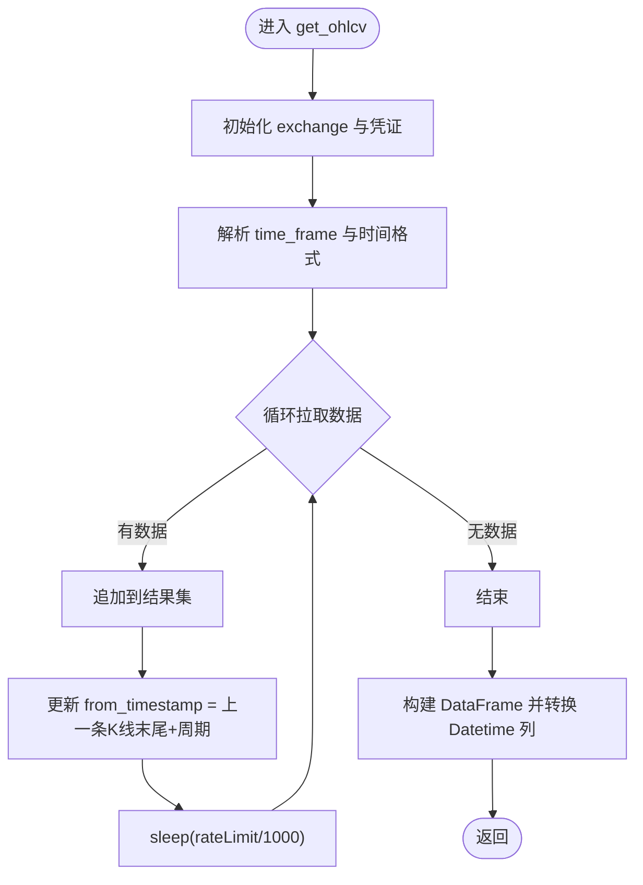
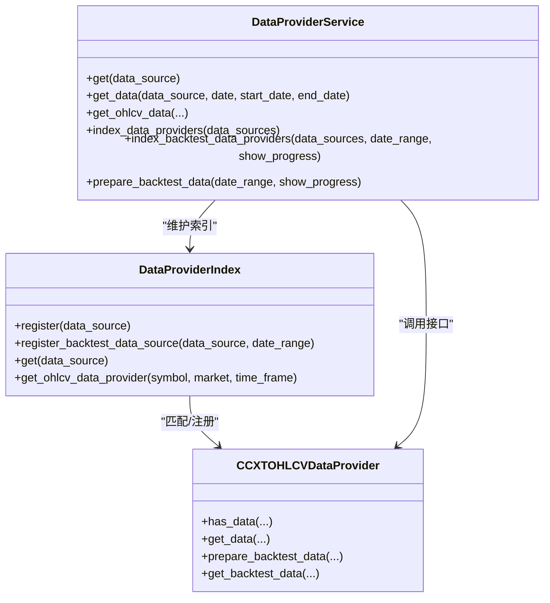
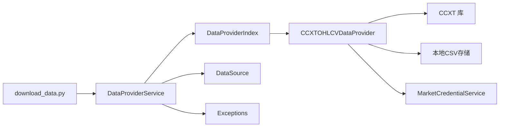

# 数据获取机制

<cite>
**本文引用的文件**
- [investing_algorithm_framework/download_data.py](file://investing_algorithm_framework/download_data.py)
- [examples/download_data.py](file://examples/download_data.py)
- [investing_algorithm_framework/infrastructure/data_providers/ccxt.py](file://investing_algorithm_framework/infrastructure/data_providers/ccxt.py)
- [investing_algorithm_framework/services/data_providers/data_provider_service.py](file://investing_algorithm_framework/services/data_providers/data_provider_service.py)
- [investing_algorithm_framework/domain/data_provider.py](file://investing_algorithm_framework/domain/data_provider.py)
- [investing_algorithm_framework/domain/models/data/data_source.py](file://investing_algorithm_framework/domain/models/data/data_source.py)
- [investing_algorithm_framework/domain/exceptions.py](file://investing_algorithm_framework/domain/exceptions.py)
- [investing_algorithm_framework/services/market_credential_service.py](file://investing_algorithm_framework/services/market_credential_service.py)
- [tests/test_download.py](file://tests/test_download.py)
</cite>

## 目录
1. [引言](#引言)
2. [项目结构](#项目结构)
3. [核心组件](#核心组件)
4. [架构总览](#架构总览)
5. [详细组件分析](#详细组件分析)
6. [依赖关系分析](#依赖关系分析)
7. [性能考量](#性能考量)
8. [故障排查指南](#故障排查指南)
9. [结论](#结论)
10. [附录](#附录)

## 引言
本文件系统性解析框架中的“市场数据获取”机制，重点覆盖：
- 基于 CCXT 的 OHLCV 数据提供者如何对接交易所 API 获取历史与增量数据
- 频率控制与速率限制处理（sleep 与 rateLimit）
- 全量下载与增量窗口模式的适用场景与差异
- 使用 download_data.py 工具下载历史数据的实践路径
- 数据完整性检查与异常处理策略（网络错误、API 限流、参数校验）
- 数据预处理流程（时间戳对齐、缺失值处理）

## 项目结构
围绕数据获取的关键模块分布如下：
- 应用入口与工具：download_data.py 提供高层下载接口；examples 下有使用示例
- 数据提供者层：CCXTOHLCVDataProvider 实现基于 CCXT 的 OHLCV 获取、存储与回测支持
- 服务层：DataProviderService 负责索引、选择与调用具体数据提供者
- 基础设施与模型：DataSource 描述数据源参数；Exceptions 定义运行期异常类型
- 凭证管理：MarketCredentialService 管理各市场的密钥与凭据

图表来源
- [investing_algorithm_framework/download_data.py](file://investing_algorithm_framework/download_data.py#L1-L109)
- [examples/download_data.py](file://examples/download_data.py#L1-L14)
- [investing_algorithm_framework/services/data_providers/data_provider_service.py](file://investing_algorithm_framework/services/data_providers/data_provider_service.py#L334-L800)
- [investing_algorithm_framework/infrastructure/data_providers/ccxt.py](file://investing_algorithm_framework/infrastructure/data_providers/ccxt.py#L1-L1144)
- [investing_algorithm_framework/domain/data_provider.py](file://investing_algorithm_framework/domain/data_provider.py#L1-L335)
- [investing_algorithm_framework/domain/models/data/data_source.py](file://investing_algorithm_framework/domain/models/data/data_source.py#L1-L223)
- [investing_algorithm_framework/domain/exceptions.py](file://investing_algorithm_framework/domain/exceptions.py#L1-L113)
- [investing_algorithm_framework/services/market_credential_service.py](file://investing_algorithm_framework/services/market_credential_service.py#L1-L40)

章节来源
- [investing_algorithm_framework/download_data.py](file://investing_algorithm_framework/download_data.py#L1-L109)
- [investing_algorithm_framework/services/data_providers/data_provider_service.py](file://investing_algorithm_framework/services/data_providers/data_provider_service.py#L334-L800)
- [investing_algorithm_framework/infrastructure/data_providers/ccxt.py](file://investing_algorithm_framework/infrastructure/data_providers/ccxt.py#L1-L1144)

## 核心组件
- CCXTOHLCVDataProvider：实现 OHLCV 数据的获取、缓存、存储与回测支持，包含 CCXT 初始化、速率限制 sleep、滑动窗口缓存、本地 CSV 存储与读取等能力
- DataProviderService：负责根据 DataSource 参数匹配最佳数据提供者，统一对外提供 get_data/get_backtest_data 接口，并支持批量索引与回测准备
- DataSource：标准化数据源参数（symbol、market、time_frame、date/start_date/end_date、window_size、pandas、save、storage_path 等），并进行时区与大小写规范化
- MarketCredentialService：集中管理各交易所的 API 凭证，用于初始化 CCXT 交易所客户端
- Exceptions：定义 OperationalException、NetworkError、DataError 等异常类型，便于上层捕获与处理

章节来源
- [investing_algorithm_framework/infrastructure/data_providers/ccxt.py](file://investing_algorithm_framework/infrastructure/data_providers/ccxt.py#L1-L1144)
- [investing_algorithm_framework/services/data_providers/data_provider_service.py](file://investing_algorithm_framework/services/data_providers/data_provider_service.py#L1-L800)
- [investing_algorithm_framework/domain/models/data/data_source.py](file://investing_algorithm_framework/domain/models/data/data_source.py#L1-L223)
- [investing_algorithm_framework/services/market_credential_service.py](file://investing_algorithm_framework/services/market_credential_service.py#L1-L40)
- [investing_algorithm_framework/domain/exceptions.py](file://investing_algorithm_framework/domain/exceptions.py#L1-L113)

## 架构总览
下图展示了从高层下载入口到 CCXT 交易所 API 的完整调用链路，以及回测模式下的数据准备与索引过程。

图表来源
- [investing_algorithm_framework/download_data.py](file://investing_algorithm_framework/download_data.py#L1-L109)
- [investing_algorithm_framework/services/data_providers/data_provider_service.py](file://investing_algorithm_framework/services/data_providers/data_provider_service.py#L334-L800)
- [investing_algorithm_framework/infrastructure/data_providers/ccxt.py](file://investing_algorithm_framework/infrastructure/data_providers/ccxt.py#L525-L622)

## 详细组件分析

### CCXTOHLCVDataProvider：基于 CCXT 的 OHLCV 数据提供者
- 职责与能力
  - 通过 CCXT 初始化指定交易所客户端，按需校验凭证
  - 以循环方式分批拉取 OHLCV 数据，自动处理 rateLimit 与时间边界
  - 将数据转换为 Polars DataFrame，并在回测模式下构建滑动窗口缓存
  - 支持本地 CSV 存储与读取，避免重复拉取
  - 提供 prepare_backtest_data、get_backtest_data、get_number_of_data_points、get_missing_data_dates 等回测辅助能力

- 关键流程与要点
  - 速率限制与频率控制：在每次 fetch_ohlcv 后，依据 exchange.rateLimit 执行 sleep，确保遵守交易所限流
  - 时间戳与格式：统一使用 UTC 时间，列名固定为 Datetime/Open/High/Low/Close/Volume
  - 滑动窗口缓存：prepare_backtest_data 中预计算窗口，get_backtest_data 通过 window_cache 快速返回
  - 本地存储：save_data_to_storage 将数据写入 CSV 文件，命名规则包含 symbol/market/time_frame 与起止时间
  - 交换机初始化：initialize_exchange 根据 market 名称动态获取 CCXT 交易所类，支持带凭证或匿名访问

- 适用场景
  - 全量下载：明确 start_date 与 end_date，且 save=True 时会持久化
  - 增量窗口：仅提供 date 与 window_size，内部推导 start_date/end_date，适合实时/回测中按窗口滚动获取

图表来源
- [investing_algorithm_framework/infrastructure/data_providers/ccxt.py](file://investing_algorithm_framework/infrastructure/data_providers/ccxt.py#L525-L622)

章节来源
- [investing_algorithm_framework/infrastructure/data_providers/ccxt.py](file://investing_algorithm_framework/infrastructure/data_providers/ccxt.py#L1-L1144)

### DataProviderService：数据提供者索引与调度
- 职责
  - 维护 DataProviderIndex，按 DataSource 匹配最佳提供者
  - 对外暴露 get_data/get_backtest_data/get_ohlcv_data 等统一接口
  - 支持批量注册与回测数据准备（index_backtest_data_providers、prepare_backtest_data）

- 回测模式
  - index_backtest_data_providers 会针对每个数据源在回测日期范围内注册 provider
  - prepare_backtest_data 调用各 provider.prepare_backtest_data，完成本地数据加载、滑窗预计算与缺失点统计

图表来源
- [investing_algorithm_framework/services/data_providers/data_provider_service.py](file://investing_algorithm_framework/services/data_providers/data_provider_service.py#L1-L800)
- [investing_algorithm_framework/infrastructure/data_providers/ccxt.py](file://investing_algorithm_framework/infrastructure/data_providers/ccxt.py#L1-L1144)

章节来源
- [investing_algorithm_framework/services/data_providers/data_provider_service.py](file://investing_algorithm_framework/services/data_providers/data_provider_service.py#L1-L800)

### DataSource：数据源参数标准化
- 规范化字段：symbol、market 统一大写；时间字段 start_date/end_date/date 统一转换为 UTC
- 标识符生成：OHLCV 类型默认标识符由 data_type、market、symbol、time_frame 组成
- 计算辅助：create_start_date_data 与 get_number_of_required_data_points 为回测准备提供帮助

章节来源
- [investing_algorithm_framework/domain/models/data/data_source.py](file://investing_algorithm_framework/domain/models/data/data_source.py#L1-L223)

### 凭证与异常：MarketCredentialService 与 Exceptions
- 凭证管理：MarketCredentialService 提供 add/add_all/get/get_all 等方法，CCXTOHLCVDataProvider 在初始化 exchange 时调用 check_credentials 校验所需凭证
- 异常体系：OperationalException 用于业务操作错误；NetworkError 用于网络请求失败；DataError 用于数据完整性问题

章节来源
- [investing_algorithm_framework/services/market_credential_service.py](file://investing_algorithm_framework/services/market_credential_service.py#L1-L40)
- [investing_algorithm_framework/domain/exceptions.py](file://investing_algorithm_framework/domain/exceptions.py#L1-L113)

## 依赖关系分析
- download_data.py 作为高层入口，创建 DataProviderService 并调用其 get_data
- DataProviderService 通过 DataProviderIndex 注册/查找最佳提供者
- CCXTOHLCVDataProvider 依赖 CCXT、Polars/Pandas、MarketCredentialService、DataSource、Exceptions
- 回测模式下，DataProviderService 调用 provider.prepare_backtest_data 完成本地数据准备与滑窗缓存

图表来源
- [investing_algorithm_framework/download_data.py](file://investing_algorithm_framework/download_data.py#L1-L109)
- [investing_algorithm_framework/services/data_providers/data_provider_service.py](file://investing_algorithm_framework/services/data_providers/data_provider_service.py#L334-L800)
- [investing_algorithm_framework/infrastructure/data_providers/ccxt.py](file://investing_algorithm_framework/infrastructure/data_providers/ccxt.py#L1-L1144)

章节来源
- [investing_algorithm_framework/download_data.py](file://investing_algorithm_framework/download_data.py#L1-L109)
- [investing_algorithm_framework/services/data_providers/data_provider_service.py](file://investing_algorithm_framework/services/data_providers/data_provider_service.py#L334-L800)

## 性能考量
- 分批拉取与限流：CCXTOHLCVDataProvider 在每次 fetch_ohlcv 后按 exchange.rateLimit 执行 sleep，避免触发 API 限流
- 滑动窗口缓存：prepare_backtest_data 预计算窗口，回测时通过 window_cache 快速返回，减少重复计算
- 数据格式与内存：默认使用 Polars DataFrame，必要时转换为 pandas，兼顾性能与生态兼容
- 本地存储：save=True 时将数据写入 CSV，后续直接从本地读取，显著降低网络开销

[本节为通用指导，不直接分析具体文件]

## 故障排查指南
- 网络错误
  - 现象：抓取过程中抛出 NetworkError
  - 处理：检查网络连接、代理设置；适当增加重试间隔；确认 exchange.rateLimit 设置合理
  - 参考：CCXTOHLCVDataProvider 在 fetch_ohlcv 循环中捕获 ccxt.NetworkError 并抛出 NetworkError

- API 凭证问题
  - 现象：初始化 exchange 时报错或权限不足
  - 处理：确保 MarketCredentialService 中已正确添加对应市场的 API Key/Secret；检查 requiredCredentials 是否满足
  - 参考：initialize_exchange/check_credentials 流程

- 参数与时区问题
  - 现象：传入的时间参数不是 UTC 或缺少必要字段
  - 处理：download() 与 DataSource 均会对时间参数进行 UTC 校验与转换；请确保传入 date/start_date/end_date 为 UTC
  - 参考：download() 与 DataSource 的时区处理逻辑

- 数据完整性与缺失点
  - 现象：回测时提示数据范围越界或缺失点过多
  - 处理：使用 get_missing_data_dates 与 get_number_of_data_points 检查缺失区间；必要时扩大 window_size 或调整回测日期范围
  - 参考：CCXTOHLCVDataProvider 的 prepare_backtest_data 与 get_missing_data_dates

- 未找到数据提供者
  - 现象：找不到匹配的 provider
  - 处理：确认 DataSource 字段（symbol/market/time_frame）与已注册 provider 的支持范围一致；检查 index_data_providers 是否被调用
  - 参考：DataProviderService 的 register 与异常抛出逻辑

章节来源
- [investing_algorithm_framework/infrastructure/data_providers/ccxt.py](file://investing_algorithm_framework/infrastructure/data_providers/ccxt.py#L525-L622)
- [investing_algorithm_framework/services/data_providers/data_provider_service.py](file://investing_algorithm_framework/services/data_providers/data_provider_service.py#L334-L800)
- [investing_algorithm_framework/domain/models/data/data_source.py](file://investing_algorithm_framework/domain/models/data/data_source.py#L1-L223)
- [investing_algorithm_framework/domain/exceptions.py](file://investing_algorithm_framework/domain/exceptions.py#L1-L113)

## 结论
该框架通过 CCXTOHLCVDataProvider 与 DataProviderService 协作，实现了稳定、可扩展的 OHLCV 数据获取与回测支持。其核心优势在于：
- 明确的速率限制与频率控制（sleep/rateLimit）
- 全量与增量两种模式的灵活适配
- 本地存储与滑动窗口缓存提升性能
- 完整的异常与完整性检查机制

[本节为总结性内容，不直接分析具体文件]

## 附录

### 使用 download_data.py 下载历史市场数据（示例）
- 示例脚本位置：examples/download_data.py
- 关键参数说明
  - symbol：交易对（如 "btc/eur"）
  - market：交易所名称（如 "bitvavo"）
  - time_frame：K线周期（如 "1d"）
  - start_date/end_date：起止时间（UTC）
  - pandas：是否返回 pandas DataFrame
  - save：是否保存到本地 CSV
  - storage_path：本地存储目录

- 运行步骤
  - 在 examples/download_data.py 中调用 download(...)，传入上述参数
  - 若 save=True 且本地 CSV 已存在，则优先读取本地数据；否则从 CCXT 拉取并保存

章节来源
- [examples/download_data.py](file://examples/download_data.py#L1-L14)
- [investing_algorithm_framework/download_data.py](file://investing_algorithm_framework/download_data.py#L1-L109)

### 数据预处理流程（时间戳对齐与缺失值处理）
- 时间戳对齐
  - CCXTOHLCVDataProvider 在 prepare_backtest_data 中使用 Polars datetime_range 生成期望时间序列，并与实际数据对比，得到缺失时间点集合
  - 回测时通过滑动窗口缓存快速定位目标窗口

- 缺失值处理
  - 通过 get_missing_data_dates 返回指定区间内的缺失时间点列表
  - 可结合 window_size 与回测日期范围评估数据完整性，必要时补充数据或调整策略

章节来源
- [investing_algorithm_framework/infrastructure/data_providers/ccxt.py](file://investing_algorithm_framework/infrastructure/data_providers/ccxt.py#L242-L274)
- [investing_algorithm_framework/infrastructure/data_providers/ccxt.py](file://investing_algorithm_framework/infrastructure/data_providers/ccxt.py#L1088-L1144)

### 全量下载 vs 增量窗口模式
- 全量下载
  - 适用：需要完整历史数据集，或首次构建本地数据仓库
  - 特点：明确 start_date 与 end_date，可保存到本地 CSV，后续直接读取
- 增量窗口模式
  - 适用：回测或实时滚动分析，仅需最近 window_size 个 K 线窗口
  - 特点：以 date 为中心，自动推导 start_date/end_date，减少网络与存储压力

章节来源
- [investing_algorithm_framework/infrastructure/data_providers/ccxt.py](file://investing_algorithm_framework/infrastructure/data_providers/ccxt.py#L275-L410)
- [investing_algorithm_framework/domain/models/data/data_source.py](file://investing_algorithm_framework/domain/models/data/data_source.py#L181-L223)