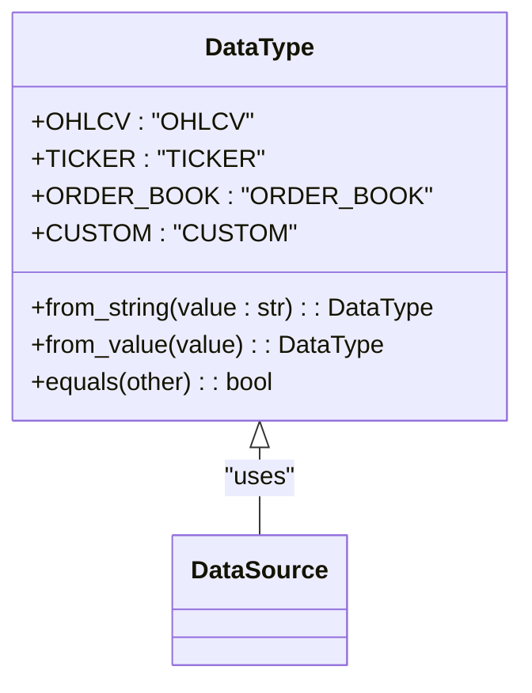
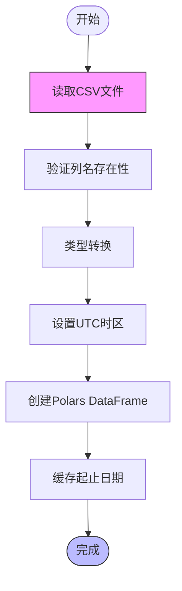
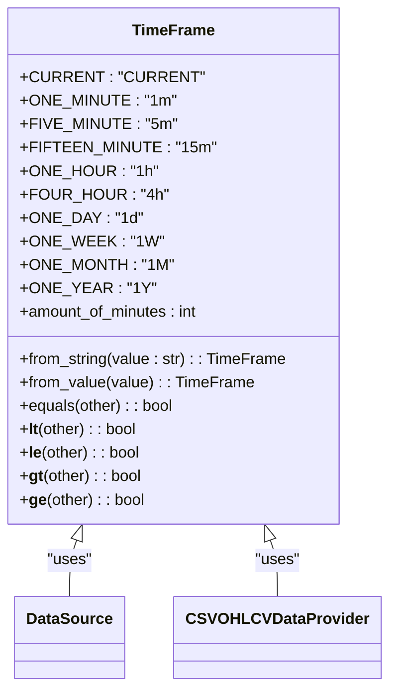

# 数据处理与模型

<cite>
**本文档中引用的文件**   
- [data_type.py](file://investing_algorithm_framework/domain/models/data/data_type.py)
- [data_source.py](file://investing_algorithm_framework/domain/models/data/data_source.py)
- [time_frame.py](file://investing_algorithm_framework/domain/models/time_frame.py)
- [csv.py](file://investing_algorithm_framework/infrastructure/data_providers/csv.py)
- [pandas.py](file://investing_algorithm_framework/infrastructure/data_providers/pandas.py)
- [polars.py](file://investing_algorithm_framework/domain/utils/polars.py)
- [constants.py](file://investing_algorithm_framework/domain/constants.py)
</cite>

## 目录
1. [OHLCV数据模型](#ohlcv数据模型)
2. [数据类型枚举](#数据类型枚举)
3. [Polars库的时间序列处理](#polars库的时间序列处理)
4. [数据完整性检查与异常值处理](#数据完整性检查与异常值处理)
5. [数据对齐与重采样](#数据对齐与重采样)
6. [数据预处理管道](#数据预处理管道)
7. [数据序列化与反序列化](#数据序列化与反序列化)

## OHLCV数据模型

该框架中的OHLCV数据模型定义了金融时间序列数据的标准结构，包含开盘价、最高价、最低价、收盘价和成交量五个核心字段。数据以Polars DataFrame格式存储，确保高效的数据处理性能。每个数据点都包含一个"DateTime"列，该列使用UTC时区并以毫秒为单位存储时间戳，保证了跨数据源的一致性。

OHLCV数据模型通过`CSVOHLCVDataProvider`和`PandasOHLCVDataProvider`类实现，这些类从CSV文件或Pandas DataFrame加载数据，并将其转换为Polars DataFrame。数据模型要求CSV文件必须包含以下列：Datetime、Open、High、Low、Close、Volume。框架在加载数据时会验证这些列的存在性，如果缺少任何必需的列，将抛出`OperationalException`异常。

数据模型的设计考虑了回测场景的特殊需求，通过预计算滑动窗口来优化性能。在准备回测数据时，系统会创建一个窗口缓存，其中包含指定日期范围内每个时间戳的滑动窗口数据。这种预计算机制显著提高了回测过程中的数据检索速度，特别是在需要频繁访问历史数据窗口的策略中。

**Section sources**
- [csv.py](file://investing_algorithm_framework/infrastructure/data_providers/csv.py#L29-L569)
- [pandas.py](file://investing_algorithm_framework/infrastructure/data_providers/pandas.py#L19-L600)

## 数据类型枚举

框架使用`DataType`枚举类来定义支持的数据类型，这是一个继承自Python `Enum`类的枚举类型。`DataType`枚举包含四种数据类型：OHLCV（开高低收成交量）、TICKER（行情数据）、ORDER_BOOK（订单簿）和CUSTOM（自定义数据）。每种数据类型都有对应的字符串值，如"OHLCV"、"TICKER"等，这些值在配置文件和数据源标识中使用。

`DataType`枚举提供了静态方法`from_string`和`from_value`，用于从字符串或其他值创建枚举实例。这些方法实现了类型转换的容错机制，能够处理大小写不敏感的字符串输入。例如，输入"ohlcv"、"OHLCV"或"OHLcv"都会被正确解析为`DataType.OHLCV`。此外，`equals`方法允许与其他枚举或字符串进行相等性比较，增强了数据类型比较的灵活性。

在框架的常量文件中，也定义了对应的数据类型字符串常量`OHLCV_DATA_TYPE`和`TICKER_DATA_TYPE`，这些常量在配置和环境变量中使用，确保了代码中数据类型引用的一致性。数据类型枚举的设计使得框架能够灵活支持多种数据源，并为未来扩展新的数据类型提供了清晰的接口。

**Diagram sources **
- [data_type.py](file://investing_algorithm_framework/domain/models/data/data_type.py#L4-L47)
- [data_source.py](file://investing_algorithm_framework/domain/models/data/data_source.py#L26-L36)
- [constants.py](file://investing_algorithm_framework/domain/constants.py#L45-L46)

## Polars库的时间序列处理

框架采用Polars库进行高效的时间序列数据处理和转换，利用其Rust后端实现的高性能优势。Polars在处理大型数据集时表现出显著优于Pandas的性能，特别是在日期时间操作方面，这得益于其优化的内存管理和多线程执行能力。所有时间序列DataFrame的Datetime列都设置为UTC时区，确保了不同数据源之间的时间一致性。

数据处理流程中，框架提供了`convert_polars_to_pandas`工具函数，用于在Polars和Pandas DataFrame之间进行转换。该函数允许选择是否移除重复日期、是否添加索引以及是否添加Datetime列。当`add_index`参数为True时，函数会将Datetime列设置为DataFrame的索引，这使得基于时间的过滤操作更加高效和可读。转换过程中，系统会确保Datetime列的类型正确，并在必要时移除重复的时间戳。

对于CSV数据源，框架使用`pl.read_csv`函数读取数据，并通过`schema_overrides`参数指定Datetime列为Polars的Datetime类型。读取后，数据会通过`with_columns`方法进行类型转换，确保Datetime列具有正确的毫秒精度和UTC时区。这种类型安全的处理方式避免了由于时间格式不一致导致的数据解析错误，提高了数据处理的可靠性。

**Diagram sources **
- [polars.py](file://investing_algorithm_framework/domain/utils/polars.py#L5-L54)
- [csv.py](file://investing_algorithm_framework/infrastructure/data_providers/csv.py#L409-L435)
- [pandas.py](file://investing_algorithm_framework/infrastructure/data_providers/pandas.py#L447-L472)

## 数据完整性检查与异常值处理

框架实现了全面的数据完整性检查机制，确保回测和交易策略使用的数据质量。在准备回测数据时，`prepare_backtest_data`方法会验证回测日期范围是否在可用数据范围内。如果回测开始日期早于数据源的起始日期，或回测结束日期晚于数据源的结束日期，系统会抛出`OperationalException`异常，防止使用不完整或不存在的数据。

数据完整性检查还包括对缺失数据点的识别和处理。系统通过比较预期日期序列和实际日期序列来确定缺失的日期。预期日期序列使用`pl.datetime_range`函数生成，基于指定的时间框架和日期范围。实际日期序列从数据的Datetime列获取。通过集合运算，系统可以找出所有缺失的日期，并将其存储在`missing_data_point_dates`列表中。这个列表可以用于后续的分析，帮助用户了解数据的完整性状况。

对于异常值处理，框架主要通过数据验证和类型检查来预防。在加载CSV数据时，系统会检查所有必需的OHLCV列是否存在，如果缺少任何列，会立即抛出异常。对于Pandas DataFrame输入，系统会验证是否存在Datetime列或DatetimeIndex。此外，框架会确保所有数值列（Open、High、Low、Close、Volume）包含有效的数值数据，防止由于数据格式错误导致的计算异常。

**Section sources**
- [csv.py](file://investing_algorithm_framework/infrastructure/data_providers/csv.py#L208-L281)
- [pandas.py](file://investing_algorithm_framework/infrastructure/data_providers/pandas.py#L207-L312)
- [csv.py](file://investing_algorithm_framework/infrastructure/data_providers/csv.py#L411-L420)

## 数据对齐与重采样

框架通过`TimeFrame`枚举类支持不同时间框架的数据对齐和重采样功能。`TimeFrame`枚举定义了多种时间间隔，包括1分钟、5分钟、15分钟、1小时、4小时、1天、1周、1月和1年等。每个时间框架都有对应的分钟数属性`amount_of_minutes`，用于计算时间间隔和窗口大小。这个设计使得框架能够灵活支持不同粒度的时间序列分析。

数据对齐功能在回测准备阶段实现，通过`_precompute_sliding_windows`方法创建滑动窗口缓存。该方法为指定日期范围内的每个时间戳生成一个数据窗口，窗口大小由`window_size`参数决定。例如，如果窗口大小为200，时间框架为1小时，系统会为每个时间戳创建一个包含前200小时数据的窗口。这种预计算机制确保了在回测过程中能够快速访问所需的历史数据。

重采样功能虽然没有直接的API，但可以通过数据源配置间接实现。用户可以通过创建不同时间框架的数据源来获取重采样后的数据。例如，可以从1分钟数据创建一个1小时数据源，系统会自动处理数据聚合。框架还支持时间框架的比较操作，`TimeFrame`类实现了`__lt__`、`__le__`、`__gt__`和`__ge__`方法，允许按时间粒度对数据源进行排序和筛选。

**Diagram sources **
- [time_frame.py](file://investing_algorithm_framework/domain/models/time_frame.py#L4-L154)
- [data_source.py](file://investing_algorithm_framework/domain/models/data/data_source.py#L29-L39)
- [csv.py](file://investing_algorithm_framework/infrastructure/data_providers/csv.py#L107-L112)

## 数据预处理管道

框架提供了完整的数据预处理管道，支持缺失值填充、数据标准化和特征工程等操作。预处理流程从数据加载开始，通过`_load_data`方法读取原始数据并进行初步验证。对于CSV数据源，系统会检查文件是否包含所有必需的列，并在必要时抛出异常。数据加载后，系统会自动处理Datetime列的类型转换，确保其为UTC时区的Polars Datetime类型。

缺失值处理是预处理管道的重要组成部分。系统通过比较预期日期序列和实际日期序列来识别缺失的数据点。预期日期序列基于时间框架和日期范围生成，而实际日期序列来自数据的Datetime列。缺失的日期被存储在`missing_data_point_dates`列表中，供后续分析使用。虽然框架目前没有自动填充缺失值的功能，但提供了`get_missing_data_dates`方法，允许用户查询特定日期范围内的缺失数据。

特征工程功能主要通过数据源的配置实现。用户可以通过设置`window_size`参数来定义用于技术指标计算的窗口大小。例如，一个200周期的移动平均线可以通过设置`window_size=200`来实现。框架的滑动窗口机制为特征工程提供了基础支持，允许策略在每个时间点访问指定长度的历史数据。此外，`DataSource`类提供了`get_number_of_required_data_points`方法，用于计算特定日期范围内所需的完整数据点数量。

**Section sources**
- [csv.py](file://investing_algorithm_framework/infrastructure/data_providers/csv.py#L389-L485)
- [pandas.py](file://investing_algorithm_framework/infrastructure/data_providers/pandas.py#L474-L522)
- [data_source.py](file://investing_algorithm_framework/domain/models/data/data_source.py#L191-L223)

## 数据序列化与反序列化

框架实现了数据序列化和反序列化的完整功能，支持CSV文件和Pandas DataFrame作为数据源。对于CSV文件，系统使用`pl.read_csv`函数进行反序列化，读取文件内容并转换为Polars DataFrame。序列化功能虽然没有直接的API，但可以通过Polars DataFrame的`write_csv`方法实现。这种设计使得用户可以轻松地将处理后的数据保存到文件系统中。

数据源的序列化主要通过`DataSource`类的`to_dict`方法实现。该方法将数据源实例转换为字典，其中包含所有非空属性。`DataType`和`TimeFrame`枚举会被转换为它们的字符串值，确保序列化结果的可读性。这个功能在调试和日志记录中特别有用，允许用户以结构化格式查看数据源的配置。

反序列化功能在多个场景中使用，特别是在从文件名解析数据源属性时。`CCXTOHLCVDataProvider`类中的`_extract_data_source_from_file_name`方法展示了如何从符合特定命名约定的CSV文件名中提取数据源信息。文件名格式为"OHLCV_<SYMBOL>_<MARKET>_<TIME_FRAME>_<START_DATE>_<END_DATE>.csv"，系统会解析这些部分并创建相应的`DataSource`实例。这种约定化的命名方式使得数据管理更加系统化和自动化。

**Section sources**
- [csv.py](file://investing_algorithm_framework/infrastructure/data_providers/csv.py#L390-L435)
- [data_source.py](file://investing_algorithm_framework/domain/models/data/data_source.py#L115-L129)
- [ccxt.py](file://investing_algorithm_framework/infrastructure/data_providers/ccxt.py#L921-L952)