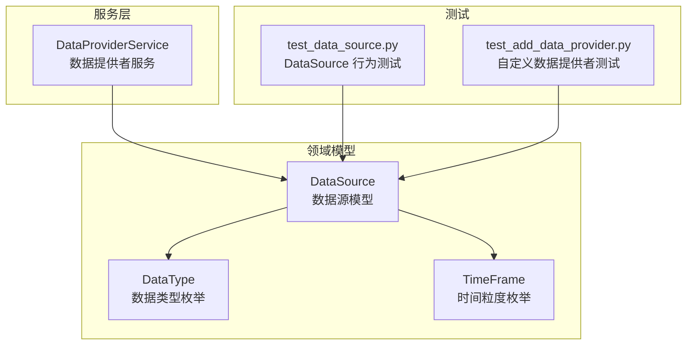
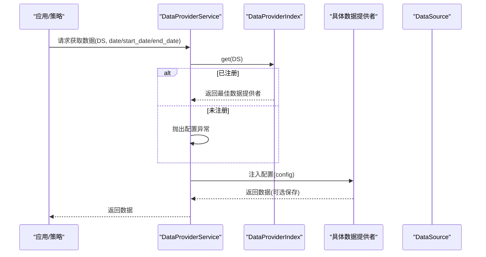
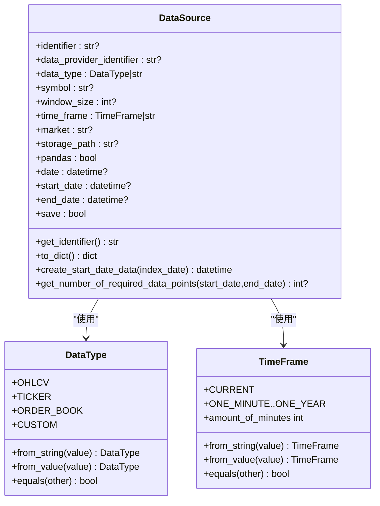
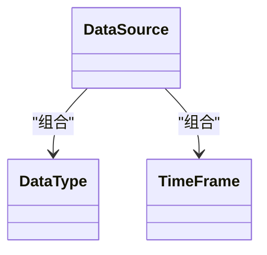
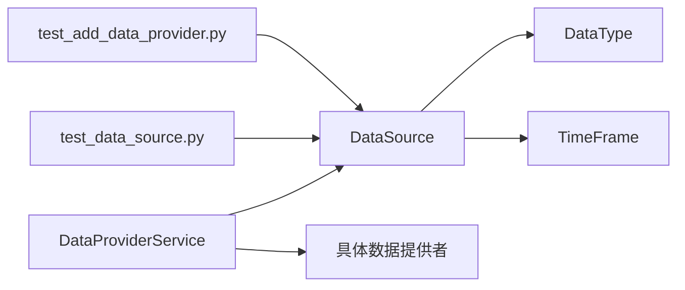

# 数据模型

<cite>
**本文引用的文件**
- [investing_algorithm_framework/domain/models/data/data_source.py](file://investing_algorithm_framework/domain/models/data/data_source.py)
- [investing_algorithm_framework/domain/models/data/data_type.py](file://investing_algorithm_framework/domain/models/data/data_type.py)
- [investing_algorithm_framework/domain/models/time_frame.py](file://investing_algorithm_framework/domain/models/time_frame.py)
- [investing_algorithm_framework/services/data_providers/data_provider_service.py](file://investing_algorithm_framework/services/data_providers/data_provider_service.py)
- [tests/domain/models/data/test_data_source.py](file://tests/domain/models/data/test_data_source.py)
- [tests/app/test_add_data_provider.py](file://tests/app/test_add_data_provider.py)
</cite>

## 目录
1. [引言](#引言)
2. [项目结构](#项目结构)
3. [核心组件](#核心组件)
4. [架构总览](#架构总览)
5. [详细组件分析](#详细组件分析)
6. [依赖分析](#依赖分析)
7. [性能考虑](#性能考虑)
8. [故障排查指南](#故障排查指南)
9. [结论](#结论)
10. [附录](#附录)

## 引言
本章节聚焦于框架中的核心数据实体设计，系统性阐述 DataSource 类的结构与功能、DataType 枚举的定义与作用、数据模型之间的关系与继承结构、序列化与反序列化实现细节、扩展新数据源类型的实践方法、数据验证规则与约束条件，并通过测试用例路径展示数据模型的实例化与使用模式。

## 项目结构
围绕数据模型的核心文件位于领域层的 models 子模块中，同时服务层提供了数据提供者索引与获取逻辑，测试用例覆盖了 DataSource 的行为边界与使用场景。

图表来源
- [investing_algorithm_framework/domain/models/data/data_source.py](file://investing_algorithm_framework/domain/models/data/data_source.py#L1-L223)
- [investing_algorithm_framework/domain/models/data/data_type.py](file://investing_algorithm_framework/domain/models/data/data_type.py#L1-L47)
- [investing_algorithm_framework/domain/models/time_frame.py](file://investing_algorithm_framework/domain/models/time_frame.py#L1-L154)
- [investing_algorithm_framework/services/data_providers/data_provider_service.py](file://investing_algorithm_framework/services/data_providers/data_provider_service.py#L334-L404)
- [tests/domain/models/data/test_data_source.py](file://tests/domain/models/data/test_data_source.py#L1-L390)
- [tests/app/test_add_data_provider.py](file://tests/app/test_add_data_provider.py#L54-L89)

章节来源
- [investing_algorithm_framework/domain/models/data/data_source.py](file://investing_algorithm_framework/domain/models/data/data_source.py#L1-L223)
- [investing_algorithm_framework/domain/models/data/data_type.py](file://investing_algorithm_framework/domain/models/data/data_type.py#L1-L47)
- [investing_algorithm_framework/domain/models/time_frame.py](file://investing_algorithm_framework/domain/models/time_frame.py#L1-L154)
- [investing_algorithm_framework/services/data_providers/data_provider_service.py](file://investing_algorithm_framework/services/data_providers/data_provider_service.py#L334-L404)
- [tests/domain/models/data/test_data_source.py](file://tests/domain/models/data/test_data_source.py#L1-L390)
- [tests/app/test_add_data_provider.py](file://tests/app/test_add_data_provider.py#L54-L89)

## 核心组件
- DataSource：用于描述策略所需的数据源，包含标识符、数据提供者标识、数据类型、交易对符号、窗口大小、时间粒度、市场、存储路径、是否返回 pandas、日期范围、是否保存等字段。该类在构造后进行字段规范化（如字符串转枚举、日期时区处理、大写标准化），并提供唯一标识生成、字典转换、相等性比较、起始日期推导、所需数据点数量计算等能力。
- DataType：定义可用的数据类型集合，包括 OHLCV、TICKER、ORDER_BOOK、CUSTOM，并提供从字符串或枚举值解析的方法以及相等性判断。
- TimeFrame：定义时间粒度枚举及分钟数映射，支持字符串到枚举的容错解析（如“1h”与“1H”、“1d”与“1D”），并提供比较运算以支持排序与比较。
- DataProviderService：负责注册与查找数据提供者，基于 DataSource 的属性匹配最佳提供者，并在运行时注入配置与调用数据获取。

章节来源
- [investing_algorithm_framework/domain/models/data/data_source.py](file://investing_algorithm_framework/domain/models/data/data_source.py#L1-L223)
- [investing_algorithm_framework/domain/models/data/data_type.py](file://investing_algorithm_framework/domain/models/data/data_type.py#L1-L47)
- [investing_algorithm_framework/domain/models/time_frame.py](file://investing_algorithm_framework/domain/models/time_frame.py#L1-L154)
- [investing_algorithm_framework/services/data_providers/data_provider_service.py](file://investing_algorithm_framework/services/data_providers/data_provider_service.py#L334-L404)

## 架构总览
下图展示了数据模型与服务层的交互关系，体现数据源如何被识别、索引并最终由数据提供者提供数据。

图表来源
- [investing_algorithm_framework/services/data_providers/data_provider_service.py](file://investing_algorithm_framework/services/data_providers/data_provider_service.py#L334-L404)

章节来源
- [investing_algorithm_framework/services/data_providers/data_provider_service.py](file://investing_algorithm_framework/services/data_providers/data_provider_service.py#L334-L404)

## 详细组件分析

### DataSource 组件分析
- 字段与职责
  - 标识符：identifier（可选），若未提供则根据数据类型与关键属性生成唯一标识。
  - 数据提供者标识：data_provider_identifier（可选）。
  - 数据类型：data_type（Union[DataType, str]），支持字符串与枚举两种输入形式。
  - 交易对符号：symbol（可选）。
  - 窗口大小：window_size（可选），用于回测或滑动窗口需求。
  - 时间粒度：time_frame（Union[TimeFrame, str]），支持字符串与枚举。
  - 市场：market（可选），统一转为大写。
  - 存储路径：storage_path（可选）。
  - 是否返回 pandas：pandas（默认 False）。
  - 日期范围：date、start_date、end_date（可选，字符串会被解析并强制 UTC 时区）。
  - 是否保存：save（默认 False）。
- 规范化与校验
  - 在 __post_init__ 中完成：
    - 将 data_type 与 time_frame 从字符串转换为对应枚举。
    - 解析 start_date 与 end_date 并设置为 UTC。
    - 将 market 与 symbol 转为大写。
- 唯一标识生成
  - 若显式提供 identifier 则直接使用；否则根据数据类型生成：
    - OHLCV：格式为 “{数据类型}_{市场}_{符号}_{时间粒度}”
    - CUSTOM：拼接 “CUSTOM” 与可选的 symbol、time_frame、market、window_size
- 相等性与哈希
  - 不同数据类型有差异化相等性规则：
    - OHLCV：当时间粒度或窗口大小缺失时，仅比较数据类型与符号；否则需比较时间粒度、市场、符号与数据类型。
    - CUSTOM：需比较数据类型、symbol、window_size、time_frame、market。
    - TICKER：需比较数据类型、symbol、market。
  - 测试覆盖了集合去重、字典键使用、集合运算等场景，确保 DataSource 可作为集合元素与字典键稳定使用。
- 数据点数量估算
  - get_number_of_required_data_points：在存在时间粒度与日期范围时，按分钟换算估算所需数据点数量，并叠加窗口大小。
- 起始日期推导
  - create_start_date_data：结合 window_size 与 time_frame 推导回测所需的起始日期。
- 序列化与反序列化
  - to_dict：输出非空字段字典，并将枚举转换为其字符串表示，便于持久化或传输。
  - __repr__：提供可读的调试字符串。
- 使用示例（测试用例路径）
  - 初始化与字段默认值：[初始化与默认值](file://tests/domain/models/data/test_data_source.py#L12-L21)
  - 指定值初始化与大小写处理：[指定值初始化](file://tests/domain/models/data/test_data_source.py#L23-L39)
  - 部分字段初始化：[部分初始化](file://tests/domain/models/data/test_data_source.py#L41-L53)
  - 不同数据类型：[不同数据类型](file://tests/domain/models/data/test_data_source.py#L55-L67)
  - 相等性与不等性：[相等性与不等性](file://tests/domain/models/data/test_data_source.py#L69-L119)
  - 集合去重与字典键：[集合与字典键](file://tests/domain/models/data/test_data_source.py#L121-L204)
  - 集合运算与边界情况：[集合运算](file://tests/domain/models/data/test_data_source.py#L205-L239)
  - 不可变性与 None 值：[不可变性与 None](file://tests/domain/models/data/test_data_source.py#L252-L286)
  - 窗口大小与时间粒度：[窗口大小与时间粒度](file://tests/domain/models/data/test_data_source.py#L288-L309)
  - 符号格式与市场值：[符号与市场](file://tests/domain/models/data/test_data_source.py#L311-L327)
  - 数据类特性与字段默认值：[数据类特性](file://tests/domain/models/data/test_data_source.py#L329-L371)
  - OHLCV 相等性对比：[OHLCV 相等性](file://tests/domain/models/data/test_data_source.py#L372-L390)

图表来源
- [investing_algorithm_framework/domain/models/data/data_source.py](file://investing_algorithm_framework/domain/models/data/data_source.py#L1-L223)
- [investing_algorithm_framework/domain/models/data/data_type.py](file://investing_algorithm_framework/domain/models/data/data_type.py#L1-L47)
- [investing_algorithm_framework/domain/models/time_frame.py](file://investing_algorithm_framework/domain/models/time_frame.py#L1-L154)

章节来源
- [investing_algorithm_framework/domain/models/data/data_source.py](file://investing_algorithm_framework/domain/models/data/data_source.py#L1-L223)
- [tests/domain/models/data/test_data_source.py](file://tests/domain/models/data/test_data_source.py#L1-L390)

### DataType 枚举分析
- 定义与用途
  - OHLCV：OHLCV 数据（开盘、最高、最低、收盘、成交量）。
  - TICKER：实时报价数据。
  - ORDER_BOOK：挂单簿数据。
  - CUSTOM：自定义数据。
- 解析与相等性
  - 提供 from_string 与 from_value 方法，支持字符串与枚举输入。
  - equals 支持与字符串或枚举的相等性判断。
- 在 DataSource 中的应用
  - DataSource 在 __post_init__ 中将字符串 data_type 转换为 DataType 枚举，保证类型一致性与可比性。

章节来源
- [investing_algorithm_framework/domain/models/data/data_type.py](file://investing_algorithm_framework/domain/models/data/data_type.py#L1-L47)
- [investing_algorithm_framework/domain/models/data/data_source.py](file://investing_algorithm_framework/domain/models/data/data_source.py#L38-L47)

### TimeFrame 枚举分析
- 定义与用途
  - 包含从分钟到年的多种时间粒度，提供 amount_of_minutes 属性用于换算。
- 解析与比较
  - from_string 支持大小写与单位差异（如“1h/1H”、“1d/1D”）。
  - 提供比较运算（<、<=、>、>=），便于排序与比较。
- 在 DataSource 中的应用
  - DataSource 在 __post_init__ 中将字符串 time_frame 转换为 TimeFrame 枚举，并在数据点估算与起始日期推导中使用。

章节来源
- [investing_algorithm_framework/domain/models/time_frame.py](file://investing_algorithm_framework/domain/models/time_frame.py#L1-L154)
- [investing_algorithm_framework/domain/models/data/data_source.py](file://investing_algorithm_framework/domain/models/data/data_source.py#L44-L46)

### DataProviderService 与数据提供者索引
- 注册与查找
  - 通过遍历已注册的数据提供者，筛选满足 DataSource 条件的提供者，并按优先级排序选择最佳提供者。
  - 对 OHLCV 与 TICKER 数据源分别维护专用索引，便于快速定位。
- 获取数据
  - 若未找到匹配提供者，抛出配置错误；否则注入配置并调用数据提供者的 get_data 方法。
- 自定义数据提供者
  - 测试用例展示了如何添加自定义数据提供者并在策略中使用 CUSTOM 数据类型的数据源。

章节来源
- [investing_algorithm_framework/services/data_providers/data_provider_service.py](file://investing_algorithm_framework/services/data_providers/data_provider_service.py#L39-L80)
- [investing_algorithm_framework/services/data_providers/data_provider_service.py](file://investing_algorithm_framework/services/data_providers/data_provider_service.py#L225-L237)
- [investing_algorithm_framework/services/data_providers/data_provider_service.py](file://investing_algorithm_framework/services/data_providers/data_provider_service.py#L356-L404)
- [tests/app/test_add_data_provider.py](file://tests/app/test_add_data_provider.py#L54-L89)

### 数据模型关系与继承结构
- DataSource 与 DataType、TimeFrame 的组合关系：DataSource 通过组合使用这两个枚举，形成对数据源的完整描述。
- 无显式继承：DataSource 采用 dataclass 设计，不涉及类继承；DataType 与 TimeFrame 为独立枚举。
- 关系可视化

图表来源
- [investing_algorithm_framework/domain/models/data/data_source.py](file://investing_algorithm_framework/domain/models/data/data_source.py#L1-L223)
- [investing_algorithm_framework/domain/models/data/data_type.py](file://investing_algorithm_framework/domain/models/data/data_type.py#L1-L47)
- [investing_algorithm_framework/domain/models/time_frame.py](file://investing_algorithm_framework/domain/models/time_frame.py#L1-L154)

## 依赖分析
- DataSource 依赖
  - DataType：用于规范 data_type 字段。
  - TimeFrame：用于规范 time_frame 字段。
- DataProviderService 依赖
  - DataSource：作为索引与查询的键。
  - 具体数据提供者：根据 DataSource 的属性动态选择并调用。
- 测试依赖
  - DataSource 行为测试覆盖了初始化、相等性、集合使用、序列化、字段默认值等。
  - 自定义数据提供者测试展示了 CUSTOM 数据类型的使用方式。

图表来源
- [investing_algorithm_framework/domain/models/data/data_source.py](file://investing_algorithm_framework/domain/models/data/data_source.py#L1-L223)
- [investing_algorithm_framework/domain/models/data/data_type.py](file://investing_algorithm_framework/domain/models/data/data_type.py#L1-L47)
- [investing_algorithm_framework/domain/models/time_frame.py](file://investing_algorithm_framework/domain/models/time_frame.py#L1-L154)
- [investing_algorithm_framework/services/data_providers/data_provider_service.py](file://investing_algorithm_framework/services/data_providers/data_provider_service.py#L334-L404)
- [tests/domain/models/data/test_data_source.py](file://tests/domain/models/data/test_data_source.py#L1-L390)
- [tests/app/test_add_data_provider.py](file://tests/app/test_add_data_provider.py#L54-L89)

章节来源
- [investing_algorithm_framework/services/data_providers/data_provider_service.py](file://investing_algorithm_framework/services/data_providers/data_provider_service.py#L334-L404)
- [tests/domain/models/data/test_data_source.py](file://tests/domain/models/data/test_data_source.py#L1-L390)
- [tests/app/test_add_data_provider.py](file://tests/app/test_add_data_provider.py#L54-L89)

## 性能考虑
- 时间粒度换算：TimeFrame.amount_of_minutes 用于快速计算数据点数量，避免重复解析与字符串比较。
- 数据点估算：get_number_of_required_data_points 在已知时间粒度与日期范围时，通过分钟换算估算所需数据点数量，有助于预加载与内存管理。
- 唯一性与索引：DataSource 的相等性与哈希语义保证在集合与字典中的高效存取，减少重复注册与查找成本。
- 服务层索引：DataProviderService 对 OHLCV 与 TICKER 分别建立索引，提升查找效率。

## 故障排查指南
- 未找到数据提供者
  - 现象：调用 DataProviderService.get_data 时抛出配置异常。
  - 原因：未为 DataSource 所需的市场、符号、时间粒度等属性注册匹配的数据提供者。
  - 处理：检查数据提供者注册流程，确认 has_data 返回 True 且优先级设置合理。
  - 参考：[异常抛出位置](file://investing_algorithm_framework/services/data_providers/data_provider_service.py#L69-L75)
- 数据类型解析失败
  - 现象：传入字符串 data_type 或 time_frame 无法解析为枚举。
  - 原因：字符串值不在枚举定义范围内或大小写不一致。
  - 处理：使用 DataType.from_string 或 TimeFrame.from_string 进行容错解析，或修正字符串值。
  - 参考：[DataType 解析](file://investing_algorithm_framework/domain/models/data/data_type.py#L11-L22)、[TimeFrame 解析](file://investing_algorithm_framework/domain/models/time_frame.py#L24-L53)
- 日期与时区问题
  - 现象：start_date/end_date 未正确解析或时区不一致。
  - 原因：字符串日期未解析或未设置 UTC。
  - 处理：确保传入字符串日期并依赖 __post_init__ 的解析与 UTC 设置。
  - 参考：[日期解析与 UTC 设置](file://investing_algorithm_framework/domain/models/data/data_source.py#L51-L77)
- 自定义数据提供者未生效
  - 现象：策略中使用 CUSTOM 数据类型但未提供数据。
  - 处理：确认已注册自定义数据提供者并在策略中正确声明 DataSource(data_type=CUSTOM,...)。
  - 参考：[自定义数据提供者测试](file://tests/app/test_add_data_provider.py#L54-L89)

章节来源
- [investing_algorithm_framework/services/data_providers/data_provider_service.py](file://investing_algorithm_framework/services/data_providers/data_provider_service.py#L69-L75)
- [investing_algorithm_framework/domain/models/data/data_type.py](file://investing_algorithm_framework/domain/models/data/data_type.py#L11-L22)
- [investing_algorithm_framework/domain/models/time_frame.py](file://investing_algorithm_framework/domain/models/time_frame.py#L24-L53)
- [investing_algorithm_framework/domain/models/data/data_source.py](file://investing_algorithm_framework/domain/models/data/data_source.py#L51-L77)
- [tests/app/test_add_data_provider.py](file://tests/app/test_add_data_provider.py#L54-L89)

## 结论
本数据模型通过 DataSource、DataType、TimeFrame 的组合，提供了对市场数据源的清晰抽象与强类型约束。DataSource 的规范化、唯一标识生成、相等性与哈希语义、序列化与数据点估算等功能，使其既能满足策略层的灵活使用，又能在服务层高效索引与调度数据提供者。通过测试用例可以验证其在各种边界条件下的稳定性与正确性。扩展新数据源类型时，建议遵循现有枚举与解析机制，并在服务层注册相应的数据提供者以确保可发现性与可执行性。

## 附录
- 实际使用模式（测试用例路径）
  - OHLCV 数据源初始化与相等性：[OHLCV 初始化与相等性](file://tests/domain/models/data/test_data_source.py#L23-L106)
  - TICKER 数据源初始化与相等性：[TICKER 初始化与相等性](file://tests/domain/models/data/test_data_source.py#L107-L119)
  - CUSTOM 数据源与自定义提供者：[CUSTOM 数据源](file://tests/app/test_add_data_provider.py#L62-L69)
  - 集合与字典键使用：[集合与字典键](file://tests/domain/models/data/test_data_source.py#L183-L204)
  - 数据点估算与起始日期推导：[数据点估算](file://investing_algorithm_framework/domain/models/data/data_source.py#L191-L223)、[起始日期推导](file://investing_algorithm_framework/domain/models/data/data_source.py#L181-L190)
  - 序列化字典输出：[to_dict](file://investing_algorithm_framework/domain/models/data/data_source.py#L115-L129)