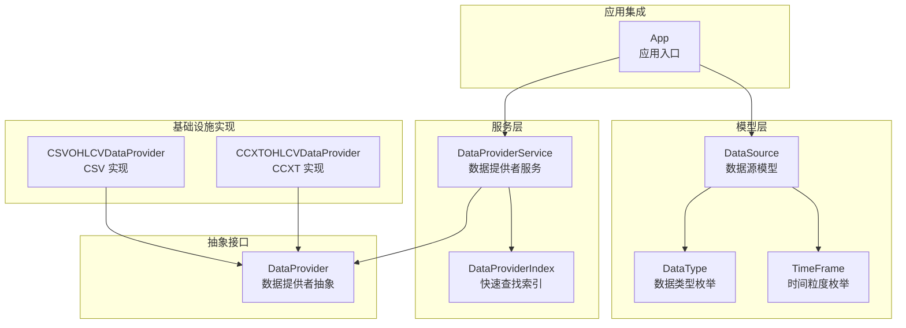
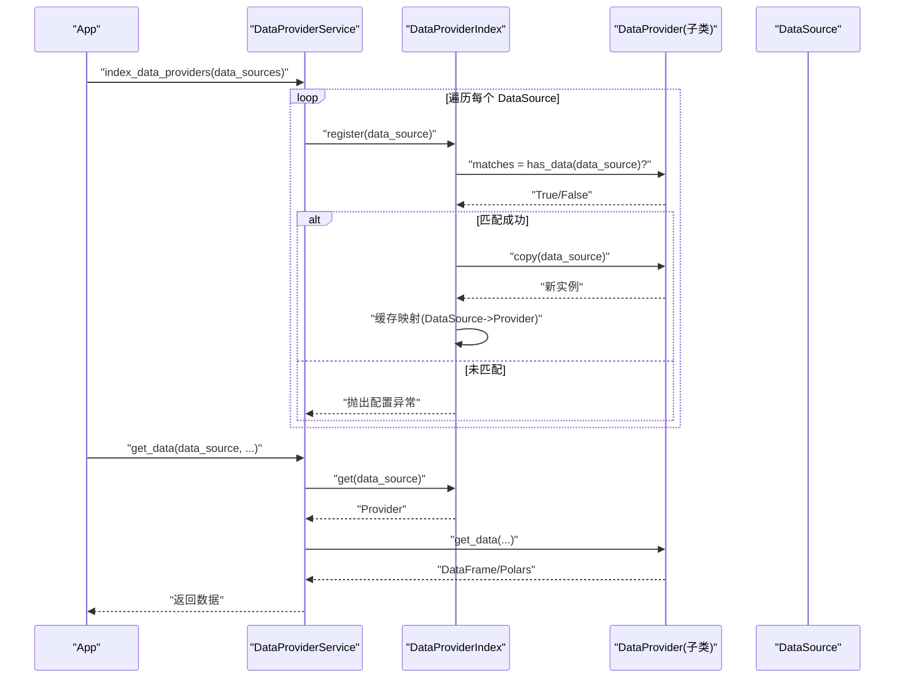
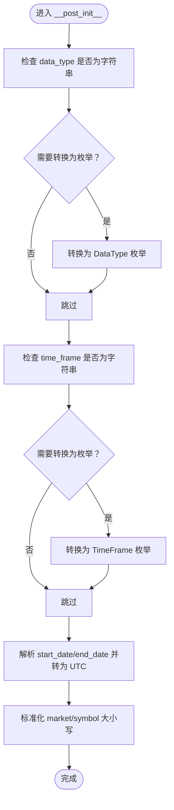
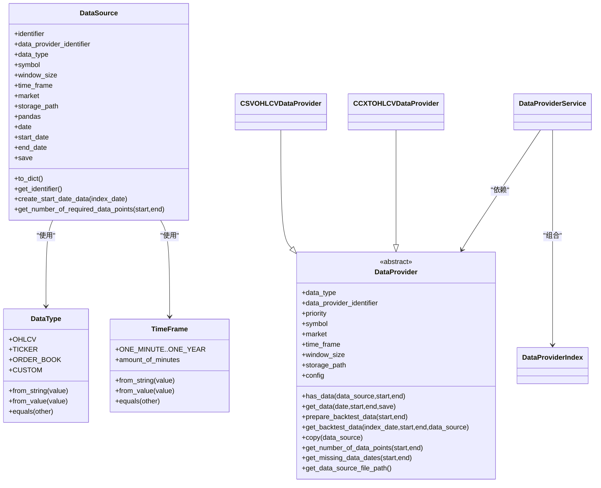

# 数据源模型

<cite>
**本文引用的文件列表**
- [investing_algorithm_framework/domain/models/data/data_source.py](file://investing_algorithm_framework/domain/models/data/data_source.py)
- [investing_algorithm_framework/domain/models/data/data_type.py](file://investing_algorithm_framework/domain/models/data/data_type.py)
- [investing_algorithm_framework/domain/models/time_frame.py](file://investing_algorithm_framework/domain/models/time_frame.py)
- [investing_algorithm_framework/domain/data_provider.py](file://investing_algorithm_framework/domain/data_provider.py)
- [investing_algorithm_framework/services/data_providers/data_provider_service.py](file://investing_algorithm_framework/services/data_providers/data_provider_service.py)
- [investing_algorithm_framework/infrastructure/data_providers/ccxt.py](file://investing_algorithm_framework/infrastructure/data_providers/ccxt.py)
- [investing_algorithm_framework/infrastructure/data_providers/csv.py](file://investing_algorithm_framework/infrastructure/data_providers/csv.py)
- [investing_algorithm_framework/app/app.py](file://investing_algorithm_framework/app/app.py)
- [tests/domain/models/data/test_data_source.py](file://tests/domain/models/data/test_data_source.py)
</cite>

## 目录
1. [简介](#简介)
2. [项目结构](#项目结构)
3. [核心组件](#核心组件)
4. [架构总览](#架构总览)
5. [详细组件分析](#详细组件分析)
6. [依赖关系分析](#依赖关系分析)
7. [性能考量](#性能考量)
8. [故障排查指南](#故障排查指南)
9. [结论](#结论)
10. [附录：扩展与最佳实践](#附录扩展与最佳实践)

## 简介
本文件系统性梳理并解读框架中的“数据源模型”，重点围绕 DataSource 类的设计与实现展开，涵盖：
- 核心属性与用途：identifier、data_provider_identifier、data_type、symbol、window_size、time_frame、market、storage_path、pandas、date、start_date、end_date、save 等字段的语义与约束。
- 配置与连接：如何通过配置将数据源映射到具体的数据提供者（DataProvider），以及 DataProviderService 的索引与查找机制。
- 验证规则与约束：字符串到枚举的转换、时间范围处理、大小写规范化、唯一性与可哈希性等。
- 与其他组件的交互：与 DataProvider 抽象、CCXT/CSV 具体实现、App 初始化流程的关系。
- 实际用法示例：创建、配置与使用的路径指引。
- 扩展指南：如何新增数据源类型或数据提供者。
- 序列化与反序列化：to_dict、标识符生成、相等性与哈希策略。

## 项目结构
围绕数据源模型的关键文件分布如下：
- 模型层：DataSource、DataType、TimeFrame 定义于 domain/models/data 与 domain/models 下。
- 抽象接口：DataProvider 抽象类定义于 domain/data_provider.py。
- 服务层：DataProviderService 及其内部索引 DataProviderIndex 定义于 services/data_providers。
- 基础设施实现：CCXTOHLCVDataProvider、CSVOHLCVDataProvider 定义于 infrastructure/data_providers。
- 应用集成：App 在初始化阶段调用 DataProviderService 对数据源进行索引与回测数据准备。
- 测试：对 DataSource 的行为进行覆盖，包括相等性、集合去重、哈希、字段默认值等。

图表来源
- [investing_algorithm_framework/domain/models/data/data_source.py](file://investing_algorithm_framework/domain/models/data/data_source.py#L1-L223)
- [investing_algorithm_framework/domain/models/data/data_type.py](file://investing_algorithm_framework/domain/models/data/data_type.py#L1-L47)
- [investing_algorithm_framework/domain/models/time_frame.py](file://investing_algorithm_framework/domain/models/time_frame.py#L1-L154)
- [investing_algorithm_framework/domain/data_provider.py](file://investing_algorithm_framework/domain/data_provider.py#L1-L335)
- [investing_algorithm_framework/services/data_providers/data_provider_service.py](file://investing_algorithm_framework/services/data_providers/data_provider_service.py#L1-L800)
- [investing_algorithm_framework/infrastructure/data_providers/ccxt.py](file://investing_algorithm_framework/infrastructure/data_providers/ccxt.py#L1-L800)
- [investing_algorithm_framework/infrastructure/data_providers/csv.py](file://investing_algorithm_framework/infrastructure/data_providers/csv.py#L1-L569)
- [investing_algorithm_framework/app/app.py](file://investing_algorithm_framework/app/app.py#L380-L579)

章节来源
- [investing_algorithm_framework/domain/models/data/data_source.py](file://investing_algorithm_framework/domain/models/data/data_source.py#L1-L223)
- [investing_algorithm_framework/services/data_providers/data_provider_service.py](file://investing_algorithm_framework/services/data_providers/data_provider_service.py#L1-L800)
- [investing_algorithm_framework/app/app.py](file://investing_algorithm_framework/app/app.py#L380-L579)

## 核心组件
- DataSource：不可变数据源描述对象，负责承载数据请求所需的所有参数，并提供标识符生成、日期推导、数据点数量估算等能力。
- DataType：数据类型枚举（OHLCV、TICKER、ORDER_BOOK、CUSTOM）。
- TimeFrame：时间粒度枚举（1m 到 1Y），并提供分钟数换算与比较运算。
- DataProvider：抽象数据提供者接口，定义 has_data、get_data、prepare_backtest_data、get_backtest_data、copy、get_number_of_data_points、get_missing_data_dates、get_data_source_file_path 等契约。
- DataProviderService：服务层协调器，负责注册/索引数据提供者、按数据源查找对应提供者、统一获取数据、回测数据准备与向量化回测数据聚合。
- CCXTOHLCVDataProvider/CSVOHLCVDataProvider：具体实现，分别对接 CCXT 交易所与本地 CSV 文件。

章节来源
- [investing_algorithm_framework/domain/models/data/data_source.py](file://investing_algorithm_framework/domain/models/data/data_source.py#L1-L223)
- [investing_algorithm_framework/domain/models/data/data_type.py](file://investing_algorithm_framework/domain/models/data/data_type.py#L1-L47)
- [investing_algorithm_framework/domain/models/time_frame.py](file://investing_algorithm_framework/domain/models/time_frame.py#L1-L154)
- [investing_algorithm_framework/domain/data_provider.py](file://investing_algorithm_framework/domain/data_provider.py#L1-L335)
- [investing_algorithm_framework/services/data_providers/data_provider_service.py](file://investing_algorithm_framework/services/data_providers/data_provider_service.py#L1-L800)
- [investing_algorithm_framework/infrastructure/data_providers/ccxt.py](file://investing_algorithm_framework/infrastructure/data_providers/ccxt.py#L1-L800)
- [investing_algorithm_framework/infrastructure/data_providers/csv.py](file://investing_algorithm_framework/infrastructure/data_providers/csv.py#L1-L569)

## 架构总览
DataSource 作为“查询规格”，由 DataProviderService 将其与具体 DataProvider 进行匹配与索引；App 在启动时批量注册数据源，触发索引与回测数据准备。

图表来源
- [investing_algorithm_framework/services/data_providers/data_provider_service.py](file://investing_algorithm_framework/services/data_providers/data_provider_service.py#L334-L405)
- [investing_algorithm_framework/domain/data_provider.py](file://investing_algorithm_framework/domain/data_provider.py#L172-L335)
- [investing_algorithm_framework/app/app.py](file://investing_algorithm_framework/app/app.py#L380-L579)

## 详细组件分析

### DataSource 设计与实现
- 不可变性与后处理：通过 dataclass(frozen=True) 保证不可变；__post_init__ 中完成：
  - data_type、time_frame 字符串到枚举的转换；
  - start_date/end_date 字符串解析并统一为 UTC；
  - market/symbol 大小写标准化。
- 标识符生成：优先使用显式 identifier；若未设置，则根据 data_type 生成：
  - OHLCV：形如 “ohlcv_{market}_{symbol}_{time_frame}”
  - CUSTOM：拼接 symbol、time_frame、market、window_size 等
  - TICKER：基于 symbol 与 market
- 相等性与哈希：依据 data_type、symbol、time_frame、market、window_size 等关键字段进行比较，确保 DataSource 可作为字典键与集合元素使用。
- 数据点估算与窗口起始日期：
  - get_number_of_required_data_points：基于时间窗与分钟数计算所需数据点数，考虑 window_size。
  - create_start_date_data：当存在 window_size 与 time_frame 时，从索引日期推导开始日期。
- 序列化：to_dict 输出非空字段，将 DataType/TimeFrame 转为字符串值，便于日志与错误提示。

图表来源
- [investing_algorithm_framework/domain/models/data/data_source.py](file://investing_algorithm_framework/domain/models/data/data_source.py#L38-L84)

章节来源
- [investing_algorithm_framework/domain/models/data/data_source.py](file://investing_algorithm_framework/domain/models/data/data_source.py#L1-L223)
- [tests/domain/models/data/test_data_source.py](file://tests/domain/models/data/test_data_source.py#L1-L390)

### DataType 与 TimeFrame
- DataType：OHLCV、TICKER、ORDER_BOOK、CUSTOM 四种类型，支持 from_string/from_value 与 equals 比较。
- TimeFrame：覆盖分钟到年级的时间粒度，提供 amount_of_minutes、比较运算，用于数据点计算与窗口推导。

章节来源
- [investing_algorithm_framework/domain/models/data/data_type.py](file://investing_algorithm_framework/domain/models/data/data_type.py#L1-L47)
- [investing_algorithm_framework/domain/models/time_frame.py](file://investing_algorithm_framework/domain/models/time_frame.py#L1-L154)

### DataProvider 抽象与实现
- 抽象契约：has_data/get_data/prepare_backtest_data/get_backtest_data/copy/get_number_of_data_points/get_missing_data_dates/get_data_source_file_path 等。
- 配置与凭据：data_type、data_provider_identifier、priority、symbol、market、time_frame、window_size、storage_path、config、market_credentials 等。
- CCXTOHLCVDataProvider：对接 CCXT，支持网络拉取、本地存储、回测滑窗预计算、缺失数据检测、pandas/Polars 转换。
- CSVOHLCVDataProvider：加载本地 CSV，校验列名，支持回测滑窗预计算与缺失日期检测。

章节来源
- [investing_algorithm_framework/domain/data_provider.py](file://investing_algorithm_framework/domain/data_provider.py#L1-L335)
- [investing_algorithm_framework/infrastructure/data_providers/ccxt.py](file://investing_algorithm_framework/infrastructure/data_providers/ccxt.py#L1-L800)
- [investing_algorithm_framework/infrastructure/data_providers/csv.py](file://investing_algorithm_framework/infrastructure/data_providers/csv.py#L1-L569)

### DataProviderService 与索引
- DataProviderIndex：以 DataSource 为键，快速定位 DataProvider；同时维护 OHLCV/TICKER 的专用索引，支持带时间窗的精确匹配。
- DataProviderService：对外提供 get_data/get_ohlcv_data/get_ticker_data/get_backtest_data/get_vectorized_backtest_data 等便捷方法；在回测模式下自动切换为 backtest 数据路径与滑窗缓存。

章节来源
- [investing_algorithm_framework/services/data_providers/data_provider_service.py](file://investing_algorithm_framework/services/data_providers/data_provider_service.py#L1-L800)

### App 初始化与数据源索引
- App.initialize_data_sources：重置服务、注册内置/外部 DataProvider、索引传入的 DataSource 列表。
- App.initialize_data_sources_backtest：在回测模式下，先索引再逐个 prepare_backtest_data，确保滑窗与缺失数据检测就绪。

章节来源
- [investing_algorithm_framework/app/app.py](file://investing_algorithm_framework/app/app.py#L380-L579)

## 依赖关系分析
- DataSource 依赖 DataType 与 TimeFrame，用于类型与时间粒度的统一表示与计算。
- DataProviderService 依赖 DataProvider 抽象，通过多态适配 CCXT/CSV 等具体实现。
- App 依赖 DataProviderService 与 DataSource，贯穿初始化与运行期数据获取。

图表来源
- [investing_algorithm_framework/domain/models/data/data_source.py](file://investing_algorithm_framework/domain/models/data/data_source.py#L1-L223)
- [investing_algorithm_framework/domain/models/data/data_type.py](file://investing_algorithm_framework/domain/models/data/data_type.py#L1-L47)
- [investing_algorithm_framework/domain/models/time_frame.py](file://investing_algorithm_framework/domain/models/time_frame.py#L1-L154)
- [investing_algorithm_framework/domain/data_provider.py](file://investing_algorithm_framework/domain/data_provider.py#L1-L335)
- [investing_algorithm_framework/services/data_providers/data_provider_service.py](file://investing_algorithm_framework/services/data_providers/data_provider_service.py#L1-L800)
- [investing_algorithm_framework/infrastructure/data_providers/ccxt.py](file://investing_algorithm_framework/infrastructure/data_providers/ccxt.py#L1-L800)
- [investing_algorithm_framework/infrastructure/data_providers/csv.py](file://investing_algorithm_framework/infrastructure/data_providers/csv.py#L1-L569)

## 性能考量
- 索引命中：DataProviderIndex 使用字典与多维键（symbol、market、time_frame）实现 O(1) 查找，避免线性扫描。
- 回测滑窗预计算：CSV/CCXT 实现中对回测窗口进行预计算，减少回测时重复切片开销。
- 数据格式一致性：默认使用 Polars DataFrame，必要时转换为 pandas，避免频繁格式切换带来的额外成本。
- 时间窗计算：DataSource 的 get_number_of_required_data_points 与 create_start_date_data 基于 TimeFrame.amount_of_minutes，避免复杂时间运算。

[本节为通用指导，不直接分析具体文件]

## 故障排查指南
- 无数据提供者匹配：当 DataProviderIndex.register/find 未找到匹配的 DataProvider 时，会抛出配置异常，提示检查 data_source 参数与已注册的 DataProvider 支持范围。
- 日期范围越界：回测 prepare_backtest_data 或 get_backtest_data 时，若请求日期超出可用数据范围，会抛出操作异常，需调整 window_size 或数据范围。
- 缺失数据点：CSV/CCXT 实现提供缺失日期检测与统计，便于定位数据缺口。
- CCXT 凭证问题：初始化交易所时会校验凭证是否满足要求，缺失时抛出异常。

章节来源
- [investing_algorithm_framework/services/data_providers/data_provider_service.py](file://investing_algorithm_framework/services/data_providers/data_provider_service.py#L406-L485)
- [investing_algorithm_framework/infrastructure/data_providers/ccxt.py](file://investing_algorithm_framework/infrastructure/data_providers/ccxt.py#L525-L710)
- [investing_algorithm_framework/infrastructure/data_providers/csv.py](file://investing_algorithm_framework/infrastructure/data_providers/csv.py#L208-L388)

## 结论
DataSource 是框架数据访问的“查询规格”，通过严谨的字段规范、枚举转换与标识符生成，确保跨 Provider 的一致寻址。配合 DataProviderService 的高效索引与 DataProvider 的多实现，实现了灵活、可扩展且高性能的数据接入体系。测试覆盖了相等性、集合去重、哈希、字段默认值等关键行为，保障了模型的正确性与稳定性。

[本节为总结，不直接分析具体文件]

## 附录：扩展与最佳实践

### 如何扩展数据源模型以支持新的数据源类型
- 新增 DataType 成员：在 DataType 中添加新类型（如 NEW_TYPE），并在 DataSource 的标识符生成逻辑中补充分支。
- 更新相等性与哈希：在 DataSource.__eq__ 中增加对新类型的比较规则，确保集合与字典键的正确性。
- 更新 to_dict：在 DataSource.to_dict 中处理新类型的序列化输出。
- 示例路径参考：
  - [DataType 定义](file://investing_algorithm_framework/domain/models/data/data_type.py#L1-L47)
  - [DataSource 标识符与相等性](file://investing_algorithm_framework/domain/models/data/data_source.py#L85-L180)
  - [DataSource 序列化](file://investing_algorithm_framework/domain/models/data/data_source.py#L115-L129)

章节来源
- [investing_algorithm_framework/domain/models/data/data_type.py](file://investing_algorithm_framework/domain/models/data/data_type.py#L1-L47)
- [investing_algorithm_framework/domain/models/data/data_source.py](file://investing_algorithm_framework/domain/models/data/data_source.py#L85-L180)
- [investing_algorithm_framework/domain/models/data/data_source.py](file://investing_algorithm_framework/domain/models/data/data_source.py#L115-L129)

### 如何新增数据提供者以支持新的数据源类型
- 继承 DataProvider 并实现抽象方法：has_data/get_data/prepare_backtest_data/get_backtest_data/copy/get_number_of_data_points/get_missing_data_dates/get_data_source_file_path。
- 在 App 初始化阶段注册：通过 App.initialize_data_sources 或 initialize_data_sources_backtest 注册自定义 DataProvider。
- 示例路径参考：
  - [DataProvider 抽象](file://investing_algorithm_framework/domain/data_provider.py#L1-L335)
  - [App 初始化](file://investing_algorithm_framework/app/app.py#L380-L579)
  - [现有实现参考：CSV/CCXT](file://investing_algorithm_framework/infrastructure/data_providers/csv.py#L1-L569)
  - [现有实现参考：CSV/CCXT](file://investing_algorithm_framework/infrastructure/data_providers/ccxt.py#L1-L800)

章节来源
- [investing_algorithm_framework/domain/data_provider.py](file://investing_algorithm_framework/domain/data_provider.py#L1-L335)
- [investing_algorithm_framework/app/app.py](file://investing_algorithm_framework/app/app.py#L380-L579)
- [investing_algorithm_framework/infrastructure/data_providers/csv.py](file://investing_algorithm_framework/infrastructure/data_providers/csv.py#L1-L569)
- [investing_algorithm_framework/infrastructure/data_providers/ccxt.py](file://investing_algorithm_framework/infrastructure/data_providers/ccxt.py#L1-L800)

### 序列化与反序列化的实现细节与最佳实践
- 序列化：DataSource.to_dict 将非空字段输出，并将 DataType/TimeFrame 转为字符串，便于日志记录与异常提示。
- 反序列化：__post_init__ 中将字符串转换为枚举，确保后续逻辑的一致性。
- 最佳实践：
  - 显式设置 identifier 以避免歧义；
  - 使用 UTC 时间戳，避免时区问题；
  - 合理设置 window_size 与 time_frame，确保 get_number_of_required_data_points 与 create_start_date_data 的准确性；
  - 在回测模式下，提前 prepare_backtest_data 并检查缺失数据点，减少运行期异常。

章节来源
- [investing_algorithm_framework/domain/models/data/data_source.py](file://investing_algorithm_framework/domain/models/data/data_source.py#L115-L180)
- [investing_algorithm_framework/services/data_providers/data_provider_service.py](file://investing_algorithm_framework/services/data_providers/data_provider_service.py#L567-L630)

### 实际代码示例（路径指引）
- 创建 DataSource 并设置关键字段（data_type、symbol、time_frame、market、window_size、start_date、end_date、save 等）：
  - [DataSource 初始化与字段](file://investing_algorithm_framework/domain/models/data/data_source.py#L24-L37)
- 使用 DataProviderService 获取数据：
  - [get_data 方法](file://investing_algorithm_framework/services/data_providers/data_provider_service.py#L370-L405)
  - [get_ohlcv_data 方法](file://investing_algorithm_framework/services/data_providers/data_provider_service.py#L486-L566)
- 在 App 中初始化数据源：
  - [initialize_data_sources](file://investing_algorithm_framework/app/app.py#L383-L417)
  - [initialize_data_sources_backtest](file://investing_algorithm_framework/app/app.py#L418-L482)

章节来源
- [investing_algorithm_framework/domain/models/data/data_source.py](file://investing_algorithm_framework/domain/models/data/data_source.py#L24-L37)
- [investing_algorithm_framework/services/data_providers/data_provider_service.py](file://investing_algorithm_framework/services/data_providers/data_provider_service.py#L370-L566)
- [investing_algorithm_framework/app/app.py](file://investing_algorithm_framework/app/app.py#L383-L482)