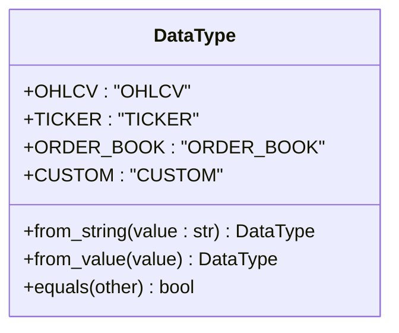
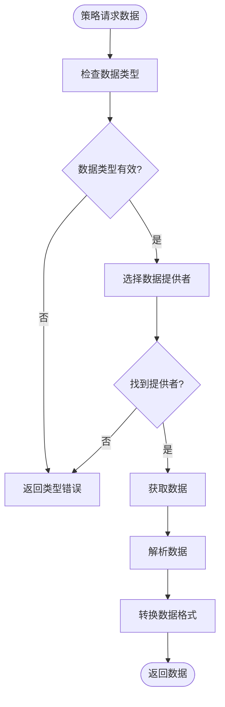
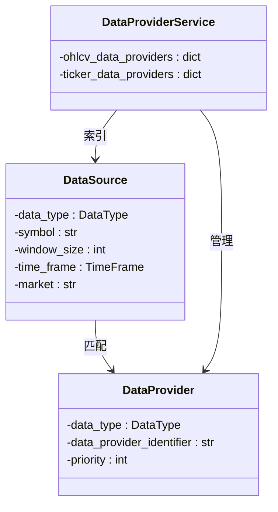
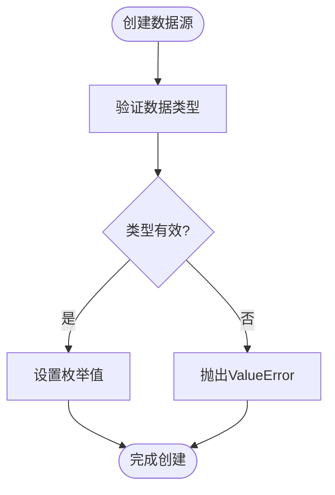

# 数据类型枚举

<cite>
**本文档引用的文件**   
- [data_type.py](file://investing_algorithm_framework/domain/models/data/data_type.py)
- [data_provider.py](file://investing_algorithm_framework/domain/data_provider.py)
- [data_source.py](file://investing_algorithm_framework/domain/models/data/data_source.py)
- [data_provider_service.py](file://investing_algorithm_framework/services/data_providers/data_provider_service.py)
- [csv.py](file://investing_algorithm_framework/infrastructure/data_providers/csv.py)
- [ccxt.py](file://investing_algorithm_framework/infrastructure/data_providers/ccxt.py)
- [constants.py](file://investing_algorithm_framework/domain/constants.py)
</cite>

## 目录
1. [引言](#引言)
2. [数据类型枚举设计](#数据类型枚举设计)
3. [核心数据类型详解](#核心数据类型详解)
4. [数据类型在数据处理流程中的应用](#数据类型在数据处理流程中的应用)
5. [数据类型与数据源的关系](#数据类型与数据源的关系)
6. [代码示例与使用模式](#代码示例与使用模式)
7. [扩展数据类型枚举](#扩展数据类型枚举)
8. [类型验证与错误处理](#类型验证与错误处理)
9. [结论](#结论)

## 引言
数据类型枚举（DataType）是投资算法框架的核心组件之一，它定义了框架支持的各种数据格式。该枚举为系统提供了统一的数据类型标识机制，确保了数据获取、解析和转换过程的一致性和可靠性。通过标准化的数据类型定义，框架能够有效地管理不同类型的数据源，支持从历史价格数据到实时市场信息的多种数据需求。

## 数据类型枚举设计

数据类型枚举（DataType）在框架中被设计为一个Python枚举类，位于`investing_algorithm_framework/domain/models/data/data_type.py`文件中。该枚举定义了框架支持的主要数据类型，包括OHLCV、TICKER、ORDER_BOOK和CUSTOM。每个枚举成员都有一个对应的字符串值，用于在系统中进行类型识别和匹配。

枚举类提供了多个静态方法来支持类型转换和比较操作。`from_string`方法允许从字符串值创建枚举实例，实现了字符串到枚举类型的转换。`from_value`方法则更为通用，可以处理字符串或枚举类型的输入，确保了类型转换的灵活性。`equals`方法提供了类型比较功能，支持与枚举实例或字符串进行相等性判断。



**Diagram sources**
- [data_type.py](file://investing_algorithm_framework/domain/models/data/data_type.py#L4-L46)

**Section sources**
- [data_type.py](file://investing_algorithm_framework/domain/models/data/data_type.py#L4-L46)

## 核心数据类型详解

### OHLCV数据类型
OHLCV（开盘价、最高价、最低价、收盘价、成交量）数据类型是框架中最常用的数据格式，用于表示金融资产在特定时间周期内的价格变动。这种数据格式广泛应用于技术分析和量化交易策略中。在系统中，OHLCV数据通常以时间序列的形式存储，每个数据点包含时间戳和五个价格/成交量值。

OHLCV数据在框架中主要用于回测和实时交易策略的开发。通过不同时间框架（如1分钟、1小时、1天）的OHLCV数据，交易算法可以分析价格趋势、计算技术指标并生成交易信号。该数据类型在`constants.py`文件中也有定义，常量名为`OHLCV_DATA_TYPE`。

### TICKER数据类型
TICKER数据类型表示实时市场报价信息，通常包含当前的买入价（bid）、卖出价（ask）、最新成交价等实时市场数据。与OHLCV数据不同，TICKER数据反映的是市场的即时状态，而不是一段时间内的价格汇总。这种数据类型对于需要实时市场信息的交易策略至关重要，如高频交易或套利策略。

在框架中，TICKER数据可以通过专门的TICKER数据提供者获取，也可以从OHLCV数据中推导出来。当没有专门的TICKER数据提供者时，系统会使用OHLCV数据的最新记录作为TICKER数据的替代，确保策略能够获得必要的市场信息。

### ORDER_BOOK数据类型
ORDER_BOOK（订单簿）数据类型表示市场的深度信息，包含买卖双方的挂单情况。订单簿数据通常包括多个价格层级的买入和卖出订单，反映了市场的供需关系和流动性状况。这种数据类型对于复杂的交易策略，如做市商策略或流动性挖掘策略，具有重要价值。

订单簿数据提供了比TICKER数据更丰富的市场信息，允许交易算法分析市场深度、识别支撑和阻力位，并预测价格变动方向。在框架中，ORDER_BOOK数据的处理需要专门的数据提供者支持，通常通过交易所的API直接获取。

### CUSTOM数据类型
CUSTOM（自定义）数据类型为框架提供了扩展性，允许用户集成非标准的数据源。这种数据类型可以用于引入各种外部数据，如社交媒体情绪分析、宏观经济指标、新闻事件数据等。自定义数据为量化策略提供了额外的分析维度，有助于构建更复杂的多因子模型。

在系统设计中，CUSTOM数据类型通过`data_provider_identifier`属性来区分不同的自定义数据源。这使得框架能够管理多个自定义数据提供者，并根据策略需求提供相应的数据。自定义数据的灵活性是框架适应不同交易场景的关键特性之一。

**Section sources**
- [data_type.py](file://investing_algorithm_framework/domain/models/data/data_type.py#L5-L8)
- [constants.py](file://investing_algorithm_framework/domain/constants.py#L46)

## 数据类型在数据处理流程中的应用

数据类型枚举在框架的数据处理流程中扮演着核心角色，贯穿于数据获取、解析和转换的各个环节。当交易策略请求特定数据时，数据类型枚举作为数据请求的关键标识，指导系统选择正确的数据提供者和处理逻辑。

在数据获取阶段，`DataProvider`类的`data_type`属性定义了该提供者能够提供的数据类型。系统通过比较请求的数据类型与可用数据提供者的类型，选择最合适的数据源。例如，当策略请求OHLCV数据时，系统会查找`data_type`为`DataType.OHLCV`的数据提供者。



**Diagram sources**
- [data_provider.py](file://investing_algorithm_framework/domain/data_provider.py#L42)
- [data_provider_service.py](file://investing_algorithm_framework/services/data_providers/data_provider_service.py#L356)

在数据解析阶段，数据类型决定了数据的解析方式和结构。不同的数据类型可能对应不同的文件格式、API响应结构或数据库模式。例如，OHLCV数据通常以CSV文件存储，包含Datetime、Open、High、Low、Close、Volume等列；而TICKER数据可能以JSON格式通过API返回。

数据转换阶段利用数据类型信息将原始数据转换为策略可用的格式。`DataProviderService`类根据数据类型调用相应的处理方法，如`get_ohlcv_data`或`get_ticker_data`，确保数据以一致的格式提供给策略。这种基于类型的分发机制提高了系统的可维护性和扩展性。

**Section sources**
- [data_provider.py](file://investing_algorithm_framework/domain/data_provider.py#L42)
- [data_provider_service.py](file://investing_algorithm_framework/services/data_providers/data_provider_service.py#L486)

## 数据类型与数据源的关系

数据类型枚举与数据源（DataSource）紧密关联，共同构成了框架的数据管理基础。`DataSource`类在`investing_algorithm_framework/domain/models/data/data_source.py`文件中定义，其`data_type`属性直接引用`DataType`枚举，建立了数据类型与数据源之间的强类型关联。

这种设计确保了数据源配置的类型安全性，防止了无效的数据类型指定。当创建数据源实例时，系统会自动将字符串类型的数据类型转换为相应的枚举实例，实现了类型的一致性。例如，当指定`data_type="OHLCV"`时，系统会调用`DataType.from_string`方法将其转换为`DataType.OHLCV`枚举值。

数据提供者索引（DataProviderIndex）利用数据类型信息优化数据提供者的查找效率。在`data_provider_service.py`文件中，索引结构根据数据类型对数据提供者进行分类存储，如`ohlcv_data_providers`和`ticker_data_providers`字典。这种基于类型的索引机制使得数据提供者的查找时间复杂度降低到O(1)，显著提高了系统的性能。



**Diagram sources**
- [data_source.py](file://investing_algorithm_framework/domain/models/data/data_source.py#L26)
- [data_provider.py](file://investing_algorithm_framework/domain/data_provider.py#L42)
- [data_provider_service.py](file://investing_algorithm_framework/services/data_providers/data_provider_service.py#L27)

数据类型还影响数据源的相等性判断逻辑。在`DataSource`类的`__eq__`方法中，不同类型的数据源有不同的相等性规则。例如，OHLCV数据源需要比较时间框架和市场信息，而TICKER数据源则主要比较符号和市场。这种基于类型的相等性判断确保了数据源匹配的准确性。

**Section sources**
- [data_source.py](file://investing_algorithm_framework/domain/models/data/data_source.py#L26)
- [data_provider_service.py](file://investing_algorithm_framework/services/data_providers/data_provider_service.py#L86)

## 代码示例与使用模式

### 基本使用模式
在交易策略中，数据类型枚举通过`DataSource`类进行使用。以下是一个典型的使用示例：

```python
from investing_algorithm_framework import TradingStrategy, DataSource, DataType

class MyStrategy(TradingStrategy):
    data_sources = [
        DataSource(
            data_type=DataType.OHLCV,
            symbol="BTC/EUR",
            time_frame="1h",
            window_size=200,
            market="BINANCE"
        ),
        DataSource(
            data_type=DataType.TICKER,
            symbol="BTC/EUR",
            market="BINANCE"
        )
    ]
    
    def run_strategy(self, context, data):
        # 使用OHLCV和TICKER数据
        ohlcv_data = data["BTC/EUR_1h"]
        ticker_data = data["BTC/EUR_ticker"]
        # 策略逻辑
        pass
```

### 数据提供者实现
自定义数据提供者需要指定其支持的数据类型。以下是一个CSV OHLCV数据提供者的实现示例：

```python
from investing_algorithm_framework import DataProvider, DataType

class CSVOHLCVDataProvider(DataProvider):
    data_type = DataType.OHLCV
    data_provider_identifier = "csv_ohlcv_data_provider"
    
    def __init__(self, storage_path, symbol, time_frame, market):
        super().__init__(
            symbol=symbol,
            market=market,
            time_frame=time_frame,
            storage_path=storage_path,
            data_type=DataType.OHLCV.value
        )
        # 初始化逻辑
```

### 运行时类型检查
在数据处理服务中，运行时类型检查确保了数据操作的安全性：

```python
def get_ohlcv_data(self, symbol, market, time_frame):
    data_provider = self.data_provider_index.get_ohlcv_data_provider(
        symbol=symbol,
        market=market,
        time_frame=time_frame
    )
    
    if data_provider is None:
        if DataType.OHLCV.equals(data_source.data_type):
            # 处理OHLCV数据
            pass
```

**Section sources**
- [data_type.py](file://investing_algorithm_framework/domain/models/data/data_type.py#L5-L8)
- [data_provider.py](file://investing_algorithm_framework/domain/data_provider.py#L42)
- [data_source.py](file://investing_algorithm_framework/domain/models/data/data_source.py#L26)

## 扩展数据类型枚举

虽然框架提供了基本的数据类型，但在某些情况下可能需要扩展数据类型枚举以支持新的数据格式。扩展数据类型枚举需要谨慎操作，以确保与现有系统的兼容性。

要添加新的数据类型，可以在`DataType`枚举中添加新的成员。例如，要添加支持新闻数据的类型：

```python
class DataType(Enum):
    OHLCV = "OHLCV"
    TICKER = "TICKER"
    ORDER_BOOK = "ORDER_BOOK"
    CUSTOM = "CUSTOM"
    NEWS = "NEWS"  # 新增的新闻数据类型
```

同时，需要更新相关的数据提供者和服务类以支持新类型。例如，创建`NewsDataProvider`类并将其集成到`DataProviderService`中。还需要考虑新数据类型对数据源相等性判断、索引机制和序列化过程的影响。

在某些情况下，使用`CUSTOM`数据类型配合`data_provider_identifier`可能是更好的选择，这样可以避免修改核心枚举类，保持系统的稳定性。例如：

```python
DataSource(
    data_type=DataType.CUSTOM,
    data_provider_identifier="news_feed",
    symbol="BTC"
)
```

这种模式允许在不修改核心代码的情况下引入新的数据类型，提高了系统的灵活性和可维护性。

**Section sources**
- [data_type.py](file://investing_algorithm_framework/domain/models/data/data_type.py#L4-L46)

## 类型验证与错误处理

框架通过多种机制确保数据类型的正确性和一致性。类型验证主要在数据源创建和数据提供者注册时进行。当创建`DataSource`实例时，`__post_init__`方法会调用`DataType.from_string`方法验证并转换数据类型，确保类型的有效性。



**Diagram sources**
- [data_type.py](file://investing_algorithm_framework/domain/models/data/data_type.py#L11)
- [data_source.py](file://investing_algorithm_framework/domain/models/data/data_source.py#L38)

错误处理机制在数据获取过程中发挥重要作用。当请求的数据类型无法找到对应的数据提供者时，系统会抛出`OperationalException`异常，提供详细的错误信息。例如，在`DataProviderService.get_ohlcv_data`方法中，如果没有找到OHLCV数据提供者，会抛出明确的异常信息。

对于类型转换错误，`DataType.from_string`方法在无法转换时会抛出`ValueError`异常，提示无法将给定值转换为数据类型。这种明确的错误信息有助于开发者快速定位和解决问题。

在生产环境中，建议使用类型注解和静态类型检查工具（如mypy）来进一步增强类型安全性，防止类型相关的错误在运行时才被发现。

**Section sources**
- [data_type.py](file://investing_algorithm_framework/domain/models/data/data_type.py#L20)
- [data_provider_service.py](file://investing_algorithm_framework/services/data_providers/data_provider_service.py#L527)

## 结论
数据类型枚举是投资算法框架数据管理系统的基石，它通过标准化的数据类型定义，实现了数据获取、解析和转换过程的统一和高效。OHLCV、TICKER、ORDER_BOOK和CUSTOM四种核心数据类型覆盖了从历史价格到实时市场信息的多种需求，为量化交易策略的开发提供了坚实的基础。

通过与数据源和数据提供者的紧密集成，数据类型枚举不仅提供了类型安全性，还优化了数据提供者的查找和匹配过程。框架的扩展性设计允许通过自定义数据类型或`CUSTOM`类型模式引入新的数据格式，适应不断变化的交易需求。

未来，可以考虑进一步增强数据类型系统，如支持数据类型的组合、添加数据质量元数据或实现更复杂的类型转换规则，以满足更高级的量化分析需求。