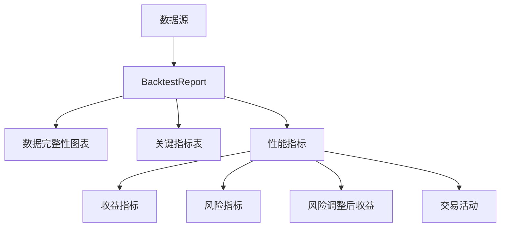

# 数据质量

<cite>
**本文档引用的文件**  
- [app.py](file://investing_algorithm_framework/app/app.py#L833-L914)
- [test_data_completeness.py](file://tests/app/test_data_completeness.py#L1-L121)
- [backtest_report.py](file://investing_algorithm_framework/app/reporting/backtest_report.py#L1-L350)
- [generate.py](file://investing_algorithm_framework/services/metrics/generate.py#L1-L359)
- [pandas.py](file://investing_algorithm_framework/infrastructure/data_providers/pandas.py#L1-L600)
- [csv.py](file://investing_algorithm_framework/infrastructure/data_providers/csv.py#L1-L569)
</cite>

## 目录
1. [数据完整性检查](#数据完整性检查)
2. [数据质量报告与指标体系](#数据质量报告与指标体系)
3. [数据修复策略](#数据修复策略)
4. [数据质量阈值与告警配置](#数据质量阈值与告警配置)
5. [实际案例分析](#实际案例分析)

## 数据完整性检查

该框架提供了一套全面的数据完整性检查机制，确保用于回测和交易策略的数据是完整且可靠的。核心功能通过 `check_data_completeness` 方法实现，该方法会验证策略所需的所有数据源在指定的回测日期范围内是否具有足够的数据点。

数据完整性验证流程包括以下几个关键步骤：
1.  **数据源识别**：系统首先从用户定义的交易策略中提取所有相关的数据源（`DataSource`）。
2.  **时间范围计算**：对于每个OHLCV（开盘价、最高价、最低价、收盘价、成交量）数据源，系统会计算出实际所需的数据时间范围。这个范围不仅包括回测的开始和结束日期，还会根据策略的 `window_size`（窗口大小）向前追溯，以确保有足够的历史数据来计算技术指标。
3.  **数据点计数**：系统会查询数据提供者，获取在所需时间范围内实际可用的数据点数量。
4.  **缺失数据检测**：通过比较预期的数据点数量和实际可用的数量，系统可以精确地识别出数据中的缺失日期。这通过 `get_missing_data_dates` 方法实现，它会生成一个在指定时间范围内所有缺失数据点的日期列表。
5.  **完整性评估**：最终，系统会返回一个布尔值，指示数据是否完整，并提供一个包含详细信息的字典，其中包含每个数据源的完整性百分比、缺失的数据点数量以及具体的缺失日期列表。

此机制在回测开始前强制执行，如果检测到数据不完整，将抛出 `DataError` 异常，从而防止基于不完整数据进行错误的分析和决策。

**Section sources**
- [app.py](file://investing_algorithm_framework/app/app.py#L833-L914)
- [test_data_completeness.py](file://tests/app/test_data_completeness.py#L1-L121)

## 数据质量报告与指标体系

框架通过 `BacktestReport` 类生成详尽的数据质量报告。该报告不仅包含策略的性能指标，还专门集成了数据完整性分析，为用户提供全面的洞察。

数据质量报告的核心组成部分包括：

1.  **数据完整性图表**：报告会自动生成 `get_ohlcv_data_completeness_chart`，这是一个可视化图表，直观地展示特定数据源（如从CSV文件加载的OHLCV数据）在时间序列上的完整性。该图表通过对比预期的日期序列和实际存在的日期序列，清晰地标识出数据缺口。
2.  **关键指标表**：报告包含一个关键指标表，其中会突出显示与数据质量相关的指标，例如数据源的完整性百分比。
3.  **性能指标体系**：除了数据完整性，报告还生成一套全面的性能指标，用于评估策略的有效性。这些指标由 `create_backtest_metrics` 函数计算，主要分为以下几类：
    *   **收益指标**：包括总收益、年化复合增长率（CAGR）、累计收益等。
    *   **风险指标**：包括最大回撤（Max Drawdown）、年化波动率（Annual Volatility）等。
    *   **风险调整后收益指标**：如夏普比率（Sharpe Ratio）、索提诺比率（Sortino Ratio）和卡玛比率（Calmar Ratio），用于衡量单位风险所获得的超额回报。
    *   **交易活动指标**：包括交易次数、胜率（Win Rate）、盈利因子（Profit Factor）等。
    *   **时间指标**：如最佳月份、最差月份、最佳年份等。

这些指标共同构成了一个多维度的评估体系，帮助用户全面理解策略的表现。

**Diagram sources**
- [backtest_report.py](file://investing_algorithm_framework/app/reporting/backtest_report.py#L1-L350)
- [generate.py](file://investing_algorithm_framework/services/metrics/generate.py#L1-L359)

**Section sources**
- [backtest_report.py](file://investing_algorithm_framework/app/reporting/backtest_report.py#L1-L350)
- [generate.py](file://investing_algorithm_framework/services/metrics/generate.py#L1-L359)

## 数据修复策略

当检测到数据不完整时，框架本身不直接执行数据修复（如插值），而是将问题暴露给用户，以便他们可以采取适当的措施。然而，其底层数据提供者的设计为实现数据修复策略提供了基础。

1.  **数据加载与验证**：`CSVOHLCVDataProvider` 和 `PandasOHLCVDataProvider` 在加载数据时会进行严格的验证。它们会检查CSV文件是否包含所有必需的列（Datetime, Open, High, Low, Close, Volume），并确保 `Datetime` 列的格式正确（UTC时区，毫秒级）。
2.  **缺失数据点识别**：在 `prepare_backtest_data` 方法中，数据提供者会主动计算缺失的数据点。它通过生成一个从 `required_start_date` 到 `backtest_end_date` 的完整日期序列（根据时间框架，如每小时、每天），然后与实际数据中的日期进行对比，从而找出所有缺失的日期，并将结果存储在 `missing_data_point_dates` 列表中。
3.  **数据回填机制**：虽然框架当前的实现会在检测到数据超出范围时抛出异常，但其设计模式支持数据回填。例如，`get_backtest_data` 方法在缓存中查找数据，这为实现一个更智能的机制（如在缓存未命中时尝试从外部API获取缺失数据）提供了可能。用户可以扩展这些数据提供者类，以实现自定义的插值逻辑（如线性插值、前向填充）来填补 `missing_data_point_dates` 中的空缺。

因此，数据修复的责任更多地落在数据准备阶段，用户需要确保输入的CSV文件是完整的，或者通过自定义数据提供者来处理缺失值。

**Section sources**
- [pandas.py](file://investing_algorithm_framework/infrastructure/data_providers/pandas.py#L1-L600)
- [csv.py](file://investing_algorithm_framework/infrastructure/data_providers/csv.py#L1-L569)

## 数据质量阈值与告警配置

该框架目前主要通过程序化的完整性检查来充当“告警”机制，而不是一个可配置的阈值系统。其告警逻辑是硬编码的：

*   **完整性阈值**：数据完整性检查的阈值是100%。如果 `check_data_completeness` 方法返回 `False`，即任何数据源存在缺失数据点，系统就会认为数据不完整。
*   **告警触发**：当数据不完整时，系统会立即通过抛出 `DataError` 异常来“告警”。这个异常会中断当前的流程（如回测运行），并提供详细的错误信息，包括哪个数据源存在问题以及具体的缺失日期。

虽然框架没有提供一个配置文件来设置“如果完整性低于95%则告警”这样的规则，但这种严格的100%完整性要求本身就是一种最保守的告警策略，确保了分析的严谨性。用户可以在调用 `check_data_completeness` 后，根据返回的 `completeness_info` 字典中的完整性百分比，自行实现更灵活的阈值判断和告警逻辑。

**Section sources**
- [app.py](file://investing_algorithm_framework/app/app.py#L833-L914)

## 实际案例分析

一个典型的案例是 `TestStrategyIncompleteData` 类在 `test_data_completeness_incomplete_data` 测试中的应用。

1.  **问题识别**：测试中定义了一个策略，该策略依赖于一个标识符为 `sol_1d_incomplete_ohlcv_data` 的数据源。这个数据源指向一个已知不完整的CSV文件。
2.  **执行检查**：当调用 `self.app.check_data_completeness` 方法时，系统会执行上述的完整性检查流程。
3.  **结果验证**：测试断言 `data_complete` 为 `False`，并确认 `completeness_info` 字典中包含了 `sol_1d_incomplete_ohlcv_data` 这个键。这表明系统成功识别了数据质量问题。
4.  **解决方案**：为了解决这个问题，用户需要找到并修复 `sol_1d_incomplete_ohlcv_data` 对应的CSV文件，确保其覆盖了从 `2021-06-15` 到 `2024-01-01` 的完整日期范围，且没有数据点缺失。修复后，再次运行 `check_data_completeness` 将返回 `True`，从而允许回测或其他操作继续进行。

这个案例清晰地展示了框架如何将数据质量问题从一个潜在的、可能导致错误结果的隐患，转变为一个明确的、可操作的错误，从而保障了整个投资分析流程的可靠性。

**Section sources**
- [test_data_completeness.py](file://tests/app/test_data_completeness.py#L1-L121)