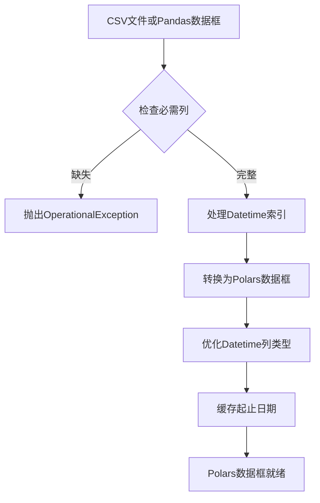

# 数据处理技术

<cite>
**本文档引用的文件**   
- [polars.py](file://investing_algorithm_framework/domain/utils/polars.py)
- [pandas.py](file://investing_algorithm_framework/infrastructure/data_providers/pandas.py)
- [volatility.py](file://investing_algorithm_framework/services/metrics/volatility.py)
- [returns.py](file://investing_algorithm_framework/services/metrics/returns.py)
- [equity_curve.py](file://investing_algorithm_framework/services/metrics/equity_curve.py)
- [contributing/index.html](file://docusaurus/docs/Contributing Guide/contributing/index.html)
- [poetry.lock](file://poetry.lock)
</cite>

## 目录
1. [引言](#引言)
2. [Polars库在框架中的核心作用](#polars库在框架中的核心作用)
3. [数据加载与预处理](#数据加载与预处理)
4. [时间序列数据操作](#时间序列数据操作)
5. [惰性计算与查询优化](#惰性计算与查询优化)
6. [金融指标计算](#金融指标计算)
7. [Polars与Pandas的兼容性](#polars与pandas的兼容性)
8. [性能优势与并行处理](#性能优势与并行处理)
9. [结论](#结论)

## 引言
本框架是一个用于投资算法开发的综合性平台，其核心数据处理能力依赖于Polars库。Polars是一个用Rust编写的高性能DataFrame库，专为处理大规模数据集而设计。在金融领域，尤其是处理时间序列数据时，性能和效率至关重要。本框架通过采用Polars，实现了比传统Pandas库更快的数据操作速度和更低的内存消耗。本文档将深入探讨框架如何利用Polars进行高效的数据处理，包括数据加载、过滤、聚合、列变换以及在大规模金融数据集上的高性能处理。

## Polars库在框架中的核心作用
Polars库是本框架数据处理的基石。根据项目依赖文件`poetry.lock`，框架明确依赖于`polars-runtime-32`版本1.35.2，其描述为“Blazingly fast DataFrame library”（极快的DataFrame库）。框架的设计原则是，当数据框作为参数传递给函数时，可以安全地假设它是一个Polars数据框。这表明Polars是框架内部数据处理的默认和首选工具。

框架利用Polars的优势主要体现在处理时间序列数据上，尤其是在处理大型数据集时，Polars凭借其基于Rust的后端、更好的多线程执行和更高效的内存管理，显著优于Pandas。所有时间序列数据框的Datetime列都被设置为UTC时区，以确保不同数据源之间的一致性。

**Section sources**
- [contributing/index.html](file://docusaurus/docs/Contributing Guide/contributing/index.html#L15)
- [poetry.lock](file://poetry.lock#L3208-L3222)

## 数据加载与预处理
框架通过`PandasOHLCVDataProvider`类从CSV文件或Pandas数据框中加载OHLCV（开盘价、最高价、最低价、收盘价、成交量）数据。尽管类名包含"Pandas"，但其内部实现是将数据转换为Polars数据框进行处理。

数据加载过程如下：
1.  **数据源检查**：首先检查输入的Pandas数据框是否包含必需的列（Datetime, Open, High, Low, Close, Volume）。
2.  **索引处理**：如果数据框的索引是`DatetimeIndex`，则将其重置为普通列并重命名为"Datetime"。
3.  **类型转换**：确保"Datetime"列是UTC时区的日期时间类型。
4.  **转换为Polars**：使用`pl.from_pandas(df)`方法将Pandas数据框高效地转换为Polars数据框。
5.  **类型优化**：使用`with_columns`方法将"Datetime"列强制转换为Polars的`Datetime`类型，指定时间单位为毫秒（ms）并保持UTC时区。
6.  **缓存元数据**：记录数据源的起始和结束日期，以便后续快速查询。

这一过程确保了所有数据在进入框架核心处理流程之前，都以高效、一致的Polars数据框格式存在。

**Diagram sources **
- [pandas.py](file://investing_algorithm_framework/infrastructure/data_providers/pandas.py#L418-L473)

## 时间序列数据操作
框架利用Polars强大的表达式API（Expression API）来执行高效的时间序列数据操作。这些操作包括数据过滤、聚合和列变换。

### 数据过滤
在`get_data`和`get_backtest_data`方法中，框架使用Polars的`filter`方法结合布尔表达式来筛选特定日期范围内的数据。例如，`df.filter((df['Datetime'] >= start_date) & (df['Datetime'] <= end_date))` 这种操作在Polars中是惰性求值的，可以被查询优化器优化，从而实现极高的性能。

### 数据聚合
在准备回测数据时，框架使用`pl.datetime_range`生成一个完整的日期范围，然后与实际数据进行对比，以找出缺失的数据点。这种集合操作在Polars中非常高效。

### 列变换
框架通过`_precompute_sliding_windows`方法预计算滑动窗口。对于每个时间戳，它都会创建一个包含前N个数据点的子集。这通过`filter`操作实现，例如`self.data.filter((self.data["Datetime"] <= timestamp) & (self.data["Datetime"] >= timestamp - timedelta(...)))`。这种基于时间窗口的变换是技术分析中的常见需求。

**Section sources**
- [pandas.py](file://investing_algorithm_framework/infrastructure/data_providers/pandas.py#L124-L205)
- [pandas.py](file://investing_algorithm_framework/infrastructure/data_providers/pandas.py#L313-L383)
- [pandas.py](file://investing_algorithm_framework/infrastructure/data_providers/pandas.py#L474-L522)

## 惰性计算与查询优化
Polars的核心优势之一是其惰性计算（lazy evaluation）模型。与Pandas的立即执行（eager evaluation）不同，Polars允许用户构建一个复杂的操作表达式，然后在最后一步才执行。这使得Polars的查询优化器能够分析整个操作链，并进行诸如谓词下推（predicate pushdown）、投影下推（projection pushdown）等优化，从而只读取和处理必要的数据。

在本框架中，虽然大部分操作是立即执行的（使用`pl.DataFrame`），但其底层的`filter`、`with_columns`等操作都受益于Polars引擎的内部优化。这意味着即使在执行单个过滤操作时，Polars也会尽可能地优化执行计划，避免不必要的计算，这对于处理大型金融数据集至关重要。

**Section sources**
- [pandas.py](file://investing_algorithm_framework/infrastructure/data_providers/pandas.py#L162-L165)

## 金融指标计算
框架中的多个服务模块利用Polars和Pandas来计算关键的金融指标。虽然指标计算的最终实现多使用Pandas，但其输入数据通常来自Polars数据框。

### 波动率计算
`get_annual_volatility`函数计算投资组合的年化波动率。它首先从快照列表构建一个Pandas数据框，然后按天重采样，计算对数收益率，最后求标准差并年化。此过程展示了如何将Polars处理的数据无缝传递给Pandas进行特定的金融计算。

### 收益率计算
`get_monthly_returns`和`get_yearly_returns`等函数使用Pandas的`resample`方法按月或年对数据进行重采样，并使用`pct_change`计算百分比变化。这些是评估投资组合表现的基础指标。

### 权益曲线
`get_equity_curve`函数简单地将投资组合快照的总价值和创建时间提取为一个序列，用于绘制权益曲线。

**Diagram sources **
- [volatility.py](file://investing_algorithm_framework/services/metrics/volatility.py#L74-L97)
- [returns.py](file://investing_algorithm_framework/services/metrics/returns.py#L25-L35)
- [equity_curve.py](file://investing_algorithm_framework/services/metrics/equity_curve.py#L18-L22)

## Polars与Pandas的兼容性
框架通过`convert_polars_to_pandas`函数实现了Polars与Pandas之间的无缝转换。该函数接受一个Polars数据框，并将其转换为Pandas数据框，同时提供多种选项，如移除重复日期、添加索引、添加Datetime列等。

这个函数是框架兼容性设计的关键。它允许框架的核心使用高性能的Polars进行数据处理，同时在需要使用Pandas生态中丰富的金融分析库（如pyindicators）时，可以方便地将数据转换为Pandas格式。例如，在策略示例中，`ema`、`rsi`、`crossover`等技术指标函数都接受Pandas数据框作为输入，这些数据正是通过此转换函数从Polars数据框得来的。

**Section sources**
- [polars.py](file://investing_algorithm_framework/domain/utils/polars.py#L5-L54)
- [strategy.py](file://examples/tutorial/strategies/ema_crossover_rsi_filter/strategy.py#L5)

## 性能优势与并行处理
Polars的性能优势主要源于其底层的Rust实现和多线程执行能力。与Python的GIL（全局解释器锁）不同，Rust允许真正的并行计算。Polars的许多操作（如过滤、聚合）都可以自动并行化，充分利用多核CPU。

在本框架中，这种性能优势体现在：
1.  **快速数据加载**：从CSV文件读取数据的速度远超Pandas。
2.  **高效过滤**：在大型数据集中进行日期范围查询非常迅速。
3.  **低内存占用**：Polars的内存管理更高效，减少了内存峰值，这对于长时间运行的回测和实时交易至关重要。

虽然框架本身没有显式地调用并行处理API，但通过使用Polars，开发者自动获得了这些性能提升。

**Section sources**
- [contributing/index.html](file://docusaurus/docs/Contributing Guide/contributing/index.html#L15)

## 结论
本框架通过深度集成Polars库，构建了一个高性能的数据处理管道。从数据加载、预处理到复杂的时间序列操作，Polars都提供了比Pandas更快的速度和更低的资源消耗。框架通过`convert_polars_to_pandas`函数巧妙地平衡了性能与生态兼容性，使得开发者既能享受Polars的性能优势，又能利用Pandas及其周边库进行金融分析。惰性计算和查询优化是Polars高性能的内在原因，而Rust的多线程能力则确保了在处理大规模金融数据集时的卓越表现。这种技术选型为构建高效、可靠的量化投资策略奠定了坚实的基础。